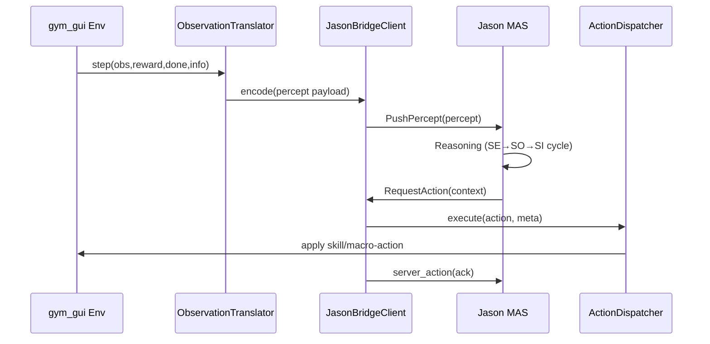
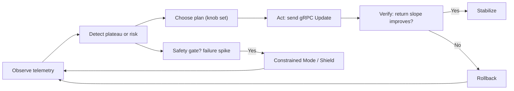

# JASON ⇄ gym_gui Integration Plan (Day 23 / Task 2)

Status & Scope

This document focuses on planning clarity before deeper implementation. Any provisional Python scaffolding under `gym_gui/services/jason_bridge/` is subject to revision after plan approval.

Grounding

Grounded in the existing JASON ⇄ Python gRPC bridge under `JASON_GRPC_BIDI_PYTHON` and the `gym_gui` adapter/telemetry + service locator architecture.

Revision History

- v1: Initial phased plan authored (Day 23).
- v1.1: Added scope clarification, revision history, acceptance refinements.

## 1) How the current bridge works (summary)

References:

- `JASON_GRPC_BIDI_PYTHON/docs/README.md`
- `JASON_GRPC_BIDI_PYTHON/docs/GRPC_JASON_BRIDGE.md`
- `JASON_GRPC_BIDI_PYTHON/proto/agent_bridge.proto`

Key points:

- A shared protobuf (`agent_bridge.proto`) defines `AgentBridge` service with RPCs:
  - `PushPercept(Percept) -> Ack` (Java→Python)
  - `RequestAction(ActionRequest) -> ActionResponse` (Java→Python→Java)
  - `StreamActions(ActionRequest) -> stream ActionResponse` (future)
- Java side implements `GrpcBridgeEnvironment` exposing internal actions to AgentSpeak:
  - `request_action(Context)` → calls Python `RequestAction` and injects percept `server_action(Action, Meta)`
  - `push_percept(Payload)` → forwards percept to Python service
- Python side (`python_project/server.py`) is a gRPC server that:
  - stores latest percept per agent
  - returns heuristic actions + structured metadata (can be replaced with RL policy)
  - participates outside Jason's internal reasoning loop; Jason invokes external actions which call these RPCs.
- Build/run:
  - Python: venv, `grpcio`, `grpcio-tools`, `protobuf`, regenerate stubs
  - Java: Gradle subproject `grpc-bridge-example` compiles the proto and runs a MAS (`grpc_bridge.mas2j`)

## 2) Integration goals with gym_gui

- Use Jason as a symbolic supervisor: goal selection, recovery strategies, and macro-actions.
- Connect Jason to `gym_gui` via the existing bridge so that:
  - gym_gui emits percepts → Jason beliefs
  - Jason returns macro-actions or skill directives → gym_gui adapts policies
- Preserve the GUI’s telemetry limits and backpressure; surface intention switches in UI.

## 3) Architecture mapping

- gym_gui side:
  - Percept source: adapters under `gym_gui/core/adapters/*` and telemetry (`TelemetryAsyncHub`).
  - Skill executor: trainer service or a local policy registry; expose a dispatcher for named skills.
  - Bridge client: small Python client using Python stubs to serve Jason’s requests (already present as demo server; we’ll adapt it to connect to gym_gui).
- Jason side:
  - Keep `GrpcBridgeEnvironment` internal actions.
  - AgentSpeak plans (.asl) implement macro flows and error recovery.

## 4) Detailed plan (phases)

### Phase A — Stand up the bridge with gym_gui

1. Create a `gym_gui/services/jason_bridge/` package:
  - `client.py`: wraps Python gRPC stubs, connects to Java service.
  - `translator.py`: converts adapter observations → belief facts (compact JSON/string).
  - `dispatcher.py`: routes Jason macro-actions to RL skills or control hooks in gym_gui.
2. Wire a minimal loop in a controller (e.g., `SessionController`) to:
  - On each env step: call `client.push_percept(translator.encode(obs,reward,done,info))`.
  - On cadence (e.g., every N steps) or on specific events: call `client.request_action(context)`.
  - Apply returned action via `dispatcher.execute(action, meta)`.
3. Logging/Telemetry: tag each Jason round-trip with run-id and step for replay.

Acceptance:

- Jason receives percepts and responds with actions visible in GUI logs.
- Telemetry hub queue usage remains stable (<70% capacity) during test episodes.

### Phase B — Skill invocation and safety gates

1. Define a stable mapping from Jason `action` strings to gym_gui skills:
  - `navigate`, `navigate_safe`, `recharge`, `survey`, … → Python callables.
2. Implement `dispatcher.execute` with guardrails:
  - Check belief-derived safety predicates (from `info`) before enacting high-risk actions.
  - Fallback to safe policy if predicate fails.
3. Add recovery templates in AgentSpeak (handle `-!goal` events) and verify via integration tests.

Acceptance:

- Skills triggered by Jason run, and safety checks block/redirect dangerous actions.
- Safety predicate failures emit structured telemetry events.

### Phase C — Intention telemetry & UI hooks

1. Emit control messages on:
  - Intention push/pop
  - Goal success/failure
  - Recovery path activation
2. Add a lightweight UI tab or overlay to show the current intention stack and last Jason action.

Acceptance:

- Operators can audit Jason’s decisions in near-real time.
- Intention stack updates surface within <1s under nominal load.

### Phase D — Performance & backpressure

1. Introduce cadence + batching for percept pushes (e.g., every 5 steps).
2. Truncate/compact percept payloads (entity lists instead of raw pixels).
3. Add timeouts/deadlines on RPCs and degrade to default RL policy when Jason is unavailable.

Acceptance:

- No visible slowdowns; smooth degradation under faults.
- Fallback policy engages within a single control tick after Jason timeout.

### Phase E — Security hardening (non‑local)

1. Enable TLS on Python server and Java client.
2. Add auth (mTLS or token) if crossing trust boundaries.
3. Sanitize metadata and cap payload sizes.

Acceptance:

- Encrypted channel; basic auth; bounded payloads.
- Added dependencies introduce no new Critical/High issues (Trivy scan clean).

## 5) Interfaces & contracts

### 5.1 Protobuf (`agent_bridge.proto`)
- Keep current messages and fields. Optional additions can be gated by presence checks.

### 5.2 Python dispatcher contract

```python
# dispatcher.py
class ActionDispatcher:
    def execute(self, action: str, meta: dict) -> None:
        if action == 'navigate':
            return self._navigate(meta)
        elif action == 'navigate_safe':
            return self._navigate_safe(meta)
        # ...
        else:
            self._default(action, meta)
```

### 5.3 Translator contract (beliefs)

```python
# translator.py
{
  "tick": int,
  "reward": float,
  "terminated": bool,
  "truncated": bool,
  "entities": [ {"type": str, "pos": [x, y]}, ... ],
  "hazards": [ ... ],
  "mission": str
}
```

## 6) Testing strategy

- Unit tests: dispatcher action mapping, translator encoding, client error handling.
- Integration: run `run_bridge_demo.sh`, then drive a tiny gym_gui session that emits percepts and consumes actions.
- Fault injection: kill Python server mid‑run, assert fallback; add artificial latency.

## 7) Operations & runbook

- Local dev:
  - Start Python bridge server (adaptation of `python_project/server.py`).
  - Start Jason MAS via Gradle run.
  - Run gym_gui with a small env and watch telemetry.
- CI hooks (future): stub Jason with a mock server for automated checks.

## 8) Risks & mitigations

- Latency → batch & deadline; fallback to default policy.
- Payload bloat → semantic summaries.
- Plan errors → recovery templates and timeouts.
- Security → TLS + auth when off localhost.

## 9) Next steps

1. Scaffold `services/jason_bridge` (client, translator, dispatcher) and unit tests.
2. Adapt `python_project/server.py` to call into gym_gui dispatcher instead of heuristic action.
3. Add intention telemetry events and a basic UI surface.
4. Write an example AgentSpeak policy using `navigate`/`navigate_safe` macro‑actions.

## 10) Sequence Diagram (Round Trip)



## 11) Jason supervisory runtime loop

Jason’s role is to supervise an ongoing RL run: observe telemetry, detect “not learning” or risk patterns, decide which corrective knobs to adjust, apply a structured control update, then verify impact and roll back if ineffective—all optionally gated by safety constraints.

### 11.1 Overview (Observe → Detect → Decide → Act → Verify → Rollback → Safety)



### 11.2 What it actually does

**Observe → beliefs.** Subscribe (directly or via bridge client) to returns, episode length, action entropy, coverage, and failure/cost metrics; assert beliefs such as `plateau_detected`, `sparse_reward`, `safety_risk` during the Jason reasoning cycle.

**Detect → events.** When the return slope ≤ 0 for *K* windows or action entropy falls below a threshold, post goals like `+!boost_exploration` or `+!enable_intrinsic` (Jason’s SE/SO/SI cycle selects relevant plans).

**Decide → plan selection (knobs).** Typical knobs Jason may choose to adjust:

- Exploration: re‑anneal ε (raise temporarily then decay).
- Intrinsic motivation: enable RND or ICM bonuses when rewards are sparse.
- Replay & goals: toggle PER (α/β) or HER to refocus learning in plateaus / sparse regimes.
- Policy‑invariant shaping: enable potential‑based shaping with
  $$F(s,s') = \gamma\, \Phi(s') - \Phi(s)$$
  guiding exploration without altering optimality.
- Curriculum / optimizer hygiene: lower learning rate, adjust target‑network τ, simplify level until learning resumes (trainer‑side implementation).

**Act → gRPC control.** Emit a single structured update, e.g.:

```text
UpdateTrainerParams{
  epsilon: 0.40,
  intrinsic_kind: RND,
  per_alpha: 0.7,
  her_enabled: true,
  shaping_enabled: true,
  lr: 5e-4,
  tau: 0.002,
  curriculum_level: 1
}
```

**Verify → rollback.** If external return (or success rate) fails to improve within Δ episodes / windows, auto‑revert the change (restore baseline ε, disable RND, reset α/β, turn off shaping) and try the next candidate plan while logging cause + parameters.

**Safety gate (optional).** If failure/cost spike occurs, switch into constrained / guarded mode (e.g. enable action shielding or CPO/PPO‑Lagrangian updates) until risk subsides.

### 11.3 Tiny AgentSpeak sketch (illustrative)

```asl
+!boost_exploration : plateau_detected & low_entropy & not epsilon_boost_active <-
  .send(rl, request, update(epsilon(0.40)));
  +epsilon_boost_active;
  .wait(episodes(5));
  ?epsilon_base(EpsBase);      // ensure we stored baseline earlier
  .send(rl, request, update(epsilon(EpsBase)));
  -epsilon_boost_active.

+!enable_intrinsic : sparse_reward & not intrinsic_on <-
  .send(rl, request, update(intrinsic(rnd), beta(0.10)));
  +intrinsic_on.

-!enable_intrinsic : intrinsic_on & plateau_detected & novelty_low <-
  .send(rl, request, update(intrinsic(none)));
  -intrinsic_on.

+!enable_shaping : sparse_reward & not shaping_enabled <-
  .send(rl, request, update(shaping_enabled(true), phi_id(goal_safe)));
  +shaping_enabled.

+!rollback : plateau_detected & intervention_pending <-
  .send(rl, request, update(reset_defaults(true)));
  -intervention_pending.
```

### 11.4 ASL viability & recommendations

1. **Message structure**: Jason `.send(Receiver, Performative, Content)` expects atomic terms—prefer `update(epsilon(0.40), intrinsic(rnd))` or a tuple rather than raw JSON. The bridge can parse a compound `update(...)` term into gRPC fields.
2. **Baseline capture**: Store baseline parameters as beliefs (e.g. `epsilon_base(0.15)`, `lr_base(1e-3)`) early in the run to support rollback.
3. **Idempotency**: Guard each plan with `not epsilon_boost_active` / `not intrinsic_on` so repeated plateau detections do not spam updates.
4. **Verification**: Introduce a belief like `improved_return` updated by telemetry; add an alternative plan:

  ```asl
  +improved_return & epsilon_boost_active <- -epsilon_boost_active.
  ```
    
5. **Rollback trigger**: Instead of a generic countdown, use a composite condition: `no_return_gain & episodes_since_intervention >= Delta`.
6. **Safety mode**: Add plans `+!enable_safety` and `+!disable_safety` keyed off `safety_risk` / cleared risk to toggle shielding or constrained optimizer.
7. **PER/HER toggles**: Represent them as `per(alpha(0.7), beta(0.5))` or `her(enabled)` terms for structured parsing.
8. **Potential shaping**: Ensure shaping potential snapshot is frozen per episode; use `phi_id(goal_safe)` to reference a known mapping inside trainer.
9. **Concurrency**: If multiple interventions may overlap, track an `intervention_pending` belief; only allow one active knob change at a time.
10. **Error handling**: Provide `-!boost_exploration` or `+failure(update_epsilon)` handlers to log failed RPCs and attempt fallback.

**Can this work?** Yes—provided the bridge layer translates atomic Jason terms into a structured gRPC update, and telemetry injection keeps beliefs current. The snippet above needs additional beliefs for baselines and improvement detection, plus explicit rollback and safety plans, but the overall BDI pattern (event goal → plan → action → belief updates) aligns with Jason best practices.

### 11.5 Bridge parsing example (Python side)

Pseudo‑parser for an `update(...)` term arriving as a string:

```python
def parse_update_term(term: str) -> dict:
    # Example: "update(epsilon(0.40), intrinsic(rnd), per(alpha(0.7), beta(0.5)))"
    # Lightweight parse; production should use formal grammar or structured payload.
    out = {}
    if "epsilon(" in term:
        val = term.split("epsilon(")[-1].split(")")[0]
        out["epsilon"] = float(val)
    if "intrinsic(rnd" in term:
        out["intrinsic_kind"] = "RND"
    if "intrinsic(none" in term:
        out["intrinsic_kind"] = "NONE"
    if "per(alpha(" in term:
        a = term.split("per(alpha(")[-1].split(")")[0]
        out["per_alpha"] = float(a)
    if "beta(" in term:
        b = term.split("beta(")[-1].split(")")[0]
        out["per_beta"] = float(b)
    return out
```

This keeps Jason’s content symbolic and minimal while translating to the richer protobuf on the gym_gui side.

## 12) Integration with gym_gui logging, constants, and validations

This section consolidates how the supervisory loop cleanly integrates with existing project infrastructure.

### 12.1 Logging (structured + correlated)

- Use the centralized helpers in `gym_gui.logging_config`:
  - `CorrelationIdAdapter` to inject `run_id`/`agent_id` into all records.
  - `log_constant()` (from `helpers.py`) to emit stable codes from `log_constants.py`.
- Component resolution already maps `gym_gui.services.*` to component "Service". Optionally register a more specific prefix for discoverability:

```python
from gym_gui.logging_config.logger import register_component_prefix
register_component_prefix("gym_gui.services.jason_bridge", "Service", description="Jason gRPC bridge")
```

- Reuse existing constants where applicable:
  - Validation: `LOG_SERVICE_VALIDATION_DEBUG/ERROR`
  - Trainer client lifecycle: `LOG_TRAINER_CLIENT_CONNECTING/CONNECTED/CONNECTION_TIMEOUT/LOOP_ERROR`
- For supervisory decisions, add a tiny set of constants under component "Service", subcomponent "Supervisor" (future work) for: control update sent/applied, invalid/rejected, rollback, and safety mode toggles. Until then, reuse TrainerClient/Validation constants with appropriate `tags`.

Example emission with correlation:

```python
import logging
from gym_gui.logging_config.logger import CorrelationIdAdapter
from gym_gui.logging_config.helpers import log_constant
from gym_gui.logging_config.log_constants import LOG_TRAINER_CLIENT_CONNECTED

base = logging.getLogger("gym_gui.services.jason_bridge")
logger = CorrelationIdAdapter(base, {"run_id": run_id, "agent_id": agent_id})

log_constant(
    logger,
    LOG_TRAINER_CLIENT_CONNECTED,
    extra={"subcomponent": "TrainerClient", "tags": "supervisor,control"},
)
```

### 12.2 Constants (supervisor defaults)

- Keep plateau/safety thresholds and knob bounds out of code by introducing a small defaults holder (future work): `gym_gui/constants/constants_supervisor.py` and export it via `gym_gui.constants` as `SUPERVISOR_DEFAULTS`.
  - Suggested fields: plateau window length/patience, min improvement, safety cost budget/clear fraction, cooldown episodes, knob min/max for epsilon, tau, lr, PER α/β, etc.
- Reuse existing constants where appropriate:
  - RPC deadlines: `TRAINER_DEFAULTS.client.deadline_s`
  - If exposing UI controls later, align ranges with `constants_ui`.

Illustrative shape (not yet added in code):

```python
from dataclasses import dataclass

@dataclass(frozen=True)
class SupervisorDefaults:
    plateau_window: int = 20
    plateau_patience: int = 3
    min_improvement: float = 0.0
    cost_limit: float = 0.0
    cooldown_episodes: int = 10
    eps_min: float = 0.0
    eps_max: float = 1.0
    tau_min: float = 1e-4
    tau_max: float = 2e-2
    lr_min: float = 1e-6
    lr_max: float = 1.0
    per_alpha_min: float = 0.0
    per_alpha_max: float = 1.0
    per_beta_min: float = 0.0
    per_beta_max: float = 1.0
```

### 12.3 Validations (trainer control updates)

- Extend `gym_gui/validations/validations_pydantic.py` with a strict model for runtime control updates from Jason; then add a method in `ValidationService` to validate these payloads before sending them to the trainer.

Model sketch (fields align with Section 11.2 example):

```python
from typing import Optional, Literal
from pydantic import BaseModel, Field

class TrainerControlUpdate(BaseModel):
    epsilon: Optional[float] = Field(None, ge=0.0, le=1.0)
    lr: Optional[float] = Field(None, gt=0.0, le=1.0)
    tau: Optional[float] = Field(None, gt=0.0, lt=1.0)
    per_alpha: Optional[float] = Field(None, ge=0.0, le=1.0)
    per_beta: Optional[float] = Field(None, ge=0.0, le=1.0)
    her_enabled: Optional[bool] = None
    shaping_enabled: Optional[bool] = None
    intrinsic_kind: Optional[Literal["NONE", "RND", "ICM", "PSEUDO_COUNT"]] = None
    curriculum_level: Optional[int] = Field(None, ge=0)
    idempotency_key: Optional[str] = None

    class Config:
        extra = "forbid"
```

`ValidationService` addition:

```python
from typing import Optional, Dict, Any
from pydantic import ValidationError

class ValidationService(...):
    def validate_trainer_control_update(self, data: Dict[str, Any]) -> Optional[TrainerControlUpdate]:
        try:
            update = TrainerControlUpdate(**data)
            self.log_constant(LOG_SERVICE_VALIDATION_DEBUG, message="control_update_valid")
            return update
        except ValidationError as exc:
            self.log_constant(LOG_SERVICE_VALIDATION_ERROR, message=f"control_update_invalid: {exc}")
            if self.strict_mode:
                raise
            return None
```

With this, the supervisory loop can validate, log with correlation, and then call the trainer client using the existing RPC deadlines from `TRAINER_DEFAULTS`.

## 13) Watchouts

- **Telemetry backpressure:** every percept push plus Jason round-trip adds log + telemetry events; throttle pushes (Phase D) or you will overflow `TelemetryAsyncHub` buffers and stall the GUI.
- **Schema drift:** the translator JSON and Jason `.send(update(...))` terms must evolve together—introduce versioned payloads or feature flags before adding/removing fields to avoid silent parse failures in the bridge.
- **Threading / event-loop blocking:** the gRPC client/server currently use blocking calls; wrap them in the existing executor pools so they cannot block the GUI’s async loop when Jason pauses or drops.
- **Safety predicates need fresh beliefs:** gating high-risk skills on stale `info` data turns the guardrails into theater; ensure translator timestamps beliefs and dispatcher revalidates environment state right before executing an action.
- **Trainer knob contention:** Jason control updates can race with automated schedulers (epsilon decay, curriculum); require idempotency keys or a “Jason owns knobs” mode so we do not flip parameters back and forth every few steps.

## 14) UI coordination

- **Dedicated Jason supervision tab:** add a new tab under `gym_gui/ui/widgets/render_tabs.py` / `gym_gui/ui/panels/analytics_tabs.py` that mirrors `live_telemetry_tab` but focuses on Jason-specific data (current intention stack, last action, control updates sent, safety overrides). This tab should reuse the existing tab registration flow that wires into the main window via `gym_gui/ui/main_window.py` so we keep the tab switcher and persistence behavior consistent with other panels.
- **Control panel hooks:** expose a read-only view of Jason’s latest telemetry in `gym_gui/ui/widgets/control_panel.py` (or a dedicated subset) so operators can see when Jason has taken control vs. when the default RL policy is active and can trigger manual overrides if needed.
- **Real-time telemetry stream:** update `gym_gui/ui/widgets/live_telemetry_tab.py` (or `telemetry_container`) to annotate any rows derived from Jason with a distinct color/icon, referencing the `TelemetryAsyncHub` tags emitted in Sections 3–12. Timestamp each telemetry update so the UI shows whether Jason data is fresh before relying on it.
- **CleanRL training form linkage:** adapt `gym_gui/ui/widgets/cleanrl_train_form.py` to allow toggling a “Jason supervisor” flag that enables the tab/service layer and ensures the actor policies resume to defaults if Jason disconnects (reflect Phase D safe fallback). Prefer reusing the existing environment selectors under `gym_gui/ui/environments/single_agent_env` so the tab only appears for compatible envs.
