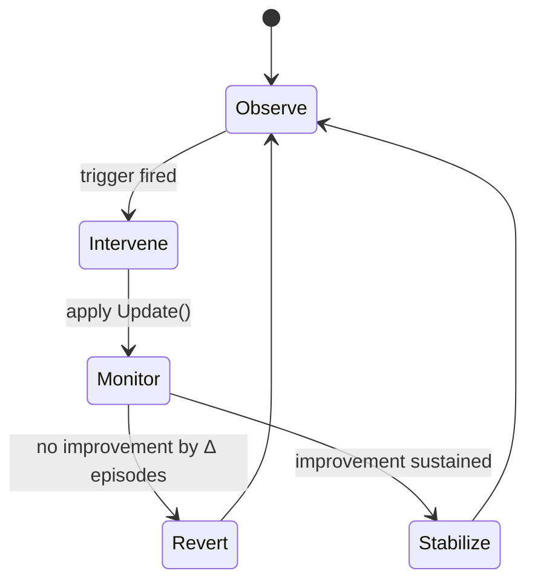
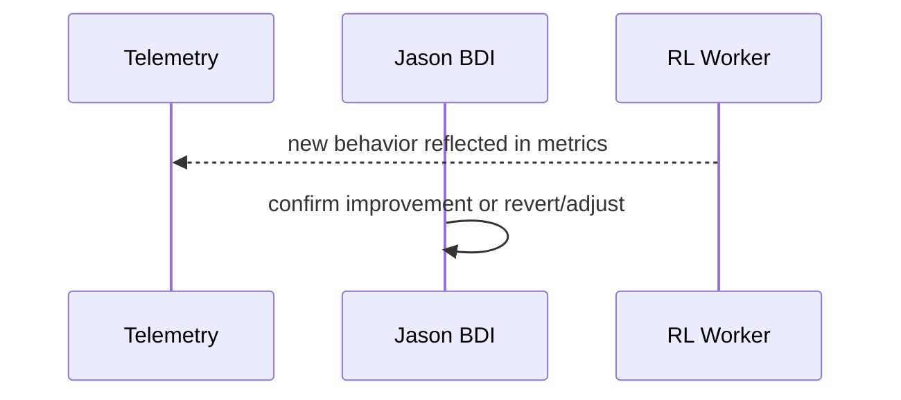
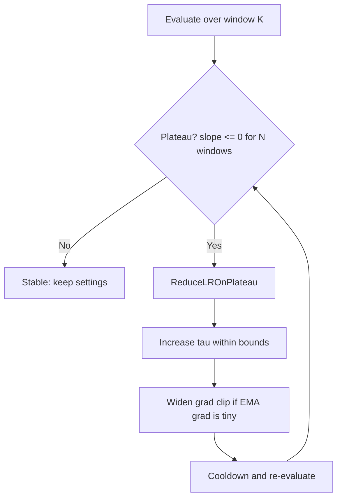
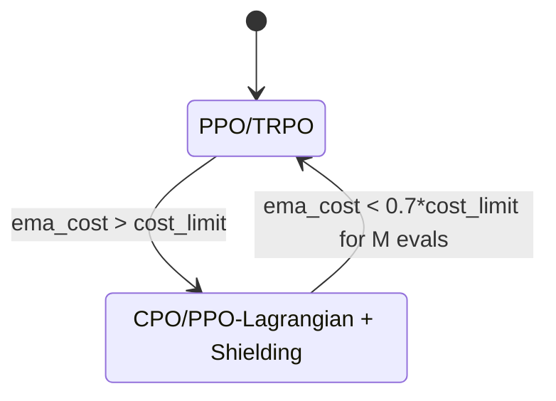
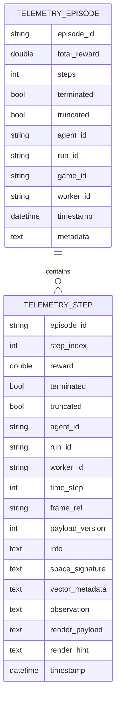

# Jason: Runtime Control of RL Training

This document explains how a Jason BDI agent can safely and effectively change an RL learner’s behavior at runtime. It focuses on: what to change (the knobs), when to change it (detectors), and how to wire commands from Jason to the learner.

Contents

1. Runtime knobs Jason can change
1. Metrics & detectors (grounded implementation)
1. BDI mapping (beliefs, events, plans)
1. gRPC control schema
1. Safety & rollback lifecycle
1. Latency & cadence
1. Concrete examples
1. Minimal playbook
1. End‑to‑end flow
1. Test plan
1. Operations & KPIs appendix
1. Practical plateau & safety playbook (RL)
1. Glossary (terms used)
1. Telemetry schema reference (ER + .proto)

---

## 1) Runtime knobs Jason can change

### 1.1 Exploration and intrinsic rewards

- Raise/reset $\varepsilon$ in $\varepsilon$‑greedy when learning stalls; switch on intrinsic rewards when external rewards are sparse.

Common triggers:

- Rolling average return not improving for $K$ episodes.
- Action entropy too low (over‑exploitation).
- State visitation concentrated (low coverage).

Intrinsic bonuses combine with environment reward as $r_{\text{total}} = r_{\text{ext}} + \beta_t\, r_{\text{int}}$.

Count/pseudo‑count novelty: $r_{\text{int}}(s) = 1/\sqrt{N(s)+\epsilon}$ with virtual count $\hat N(s)=\frac{p(s)(1-p'(s))}{p'(s)-p(s)}$.

Modern alternatives: RND (prediction error), ICM (feature‑space forward error).

Scheduling $\beta_t$: start higher in sparse regimes, decay as extrinsic returns improve; or enable only on plateau.

Pseudocode (DQN‑like) with exploration bursts and intrinsic bonuses:

```python
eps = 1.0
eps_min, eps_decay = 0.05, 0.9995
beta, beta_max = 0.0, 0.2
plateau_patience = 50
best_return, no_improve = float('-inf'), 0

for episode in range(num_episodes):
    s, ep_return = env.reset(), 0.0
    for t in range(max_steps):
        a = random_action() if random() < eps else argmax(Q[s])
        s2, r_ext, done, info = env.step(a)

        # Example intrinsic reward: 1/sqrt(count)
        N[s2] = N.get(s2, 0) + 1
        r_int = (1.0 / (N[s2] ** 0.5 + 1e-8)) if beta > 0 else 0.0
        r_total = r_ext + beta * r_int

        replay.add(s, a, r_total, s2, done)
        if ready(replay):
            update_q_network(replay)
        s, ep_return = s2, ep_return + r_ext
        if done:
            break

            ## 2) Metrics & detectors (grounded implementation)

            Jason needs timely, low-noise signals to decide when to intervene. This section expands the formulas with concrete acquisition and computation paths grounded in the current codebase (`TelemetryService`, `RunBus`, `StepRecord`, `EpisodeRollup`).

            ### 2.1 Telemetry acquisition (sources & event topics)

            Primary sources:

            1. `TelemetryService.recent_episodes()` → iterable of `EpisodeRollup` (contains `total_reward`, `steps`, `metadata`, `run_id`, `game_id`).
            2. `TelemetryService.recent_steps()` → recent `StepRecord` objects (reward, action, observation, info, run/worker IDs).
            3. Pub/Sub `RunBus` topics (`gym_gui/telemetry/events.py`):
               - `STEP_APPENDED` for streaming per-step features.
               - `EPISODE_FINALIZED` for end-of-episode metrics.
               - `OVERFLOW` / sequence gap warnings (reliability / health signals).
               - `CONTROL` (future credit/backpressure integration).

            Subscription pattern (non‑blocking queue):

            ```python
            from gym_gui.telemetry.run_bus import get_bus
            from gym_gui.telemetry.events import Topic

            bus = get_bus()
            episode_q = bus.subscribe(Topic.EPISODE_FINALIZED, "detectors-episodes")
            step_q = bus.subscribe(Topic.STEP_APPENDED, "detectors-steps")
            ```

            Drop / overflow handling: if `episode_q.full()`, oldest events are auto‑dropped; count retrieved via `bus.overflow_stats()`. Detector should treat overflow > 0 as a reliability flag (suppress interventions until stable).

            ### 2.2 Rolling window aggregator

            Maintain a sliding window of the last $K$ completed episodes plus transient per‑episode buffers:

            Data tracked per episode:

            - External return $R$ (from `EpisodeRollup.total_reward`).
            - Action counts (from per-step `StepRecord.action`).
            - State visitation set (hash `observation` or an embedding signature).
            - Intrinsic reward samples (if enabled and exposed via `StepRecord.info["intrinsic_reward"]`).

            Example aggregator:

            ```python
            import numpy as np
            from collections import deque, defaultdict

            class EpisodeWindow:
              def __init__(self, K=20):
                self.K = K
                self.returns = deque(maxlen=K)
                self.entropy = deque(maxlen=K)
                self.coverage = deque(maxlen=K)
                self.novelty_rate = deque(maxlen=K)
                self._episodes_with_return = 0  # reliability guard

              def add_episode(self, total_return, action_counts, visited_states, intrinsic_values):
                self.returns.append(float(total_return))
                self._episodes_with_return += 1
                # Action entropy
                total_actions = sum(action_counts.values()) or 1
                probs = np.array([c / total_actions for c in action_counts.values()], dtype=float)
                H = -np.sum(probs * np.log(probs + 1e-12))
                self.entropy.append(float(H))
                # Coverage (unique states fraction proxy)
                self.coverage.append(len(visited_states))
                # Novelty rate (fraction of intrinsic > threshold)
                if intrinsic_values:
                  tau = np.percentile(intrinsic_values, 60)
                  rate = float(np.mean([v > tau for v in intrinsic_values]))
                else:
                  rate = 0.0
                self.novelty_rate.append(rate)

              def slope(self):  # Least-squares slope of returns
                if len(self.returns) < 3:
                  return 0.0
                y = np.array(self.returns, dtype=float)
                x = np.arange(len(y), dtype=float)
                b = np.polyfit(x, y, 1)[0]
                return float(b)

              def avg_return(self):
                if not self.returns:
                  return 0.0
                return float(np.mean(self.returns))
            ```

            Per-episode accumulation sketch (fed by step events):

            ```python
            def consume_episode(rollup_evt_payload, steps_buffer):
              # rollup_evt_payload should carry episode_id, total_reward, etc.
              ep_id = rollup_evt_payload["episode_id"]
              ep_steps = steps_buffer.pop(ep_id, [])
              action_counts = defaultdict(int)
              visited = set()
              intrinsic_vals = []
              for step in ep_steps:
                if step.action is not None:
                  action_counts[step.action] += 1
                # Simple state hash (customize for vector obs)
                visited.add(str(step.observation)[:256])
                intr = step.info.get("intrinsic_reward")
                if intr is not None:
                  intrinsic_vals.append(float(intr))
              window.add_episode(
                rollup_evt_payload.get("total_reward", 0.0),
                action_counts,
                visited,
                intrinsic_vals,
              )
            ```

            ### 2.3 Detector formulas (extended)

            Compute over window size $K$ (defaults below):

            | Metric | Formula / Logic | Trigger Condition |
            |--------|-----------------|-------------------|
            | Rolling average return | $\overline{R}_K = K^{-1}\sum R^{(i)}$ | Low improvement paired with low entropy → exploration boost |
            | Return slope | Least squares $b$ from $R^{(i)} \approx a + b i$ | Plateau if $b \le b_{\min}$ for $N$ consecutive windows |
            | Action entropy | $H = -\sum_a p(a)\log p(a)$ | Over‑exploitation if $H < H_{\min}$ |
            | Coverage | $|S_{\text{visited}}|$ or fraction vs max grid cells | Poor exploration if coverage < $\rho_{\\min}$ |
            | Novelty rate | Mean $\mathbf{1}[r_{\text{int}} > \tau_{60\%}]$ | If novelty_rate → 0 while plateau persists, enable intrinsic |
            | Failure spike | From `EpisodeRollup.metadata` (if available) | Enable constraints/shaping if spike above threshold |

            Reliability gates before firing triggers:

            - Minimum episodes observed: `window._episodes_with_return >= min_ready` (e.g. 10).
            - No queue overflow events in last M seconds (`OVERFLOW` topic silent).
            - No sequence gap warnings from `RunBus` since last evaluation.

            ### 2.4 Implementation skeleton (detector loop)

            ```python
            import time, math
            from gym_gui.telemetry.run_bus import get_bus
            from gym_gui.telemetry.events import Topic

            bus = get_bus()
            ep_q = bus.subscribe(Topic.EPISODE_FINALIZED, "detectors-episodes")
            step_q = bus.subscribe(Topic.STEP_APPENDED, "detectors-steps")
            window = EpisodeWindow(K=20)
            steps_buffer = {}
            plateau_windows = 0

            def evaluate_and_emit():
              global plateau_windows
              slope = window.slope()
              avg_ret = window.avg_return()
              H_last = window.entropy[-1] if window.entropy else math.inf
              coverage_last = window.coverage[-1] if window.coverage else 0
              novelty_last = window.novelty_rate[-1] if window.novelty_rate else 0.0

              # Plateau logic
              if slope <= 0.0:
                plateau_windows += 1
              else:
                plateau_windows = 0

              if plateau_windows >= 3 and H_last < 0.7 * math.log(len(steps_buffer) + 1):
                emit_jason_belief("plateau_detected", True)
                emit_jason_event("boost_exploration", {
                  "epsilon_target": 0.4,
                  "reason": "plateau+low_entropy",
                })
              if plateau_windows >= 3 and novelty_last < 0.05:
                emit_jason_event("enable_intrinsic", {"kind": "rnd", "beta_min": 0.1})

            def emit_jason_belief(name, value):
              # Bridge layer: assert belief into Jason (implementation-specific)
              pass

            def emit_jason_event(goal, payload):
              # Bridge layer: send gRPC UpdateTrainerParams or post a message
              pass

            def detector_loop():
              last_eval = time.time()
              while True:
                # Drain step events
                try:
                  evt = step_q.get(timeout=0.05)  # TelemetryEvent
                  step = evt.payload.get("step_record")  # Expect StepRecord-like mapping
                  ep_id = step["episode_id"]
                  steps_buffer.setdefault(ep_id, []).append(step)
                except Exception:
                  pass
                # Drain episode completion events
                try:
                  ep_evt = ep_q.get_nowait()
                  payload = ep_evt.payload  # Should include total_reward & episode_id
                  consume_episode(payload, steps_buffer)
                except Exception:
                  pass
                # Periodic evaluation
                if time.time() - last_eval >= 5.0:  # every ~5s or per K episodes
                  evaluate_and_emit()
                  last_eval = time.time()
            ```

            ### 2.5 Emitting Jason beliefs & events

            Map detector outputs to beliefs (state) and goals (events):

            - Beliefs: `avg_return(K,V)`, `slope_return(K,B)`, `action_entropy(H)`, `coverage(C)`, `novelty_rate(N)`, `plateau(P)`, `exploration_low(H)`, `novelty_low(N)`. Each belief includes `run_id`, `ts_iso`, `window_size`.
            - Events (Jason goals): `+!boost_exploration`, `+!enable_intrinsic`, `+!enable_shaping`, `+!enable_constraints`, `+!enable_PER`.

            Belief emission should be idempotent (same value within evaluation window → skip reassert to reduce AgentSpeak plan churn).

            ### 2.6 Edge cases & guardrails

            - Short runs: If fewer than `min_ready` episodes, never fire plateau triggers.
            - Truncated episodes: Optionally exclude episodes where `truncated=True && steps < min_steps` to avoid noisy partial returns.
            - Sparse stepping: If action entropy cannot be computed (few actions), defer evaluation.
            - Overflow / sequence gap: Suppress interventions until stability resumes (treat as `reliability_risk` belief).
            - Large observation objects: Hash or downsample to avoid memory blowup in `visited` sets.
            - Reset / new curriculum phase: Reset window counters when task difficulty changes (avoid mixing distributions).

            ### 2.7 Acceptance criteria (detector module)

            1. Given a synthetic sequence of plateau episodes (flat returns, low entropy) detector emits `boost_exploration` within 1 evaluation cycle.
            2. When returns recover (positive slope), plateau counter resets and no exploration boost is emitted.
            3. Novelty starvation (plateau + near-zero novelty rate) produces `enable_intrinsic` event exactly once per plateau occurrence.
            4. Queue overflow or sequence gap presence blocks all intervention events (only beliefs update) until cleared.
            5. Idempotency: Re-running evaluation without state change produces no duplicate events.
            6. All emitted Jason events include structured payload with cause, parameters, and window statistics.

            Defaults (tunable): `K=20`, `plateau_windows_trigger=3`, `min_ready=10`, `entropy_floor = 0.7 * H_max_est`, `coverage_min=0.25 * grid_cells`, `novelty_floor=0.05`.

            > H_max_est can be approximated as `log(A)` for `A` discrete actions, or sampled baseline entropy over initial episodes for continuous policies.

Tips:

- Evaluate on external reward only; intrinsic is for learning, not scoring.
- Intrinsic bonuses are not policy‑invariant; tune $\beta$ carefully.
- Prefer RND/ICM/pseudo‑counts with function approximation.
- Add a cooldown after re‑anneal to avoid oscillations.

### 1.2 Potential‑based reward shaping (policy‑invariant)

Define a shaping potential $\Phi$ and add $F(s, s') = \gamma\, \Phi(s') - \Phi(s)$ to the reward so the learner trains on $r_{\text{total}} = r_{\text{ext}} + F(s,s')$. Key property (Ng et al., 1999): policy invariance—$F$ telescopes, so action ranking at a state is unchanged in the limit.

Guardrails:

- Use the same $\gamma$ as the learner.
- Set $\Phi(\text{terminal}) = 0$.
- If $\Phi$ evolves, freeze within an episode and update between episodes.

Design recipes for $\Phi$:

- Goal attraction (grid worlds): $\Phi_{\text{goal}}(s) = c_g (D_{\max} - d_{\text{goal}}(s))$.
- Hazard repulsion: $\Phi_{\text{safe}}(s) = c_h\, d_{\text{hole}}(s)$.
- Waypoints/subgoals: $\Phi_{\text{way}}(s) = \sum_k w_k\, \mathbf{1}[s\ \text{reached}\ g_k]$ (or smoothed proximity).
- Value‑guided: $\Phi(s) = \hat V_\theta(s)$ (frozen per episode).

Combine terms: $\Phi(s) = \Phi_{\text{goal}}(s) + \lambda\, \Phi_{\text{safe}}(s) + \cdots$.

Implementation (tabular/DQN‑style):

```python
s2, r_ext, done, info = env.step(a)
phi_s, phi_s2 = phi(s), (0.0 if done else phi(s2))
F = gamma * phi_s2 - phi_s
r_total = r_ext + F
replay.add(s, a, r_total, s2, done)
update_agent(replay)
s = s2
```

Evaluation: always report external reward only.

How Jason controls shaping (toggle/swap $\Phi$):

- shaping.enabled: bool
- shaping.phi_id: string (e.g., "goal", "goal_safe", "waypoints", "vhat_snapshot")
- shaping.params: map (e.g., {"c_g":1.0, "lambda":0.3})
- shaping.freeze_mode: "per_episode" | "always_on"

Quick FrozenLake preset: $\Phi(s) = c_g (D_{\max} - d_{\text{goal}}(s)) + \lambda\, d_{\text{hole}}(s)$ with $c_g=1.0$, $\lambda\in[0.2,0.6]$, freeze per episode, and $\Phi(\text{terminal})=0$.

### 1.3 Replay, curriculum, optimizer, safety

- Replay: enable PER or adjust $(\alpha,\beta)$ to target high‑TD‑error samples.
- Sparse‑reward: enable HER or raise relabeling rate.
- Curriculum: reduce difficulty/horizon; pick next level when progress stalls.
- Optimizer/schedules: lower LR on plateau; tune target‑network update/tau; widen grad clipping as needed.
- Safety/constraints: when failures spike, enable constrained updates (e.g., CPO‑style) or action guards.

#### 1.3.1 Prioritized Experience Replay (PER): How to enable it and tune $\alpha/\beta$ on plateaus

Goal. Focus learning on "important" transitions—those with large TD‑error—by sampling them more often and correcting any sampling bias with importance sampling (IS).

---

##### 1) Core definitions

Sampling distribution

We assign each stored transition $i$ a priority $p_i>0$ and sample mini‑batches according to:

$$
P(i) = \frac{p_i^{\alpha}}{\sum_k p_k^{\alpha}}, \qquad 0 \le \alpha \le 1.
$$

- Proportional variant: $p_i = |\delta_i| + \varepsilon$ (small $\varepsilon>0$ ensures non‑zero probability).
- Rank‑based variant: $p_i = 1/\operatorname{rank}(i)$ where transitions are sorted by $|\delta|$.

Both are monotone in $|\delta|$ and interpolate between uniform ($\alpha=0$) and greedy replay ($\alpha\to1$).

Importance sampling (to correct bias)

For a replay buffer of size $N$, the per‑sample IS weight is

$$
w_i = \Big(\tfrac{1}{N\, P(i)}\Big)^{\beta}, \quad 0\le \beta \le 1,
$$

usually normalized in‑batch by $w_i \leftarrow w_i / \max_j w_j$. Anneal $\beta$ toward 1 during training so estimates become (asymptotically) unbiased.

---

##### 2) Minimal algorithm (DQN‑style)

Storing new transitions

- On insert, set the priority high so new data is sampled at least once:

$$
 p_{\text{new}} \leftarrow \max_j p_j \quad \text{or} \quad |\delta_{\text{init}}| + \varepsilon.
$$

- After a learning update, refresh with the latest TD‑error:

$$
 p_i \leftarrow |\delta_i| + \varepsilon.
$$

Sampling a minibatch

1. Draw indices $i \sim P(i)$ (use a SumTree / prefix‑sum tree for $O(\log N)$ sample+update). A sum‑tree stores priorities at leaves; internal nodes hold child sums for efficient prefix draws.
2. Compute IS weights $w_i$ and form the weighted TD loss (normalize $w_i$ by max in batch).
3. Backprop; then update each sampled transition’s priority with its new $|\delta_i|$.

Reference implementations / APIs

- TorchRL’s PrioritizedSampler exposes the $P(i)\propto p_i^{\alpha}$ and $\beta$‑weighted IS behavior.

---

##### 3) Good default hyperparameters

Empirically effective (ICLR’16 PER paper):

- Proportional PER: $\alpha \approx 0.6,\; \beta_0 \approx 0.4 \rightarrow 1.0$ (linear anneal to 1 by end).
- Rank‑based PER: $\alpha \approx 0.7,\; \beta_0 \approx 0.5 \rightarrow 1.0$.

Because prioritized updates amplify gradient magnitudes, PER used a 4× smaller step size than the DQN baseline in their setup.

---

##### 4) Plateau‑time schedule: how to “focus on high‑TD‑error” when learning stalls

Let $\bar{R}_t$ be a moving average of external return. If no improvement for $P$ episodes (plateau):

1) Strengthen prioritization

$$
\alpha \leftarrow \min(\alpha_{\max},\, \alpha + \Delta_\alpha) \quad \text{(e.g., } \Delta_\alpha=0.1,\; \alpha_{\max}\in[0.8,0.95]).
$$

Raising $\alpha$ steepens $P(i)$, concentrating sampling on large $|\delta|$.

1. Adjust IS correction conservatively

Keep $\beta$ on its path toward 1, but slow the anneal during a burst (avoid decreasing $\beta$ below your current value unless you accept more bias). When plateau clears (returns improve), resume the original $\beta$ schedule.

1. Refresh priorities eagerly

After each update, set $p_i\leftarrow |\delta_i|+\varepsilon$. If rewards/TD‑errors are clipped, consider rank‑based PER for robustness to outliers.

Practical recipe

Start proportional PER at $\alpha=0.6,\;\beta_0=0.4$ (linear $\beta\to1$). On a plateau of $P=50$ episodes, bump $\alpha \to \alpha+0.1$ (cap $\le0.9$); extend the $\beta$ schedule horizon so it still reaches 1.0 by end‑of‑training. When performance recovers, roll $\alpha$ back by a small decay (e.g., $\alpha\leftarrow0.95\alpha$ per episode) to restore diversity.

---

##### 5) Pseudocode patch (drop‑in outline)

```python
# --- Replay store ---
# On append:
priority_new = max_priority_in_buffer  # or abs(delta_init) + eps
buffer.add(transition, priority=priority_new)

# --- Sample step ---
idxs, probs = buffer.sample(batch_size, alpha=alpha)  # P(i) ∝ p_i^alpha
weights = (1.0 / (len(buffer) * probs)) ** beta
weights /= weights.max()  # stability

loss = (weights * td_error(batch)**2).mean()
optimizer.zero_grad(); loss.backward(); optimizer.step()

# --- Priority update ---
new_priorities = abs(td_error(batch)).detach().cpu().numpy() + eps
buffer.update_priorities(idxs, new_priorities)

# Implementation detail: use a sum-tree / segment tree for O(log N)
# sample() and update_priorities().
```

---

##### 6) Notes & gotchas

- Diversity vs. focus: Large $\alpha$ narrows sampling — use temporary bursts, then relax.
- Bias control: Anneal $\beta \to 1$; normalizing $w_i$ by $\max w$ keeps updates bounded.
- Clipping interactions: With reward/TD‑error clipping (common in DQN), rank‑based and proportional perform similarly; rank‑based can be more robust to outliers.
- Rainbow DQN: PER is one of Rainbow’s core components, widely adopted in practice.

---

## 3) BDI mapping (beliefs, events, plans)

Beliefs:

- avg_return(K,V), slope_return(K,B), action_entropy(H), coverage(Rho)
- plateau_detected, sparse_reward, safety_risk

Events:

- +!boost_exploration, +!enable_intrinsic, +!simplify_task, +!enable_shaping, +!enable_constraints

Plans (sketch):

```asl
+!boost_exploration : plateau_detected & action_entropy(H) & H < Hmin <-
  .send(rl, request, update({epsilon:0.4}));
  .wait(episodes(5));
  .send(rl, request, update({epsilon:0.2})).

+!enable_intrinsic : sparse_reward & not intrinsic_on <-
  .send(rl, request, update({intrinsic:"rnd"})).

+!enable_shaping : sparse_reward & not shaping_enabled <-
  .send(rl, request, update({shaping_enabled:true})).
```

Jason beliefs are asserted from telemetry via a bridge that tags each belief with run_id and timestamp for auditing.

---

## 4) gRPC control schema

Add enums and idempotency keys to make updates safe and auditable:

```protobuf
enum IntrinsicKind { NONE=0; PSEUDO_COUNT=1; RND=2; ICM=3; }
enum FreezeMode { PER_EPISODE=0; ALWAYS_ON=1; }

message UpdateTrainerParams {
  optional float epsilon = 1;
  optional float lr = 2;

service TrainerControl { rpc Update(UpdateTrainerParams) returns (Ack); }
```

Server should validate ranges and reject unsafe jumps with descriptive errors.


## 5) Safety & rollback lifecycle

- Trial budgets: auto‑revert after $\Delta$ episodes without improvement.
- Constraints: enable shielding/guards when failure rate spikes.

Lifecycle:



---

## 6) Latency & cadence

- RPC deadline: 100–300 ms; if timeout → skip this tick and keep current policy.
- Intervention cadence: evaluate detectors every K episodes (e.g., 20) to avoid thrash.
- Batch metric updates; avoid sending per‑step heavy telemetry.

---

## 7) Concrete examples

- FrozenLake: if success_rate < 0.1 after 50 episodes → enable shaping with $c_g=1.0$, $\lambda=0.4$ for 100 episodes; revert if success_rate not improved.
- MiniGrid RedBlueDoors: if door choice accuracy < 60% after 100 episodes → boost $\varepsilon$ to 0.4 for 10 episodes and enable RND ($\beta=0.1$); then decay $\varepsilon$ back to 0.1.

---

## 8) Minimal playbook

1) Surface telemetry to Jason: rolling return, success, TD‑error stats.
2) Encode triggers → goals (+!boost_exploration, +!enable_PER, +!enable_HER, +!shaping_on).
3) Implement the control RPC to hot‑apply changes (epsilon, lr, PER/HER, shaping, intrinsic, curriculum).
4) Guardrails: auto‑revert after $\Delta$ episodes if no improvement; log every intervention with cause/parameters; optionally enforce constraints during recovery.
5) Verify recovery via subsequent telemetry; evaluate on external rewards only.

---

## 9) End‑to‑end flow



---

## 10) Test plan

- Unit: detectors (slope, entropy), parameter validators, idempotency handling.
- Integration: mock TrainerControl server; assert updates applied and audited.
- Fault: inject timeouts; ensure skip/degrade path; verify rollback after $\Delta$ episodes.
- KPI: assert improvement or controlled revert by design.

---

## 11) Operations & KPIs appendix

Operational steps:

1. Enable telemetry export to Jason bridge; verify beliefs updating.
2. Dry‑run updates on mock server; then limited‑scope live trial ($\Delta$ episodes).
3. Monitor KPIs: $\overline{R}_K$, slope $b$, success_rate, failure_rate, entropy, coverage.
4. Approve stabilization or auto‑revert per lifecycle.

KPI formulas: see Section 2.

---

## 12) Practical plateau & safety playbook (RL)

This section provides concrete, battle-tested knobs to apply when progress stalls (plateau) and when safety risk spikes. It complements the detectors in Section 2.

### 12.1 Optimizer & schedules

#### 12.1.1 Reduce LR on plateau (auto)

Use a moving window over evaluation return (or loss/TD‑error). If no improvement for $P$ evals, drop LR by factor $\gamma_{\text{lr}}$ using the standard scheduler. Example (PyTorch):

```python
import torch

scheduler = torch.optim.lr_scheduler.ReduceLROnPlateau(
  optimizer,
  mode="max",      # maximize eval return
  factor=0.5,       # halve LR
  patience=10,      # P
  threshold=1e-3,   # minimal gain to count as improvement
  cooldown=5,
  min_lr=1e-6,
  verbose=True,
)

# Call after each evaluation cycle
scheduler.step(eval_return)
```

Heuristic: if LR has reached `min_lr` and you’re still plateaued, switch focus to target-network updates and gradient clipping below.

#### 12.1.2 Target‑network update/tau (stability vs. speed)

Use soft (Polyak) updates every step:

$$
  heta_{\text{targ}} \leftarrow (1 - \tau)\, \theta_{\text{targ}} + \tau\, \theta_{\text{online}}, \quad \tau \in (0, 1).
$$

- Start with $\tau \approx 10^{-3}$ (very slow).
- If returns plateau while TD‑error is steady/low → increase $\tau$ (e.g., $\times 2$ up to $\sim 10^{-2}$) so targets track faster.
- If TD‑error oscillates or blows up → decrease $\tau$ (e.g., $\div 2$) or switch to hard updates less frequently (increase copy period $C$ steps).

#### 12.1.3 Gradient clipping (avoid over/under‑updates)

Clip global norm each optimizer step:

```python
torch.nn.utils.clip_grad_norm_(agent.parameters(), max_norm)
```

- Begin with `max_norm ≈ 10` and track an EMA of grad‑norm $\bar g$.
- If updates are tiny for $K$ steps (e.g., $\bar g < 0.1$), widen the clip (e.g., $\times 2$ up to 100) so you’re not over‑clipping.
- If you see spikes/NaNs, tighten (halve `max_norm`) and consider Huber loss or reward/TD clipping.

### 12.2 Safety & constraints

When failure rate spikes over a sliding window, switch the learner into a constrained update mode or enforce action guards.

#### 12.2.1 Constrained update mode (CPO‑style)

Model the task as a CMDP. Besides reward $R$, define a cost $C$ (e.g., collisions). Constrain expected discounted cost $J_C(\pi) \le d$. CPO solves TRPO‑like steps with a trust region and a cost constraint using surrogate objectives:

$$
\max_{\pi}\; \mathbb{E}_{s\sim d_{\pi_k},\; a\sim \pi}\big[A^{\pi_k}(s,a)\big]
$$

subject to

$$
J_C(\pi_k) + \frac{1}{1-\gamma}\, \mathbb{E}_{s\sim d_{\pi_k},\; a\sim \pi}\big[A^{C,\pi_k}(s,a)\big] \le d,\quad \bar D_{\mathrm{KL}}(\pi\,\Vert\,\pi_k) \le \delta.
$$

Practical switch rule: maintain an EMA of cost‑rate $\hat c_t$. If $\hat c_t > c_{\text{limit}}$:

- toggle CPO updates (or PPO‑Lagrangian/RCPO),
- tighten the KL trust region $\delta$,
- optionally enable conservative cost shaping (upper‑bound predictor as in CPO).

When $\hat c_t < 0.7\,c_{\text{limit}}$ for $M$ evals, switch back to unconstrained PPO/TRPO.

Alternatives: RCPO (Reward‑Constrained PPO, penalty learned online) and PPO‑Lagrangian (first‑order, per‑epoch multiplier update).

#### 12.2.2 Action guards (shielding)

Synthesize a shield from temporal‑logic or geometric safety specs. At decision time, mask or correct actions that would violate the spec; pass through safe actions unchanged.

```python
def guard_action(s, a):
  # project to safe set if predicted next state enters hazard set H
  if predicts_violation(s, a):
    return project_to_safe(s, a)  # e.g., QP/CBF-based correction
  return a
```

### 12.3 Minimal “plateau → safe mode” controller

Pseudo‑logic you can embed around any DQN/PPO loop. Hook `plateau(...)` and `ema_cost` from detectors (Section 2):

```python
if plateau(eval_returns, patience=P):
  scheduler.step(current_eval_return)          # A) reduce LR
  tau = min(tau_max, tau * 2.0)               # B) faster target tracking
  if ema_grad_norm < tiny:                    # C) widen clip if over-clipping
    max_norm = min(max_clip, max_norm * 2.0)

# Safety monitor
if ema_cost > cost_limit:
  algo = "CPO"                                # switch optimizer head
  delta_kl = base_delta_kl * 0.5              # tighten trust region
  enable_cost_shaping = True                  # pessimistic cost upper bound
  action_selection = guarded(action_selection)# wrap with shield
else:
  algo = "PPO"                                # default
```

### 12.4 Mermaid diagrams

Plateau‑adjustment flow:



Safety switching (state diagram):



### 12.5 What to log (sanity checklist)

- LR, $\tau$, grad‑norm (and clip rate), TD‑error variance, action entropy.
- Cost rate vs. budget $d$; fraction of shielded actions.
- KL divergence per update (trust‑region adherence).

### 12.6 References (high‑level)

- Achiam et al., “Constrained Policy Optimization” (2017).
- Altman, “Constrained Markov Decision Processes” (1999).
- Tessler et al., “RCPO: Reward Constrained Policy Optimization” (2018).
- Shielding/action guards from temporal logic and control barrier functions.
- Lillicrap et al., DDPG (Polyak $\tau$ soft targets), adopted across Q‑learning variants.
- PyTorch ReduceLROnPlateau scheduler (practical LR schedule).
- Gradient clipping & robust losses (Huber, reward/TD clipping).

---

## 13) Glossary (terms used)

- LR (learning rate): step size for optimizer parameter updates.
- Plateau: lack of improvement in a metric (e.g., eval return) over a patience window.
- $\tau$ (Polyak factor): interpolation weight for soft target updates.
- Target network: a slowly updated copy of the online network used for stable Bellman targets.
- Gradient clipping: bounding the gradient norm or values to stabilize updates.
- EMA: exponential moving average (used here for grad‑norm and cost‑rate).
- TD‑error: temporal‑difference error (Bellman residual) used in Q‑learning.
- KL trust region $\delta$: limit on policy divergence per update (TRPO/CPO style).
- CPO: constrained policy optimization enforcing a per‑iteration cost bound.
- RCPO / PPO‑Lagrangian: first‑order alternatives with a learned penalty multiplier.
- Shielding: runtime action correction/masking to enforce safety constraints.

---

## 14) Telemetry schema reference (ER + .proto)

This documents the live telemetry records we emit and persist. It mirrors the in‑repo dataclasses `StepRecord` and `EpisodeRollup` and is useful for Jason bridge consumers.

### 14.1 ER diagram



Notes:

- `observation` and `render_payload` can be large; storage backends may drop them per settings.
- `info`, `space_signature`, `vector_metadata`, and `render_hint` are JSON‑like blobs.

### 14.2 .proto sketch (for ingestion/streaming)

This sketch uses `google.protobuf.Struct` for flexible JSON‑like payloads and `Timestamp` for times. Adjust field types if you prefer stricter schemas.

```protobuf
syntax = "proto3";
package telemetry;

import "google/protobuf/timestamp.proto";
import "google/protobuf/struct.proto";

message Ack { bool ok = 1; string message = 2; }

message TelemetryStep {
  string episode_id = 1;
  int32  step_index = 2;
  google.protobuf.Struct observation = 3;  // or bytes for frames
  double reward = 4;
  bool   terminated = 5;
  bool   truncated = 6;
  google.protobuf.Struct info = 7;
  google.protobuf.Timestamp timestamp = 8;
  google.protobuf.Struct render_hint = 9;
  string agent_id = 10;
  string frame_ref = 11;
  int32  payload_version = 12;
  string run_id = 13;
  string worker_id = 14;
  int32  time_step = 15;
  google.protobuf.Struct space_signature = 16;
  google.protobuf.Struct vector_metadata = 17;
  google.protobuf.Struct render_payload = 18; // or bytes
}

message TelemetryEpisode {
  string episode_id = 1;
  double total_reward = 2;
  int32  steps = 3;
  bool   terminated = 4;
  bool   truncated = 5;
  google.protobuf.Struct metadata = 6;
  google.protobuf.Timestamp timestamp = 7;
  string agent_id = 8;
  string run_id = 9;
  string game_id = 10;
  string worker_id = 11;
}

service TelemetryIngest {
  rpc RecordStep(TelemetryStep) returns (Ack);
  rpc CompleteEpisode(TelemetryEpisode) returns (Ack);
}
```

If you need bidirectional streaming, wrap `TelemetryStep` in a streaming RPC and keep backpressure in mind (see RunBus backpressure notes in Day‑14 guardrails).
