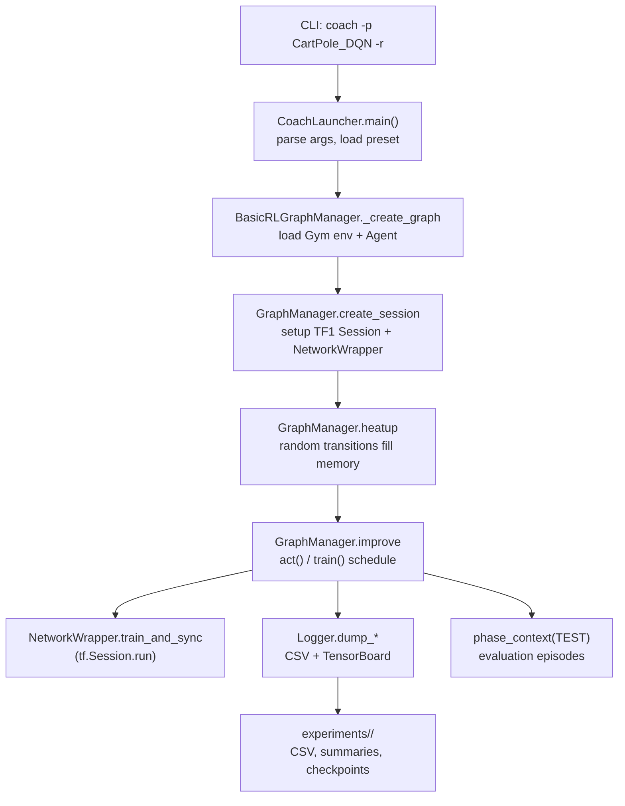
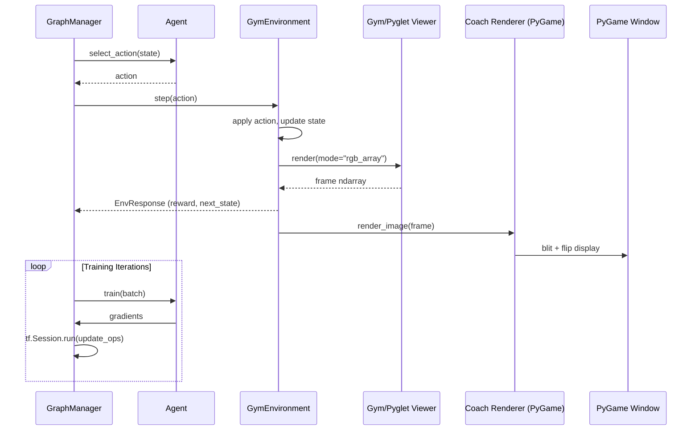

# Intel Coach Technical Report (Day 24 – Task 1)

## 1. Telemetry and Run Observation

- **Logging sinks**: Coach streams training statistics to CSV files under each run's `experiments/<name>/` directory (see `coach/README.md` and `coach/rl_coach/logger.py`, where `Logger.dump_output_csv` writes metrics according to `VisualizationParameters.dump_csv`). There is no SQLite-backed telemetry pipeline; persistence is file-based (CSV plus optional GIF/MP4 dumps and TensorBoard event files when enabled).
- **Screen traces**: `screen.log_*` calls inside the managers (for example in `coach/rl_coach/graph_managers/graph_manager.py`) emit the `Training … Episode …` lines you observed. The same logger multiplexes to stdout and to CSV so that the dashboard and TensorBoard can replay identical numbers.
- **Real-time visualization**: The `dashboard` tool (Bokeh server defined in `coach/rl_coach/dashboard.py`) tails those CSVs and updates plots live, as documented in `coach/docs_raw/source/dashboard.rst` ("signals are dynamically updated during the agent training"). Run it via `python -m rl_coach.dashboard --experiment_dir experiments/<name>` while training continues separately.
- **TensorBoard support**: Setting `-tb/--tensorboard` flips `VisualizationParameters.tensorboard=True`, causing the logger to stream summaries (`Logger.dump_tensorboard_summaries`) so you can monitor loss curves from the same `experiments/<name>/summaries/` tree.

## 2. End-to-End Execution Pipeline

1. **CLI bootstrap (`coach/rl_coach/coach.py`)**: `CoachLauncher.main()` parses flags (`-p`, `-r`, `-n`, etc.), resolves presets via `rl_coach.utils.short_dynamic_import`, and materializes `TaskParameters` alongside `VisualizationParameters`. The `-r/--render` flag sets `visualization_parameters.render=True` for all instantiated environments.
2. **Graph creation (`BasicRLGraphManager._create_graph`)**: The preset supplies `AgentParameters`, `EnvironmentParameters`, and `ScheduleParameters`. `_create_graph` loads the Gym environment (e.g., `rl_coach.environments.gym_environment:GymEnvironment`) and agent class, then wraps them in a `LevelManager`. Filters and default pre/post-processing are wired at this stage.
3. **Session and networks (`GraphManager.create_session`)**: Once the environment/agent graph exists, Coach builds a TensorFlow 1.x session (`tf.Session(config=…)` inside `GraphManager._create_session_tf`). Each `NetworkWrapper` materializes its online/target networks and registers savers so checkpoints and model exports can be managed.
4. **Heat-up and training loops (`GraphManager.heatup` / `improve`)**: The run starts with a heat-up phase that fills replay memory via random actions. Afterwards the improve loop alternates between (a) `act(...)`, which rolls out episodes, logs transitions into memory, and adjusts ε-greedy exploration, and (b) `train()`, which samples batches for `Agent.learn_from_batch`. DQN updates call `NetworkWrapper.train_and_sync_networks`, executing `tf.Session.run` on the loss/optimizer and the target-network sync ops.
5. **Evaluation cadence**: `phase_context(RunPhase.TEST)` wraps scheduled evaluation windows so metrics such as success rate and mean return are recorded without updating weights. Results are logged through the same `Logger` and appear in both console output and CSV files.
6. **Checkpointing and artefacts**: `SaverCollection.save` persists TensorFlow checkpoints on the cadence dictated by CLI flags, while experiment metadata (preset parameters, logs, videos) accumulates alongside the run inside `experiments/<timestamped_dir>/`.

### Pipeline Overview (Mermaid)

## 3. Rendering and Live Visuals (Gym + Pyglet + Coach Renderer)

- **Render switch**: `VisualizationParameters.render` (set by `-r`) toggles `Environment.is_rendered` in `coach/rl_coach/environments/environment.py`. Every call to `Environment.step` or `reset_internal_state` then triggers `self.render()`.
- **Gym + Pyglet viewer**: `GymEnvironment.get_rendered_image()` delegates to `self.env.render(mode='rgb_array')`. In Gym 0.12.x the classic control environments (e.g., `gym/envs/classic_control/cartpole.py`) draw via `gym.envs.classic_control.rendering.Viewer`, which owns a `pyglet.window.Window` and issues OpenGL commands. Asking for `rgb_array` makes Gym flush the Pyglet back buffer and return a NumPy array snapshot of the pixels.
- **Coach renderer bridge**: Unless `VisualizationParameters.native_rendering` is set, `Environment.render()` forwards that array to `rl_coach/renderer.py`. The helper wraps PyGame, scales the frame to the configured window size, blits it to the display surface, and polls keyboard events (used when `--play` hands control to a human). Gym/Pyglet therefore generate the frame, while Coach/PyGame handle the window the user sees.
- **Pyglet version constraints**: Recent Pyglet releases (≥2.0) require Python ≥3.8 and altered the buffer API. Coach’s Gym dependency expects the 1.x renderer, so in Python 3.7 environments we pin `pyglet==1.5.27` to keep the CartPole viewer compatible. If you flip `native_rendering=True`, Gym/Pyglet manage their own window directly and PyGame is bypassed.
- **Performance implications**: Rendering is synchronous with the training loop. Each `act()` step grabs a frame from Pyglet and pushes it through PyGame, so enabling `-r` introduces overhead. On headless servers, users typically disable rendering, enable MP4/GIF dumps, and rely on the dashboard for live metrics instead.

### Window Lifecycle and Event Flow

Coach opens the PyGame window lazily the first time it samples a frame from the environment. `GymEnvironment.__init__` calls `get_rendered_image()` immediately after Gym has booted; the array’s width/height (x2 in human-control mode) is fed into `Renderer.create_screen`, which sets up a double-buffered surface via `pygame.display.set_mode(..., HWSURFACE | DOUBLEBUF)` and stamps the window title. From that point on, every call to `Environment.step` or `reset_internal_state` executes `Environment.render()` when `is_rendered` is true. The default path (`native_rendering=False`) invokes `Renderer.render_image`, which:

- reshapes channel-first arrays coming from Gym, optionally normalizes grayscale frames, and creates a PyGame surface with `pygame.surfarray.make_surface`
- scales the surface to the configured window size, blits it to the back buffer, flips the display, and throttles with `pygame.time.Clock.tick()` so the UI event pump keeps pace with the OS
- polls `pygame.event.get()` each frame so quit/escape events close the window cleanly and pressed keys are cached in `renderer.pressed_keys`

When `VisualizationParameters.human_control` is set, `Environment.get_action_from_user` reads those cached keys and maps them back to Gym actions (`env.get_keys_to_action()`), letting a human take over mid-training. Additional visualization flags (`add_rendered_image_to_env_response`, `dump_mp4`, `dump_gifs`) hook into the same render call: the RGB frame is attached to each `EnvResponse` and buffered in `last_episode_images` so Coach can emit GIF/MP4 artefacts at the end of an episode. Native rendering short-circuits this flow by calling `env.render(mode="human")`, allowing Gym/Pyglet to manage their own window when duplicate windows would appear (Mujoco, classic control).

### Rendering While Learning (Mermaid)

## 4. Inter-Process Communication and Distributed Coordination

- **Single-host multi-process runs**: Passing `--num_workers > 1` activates TensorFlow’s parameter-server runtime. `CoachLauncher.start_multi_process` spawns a parameter-server process plus a worker process per replica using Python’s `multiprocessing.Process`. Each worker receives a `DistributedTaskParameters` object that carries the ps/worker gRPC endpoints and a handle to a `SharedMemoryScratchPad` (exposed through `multiprocessing.managers.BaseManager`). The scratch pad lets workers publish lightweight control signals (e.g., evaluation summaries) back to the launcher without sockets or files.
- **Dashboard collectors**: The Bokeh dashboard tailed by `rl_coach/dashboard_components/signals_files_group.py` runs in a separate `multiprocessing.Process`. It uses a `Manager`-provided queue so the UI can watch CSV/tensorboard artifacts asynchronously while the training process keeps driving the session.
- **Redis memory backend**: In distributed Coach, rollout workers and the central trainer exchange experience tuples through `RedisPubSubBackend` (`rl_coach/memories/backend/redis.py`). Rollouts publish pickled `Transition`/`Episode` objects on a Redis channel; the trainer subscribes and streams them into its replay buffer. Deployment helpers can even bootstrap Redis on Kubernetes when `memory_backend=redispubsub`.
- **Policy broadcast via data stores**: Updated policies flow the other way through the `RedisDataStore` (`rl_coach/data_stores/redis_data_store.py`). The trainer serializes network weights (`GlobalVariableSaver.to_string`) into Redis key/value storage and raises a Pub/Sub `new_policy` flag so rollout workers can pull the latest checkpoint and resume.
- **Shared statistics**: Optionally, `utilities/shared_running_stats.NumpySharedRunningStats` uses the same Redis Pub/Sub channel to fan out running-mean/variance updates (useful for reward normalization across many rollout pods). Subscribers push the received numpy buffers straight into their local normalizers.
- **Orchestrated clusters**: When `--distributed_coach` is combined with the Kubernetes orchestrator, the command line launcher becomes an orchestrator process that boots trainer and rollout containers remotely. Communication still rides on Redis Pub/Sub for trajectories plus the configured data store (S3/NFS/Redis) for checkpoints, so IPC extends seamlessly to inter-pod messaging.

## 5. Technology Stack

- **Language & runtime**: Python 3.6–3.7 (see `coach/setup.py`). Presets and orchestration code are pure Python modules; multi-process/distributed support is optional.
- **Deep learning backends**: TensorFlow 1.x by default (`setup.py` installs the CPU or GPU wheel). MXNet can be selected per run with `-f mxnet`, but DQN presets ship with TensorFlow graphs.
- **Visualization stack**: Bokeh powers the dashboard, PyGame handles Coach-managed windows, and Gym depends on Pyglet/OpenGL for native rendering. Matplotlib is bundled for offline plotting.
- **Numerics and logging**: NumPy, Pandas, SciPy, scikit-image (`coach/requirements.txt`) cover tensor math, statistics, and image processing for replay buffers and GIF/MP4 dumps.
- **Ecosystem adapters**: Gym 0.12.5 for environments, Redis/MinIO/Kubernetes clients for distributed rollouts, plus boto3 and Docker SDK integrations as listed in `coach/requirements.txt`.

## 6. Practical Takeaways

1. **Telemetry**: CSV/TensorBoard-based; there is no SQLite or gRPC telemetry bus. The dashboard and TensorBoard both consume the `experiments/<name>/` artefacts generated during a run.
2. **Watching runs**: Use `coach -p <preset> -r` for live rollouts and launch `python -m rl_coach.dashboard` in parallel for streaming charts. Expect a training slow-down whenever rendering is active.
3. **Reproducibility**: Preset parameters, checkpoints, and logs are persisted together. Copying the `experiments/<name>/` directory (plus the preset revision) is enough to resume or audit a run.
4. **Environment compatibility**: Keep Gym at the pinned version and match Pyglet to Python 3.6/3.7 (1.5.x) to avoid renderer breakage. For headless nodes, rely on dashboard/TensorBoard instead of the PyGame window.

## 7. Reference Paths

- Logging pipeline: `coach/rl_coach/logger.py`
- Dashboard tooling: `coach/rl_coach/dashboard.py`, `coach/docs_raw/source/dashboard.rst`
- CLI usage guide: `coach/docs_raw/source/usage.rst`
- Package metadata & entry points: `coach/setup.py`, `coach/requirements.txt`
- High-level README: `coach/README.md`
- Execution flow internals: `coach/rl_coach/graph_managers/graph_manager.py`, `coach/rl_coach/graph_managers/basic_rl_graph_manager.py`, `coach/rl_coach/level_manager.py`
- Rendering bridge: `coach/rl_coach/environments/environment.py`, `coach/rl_coach/environments/gym_environment.py`, `coach/rl_coach/renderer.py`
