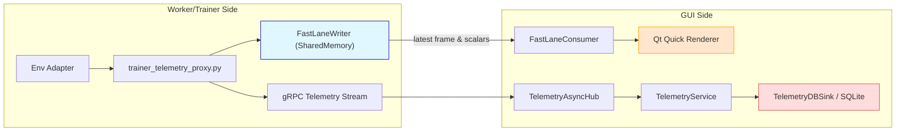

# Hybrid Telemetry Bridge (Low Latency + Durable)

## TL;DR

- Keep the gRPC -> RunBus -> SQLite path for durability and replay.
- Introduce a shared-memory fast lane so the GUI samples frames and HUD scalars directly at display cadence.
- Use Qt Quick's scene graph (QQuickWindow/QQuickView) for high-FPS rendering instead of embedding other engines.
- For the fully implemented walkthrough (with module references, failure modes, and instrumentation ideas), see `docs/1.0_DAY_28/TASK_1/README.md`.

## Goal

Maintain the current durable telemetry pipeline while delivering coach-like responsiveness by letting the GUI read the freshest visual data from a zero-copy buffer shared with the trainer or worker processes.

## Architecture Overview

### Producer Path

- The worker proxy (or worker itself) writes the latest frame and lightweight HUD metrics into a single-producer, single-consumer shared-memory ring buffer.
- Each publication increments an atomic head counter and notifies the GUI via a lightweight local socket message.

### Consumer Path

- The GUI attaches to the shared-memory segment, reads the newest stable slot, and paints it at the screen's refresh cadence.
- If the ring is empty, the GUI falls back to the existing gRPC stream so no telemetry is lost.

### Durability Path

- The daemon keeps ingesting telemetry via gRPC and batches writes into SQLite with WAL enabled.
- Replay tooling, analytics, and long-term persistence remain unchanged.

### Why This Works

- Intel Coach achieves sub-frame latency by tailing files inside the same process; the shared-memory ring recreates that locality without collapsing multi-process boundaries.
- Unity ML-Agents uses shared memory for hot observations and NVIDIA Isaac Sim renders straight from GPU-resident tensors. Adopting the same fast lane keeps the GUI responsive while preserving durability.

### Terminology & Current Bottleneck

- **HUD metrics**: shorthand for “Heads-Up Display” values (episode reward, current step, FPS, etc.). In today’s GUI they’re derived from telemetry rows pulled out of SQLite; in the fast lane we keep them in the shared-memory header so the HUD updates without touching the database.
- **Ring creation point**: `trainer_telemetry_proxy.py` allocates the `SharedMemory` region when a run starts (one segment per run, named `mosaic.run.<run_id>.fastlane`). The proxy writes the header + slots; the GUI attaches when the run transitions to READY and detaches during teardown.
- **QML**: Qt’s declarative UI language (Qt Modeling Language). Qt Quick scenes are described in QML files (e.g., `FastLaneView.qml`) and rendered by the scene graph on a dedicated thread. Our new renderer lives here, using a `QQuickFramebufferObject` or custom `QQuickItem` implemented in Python/C++ but embedded in QML.
- **Existing bottleneck**: frames currently travel worker → protobuf → gRPC → TelemetryAsyncHub → QWidget painter. Each hop copies data, and the GUI waits for `_record_step()` to enqueue telemetry before it can paint. When SQLite falls behind (common with 60 FPS Atari), the UI thread blocks, so rendering stutters. The fast lane removes protobuf/SQLite from the hot path and lets Qt Quick paint directly from shared memory, leaving the durable path to catch up asynchronously.

## Ring Buffer Design

### Memory Layout

```cpp
struct Header {
    uint32_t version;
    uint32_t flags;          // bit 0: running, bit 1: paused, etc.
    uint64_t capacity;       // number of slots
    alignas(64) std::atomic<uint64_t> head;
    alignas(64) std::atomic<uint64_t> tail;
    double   last_reward;
    double   avg_reward_1s;
    double   step_rate_hz;
};

struct Slot {
    uint64_t seq;            // seqlock generation to prevent torn reads
    uint32_t width;
    uint32_t height;
    uint32_t format;         // e.g., RGB8
    uint32_t bytes;          // payload length
    uint8_t  payload[bytes];
};
```

### Flow Control

- The producer writes `seq + 1`, copies the payload, then publishes `seq + 2`; even values indicate stable data.
- The consumer waits for an even sequence value that is unchanged before and after copying, ensuring lock-free reads.
- Dropping intermediate slots keeps the GUI real-time, while SQLite still guarantees durability.

### Naming and Lifecycle

- Shared-memory segment per run: `mosaic.run.<run_id>.fastlane`.
- The producer creates the segment and unlinks it on exit; the GUI cleans up stale segments during run teardown.

### Accessible APIs

- Python workers can rely on `multiprocessing.shared_memory.SharedMemory` for a cross-platform implementation today.
- The GUI can stay on the Python shared-memory API for speed; Qt's `QSharedMemory`/`QSystemSemaphore` become useful if the reader moves to C++.

### Payload Scope

- Required: the freshest RGB frame (or tiled textures if cheaper).
- Scalars: episode index, step, reward, steps per second, optional loss.
- Optional: 8-bit overlays (heatmaps, visitation maps) for low-bandwidth value visualisations.
- Everything else (protobuf telemetry, history, checkpoints) continues over gRPC into SQLite.

## SQLite Tuning

- Keep WAL mode and batch transactions to reduce writer/reader contention.
- Set `PRAGMA synchronous=NORMAL` on the telemetry database to trim fsync overhead while remaining safe for this workload.
- Trigger WAL checkpoints opportunistically to avoid long stalls.

## Qt Rendering Strategy

### Preferred Path

- Render inside `QQuickWindow`/`QQuickView` so Qt's scene-graph thread (backed by the RHI) can drive high frame rates.
- Avoid `QQuickWidget` for visualisation tabs; it forces rendering onto the GUI thread and introduces extra copies.

### Implementation Options

- **QQuickFramebufferObject**: implement a renderer that uploads each frame to a texture inside `render()`. Qt composites the offscreen FBO automatically and makes overlaying HUD elements trivial.
- **Scene-Graph Texture Node**: subclass `QQuickItem`, hold a persistent `QSGSimpleTextureNode`, and refresh a `QSGTexture` whenever a new frame arrives. The pattern is ready for a future C++ rewrite using QRhi.

### Why It Fits

- Qt Quick lets the team layer text, charts, and badges in QML without extra windowing stacks.
- The approach mirrors NVIDIA Isaac Sim, where GPU textures never leave the render process.

## Frame Scheduling and Threading

- A lightweight consumer thread maps the newest ring slot, wraps it in a `QImage` that references external memory, and signals the QML item.
- Call `QQuickWindow::update()` so Qt schedules rendering at vsync on its dedicated thread.
- For fixed-rate rendering, drive a precise timer on the Qt side and sample the freshest slot available.

## Implementation Phases

- **Phase A — Fast Lane (Unity Style)**: add the shared-memory writer to `trainer_telemetry_proxy.py`, allocate `Header + N * Slot` (N ≈ 64–256), publish frames and scalars, and wire a GUI reader that always consumes the latest stable slot.
- **Phase B — Qt Quick Rendering (Isaac Friendly)**: introduce a dedicated QML scene (FBO or texture-node), overlay HUD information, and expose UI controls such as FPS caps and a "prefer shared memory" toggle.
- **Phase C — Persistence Hardening (Coach Style)**: continue tuning WAL settings and optionally integrate control-stream credits so the GUI can request slower producers when sustained drops appear.

## Validation and Metrics

- Target end-to-end latency (worker step to pixels) below 16 ms on mainstream hardware.
- Track GUI frame time, dropped frames, and UI-thread jank.
- Observe SQLite batch duration and WAL checkpoint pauses.
- Compare gRPC step rate with GUI frame rate to confirm the GUI intentionally displays the newest data, not every step.

## Impacted and Likely Impacted Files

| Area | Files |
| --- | --- |
| Fast lane buffer and lifecycle | `trainer_telemetry_proxy.py`, `gym_gui/services/trainer/streams.py`, new `gym_gui/fastlane/__init__.py` (ring structs, shared-memory helpers) |
| GUI integration | `gym_gui/ui/main_window.py`, new QML assets such as `resources/qml/FastLaneView.qml`, helpers in `gym_gui/ui/renderers` |
| Telemetry persistence | `gym_gui/telemetry/db_sink.py`, `gym_gui/services/bootstrap.py`, `gym_gui/constants/constants_telemetry.py` (PRAGMA defaults) |
| Configuration and toggles | `gym_gui/config/settings.py`, `gym_gui/config/storage_profiles.yaml`, control-panel UI wiring |
| Backpressure and metrics | `gym_gui/logging_config/log_constants.py`, `TelemetryAsyncHub` statistics, new structured log events |
| Likely touched later | `gym_gui/services/frame_storage.py`, `gym_gui/controllers/session.py`, packaging scripts (include new QML/resources) |

## Architecture Snapshot



The blue node highlights the shared-memory fast lane, orange covers the Qt Quick renderer, and red shows the durable telemetry pipeline.

## References

| Topic | Key Docs |
| --- | --- |
| Unity ML-Agents shared memory | Unity ML-Agents Trainer <-> Game bridge documentation |
| NVIDIA Isaac Sim GPU transport | NVIDIA Isaac documentation on Omniverse sensor streaming |
| Intel Coach dashboard | Intel Coach dashboard notes (Intel Labs) |
| Qt Quick scene graph and RHI | Qt 6 scene graph documentation |
| `QQuickFramebufferObject` patterns | Qt reference manual and project notes (`QuickFramebufferObject.md`) |
| Qt shared-memory primitives | Qt docs on `QSharedMemory` and `QSystemSemaphore` |
| Python shared memory | Python `multiprocessing.shared_memory` docs |
| SQLite WAL and PRAGMAs | Official SQLite documentation |

## FAQ

### Can Unity or Godot live inside `gym_gui`?

Not realistically. Both engines own their render loops and windowing systems. Embedding them inside Qt introduces event-loop conflicts, duplicated GPU contexts, and additional copies. The better approach is to keep Unity or Godot as external environment providers and feed their frames into the shared-memory bridge while Qt Quick handles the MOSAIC GUI.

## Next Actions

- Confirm the shared-memory header layout and prototype the publisher/consumer pair.
- Decide between the QQuickFramebufferObject and texture-node approaches, then scaffold the chosen path.
- If helpful, draft the shared-memory structs and a PyQt6 `QQuickFramebufferObject` sample for direct inclusion in the repo.
