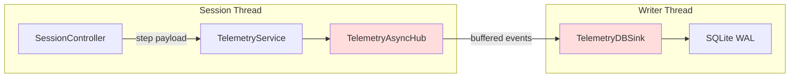
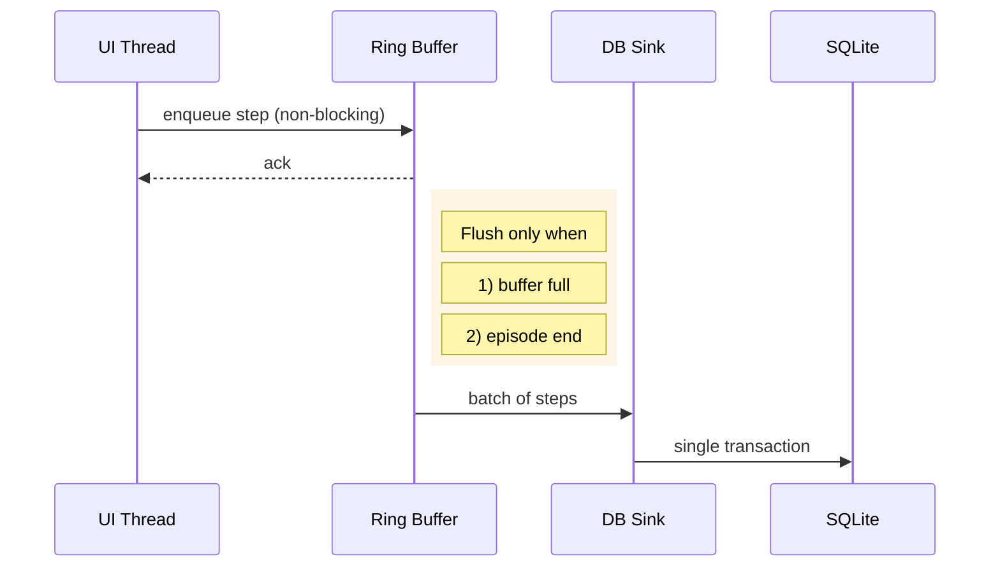

# Rendering + Telemetry Pipeline Notes

## Goal
Document options for keeping rendering responsive while telemetry is persisted, focusing on dynamic buffering, better observability, and future architectural changes.

## Dynamic Buffer/Queue Sizing Idea
- **Context**: `TelemetryAsyncHub` (in-memory fan-out) and `TelemetryDBSink` (SQLite writer) both have fixed queue sizes (`TELEMETRY_HUB_BUFFER_SIZE`, `DB_SINK_WRITER_QUEUE_SIZE`). When Assault or CarRacing emit 60 Hz RGB frames plus metadata, those queues fill and the UI thread blocks waiting for space.
- **Proposal**: Derive buffer sizes from the active game instead of constants. e.g.
  - Maintain a small table keyed by `GameId` → `{hub_buffer, writer_queue, batch_size}`; fall back to family defaults.
  - Use the new DB-sink log constants (LOG931–LOG934) to watch queue depth/flush latency in production, then persist the observed optimal settings.
  - Expose a CLI/Qt “Performance preset” so testers can bump headroom without diving into source.



*Hot nodes* (`TelemetryAsyncHub`, `TelemetryDBSink`) are where dynamic queue sizing matters most.

## Q1: Can pytest-based tests determine good buffer sizes?
- **Synthetic throughput tests** are feasible: create a fake adapter that emits steps at configurable FPS, feed them through a mocked telemetry pipeline, and vary buffer sizes to see when queue pressure logs appear.
- However, the “correct” size depends on actual frame payloads (RGB arrays) and disk speed; unit tests would at best give relative comparisons on the CI machine. They won’t model a user’s SSD/CPU.
- Recommended testing strategy:
  1. Build a stress-test fixture that replays captured episodes at different rates to ensure no deadlocks.
  2. Use debug logs/metrics (already added) during manual profiling sessions per game to choose defaults.
  3. Optionally add a benchmark test (skipped by default) that reports throughput to a CSV so we can compare runs over time.

## Q2: Could Redis/message queues or multiple SQLite files help?
- **Redis / MQ**: Offloading telemetry to Redis or NATS would decouple the UI thread entirely; the GUI would push events over TCP and a separate worker would drain to SQLite. Pro: smoother rendering, easy scaling. Con: adds an external dependency and complicates offline runs.
- **Multiple SQLite files**: We could shard telemetry by game (`telemetry_Assault.sqlite`, `telemetry_CarRacing.sqlite`). This reduces WAL contention because each writer owns its file, but the UI still blocks if *any* shard queue backs up. It also complicates querying aggregated history.
- Short-term compromise: keep SQLite but push writer into a separate process (multiprocessing) so Python’s GIL doesn’t pause Qt, or switch to `sqlite3`’s `apsw` for better concurrency.

## Q3: How to “speed up” `DB_SINK_WRITER_QUEUE_SIZE`, and what does a ring buffer buy us?
- **Queue size** is just the max backlog; increasing it doesn’t make writes faster, it only delays the point where producers block. To improve throughput:
  - Increase `DB_SINK_BATCH_SIZE` so each flush writes more rows per transaction.
  - Reduce checkpoint frequency (`DB_SINK_CHECKPOINT_INTERVAL`) so WAL merges happen less often.
  - Move heavy render blobs off the critical path (store them on disk first, log only pointers).
- **Ring buffer**: Already used elsewhere, but the idea is to keep only the last *N* steps in RAM. For human mode we can avoid hitting SQLite every frame by:
  - Appending steps to a ring buffer during play.
  - Only flushing to disk once the episode ends or the user explicitly saves.
  - While the buffer still allows live HUD updates, the UI no longer blocks waiting for durable storage.



## Next Experiments
1. Instrument CarRacing (Box2D) with current constants; capture queue-pressure logs and actual FPS.
2. Apply larger per-game buffer presets, replay Assault, and compare log output + perceived smoothness.
3. Prototype “telemetry-lite” mode that keeps the ring buffer in memory and postpones SQLite writes.

## Impacted / Likely Impacted Files
- `gym_gui/constants/constants_telemetry.py` — defines `TELEMETRY_HUB_BUFFER_SIZE`, `DB_SINK_BATCH_SIZE`, etc.; would host per-game overrides.
- `gym_gui/services/bootstrap.py` — wires the telemetry hub and DB sink using those constants; needs logic to inject dynamic sizes.
- `gym_gui/telemetry/db_sink.py` — queue/flush behavior, new logging, possible ring-buffer integration.
- `gym_gui/services/trainer/streams.py` — owns `TelemetryAsyncHub`; buffer sizing or backpressure hooks would touch this file.
- `gym_gui/controllers/session.py` & rendering widgets — if we add “telemetry-lite” or ring buffer toggles, UI must expose settings.
- `gym_gui/config/game_configs.py` or a new tuning map — place to store per-game performance presets.

## Buffer Size vs. CPU / Memory / Disk
Larger buffers shift pressure between resources:

```mermaid
flowchart TB
    subgraph Memory
        BUF[Hub Buffer / Writer Queue]
    end
    subgraph CPU
        CPU[Flush batching & WAL checkpoints]
    end
    subgraph Disk
        IO[SQLite writes / checkpoints]
    end

    A[UI Thread] -->|Step payload| BUF
    BUF -->|Batch flush| CPU --> IO
    IO -->|Backpressure| A

    classDef mem fill:#e6f7ff,stroke:#5aa;
    classDef cpu fill:#fff3cd,stroke:#cc9;
    classDef disk fill:#fde2e1,stroke:#c77;
    BUF:::mem
    CPU:::cpu
    IO:::disk
```

- **Memory usage** grows roughly linearly with buffer depth × payload size (RGB frames are large). Bigger buffers mean more RAM but fewer stalls.
- **CPU cost** spikes during flushes: larger batches take longer per transaction but amortize per-row overhead; small buffers flush frequently, increasing context switches.
- **Disk I/O** benefits from bigger batches (sequential WAL writes) but suffers if WAL checkpoints run too often—raising the checkpoint interval defers that work at the cost of longer WAL files.
- When buffers fill (Memory saturated), backpressure propagates upstream (UI thread blocks) and perceived FPS plummets—even though CPU/Disk might still have headroom.

### Concrete Numbers (typical desktop)
- **Payload size**: `RGB(210x160x3)` ≈ 100 KB per step (after compression 30–50 KB). With metadata (~2 KB), a queue depth of 4,096 consumes ~400 MB of RAM.
- **Flush batching**: Writing 128 rows at once takes ~6–10 ms on NVMe SSD, but 128 single-row transactions take ~150–250 ms. Increasing `DB_SINK_BATCH_SIZE` trades a brief CPU burst for higher overall throughput.
- **Checkpoint cost**: `sqlite3_wal_checkpoint` forces WAL→DB merge; on large WAL files (>200 MB) this can spike disk I/O for 100–200 ms. Raising `DB_SINK_CHECKPOINT_INTERVAL` postpones these spikes.
- **Backpressure response**: When `TelemetryAsyncHub`’s buffer fills, `SessionController._record_step` blocks. Idle timers keep firing, but rendering halts because Qt can’t process paint events while waiting.

### Optimization Levers
1. **Memory-bound games (e.g., CarRacing)**: Use moderate buffer (2–4k) but store only frame references (disk paths) in telemetry; offload raw PNGs to `FrameStorageService`.
2. **CPU-bound games (e.g., Assault with high FPS)**: Increase batch size and move DB sink to a separate process so Python’s GIL doesn’t block Qt during flushes.
3. **Disk-bound scenarios (slow SSD/HDD)**: Enable “telemetry-lite” mode so human sessions keep only a ring buffer until the user opts to save, reducing sustained writes.
4. **Per-game presets**: Expose sliders in the control panel allowing testers to trade memory for responsiveness; record actual queue depths via LOG931/LOG932 to auto-tune defaults.

### Recommended Host Profiles

| Profile | CPU | RAM | Disk | Buffer Guidance |
| --- | --- | --- | --- | --- |
| **Minimum** | 4 cores @ ≥2.0 GHz | 8 GB | SATA SSD / fast HDD | Keep `TELEMETRY_HUB_BUFFER_SIZE ≤ 2048`, `DB_SINK_WRITER_QUEUE_SIZE ≤ 2048`, batch size 64; enable telemetry-lite for human play. |
| **Good** | 6 cores @ ≥3.0 GHz | 16 GB | NVMe SSD | Buffers 4096–8192, batch size 128–256, checkpoint interval ≥2048; safe for Assault without skips. |
| **More than enough** | ≥8 cores (performance+efficiency) | ≥32 GB | NVMe Gen4 / RAID | Buffers 8192–16384, batch size 256–512, checkpoint interval 4096+; can also enable per-game frame caching. |

Your current machine (~31 GB RAM, >90 % CPU idle per `top`) sits in the “more than enough” tier, so we can safely experiment with larger queue depths (e.g., start at 8192) without starving other processes.

### SQLite Settings to Consider
SQLite’s defaults favor durability over throughput. We can relax some knobs (ideally via `gym_gui/constants/constants_telemetry_db.py` or a dedicated storage profile) when the primary goal is smooth rendering.

| Setting | Current Behavior | Suggested Tuning |
| --- | --- | --- |
| `PRAGMA journal_mode=WAL` | Already enabled; allows concurrent reads. | Keep WAL but pair with larger `DB_SINK_BATCH_SIZE` to reduce WAL write frequency. |
| `PRAGMA synchronous=FULL` (likely default) | Forces fsync per transaction → rock-solid but slow. | For human-only sessions, drop to `NORMAL` or `OFF` (crash risk) to trade durability for speed. Expose via settings toggle. |
| `PRAGMA cache_size` | Default (2 MB). | Increase (e.g., `PRAGMA cache_size = -131072` for 512 MB) so repeated inserts don’t evict recent pages. |
| `PRAGMA temp_store` | File-based. | Set to `MEMORY` to avoid temp files during large batch inserts. |
| `PRAGMA wal_autocheckpoint` | SQLite default (1000 pages ≈ 4 MB). | Already effectively controlled by `DB_SINK_CHECKPOINT_INTERVAL`; raise interval or disable auto checkpoint in favor of manual `checkpoint_wal()`. |
| `VACUUM` cadence | Manual. | Run after heavy play sessions to compact the DB; automate via `storage_profiles.yaml`. |

We can set these pragmas when the Telemetry store is created (see `gym_gui/services/bootstrap.py` → `TelemetrySQLiteStore`) so each run inherits the tuning. For example:

```python
conn.execute("PRAGMA synchronous=NORMAL")
conn.execute("PRAGMA cache_size=-131072")  # 512 MB cache
conn.execute("PRAGMA temp_store=MEMORY")
```

Pairing lighter `synchronous` with bigger queues keeps Assault smooth even when aliens fire continuously, because each flush becomes a large sequential write instead of thousands of fsyncs.
