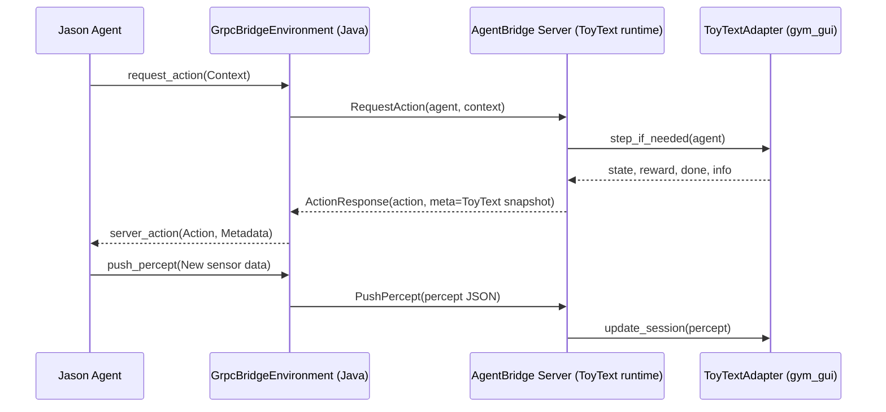

# ToyText ↔ Jason Bridge Integration Plan

## Objective

- Embed Gym GUI ToyText environments inside the Jason ⇄ Python gRPC bridge so Jason agents can request policy guidance backed by real environment rollouts instead of the current dummy heuristic server.
- Preserve compatibility with existing `agent_bridge.proto` contracts while surfacing richer ToyText state and telemetry for downstream analytics.

## Success Criteria

- Jason agent invoking `request_action/1` receives actions computed from a live ToyText environment (FrozenLake, CliffWalking, Taxi, Blackjack) via the Python bridge.
- The bridge exposes deterministic reset/seed controls so Jason plans can coordinate reproducible experiments.
- Structured metadata (`meta[]`) includes ToyText-specific context (grid location, reward, done flags) without breaking legacy consumers of `metadata`.
- Integration can be exercised end-to-end via automated tests (standalone Python + Jason loop) and manual runs documented in repo docs.

## Current State Snapshot

- **gym_gui assets**: `gym_gui/core/adapters/toy_text.py` provides adapters with rendering helpers, defaults live under `gym_gui/constants/constants_game.py`, and docs for ToyText variants reside in `gym_gui/game_docs/Gymnasium/ToyText/`.
- **Jason bridge repo**: `3rd_party/JASON_GRPC_BRIDGE_PYTHON/python_project/server.py` returns heuristic actions with no environment backing; MAS side (`GrpcBridgeEnvironment.java`) assumes unary RPCs and injects `server_action/2` percepts.
- **Existing bridges**: `gym_gui/services/jason_bridge/server.py` already integrates with the GUI supervisor. Lessons learned there (service locator, in-process fallback, telemetry logging) should inform the ToyText bridge design.
- **Tooling**: Proto contract (`proto/agent_bridge.proto`) already ships with structured metadata and streaming hooks; Python project maintains its own venv and requirements.

## Recommended Integration Strategy

- Treat the Python bridge as the authoritative ToyText runner while Jason remains the high-level BDI logic. Jason requests actions; the bridge simulates ToyText transitions using Gym GUI adapters and returns recommended actions plus state summaries.
- Use Gym GUI adapters rather than raw Gymnasium envs to stay aligned with GUI defaults (map layouts, logging, render payloads) and to reuse helper utilities (ANSI-to-grid parsing, hole metadata, taxi decoding).
- Maintain one ToyText session per Jason agent (backed by adapter instances). Sessions own RNG seeds, current observation/reward, and optional training artefacts (Q-tables, policies).
- Preserve current gRPC signature by encoding ToyText observations in `meta` entries (JSON is optional but metadata keys should be stable).
- Provide opt-in configuration so the bridge can run either the new ToyText runtime or the legacy heuristic policy (use env var, CLI flag, or config file).

## Phased Work Plan

### Phase 0 — Foundations & Environment Setup

- Align Python versions: ensure the bridge venv matches Gym GUI’s supported version (3.11). Update `3rd_party/JASON_GRPC_BRIDGE_PYTHON/requirements.txt` with `gym-gui` extras or add editable install pointing to repo root.
- Expose an activation helper script (`source ../.venv/bin/activate && export PYTHONPATH=../..`) so the bridge can import `gym_gui` packages during development and CI.
- Document build/run prerequisites in `JASON_GRPC_BRIDGE_PYTHON/README.md` (ToyText mode requires GUI repo checkout, optional Qt offscreen flag for render tests).

### Phase 1 — ToyText Runtime Harness

- Add `python_project/toytext_runtime.py` housing:
  - `ToyTextSession` dataclass encapsulating adapter instance, last observation, reward, done flag, RNG seed, and queued percepts.
  - `ToyTextRuntime` manager with session registry keyed by `(agent_id, game_id)`; load adapters via `gym_gui.core.adapters.toy_text.TOY_TEXT_ADAPTERS`.
  - Configuration loader mapping Jason context strings to `GameId`, control mode, and adapter kwargs (start/goal overrides, slippery flag, etc.).
- Implement reset/seed helpers that accept either Jason-supplied seeds or auto-generate via `secrets.randbelow` for reproducibility.
- Surface rendering snapshots (grid, agent position, holes) using adapter `render()` payload; cache latest snapshot for metadata emission.

### Phase 2 — gRPC Server Integration

- Refactor `server.py` to depend on `ToyTextRuntime`:
  - Inject runtime via constructor or singleton to keep default heuristics available for non-ToyText use cases.
  - Extend `AgentBridgeService.PushPercept` to accept structured JSON payloads (e.g. `{"kind": "toytext_event", "data": {...}}`) and forward relevant events (goal switch, reward acknowledgement) to the runtime.
  - Update `RequestAction` to retrieve/update sessions before deciding actions:
    1. Deserialize context (JSON or `key=value` pairs) to select session and optional control signals (reset, game_id, manual action overrides).
    2. If no prior observation exists, call `adapter.reset()` and stash the observation.
    3. Use runtime policy to pick next action (`q_table`, heuristic, or pass-through). Optionally support Jason-driven actions by returning `metadata` guidance while leaving final decision to Jason.
    4. Step the adapter when policy chooses an action, capture new observation/reward/done, and update session state.
    5. Populate `ActionResponse.meta` with keys such as `grid_row`, `grid_col`, `reward`, `terminated`, `truncated`, `snapshot_path`.
- Preserve fallback `_decide_action` for legacy behavior when runtime is disabled or fails to initialize; include flag in metadata (`mode=toytext` vs `mode=legacy`).

### Phase 3 — Policy & Control Logic

- Create pluggable policy interface (strategy pattern): baseline options include random policy, greedy short-path for FrozenLake, Q-learning table stored under `var/toy_text/`.
- Provide hooks to load Gym GUI-trained policies (if available) or to delegate to CleanRL/Spade worker outputs.
- Allow Jason to send hints via `PushPercept` (e.g., `{"cmd": "set_goal", "x": 3, "y": 3}`) that runtime maps onto adapter methods (`set_goal`, `reset_q_table`).
- Ensure state transitions remain synchronous to keep MAS reasoning deterministic (i.e., ignore concurrent requests; use locks around session updates).

### Phase 4 — Telemetry & Observability

- Emit structured logs (`logging` module) mirroring Gym GUI log constants for easier correlation (e.g., `toytext_session_reset`, `toytext_action_selected`).
- Optionally forward telemetry to Gym GUI’s `TelemetryService` by reusing `TelemetrySQLiteStore` if we need persistent run history; gate behind config to avoid hard dependency.
- Publish lightweight metrics (per-agent reward sums, episode lengths) via `meta` entries or a dedicated health endpoint for future dashboards.

### Phase 5 — Jason MAS Adjustments

- Update `GrpcBridgeEnvironment` usage documentation to describe new context conventions (e.g., `request_action(game(frozenlake), seed(1234))`).
- Provide example AgentSpeak plan demonstrating end-to-end ToyText loop (reset, request action, process `server_action/2`, optionally push feedback percepts).
- Validate that escaping rules still hold when metadata carries JSON fragments; adjust quoting if necessary.

### Phase 6 — Verification & Documentation

- Unit-test `ToyTextRuntime` with pytest (cover session reset, metadata payload, deterministic seeds). Place tests under `python_project/tests/`.
- Add integration smoke test that spins up gRPC server, simulates Jason RPCs, and verifies FrozenLake run reaches terminal state.
- Extend `GRPC_JASON_BRIDGE.md` and top-level README with ToyText mode instructions, diagrams, and troubleshooting tips.
- Capture manual validation steps (CLI commands, expected logs) in `docs/1.0_DAY_26/TASK_1/` follow-up notes once implementation lands.

## Testing Matrix (Minimal)

- **FrozenLake 4x4 / 8x8**: deterministic vs slippery, ensure agent position metadata matches grid.
- **CliffWalking**: validate reward penalties and termination detection when stepping into the cliff.
- **Taxi**: confirm passenger/destination indices surface correctly; multi-step episodes.
- **Blackjack**: check scalar observation encoding (hand values) despite degenerate grid rendering.
- **Jason RPC failure modes**: drop connection mid-episode, invalid context JSON, repeated resets.
- **Concurrency**: simultaneous requests from multiple Jason agents mapped to independent sessions.

## Risks & Open Questions

- **Runtime dependency weight**: importing full `gym_gui` (Qt, telemetry stack) may slow startup inside the bridge repo. Mitigation: isolate ToyText runtime to adapter modules only and guard optional imports.
- **Action authority**: clarify whether Jason should obey bridge action suggestions or only use them as hints; interface might require new proto field (e.g., `recommendation_level`).
- **State synchronization**: need a deterministic contract for when the bridge steps the environment vs when Jason sends commands—otherwise beliefs can desynchronize. Proposal: step only inside `RequestAction`; treat `PushPercept` as out-of-band commands/config.
- **Policy storage**: decide on storage location for learned Q-tables (bridge repo vs shared `var/`).
- **Security/TLS**: current bridge remains plaintext; enabling remote ToyText runs might require TLS + auth before production use.

## Immediate Next Steps

1. Prototype `ToyTextRuntime` class that can reset and step FrozenLake locally (without gRPC) using adapters.
2. Draft JSON schema for `RequestAction.context` and `PushPercept.payload` to carry session directives and validation state.
3. Align with documentation owners on where ToyText bridge usage should live (Day-26 follow-up doc plus README entry).
4. Review with stakeholders whether proto extensions are needed before coding (e.g., separate RPC for environment snapshots).

## References

- `gym_gui/core/adapters/toy_text.py`
- `gym_gui/services/jason_bridge/server.py`
- `3rd_party/JASON_GRPC_BRIDGE_PYTHON/python_project/server.py`
- `proto/agent_bridge.proto`
- `JASON_java_project/grpc-bridge-example/src/main/java/org/jason/grpc/bridge/GrpcBridgeEnvironment.java`
