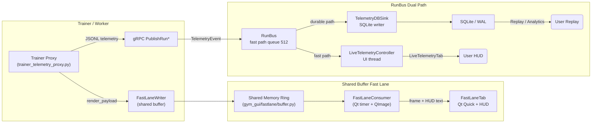

# Dual Path, Fast Lane, and Slow Lane Briefing

This note grounds every term in the current code base so operators can tell which switches affect live rendering versus durable storage. For the historical rationale, see the original dual-path write-ups in `docs/1.0_DAY_11/RAY_ARCHITECTURE_DEEP_DIVE.md` and the fast-lane proposal in `docs/1.0_DAY_24/TASK_3/proposing_improvement.md`.

## Dual-Path Telemetry (RunBus fast path + durable path)

| Concept | Description | Primary Code References |
| --- | --- | --- |
| Fast path (UI) | RunBus queues sized for the UI (`RUNBUS_UI_PATH_QUEUE_SIZE = 512`) feed `LiveTelemetryController`, which fans events directly into `LiveTelemetryTab` without waiting on SQLite. | `gym_gui/constants/constants_telemetry.py`, `gym_gui/controllers/live_telemetry_controllers.py` |
| Durable path | `TelemetryDBSink` subscribes to RunBus with a large queue (`DB_SINK_WRITER_QUEUE_SIZE = 16384`) and writes every `StepRecord`/`EpisodeRollup` to SQLite using WAL+batching. | `gym_gui/telemetry/db_sink.py`, `gym_gui/telemetry/sqlite_store.py`
| Producer | Trainer daemon accepts JSONL telemetry via gRPC, publishes to RunBus, and mirrors the data into the SQLite store. | `gym_gui/services/trainer/service.py`
| Credit guard | `LiveTelemetryController` initializes credits per `(run_id, agent_id)` and hands them to `get_credit_manager()` so a misbehaving UI tab cannot stall the slow lane. | `gym_gui/controllers/live_telemetry_controllers.py`, `gym_gui/telemetry/credit_manager.py` |
| Queue sizing knobs | `RUNBUS_UI_PATH_QUEUE_SIZE`, `RUNBUS_DB_PATH_QUEUE_SIZE`, `DB_SINK_WRITER_QUEUE_SIZE` are centralized in `constants_telemetry.py` so we can tune each lane independently during load tests. | `gym_gui/constants/constants_telemetry.py` |

Key rules baked into `gym_gui/telemetry/run_bus.py`:
- Publish never blocks; each subscriber gets its own `queue.Queue` and overflow drops the oldest event instead of slowing the producer.
- Fast path and durable path subscribers are completely independent, so a backlog on SQLite never freezes the UI.
- Sequence numbers are tracked per `(run_id, agent_id)` so durable-path replays can alert on gaps even if the fast path overwrote frames.

### Per-component responsibilities

| Component | Responsibility | Notes |
| --- | --- | --- |
| `TrainerService.PublishRunSteps` | Converts JSONL to protobuf, mirrors into SQLite, and publishes `TelemetryEvent`s to RunBus. | Responds with drop counts so workers can back-pressure. |
| `TelemetryDBSink` | Background thread that batches 64+ events, writes via WAL, and periodically checkpoints. | Uses larger queue so disk stalls do not impact RunBus publishers. |
| `TelemetryAsyncHub` | Bridges remote workers and local RunBus subscribers. | Acts as the WAN/LAN boundary described back on Day 14. |
| `LiveTelemetryController` | UI fast-path consumer that keeps lightweight buffers (64 steps, 32 episodes) until tabs exist. | Drops overflow with logs `LOG_LIVE_CONTROLLER_QUEUE_OVERFLOW`. |
| `LiveTelemetryTab` | Renders analytics widgets, uses fast-path fallback builders when `render_payload` is missing. | Fallback logic lives around line 1080. |

## Fast Lane vs Slow Lane

`docs/1.0_DAY_24/TASK_3/proposing_improvement.md` and the new `gym_gui/fastlane` package introduce an **extra** split specifically for video/HUD rendering:

- **Fast lane (shared buffer)**: `FastLaneWriter` allocates a per-run shared-memory ring buffer (`gym_gui/fastlane/buffer.py`). `trainer_telemetry_proxy.py` converts each render payload into raw RGB bytes, writes them into the buffer, and updates HUD metrics.
- **Slow lane (telemetry pipeline)**: the existing gRPC → `TelemetryAsyncHub` → `TelemetryService` → `TelemetryDBSink` path remains untouched. This is where SQLite durability, replay, credit-based flow control, and multi-language workers live.

The CleanRL launch form exposes a "Fast Lane Only" checkbox (`gym_gui/ui/widgets/cleanrl_train_form.py`) that disables the slow lane entirely when you just want live video.

### Shared Buffer Details

1. `FastLaneWriter` precomputes slot metadata (sequence ID, payload length) and copies the freshest RGB/RGBA frame into shared memory without blocking. It uses an SPSC seqlock pattern (`seq+1` during write, `seq+2` when stable) like the one outlined in Day 24.
2. `FastLaneReader` (inside `gym_gui/ui/fastlane_consumer.py`) polls every 16 ms, grabs the newest complete slot, and emits a `FastLaneFrameEvent` containing the `QImage` and HUD text. If the shared memory segment disappears (cleanup), it reconnects automatically.
3. `FastLaneTab` hosts a Qt Quick scene that paints frames via `FastLaneItem` and overlays HUD text, giving operators a zero-copy render UI. The QML layer lives in `gym_gui/ui/qml/FastLaneView.qml` so designers can restyle without touching Python.
4. `FastLaneConsumer.status_changed` emits `fastlane-unavailable` or `connected`, so monitoring can detect when the shared buffer fails to mount.
5. The shared-memory naming convention (`mosaic.fastlane.<run_id>`) matches the cleaning script in Day 27, ensuring orphaned buffers are garbage-collected when runs terminate.

### Where the fast lane shows up in the UI tree

| UI file | Purpose |
| --- | --- |
| `gym_gui/ui/widgets/fastlane_tab.py` | Wraps the Qt Quick scene inside a QWidget tab, wires `FastLaneConsumer` signals into QML, and exposes `cleanup()` so `RenderTabs` can tear it down safely. |
| `gym_gui/ui/fastlane_consumer.py` | Owns the `FastLaneReader`, converts shared-memory frames into `QImage`s, and emits HUD strings. |
| `gym_gui/ui/renderers/fastlane_item.py` + `gym_gui/ui/qml/FastLaneView.qml` | Provide the actual drawing canvas (QQuickPaintedItem) and overlay text/controls that the FastLane tab embeds. |
| `gym_gui/ui/main_window.py` | Detects fast-lane capable runs (`_run_metadata_indicates_fastlane`) and invokes `_maybe_open_fastlane_tab()` so the tab exists before telemetry arrives. |
| `gym_gui/ui/widgets/cleanrl_train_form.py` | Surfaces the “Fast Lane Only” toggle and slot selector, piping user intent into the worker runtime configuration. |

If you need to follow the creation path end-to-end: `MainWindow` → `_render_tabs.add_dynamic_tab()` hosts a `FastLaneTab`, which instantiates `FastLaneConsumer`, which attaches to shared memory via `FastLaneReader.attach(run_id)`.

### Heads-Up Display (HUD)

HUD values ride alongside the frame inside the shared-memory header (`FastLaneMetrics`):
- `last_reward`: most recent scalar reward.
- `rolling_return`: exponential running return, useful for spotting drift.
- `step_rate_hz`: trainer step throughput.

`FastLaneConsumer` formats these into the multi-line HUD string the QML overlay displays. Because the data lives in shared memory, HUD updates remain live even if the telemetry service throttles rendering payloads.

### Worker emitters (CleanRL + proxies)

- `gym_gui/services/trainer/trainer_telemetry_proxy.py` is the generic bridge: whenever a worker prints JSONL steps with `render_payload`, `_publish_fastlane` extracts RGB data and hands it to `FastLaneWriter`.
- For CleanRL runs we additionally ship `3rd_party/cleanrl_worker/cleanrl_worker/fastlane.py`, which injects a `FastLaneEnvWrapper` around the chosen vectorized environment slot. It calls back into the shared `gym_gui.fastlane` helpers even when the GUI is not co-located with the worker.
- `3rd_party/cleanrl_worker/cleanrl_worker/sitecustomize.py` flips the wrapper on whenever `FASTLANE=1` (or the train form sets "Fast Lane Only"), while `runtime.py` hands `fastlane_only` and `fastlane_slot` CLI args down to the worker so the correct env index feeds the ring buffer.

Other workers can take the same approach: import `FastLaneWriter`, call `FastLaneWriter.create(run_id, config)` exactly once per run, and publish frames inside their training loop.

### Failure modes and mitigations

- **Fast lane starvation**: if the GUI stops reading, `FastLaneWriter` keeps overwriting the same slots while head advances. No blocking occurs, but operators only see the most recent successfully read frame. Restarting the tab re-attaches the reader.
- **Slow lane backlog**: when SQLite writes slow down, DB sink queue depth grows but fast-path subscribers remain unaffected. WAL checkpoints plus `DB_SINK_QUEUE_PRESSURE` logs make the issue visible.
- **Credit starvation**: if a tab drops credits below `MIN_CREDITS_THRESHOLD`, `LiveTelemetryController` emits `LOG_CREDIT_STARVED` and the producer pauses. Because credits are per agent, other tabs continue smoothly.
- **Sequence gaps**: RunBus logs warn when seq IDs skip; use this to differentiate genuine packet loss from the fast-lane overwrite behavior.

## Durable Path Responsibilities

Even when the fast lane handles visuals, the durable path continues to:
- Maintain the canonical SQLite log for replay, analytics, and WANDB export.
- Track per-run credit via `LiveTelemetryController` so workers slow down gracefully instead of firehosing.
- Support unattended workers (`TelemetryService.attach_store`) that never open a GUI session.

`TelemetryDBSink.start()` keeps a background thread alive and flushes batches plus periodic WAL checkpoints so the WAL file stays bounded. Its `_maybe_log_queue_depth` helper already reports `LOG_SERVICE_DB_SINK_QUEUE_DEPTH`, so Grafana panels can watch slow-lane pressure.

## Fast Path Responsibilities

The fast path is optimized for responsiveness:
- Small per-subscriber queues keep latency low.
- `LiveTelemetryController` runs in a separate thread, dropping overflow and buffering just enough steps to seed a tab when it first opens.
- `LiveTelemetryTab` adds a “fast path fallback” that can synthesize render payloads straight from observations (e.g., FrozenLake grids) when the worker does not emit full render data.

## End-to-End Flow (Mermaid)

- **Shared buffer** (blue path) is lossy-by-design; it only aims to keep the latest frame/HUD synchronized with the Qt Quick view.
- **Heads-up display** data lives in the FastLane header, so the GUI never queries SQLite for HUD metrics.
- **Fast path** (RunBus → LiveTelemetryController) keeps the Live Telemetry tab fresh, even if the durable path has a backlog.
- **Durable path** (RunBus → TelemetryDBSink → SQLite) guarantees long-term persistence and analytics fidelity.

## Operational Takeaways

- When troubleshooting stutter: check fast lane attachment logs first (`FastLaneConsumer` status) before digging into telemetry credits.
- When replay or WANDB exports are missing data: inspect the durable path (DB sink queue depth, WAL checkpoints) because the fast lane never touches disk.
- Toggle “Fast Lane Only” only when you are comfortable losing telemetry persistence; otherwise leave the slow lane enabled so the dual path remains intact.
- Capture both RunBus overflow stats (`RunBus.overflow_stats()`) and fast-lane head position to understand whether dropped HUD frames are due to UI throttling or disk pressure.

## Constants, log IDs, and validation surfaces

| Category | Key entries | Location / Notes |
| --- | --- | --- |
| Queue sizing | `RUNBUS_UI_PATH_QUEUE_SIZE`, `RUNBUS_DB_PATH_QUEUE_SIZE`, `RUNBUS_DEFAULT_QUEUE_SIZE`, `LIVE_STEP_QUEUE_SIZE`, `DB_SINK_WRITER_QUEUE_SIZE`, `DB_SINK_BATCH_SIZE` | `gym_gui/constants/constants_telemetry.py` – adjust here to reshape fast vs durable flow without hunting through code. |
| Credit/backpressure | `INITIAL_CREDITS`, `MIN_CREDITS_THRESHOLD`, `RUNBUS_DEFAULT_QUEUE_SIZE` | Same constants module; enforced by `gym_gui/telemetry/credit_manager.py` and cited in `LiveTelemetryController`. |
| Fast lane config | `_DEFAULT_CAPACITY`, `FastLaneConfig`, `FastLaneMetrics`, `create_fastlane_name()` | `gym_gui/fastlane/buffer.py` – single source of truth for shared-memory sizing and HUD metrics. |
| Log constants | `LOG_LIVE_CONTROLLER_*`, `LOG_UI_LIVE_TAB_*`, `LOG_SERVICE_DB_SINK_*`, `LOG_SERVICE_TELEMETRY_*`, `LOG_WORKER_CONFIG_DURABLE_PATH` | `gym_gui/logging_config/log_constants.py` – durable path logging already centralized; gap remains for `LOG_FASTLANE_*` (see plan doc). |
| Validation hooks | `TelemetryService` optional `ValidationService`, `StorageRecorderService` toggles (`drop_render_payload_enabled`) | `gym_gui/services/telemetry.py`, `gym_gui/services/storage.py` – important when clarifying whether “Fast Lane Only” still enforces data hygiene. |

Keep these references handy when tuning telemetry behaviour so naming and instrumentation stay aligned.

## Instrumentation & next steps

1. **Cross-linking**: Day-24’s fast-lane proposal and Day-11’s dual-path recap now reference this README so newcomers can jump straight into concrete implementation notes.
2. **Fast-lane queue-depth telemetry** (recommended): instrument `FastLaneWriter.publish()` (writer perspective) and `FastLaneConsumer._poll()` (reader perspective) to expose:
   - Current head minus last rendered seq (backlog estimate).
   - Writer publish rate (frames per second vs configured timer interval).
   - Reader reconnect count (helps spot stale shared-memory handles).

   Emit these as `LOG_FASTLANE_QUEUE_DEPTH` style log constants or expose them via a lightweight `/var/run/fastlane/<run_id>.json` counter so the troubleshooting bullets above can cite real metrics. Once collected, mirror the stats onto the existing `TelemetryStats` HUD inside LiveTelemetryTab.
