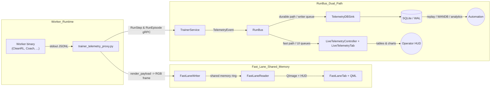

# Telemetry Naming & Architecture Standardization Plan

This note captures the outstanding terminology/architecture problems and the concrete fixes needed to keep the “dual path + fast lane” story coherent as the code base grows. It starts with a recap of each component’s purpose so the later remediation tasks have clear context.

## Component purpose & current wiring

| Name | Purpose | Where it lives & how it’s wired today | Why this split makes sense |
| --- | --- | --- | --- |
| **Fast lane** | Deliver the freshest RGB frame + HUD metrics straight from the worker to the GUI using shared memory, bypassing protobuf, gRPC, and SQLite. | Writer side: `trainer_telemetry_proxy.py` (and worker-specific helpers like `3rd_party/cleanrl_worker/MOSAIC_CLEANRL_WORKER/fastlane.py`) call `FastLaneWriter.publish()`. Reader side: `gym_gui/ui/fastlane_consumer.py` + `FastLaneTab` attach via `FastLaneReader` and paint through `gym_gui/ui/renderers/fastlane_item.py` and `ui/qml/FastLaneView.qml`. | Keeps render latency low even when telemetry persistence lags, mirrors the “hot path” designs in Coach/Unity/Isaac Sim, and lets operators run “fast-lane only” demos without touching the durable pipeline. |

**Update (2025-11-24):** CleanRL workers now honor the `GYM_GUI_FASTLANE_VIDEO_MODE`/`GYM_GUI_FASTLANE_GRID_LIMIT` env vars. When operators pick **Grid (first N envs)** in the UI, the worker composites frames via `gym_gui/fastlane/tiling.py` and streams them through slot `0`, so the FastLane tab actually shows the requested number of envs. The table above already reflected the architectural intent; this update means the code finally matches it.
| **Fast path (RunBus UI)** | Fan telemetry events into the Live Telemetry tab with minimal buffering. | `TrainerService.PublishRunSteps` publishes `TelemetryEvent`s → `RunBus` → `LiveTelemetryController` → `LiveTelemetryTab`. Queue sizes controlled via `RUNBUS_UI_PATH_QUEUE_SIZE`. | Gives the Qt tables/plots live-ish data while keeping them logically tied to the durable event stream (same StepRecord schema, seq IDs, credits). |
| **Durable path (RunBus DB)** | Persist every step/episode into SQLite/WAL for replay, analytics, WANDB exports. | Same RunBus publisher → `TelemetryDBSink` (writer queue 16 384) → `TelemetrySQLiteStore`. | Guarantees we never lose telemetry even if UI subscribers pause, and supports CLI tools that run without a GUI. |
| **Slow lane (gRPC → SQLite)** | The broader telemetry pipeline when remote workers stream into the daemon: gRPC ingest, RunBus fan-out, DB writes. | `trainer_telemetry_proxy.py`/workers → `TrainerService.PublishRun*` → `TelemetryAsyncHub`/`RunBus` → `TelemetryService` + `TelemetryDBSink`. | Separates transport concerns (gRPC/WAN) from UI/RunBus, allowing remote agents and replay tools to share the same durable storage. |

**Why “dual path” and not “multi-path”?** Inside RunBus there are currently two subscribers with distinct guarantees (UI + SQLite). The shared-memory fast lane is a separate channel optimized for video—not a RunBus subscriber—so “dual path” accurately describes the bus today. This doc assumes we’ll eventually grow beyond two RunBus consumers, so several action items focus on making that evolution painless.

### Wiring summary diagram

With that context, the remaining sections describe the issues getting in the way of a consistent story.

### Constants, log IDs, and validation hooks

- **Queue/telemetry constants** live in `gym_gui/constants/constants_telemetry.py`:
  - `RUNBUS_UI_PATH_QUEUE_SIZE`, `RUNBUS_DB_PATH_QUEUE_SIZE`, `RUNBUS_DEFAULT_QUEUE_SIZE`
  - `DB_SINK_BATCH_SIZE`, `DB_SINK_WRITER_QUEUE_SIZE`, `TELEMETRY_HUB_MAX_QUEUE`
  - UI/HUD throttles such as `STEP_BUFFER_SIZE`, `EPISODE_BUFFER_SIZE`, and `RENDER_QUEUE_SIZE`
- **Fast lane helpers** expose `FastLaneConfig`, `FastLaneMetrics`, and ring sizing defaults in `gym_gui/fastlane/buffer.py`.
- **Log constants** already defined:
  - Durable path: `LOG_SERVICE_DB_SINK_*`, `LOG_WORKER_CONFIG_DURABLE_PATH`, etc. (`gym_gui/logging_config/log_constants.py`)
  - UI path: `LOG_LIVE_CONTROLLER_*`, `LOG_UI_LIVE_TAB_*`
  - Recommendation: add `LOG_FASTLANE_*` entries (see item #5) so FastLaneTab/Consumer emit structured events.
- **Validation & credit controls**:
  - `gym_gui/telemetry/credit_manager.py` enforces `INITIAL_CREDITS` / `MIN_CREDITS_THRESHOLD` (same constants module as above).
  - `gym_gui/services/telemetry.py` uses `ValidationService` hooks before committing to storage; ensure terminology updates reference these validators so durable-path expectations remain clear.

## 1. Terminology drift between fast path, fast lane, slow lane, durable path

- **Why it matters:** Operators cannot reliably map “fast path” toggles (RunBus UI queues) versus “fast lane” toggles (shared-memory video) because comments, constants, and CLI flags mix the phrases freely.
- **Where it appears today:**
  - `gym_gui/constants/constants_telemetry.py:23` labels RunBus queue sizes “fast path”/“durable path”.
  - `gym_gui/ui/widgets/cleanrl_train_form.py:426` exposes a “Fast Lane Only” checkbox that actually disables the gRPC/SQLite slow lane, not the RunBus fast path.
  - Docs under `docs/1.0_DAY_11`/`24`/`28` use the terms differently depending on author.
- **What to change:**
  1. Author a short “Telemetry Naming Style” section inside `docs/1.0_DAY_28/TASK_1/README.md` that explicitly defines: **fast path** (RunBus UI queue), **durable path** (RunBus DB queue), **fast lane** (shared-memory visuals), **slow lane** (gRPC→SQLite pipeline). Link to it from contributor guidelines.
  2. Rename checkbox/tooltips in `cleanrl_train_form.py` to “Fast Lane Only (skip durable telemetry)” and add inline comments referencing the style guide.
  3. Gate new constants/env vars via code review: no new “fast/slow” terminology may merge without referencing the style guide section.

## 2. Dual-path RunBus can’t support future third/fourth consumers

- **Why it matters:** The architecture name is “dual path”, but we already added the shared-memory fast lane (a third path) and future consumers (e.g., WAN relay, analytics) will need distinct QoS policies. RunBus currently provides only a single drop-on-full policy parameterized by queue length.
- **Where it appears today:** `gym_gui/telemetry/run_bus.py` hardcodes one `_max_queue`, and `subscribe_with_size()` silently drops events when full.
- **What to change:**
  1. Enhance `RunBus` with per-subscriber QoS struct (e.g., `QueuePolicy {max_queue, drop_oldest, block}`) so we can add a “reliable path” later without rewriting the architecture.
  2. Update docs (`docs/1.0_DAY_28/TASK_1/README.md`) to clarify that “dual path” describes the *current* subscribers, not a hard architectural limit, and outline how additional paths will plug in.
  3. Add unit tests that simulate a third subscriber to prevent regressions when new paths arrive.

## 3. Missing instrumentation for fast lane queue depth and RunBus overflow

- **Why it matters:** The new README recommends watching fast-lane head position and RunBus overflow stats, but no code emits those metrics. Operators currently guess whether stutter originates from the shared buffer, RunBus, or SQLite.
- **Where it appears today:**
  - `FastLaneWriter.publish()` and `FastLaneConsumer._poll()` do not log queue depth or head/seq metrics.
  - `RunBus.overflow_stats()` exists but is never scheduled for periodic reporting.
- **What to change:**
  1. Instrument `FastLaneWriter.publish()` to increment counters (head seq, publish rate) and log `LOG_FASTLANE_QUEUE_DEPTH` when backlog exceeds a threshold. Consider writing metrics to `/var/run/fastlane/<run_id>.json` for scraping.
  2. Extend `FastLaneConsumer` to emit `LOG_FASTLANE_READER_LAG` when it skips frames or reconnects.
  3. Add a lightweight background task in `LiveTelemetryController` that periodically dumps `RunBus.overflow_stats()` and `queue_sizes()` to logs for each topic.
  4. Update the README’s “Instrumentation & next steps” section once metrics exist.

## 4. Worker-side toggles may diverge across projects

- **Why it matters:** CleanRL worker uses `fastlane_only`, `fastlane_slot`, and env var `FASTLANE=1`, but other workers (Coach, SPADE, Unreal) may invent different names, reintroducing terminology confusion.
- **Where it appears today:**
  - `3rd_party/cleanrl_worker/MOSAIC_CLEANRL_WORKER/fastlane.py` defines the wrapper.
  - `3rd_party/cleanrl_worker/MOSAIC_CLEANRL_WORKER/runtime.py` wires CLI args.
  - No equivalent helpers exist under `coach/` or `spadeBDI_RL/` yet.
- **What to change:**
  1. Extract a reusable helper (e.g., `gym_gui/fastlane/worker_helpers.py`) exporting `FASTLANE_ENABLED_ENV`, `FASTLANE_SLOT_ENV`, and wrapper utilities. Document them in the style guide.
  2. Ensure every worker runtime (CleanRL, Coach, SPADE, future Unreal) imports the same helper so CLI/env names stay consistent.
  3. Add integration tests confirming that setting `FASTLANE=1` produces `[FASTLANE]` logs regardless of worker type.

## 5. Logging inconsistencies for fast-lane/fast-path events

- **Why it matters:** Durable-path logs flow through `gym_gui/logging_config/log_constants.py`, but fast-lane UI logs currently use ad-hoc text (“Fast lane: connecting…”). Without standardized log IDs, observability dashboards cannot filter reliably.
- **Where it appears today:** `FastLaneTab`, `FastLaneConsumer`, and `trainer_telemetry_proxy.py` call `_LOGGER.debug/info` with free-form strings.
- **What to change:**
  1. Define `LOG_FASTLANE_*` constants (e.g., CONNECTED, DISCONNECTED, WRITER_PUBLISH, WRITER_ERROR) in `gym_gui/logging_config/log_constants.py`.
  2. Replace ad-hoc logging in `fastlane_tab.py`, `fastlane_consumer.py`, and `trainer_telemetry_proxy.py` with calls to `log_constant()`.
  3. Update monitoring dashboards to use these IDs so naming tweaks in UI text do not break alerts.

## 6. Fast Lane toggle placement and telemetry-path selection widget

- **Why it matters:** Inside the Human Control tab, the “Fast Lane Only” checkbox currently lives inside the **Status** group (`gym_gui/ui/widgets/control_panel.py:870`). Status sections normally show read-only fields (Step, Reward, FPS), so embedding an interactive toggle there obscures its importance and confuses the mental model (“is this a metric or a control?”). There is no dedicated place to pick between Fast Lane, Dual Path (RunBus UI + SQLite), or future options, so operators use ad-hoc toggles scattered across forms.
- **Where it appears today:** `_create_status_group()` mixes output labels and a `QCheckBox`. CleanRL’s train form repeats a similar checkbox, leading to duplicate, unsynchronized controls.
- **What to change:**
  1. Introduce a **Telemetry Mode** widget (ComboBox or radio group) alongside the mode selector, with explicit options: `Fast Lane Only`, `Dual Path (UI + Durable)`, and `Durable Only (headless)`. Display succinct descriptions lifted from the naming style guide.
  2. Move the existing checkbox out of the Status grid and wire it into the new widget, so control surfaces live near other inputs (not metrics).
  3. Emit a shared `telemetry_mode_changed` signal that both the CleanRL train form and ControlPanel subscribe to, ensuring the entire UI reflects the same choice.
  4. Update tooltips/documentation to reference the diagram above, making it clear which pipelines each selection engages.

---

### Implementation order of operations

1. **Define the style guide snippet** (Docs only). Baseline terminology before touching code.
2. **Instrument fast lane + RunBus metrics** so new naming decisions can be validated with data.
3. **Normalize worker toggles** by extracting helper utilities (shared env var names, CLI flags).
4. **Add RunBus QoS primitives** to pave the way for eventual multi-path expansion.
5. **Standardize logging IDs** once terms are frozen, ensuring new metrics feed dashboards cleanly.

Each bucket should land in its own PR so reviewers can reason about risk independently.
