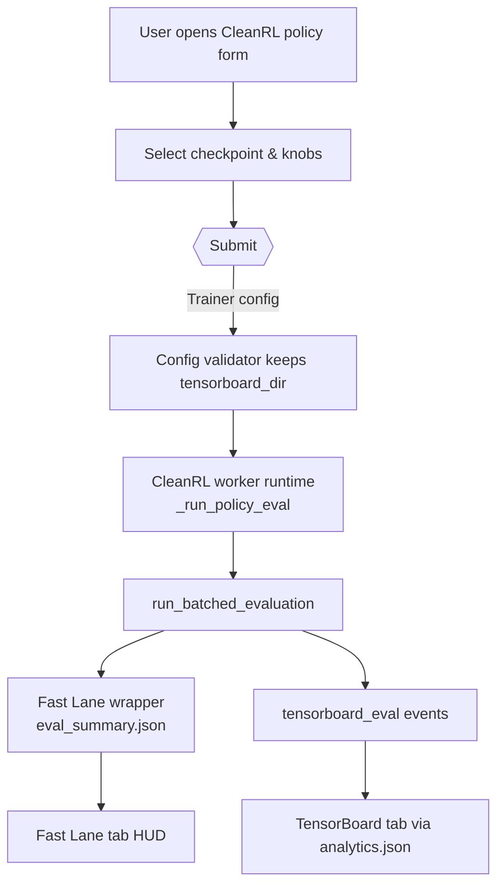

# CleanRL Policy Evaluation Workflow (Day 29 / Task 1)

This note captures how to evaluate a saved CleanRL policy end-to-end in MOSAIC, the code changes that make the workflow work, and the operational caveats discovered while validating the Ant-v5 checkpoints.

---

## 1. User Workflow Recap



1. **Train a policy** (CleanRL train form).
2. **Open "Load CleanRL Policy..."** in the Human Control tab.
3. **Select a checkpoint** under `var/trainer/runs/<run>/runs/<env>__<algo>__<seed>__<ts>/<algo>.cleanrl_model` or browse manually.
4. **Set evaluation knobs**:
   - Eval episodes per batch (defaults to 50 but can be lowered; Ant-v5 on CPU needs ~12 minutes/episode).
   - Repeat evaluation (check to loop batches indefinitely, uncheck for a single batch).
   - Fast Lane options (single vs. grid; grid shows multi-env mosaics if the original run used vectorized envs).
   - "Capture evaluation video" to emit mp4s under `videos/<run>-eval/`.
5. **Submit**. The trainer spawns a CleanRL worker in "policy_eval" mode. Output lives under `var/trainer/runs/<eval_run_id>/`:
   - `tensorboard_eval/` - evaluation scalars per batch.
   - `eval_summary.json` - running summary consumed by the Fast Lane HUD.
   - `videos/<...>-eval/` - optional rendered mp4s.

### Observing results

- Fast Lane tab shows `Fast lane (evaluation)` HUD with the latest batch summary as soon as the first batch completes.
- TensorBoard tab reads `tensorboard_eval/` and displays the eval scalars (avg/min/max returns, duration, etc.). Until the first batch finishes TensorBoard will say "No dashboards ..." because no scalars exist yet.

## 2. Code Changes for Policy Evaluation

| Area / files | Change | Why |
|--------------|--------|-----|
| CleanRL policy form (`gym_gui/ui/widgets/cleanrl_policy_form.py`, Control Panel glue) | Sets `extras["tensorboard_dir"] = "tensorboard_eval"`, emits explicit artifact metadata, and now exposes advanced knobs (gamma, max episode steps/seconds) backed by `metadata/cleanrl/eval_presets.json`. | Keeps training vs. eval logs separate and lets operators tweak eval speed without editing code. |
| Trainer config validator (`gym_gui/services/trainer/config.py`) | Respects `tensorboard_dir` from the worker extras when producing canonical configs. | Prevents the validator from silently reverting to the default `tensorboard/` directory. |
| Runtime + manifest (`3rd_party/cleanrl_worker/cleanrl_worker/runtime.py`, `3rd_party/cleanrl_worker/cleanrl_worker/eval_registry.py`, `gym_gui/logging_config/log_constants.py`) | `_run_policy_eval` passes `tensorboard_dir="tensorboard_eval"` into `build_manifest`, batches evaluation via `run_batched_evaluation()`, and emits FastLane heartbeat/log codes for each batch. | Ensures analytics.json always points at the correct folder, logs eval progress, and keeps batch metadata consistent across algos. |
| Eval helper (`3rd_party/cleanrl_worker/cleanrl_worker/eval/__init__.py`) | Provides `run_batched_evaluation()` which writes TensorBoard scalars to `tensorboard_eval/` and produces `eval_summary.json` for the Fast Lane HUD. | Gives us consistent per-batch observability for every CleanRL algorithm. |
| TensorBoard tab (`gym_gui/ui/widgets/tensorboard_artifact_tab.py`) | Added `set_log_dir()` / `refresh()` so tabs retarget on-the-fly. | Evaluations only create analytics.json after the worker launches; this prevents stale paths. |
| Fast Lane tab (`gym_gui/ui/widgets/fastlane_tab.py`) | Watches `eval_summary.json` and overlays batch summaries on the HUD. | Gives immediate feedback on eval progress before TensorBoard has data. |
| Control-plane glue (`gym_gui/services/bootstrap.py`, Jason supervisor/bridge/worker files, ControlPanel widget) | Propagated the new policy form + extras through Jason bridge workflows and control panel UI. | Ensures every entry point (manual or Jason automation) can launch policy eval with the same semantics. |
| Tests (`gym_gui/tests/test_cleanrl_policy_form.py`, `gym_gui/tests/test_trainer_tensorboard_paths.py`, `3rd_party/cleanrl_worker/tests/test_runtime.py`, Jason supervisor tests) | Updated expected extras/manifest fields and added coverage for `tensorboard_eval`. | Prevents regressions and documents the contract in CI. |

### Reference file list

- **Policy form & metadata:**
  - `gym_gui/ui/widgets/cleanrl_policy_form.py` - sets `tensorboard_eval`, emits artifact paths, exposes eval knobs.
  - `gym_gui/ui/widgets/control_panel.py`, `gym_gui/services/bootstrap.py` - wire the form into the Human Control tab (and Jason automation).
  - `metadata/cleanrl/eval_presets.json`, `gym_gui/config/cleanrl_eval_presets.py` - user-tunable presets that seed the advanced controls per environment.
- **Trainer + analytics manifest:**
  - `gym_gui/services/trainer/config.py` - preserves `tensorboard_eval` when canonicalizing configs and analytics metadata.
- **Worker runtime & eval helper:**
  - `3rd_party/cleanrl_worker/cleanrl_worker/runtime.py` - `_run_policy_eval`, manifest updates, batch heartbeats.
  - `3rd_party/cleanrl_worker/cleanrl_worker/eval/__init__.py`, `.../eval_registry.py` - `run_batched_evaluation()` + algo registry.
  - `3rd_party/cleanrl_worker/tests/test_runtime.py` - validates the new extras/manifest behaviour.
- **UI consumers:**
  - `gym_gui/ui/widgets/tensorboard_artifact_tab.py` + `gym_gui/ui/panels/analytics_tabs.py` - retarget tabs when manifests point to `tensorboard_eval`.
  - `gym_gui/ui/widgets/fastlane_tab.py`, `gym_gui/logging_config/log_constants.py` - show batch summaries on the HUD, new log IDs.
- **Control-plane / Jason integration:**
  - `gym_gui/services/jason_supervisor/service.py`, `gym_gui/services/jason_bridge/server.py`, `gym_gui/workers/jason_supervisor_cleanrl_worker/*`, `gym_gui/tests/test_jason_supervisor_cleanrl_worker.py` - propagate the new extras through Jason workflows.
- **Documentation:**
  - `docs/1.0_DAY_28/TASK_3/cleanrl_fastlane_grid_notes.md`, this file - capture the workflow and rationale.

All related tests were updated (`test_cleanrl_policy_form.py`, `test_trainer_tensorboard_paths.py`) and pass under pytest.

## 3. Performance Caveat (Ant-v5 on CPU)

While verifying the evaluation stack we discovered that the Ant-v5 environment takes roughly **0.7 seconds per simulation step** on this workstation. Each episode has 1 000 steps ⇒ **~12 minutes per episode**, even for `eval_episodes=1`. Consequently:

- Expect TensorBoard to report "No dashboards..." until the first episode finishes. This is normal; the event file is empty until then.
- Running the default 50-episode batch would require ~10 hours on CPU. Lower the "Eval episodes per batch" knob (e.g., to 1-2) when evaluating heavy MuJoCo policies on commodity hardware.
- The worker logs (`logs/cleanrl.stdout.log`) stay empty until an episode completes, so seeing nothing there simply means it is still mid-rollout.

### Recommendation

Document the per-environment evaluation costs and set more realistic defaults for heavy environments. For now, advise users to:

- Drop the eval batch size to ≤5 when running Ant-v5 or other MuJoCo envs under CPU.
- Leave "Repeat evaluation" unchecked unless they want indefinite long-running monitoring.

## 4. Manual Verification Steps

To debug evaluation behaviour outside MOSAIC:

```bash
source .venv/bin/activate
# Packages installed in editable mode:
#   pip install -e .                           # gym-gui
#   pip install -e 3rd_party/cleanrl_worker    # cleanrl + cleanrl_worker
python - <<'PY'
import torch, gymnasium as gym
from cleanrl.ppo_continuous_action import Agent, make_env
from cleanrl_utils.evals.ppo_eval import evaluate

POLICY = "var/trainer/runs/<run>/runs/Ant-v5__ppo_continuous_action__.../ppo_continuous_action.cleanrl_model"
returns = evaluate(
    POLICY,
    make_env,
    env_id="Ant-v5",
    eval_episodes=1,
    run_name="manual-eval",
    Model=Agent,
    device=torch.device("cpu"),
    capture_video=False,
)
print("returns", returns)
PY
```

If this script sits for several minutes before printing anything, it confirms the slowdown is inherent to the environment/policy. Once the first `eval_episode=...` line appears you'll know how long to expect inside the GUI.

## 5. RLlib Evaluation References (for parity checks)

While wiring up the CleanRL pathway we also surveyed how **RLlib** handles post-training
evaluation so we can mirror the same ergonomics when we eventually plug other workers into the
GUI. The most relevant examples live under `ray/rllib/examples/` inside this repository clone:

| RLlib example | File(s) | Takeaways we can reuse |
|---------------|---------|------------------------|
| Custom evaluation hooks | `rllib/examples/evaluation/custom_evaluation.py` | RLlib lets you supply a `custom_evaluation_function(algorithm, eval_workers)` that can: (a) reconfigure evaluation envs on the fly, (b) run multiple eval rounds per training iteration, (c) aggregate metrics manually, and (d) feed them back through `Algorithm.metrics`. We already mirror part of this by letting the policy form override max steps/gamma per eval batch; long term, we can expose a hook so automation can override env settings before each batch. |
| Parallel evaluation to training | `rllib/examples/evaluation/evaluation_parallel_to_training.py` | Demonstrates `evaluation_parallel_to_training=True`, `evaluation_interval`, and `evaluation_duration`/`evaluation_duration_unit`. The key insight is that evaluation env runners live beside training ones and report asynchronously. If we ever need "continuous eval while training" in MOSAIC, we can spin up a second CleanRL worker with a small eval batch and stream its Fast Lane feed separately, emulating RLlib's `evaluation_num_env_runners`. |
| Checkpoint restore + `Algorithm.evaluate()` | `rllib/examples/checkpoints/change_config_during_training.py` | Shows the canonical flow: `algo.restore_from_path(checkpoint)`, then call `algo.evaluate()` (which internally spins the evaluation env runners) before resuming `algo.train()`. This is similar to our Load Policy workflow--after restoring, they call the same evaluation helper the training loop uses. It reinforces our decision to reuse CleanRL's eval modules instead of inventing a new loop per worker. |

Other useful RLlib idioms surfaced while reading these scripts:

1. **Evaluation config blocks** - RLlib exposes `evaluation_config` to override env settings, seeds, or wrappers for eval only. Our `eval_presets.json` plays the same role; keeping it data-driven stays aligned with RLlib's pattern.
2. **Metric plumbing** - RLlib reports evaluation results under the `EVALUATION_RESULTS/ENV_RUNNER_RESULTS` keys every time a batch finishes. We now do the equivalent by writing `eval_summary.json` and TensorBoard scalars per batch. If we later ingest evaluation outputs into Jason dashboards, we can follow RLlib's naming so it's obvious what is train vs. eval.
3. **Manual `Algorithm.evaluate()` usage** - In RLlib the recommended way to check a restored checkpoint without training is literally `algo.evaluate()`. Our Load Policy flow is analogous to that call, so keeping the interface (select checkpoint → run eval only) resonates with RLlib-trained users.

Bottom line: RLlib's evaluation pipeline validates that our current approach (data-driven presets, reusable eval helper, and per-batch telemetry) is compatible with industry expectations. If we add non-CleanRL workers later, we can implement their evaluation mode by mimicking RLlib's `evaluation_config` + `evaluate()` mechanics.

## 6. Open Items

1. **Timeout/Progress logging:** add debug statements around `run_batched_evaluation()` so we can show intermediate progress even before a batch completes.
2. **Per-env defaults:** consider encoding recommended `eval_batch_size` per environment (e.g., 1 for Ant-v5, 10 for lightweight envs) to avoid user confusion.
3. **Automated regression test:** write a pytest stub that mocks the CleanRL eval helper to return synthetic returns and confirm `eval_summary.json` + TensorBoard entries appear after a batch.

---

This document should be kept current whenever we adjust the evaluation semantics (e.g., new video modes, additional telemetry). For now, the key takeaway is: *policy evaluation works, but heavy MuJoCo envs require patience or smaller batches*. Use `metadata/cleanrl/eval_presets.json` to codify per-env defaults instead of hardcoding values.

*Last updated: 2025‑11‑26, after refactoring cleanrl_worker package structure (cleanrl + cleanrl_worker now proper Python packages) and adding `ppo_continuous_action` to the eval registry.*
