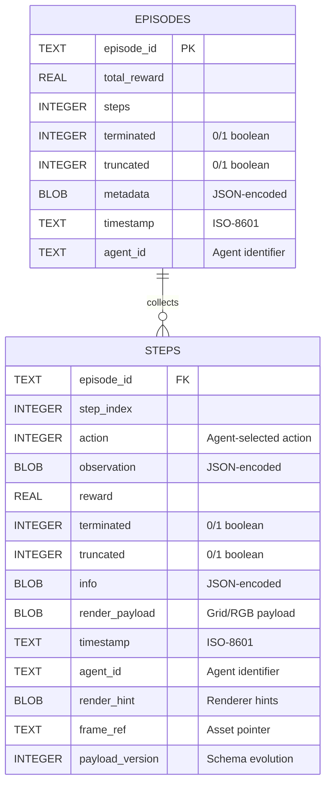
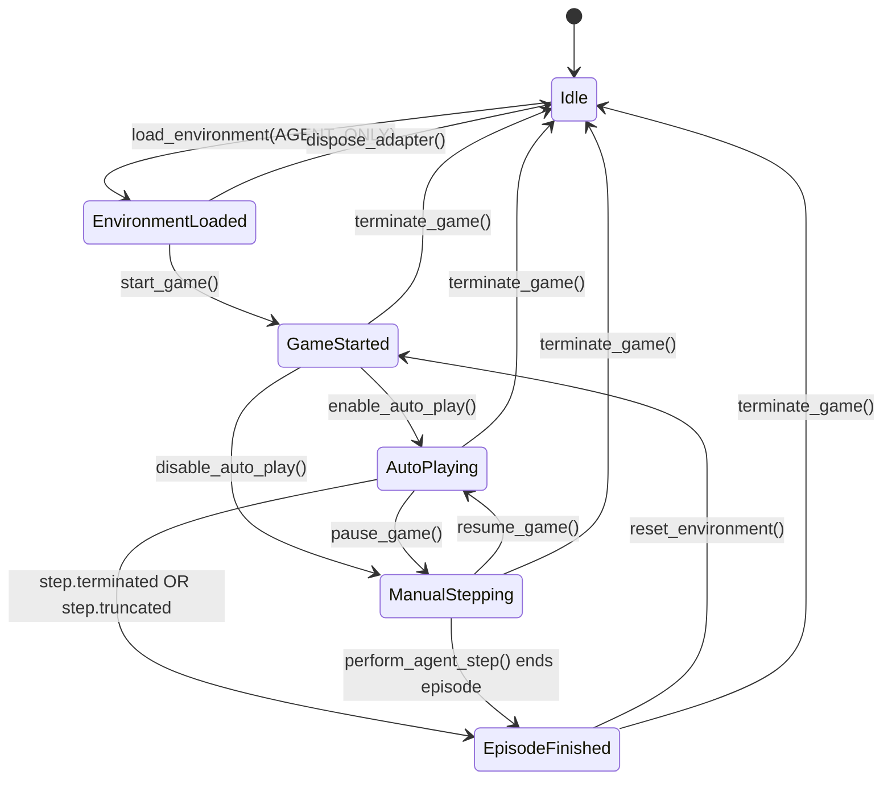
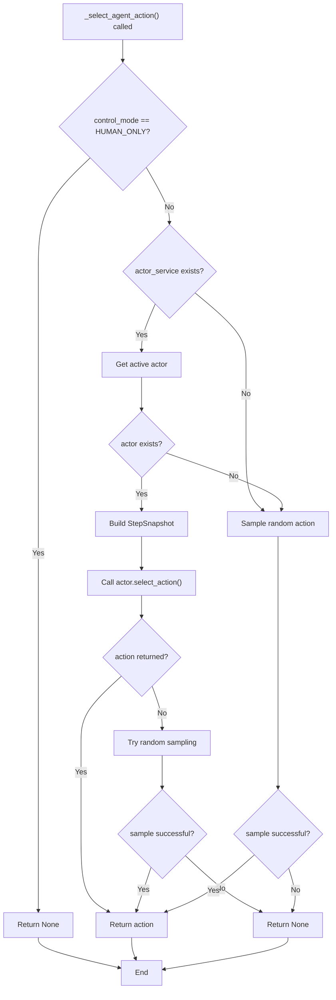
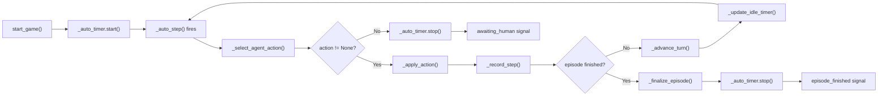

# 3.1 AGENT-ONLY MODE — AUTONOMOUS CONTROL & CONFIGURATION BLUEPRINT

This design note centralizes every concept, class, and storage touchpoint that governs the **Agent-Only** control flow inside the Qt shell. All subsequent code changes to agent-only control or mode selection must trace back to the contracts captured here.

## Scope

- Enumerations and defaults in `gym_gui.core.enums`
- Runtime configuration sourced through `gym_gui.config.settings.Settings`
- UI orchestration in `gym_gui.ui.widgets.control_panel.ControlPanelWidget`
- Session lifecycle in `gym_gui.controllers.session.SessionController`
- Actor management in `gym_gui.services.actor.ActorService`
- Writable locations declared in `gym_gui.config.paths`

## ControlMode.AGENT_ONLY Overview

```
ControlMode.AGENT_ONLY → Agents (policy actors) act autonomously; human input is ignored.
```

In Agent-Only mode:
- The environment is driven exclusively by registered agents (actors)
- Human keyboard input is completely disabled
- The session controller automatically selects and applies agent actions
- Auto-play mechanisms run continuously until episode termination
- All actions are attributed to the active agent in telemetry records
- The UI disables human-input controls and enables agent-specific controls

## Configuration Sources

### Environment Variables & Settings

- `.env` (loaded via `dotenv`) and system env vars feed `gym_gui.config.settings.get_settings()`.
- `_parse_control_mode()` maps `DEFAULT_CONTROL_MODE`/`GYM_CONTROL_MODE` string overrides to a `ControlMode` enum.
- `Settings.default_control_mode` can be set to `ControlMode.AGENT_ONLY` via environment override.
- `Settings.agent_ids` contains a tuple of registered agent identifiers (comma-separated in `.env`).
- `Settings.enable_agent_autostart` controls whether auto-play begins immediately after environment load.

### File system expectations

- `gym_gui.config.paths.ensure_var_directories()` creates the writable tree under `<repo-root>/var/` (`records/`, `telemetry/`, `logs/`, `trainer/`, …).
- Agent-only sessions recorded by `TelemetryService` rely on these directories; call this bootstrap before spinning up the Qt shell.

## UI Orchestration — ControlPanelWidget

`MainWindow` supplies a `ControlPanelConfig` with:

- `available_modes`: built by iterating `available_games()` and querying `SessionController.supported_control_modes(game_id)`. Agent-only mode appears only for games that declare support.
- `default_mode`: pulled from `Settings.default_control_mode` to honor environment overrides.
- Actor metadata: actor descriptors and the active actor id.

### Mode persistence & selection

- The widget keeps `self._current_mode` in sync with the toggled radio button group. The choice is cached in `QtCore.QSettings` under `control_mode`.
- `_apply_current_mode_selection()` ensures the stored mode is reflected in the UI after initialization.
- `update_modes(game_id)` disables radio buttons that are not listed in `available_modes[game_id]`.

### AGENT_ONLY-specific behavior

- `_update_control_states()` checks `self._current_mode == ControlMode.AGENT_ONLY` to:
  - **Enable** the *Configure Agent*, *Train Agent*, and *Load Trained Policy* buttons
  - **Enable** the actor dropdown for agent selection
  - **Disable** human input controls (keyboard shortcuts are muted)
  - **Enable** the *Agent Step* button for manual stepping (when auto-play is off)
- The actor dropdown is **enabled** in Agent-Only mode, allowing users to switch between registered agents.
- `set_awaiting_human()` is never called in Agent-Only mode; the UI remains in "agent acting" state.

## Session Lifecycle — SessionController

`SessionController` is the bridge between adapters, agents, telemetry, and Qt widgets. Its handling of agent-only flows is explicit:

- `load_environment(...)` records the chosen `control_mode`, resets idle timers, and sets `_turn = "human"` (the default value, regardless of mode). The turn value is only meaningful in `HYBRID_TURN_BASED` mode and is effectively ignored in `AGENT_ONLY` mode.
- `perform_agent_step()` executes a single agent action:
  - Validates that the game has been started and is not paused
  - Calls `_select_agent_action()` to obtain the next action from the active agent
  - If no action is returned, logs a warning (agents should always return an action in Agent-Only mode)
  - Applies the action via `_apply_action(action)`
- `_select_agent_action()` returns an action when:
  - `self._control_mode != ControlMode.HUMAN_ONLY` (passes for Agent-Only)
  - `self._actor_service` is not None and has an active agent
  - The active agent's `select_action(snapshot)` returns a valid integer
  - Falls back to random action sampling if no agent is registered
- `_auto_step()` continuously calls `_select_agent_action()` and applies actions at the configured interval (default 600ms).
- `_record_step(...)` persists every agent action through the telemetry pipeline, tagging each step with the active `agent_id`.

## Actor Management — ActorService

`ActorService` is the registry that coordinates active agents for the current session:

- `register_actor(actor, display_name=..., activate=False)` adds an actor to the registry and optionally activates it.
- `set_active_actor(actor_id)` switches the active agent; subsequent `_select_agent_action()` calls use the new agent.
- `get_active_actor()` returns the currently active agent instance.
- `select_action(snapshot)` delegates to the active agent's `select_action(snapshot)` method.
- `notify_step(snapshot)` and `notify_episode_end(summary)` propagate lifecycle events to the active agent.
- `seed(seed)` broadcasts a deterministic seed to all registered actors for reproducibility.

### Actor Protocol

Every actor implementation must follow the `Actor` protocol:

```python
class Actor(Protocol):
    id: str
    def select_action(self, step: StepSnapshot) -> Optional[int]: ...
    def on_step(self, step: StepSnapshot) -> None: ...
    def on_episode_end(self, summary: EpisodeSummary) -> None: ...
```

## Keyboard Routing — HumanInputController

- Receives the `SessionController` instance and wires Qt shortcuts (`QShortcut`) for the discrete action space.
- `update_for_mode(mode)` toggles `_mode_allows_input`: human input is **rejected** when the mode is `AGENT_ONLY`.
- `_update_shortcuts_enabled()` combines `_mode_allows_input` with the requested enabled flag so that shortcuts are globally muted in Agent-Only mode.

## Data & Replay Surface

- `SessionController._record_step` and `_record_episode` feed `TelemetryService`, which writes JSONL/SQLite artifacts under `gym_gui.config.paths`.
- Agent-only sessions land alongside human runs with identical retention policies.
- Each step record includes `agent_id` to identify which agent produced the action.
- `RenderTabs` inspects the current `ControlMode` when deciding whether to surface agent replay tabs. In Agent-Only mode it surfaces agent-centric views.

## Telemetry Persistence Schema (EER Snapshot)

Agent-only session telemetry is durably stored in the SQLite database located beneath `paths.VAR_TELEMETRY_DIR`. The schema mirrors the human-only structure but with `agent_id` populated.



### Field Reference

- `episode_id`: Human-readable UUID emitted by `SessionController._begin_episode`; anchors the relationship between summary rows and per-step details.
- `step_index`: Zero-based, monotonic counter within an episode.
- `action`: Integer action selected by the active agent (never `None` in Agent-Only mode).
- `agent_id`: Populated with the active agent's identifier for every step and episode.
- `observation`, `reward`, `terminated`, `truncated`, `info`: Exact values recorded at the time of the step.
- `render_payload`: Serialized payload fed into render strategies (grid tiles, RGB frames, etc.).
- `timestamp`: UTC ISO-8601 string stamped at persistence time for auditability.
- `render_hint`: Auxiliary JSON that renderer strategies use for tooltips and overlays.
- `frame_ref`: Optional string linking to a frame persisted on disk (PNG, JSONL).
- `payload_version`: Integer guard for payload format evolution.
- `metadata`: Episode-level JSON summary that mirrors `EpisodeRollup.metadata` (seed values, agent configuration, etc.).

## System Architecture Diagram

```mermaid
graph TB
    subgraph UI["Qt UI Layer"]
        CP["ControlPanelWidget"]
        RenderTabs["RenderTabs"]
    end
    
    subgraph Session["Session Management"]
        SC["SessionController"]
        HIC["HumanInputController"]
    end
    
    subgraph Agent["Agent Layer"]
        AS["ActorService"]
        Actor1["Actor 1"]
        Actor2["Actor 2"]
    end
    
    subgraph Adapter["Environment Layer"]
        Adapter["EnvironmentAdapter"]
        Env["Gymnasium Environment"]
    end
    
    subgraph Telemetry["Telemetry & Storage"]
        TS["TelemetryService"]
        SQLite["SQLite Store"]
    end
    
    CP -->|mode selection| SC
    CP -->|actor selection| AS
    HIC -->|disabled in AGENT_ONLY| SC
    SC -->|select_action| AS
    AS -->|active agent| Actor1
    AS -->|active agent| Actor2
    SC -->|step| Adapter
    Adapter -->|interact| Env
    SC -->|record_step| TS
    TS -->|persist| SQLite
    RenderTabs -->|query| TS
```

## Configuration Parameters Table

| Parameter | Type | Default | Description | Source |
| --- | --- | --- | --- | --- |
| `DEFAULT_CONTROL_MODE` | String | `"human_only"` | Default control mode; set to `"agent_only"` for Agent-Only startup | `.env` or env var |
| `ENABLE_AGENT_AUTOSTART` | Boolean | `false` | Whether auto-play begins immediately after environment load | `.env` or env var |
| `AGENT_IDS` | CSV String | `""` | Comma-separated list of agent identifiers to register | `.env` or env var |
| `GYM_DEFAULT_SEED` | Integer | `1` | Seed for reproducible agent behavior | `.env` or env var |
| `ALLOW_SEED_REUSE` | Boolean | `false` | Whether to allow the same seed across multiple episodes | `.env` or env var |

## Agent-Only vs Human-Only Comparison

| Aspect | Human-Only | Agent-Only |
| --- | --- | --- |
| **Input Source** | Keyboard (human) | Agent policy |
| **Keyboard Shortcuts** | Enabled | Disabled |
| **Actor Dropdown** | Disabled | Enabled |
| **Agent Step Button** | Disabled | Enabled |
| **Configure/Train Agent** | Disabled | Enabled |
| **Auto-play** | Disabled | Can be enabled |
| **Turn Management** | `_turn = "human"` | `_turn = "agent"` |
| **Action Selection** | `_select_agent_action()` returns `None` | `_select_agent_action()` returns agent action |
| **Telemetry `agent_id`** | `None` | Active agent identifier |
| **UI Focus** | Manual playback controls | Agent performance monitoring |

## Implementation Guardrails

1. **Documentation-first:** Any future change to agent-only behavior must update this document before touching source files.
2. **Agent contract:** New agents must implement the `Actor` protocol with `select_action`, `on_step`, and `on_episode_end` methods.
3. **Settings parity:** Environment overrides (CLI, `.env`, CI) should use enum names (`AGENT_ONLY`) or values (`agent_only`). `_parse_control_mode` supports both.
4. **Storage discipline:** Always ensure `paths.ensure_var_directories()` runs during bootstrap so telemetry recordings from agent sessions never fail due to missing directories.
5. **Agent registration:** Agents must be registered with `ActorService.register_actor()` before `load_environment()` is called; otherwise, random action sampling is used as fallback.

## Field Verification Matrix

The tables below trace every field that shapes Agent-Only mode from configuration through runtime state and persistence.

### Runtime settings & environment bootstrap

| Field | Description | Source |
| --- | --- | --- |
| `Settings.default_control_mode` | Fallback control mode for new sessions; can be set to `ControlMode.AGENT_ONLY` via env var. | `gym_gui/config/settings.py` |
| `Settings.agent_ids` | Tuple of agent identifiers to register; populated from `AGENT_IDS` env var (comma-separated). | `gym_gui/config/settings.py` |
| `Settings.enable_agent_autostart` | Boolean flag controlling whether auto-play begins immediately after environment load. | `gym_gui/config/settings.py` |
| `paths.VAR_ROOT` & subpaths | Directory structure for runtime artifacts (`records/`, `telemetry/`, `logs/`, `trainer/`, etc.). | `gym_gui/config/paths.py` |

### Control panel configuration

| Field | Description | Source |
| --- | --- | --- |
| `ControlPanelWidget._actor_combo` | **Enabled** whenever `ControlMode.AGENT_ONLY` is active, allowing agent selection. | `gym_gui/ui/widgets/control_panel.py` |
| `ControlPanelWidget._configure_agent_button` | **Enabled** only in Agent-Only mode for agent configuration. | `gym_gui/ui/widgets/control_panel.py` |
| `ControlPanelWidget._train_agent_button` | **Enabled** only in Agent-Only mode for headless training. | `gym_gui/ui/widgets/control_panel.py` |
| `ControlPanelWidget._trained_agent_button` | **Enabled** only in Agent-Only mode for loading trained policies. | `gym_gui/ui/widgets/control_panel.py` |

### Session controller state

| Field | Description | Source |
| --- | --- | --- |
| `SessionController._control_mode` | Live control mode flag; gating condition for every agent-action path. | `gym_gui/controllers/session.py` |
| `SessionController._turn` | String label (`"agent"` in Agent-Only mode); used to enforce turn-based hybrid logic. | `gym_gui/controllers/session.py` |
| `SessionController._auto_timer` | Qt timer that fires `_auto_step()` at configured intervals (default 600ms). | `gym_gui/controllers/session.py` |
| `SessionController.perform_agent_step()` | Executes a single agent action; validates game state before calling `_select_agent_action()`. | `gym_gui/controllers/session.py` |
| `SessionController._select_agent_action()` | Returns agent action when mode is not `HUMAN_ONLY` and actor service has active agent. | `gym_gui/controllers/session.py` |

### Actor service state

| Field | Description | Source |
| --- | --- | --- |
| `ActorService._actors` | Dictionary mapping actor IDs to `Actor` instances. | `gym_gui/services/actor.py` |
| `ActorService._active_actor_id` | Currently active agent identifier; used by `select_action()` to delegate. | `gym_gui/services/actor.py` |
| `ActorService._descriptors` | Metadata for UI presentation (display name, description, policy label, backend label). | `gym_gui/services/actor.py` |
| `ActorService.register_actor(...)` | Adds an actor to the registry; optionally activates it. | `gym_gui/services/actor.py` |
| `ActorService.set_active_actor(actor_id)` | Switches the active agent; subsequent `select_action()` calls use the new agent. | `gym_gui/services/actor.py` |

### Human input routing

| Field | Description | Source |
| --- | --- | --- |
| `HumanInputController._mode_allows_input` | Internal flag set by `update_for_mode`, **false** for `AGENT_ONLY` mode. | `gym_gui/controllers/human_input.py` |
| `_update_shortcuts_enabled()` | Applies `mode_allows_input AND requested_enabled`; logs state for debugging. | `gym_gui/controllers/human_input.py` |

### Telemetry records & persistence

| Field | Description | Source |
| --- | --- | --- |
| `StepRecord` dataclass fields | Canonical in-memory representation before SQLite persistence; includes `agent_id`. | `gym_gui/core/data_model/telemetry.py` |
| `EpisodeRollup` fields | Episode-level summary generated at the end of agent-controlled sessions; includes `agent_id`. | `gym_gui/core/data_model/telemetry.py` |
| `TelemetrySQLiteStore._flush_steps` | Ensures every `StepRecord` attribute is written to the `steps` table with `agent_id`. | `gym_gui/telemetry/sqlite_store.py` |
| `TelemetrySQLiteStore._write_episode` | Mirrors `EpisodeRollup` fields into the `episodes` table with `agent_id` populated. | `gym_gui/telemetry/sqlite_store.py` |

## Agent Implementation Patterns

### Minimal Agent Example

```python
from gym_gui.services.actor import Actor, StepSnapshot, EpisodeSummary
from typing import Optional

class RandomAgent:
    """Minimal agent that samples random actions."""

    id: str = "random_agent"

    def __init__(self, action_space):
        self.action_space = action_space

    def select_action(self, step: StepSnapshot) -> Optional[int]:
        """Return a random action from the action space."""
        if hasattr(self.action_space, 'sample'):
            action = self.action_space.sample()
            return int(action) if isinstance(action, (bool, int)) else action
        return None

    def on_step(self, step: StepSnapshot) -> None:
        """Called after each step; can be used for learning updates."""
        pass

    def on_episode_end(self, summary: EpisodeSummary) -> None:
        """Called when episode finishes; can be used for cleanup."""
        pass
```

### Policy-Based Agent Example

```python
class PolicyAgent:
    """Agent that uses a learned policy to select actions."""

    id: str = "policy_agent"

    def __init__(self, policy_model):
        self.policy = policy_model
        self.episode_steps = []

    def select_action(self, step: StepSnapshot) -> Optional[int]:
        """Use policy to select action based on observation."""
        try:
            action = self.policy.predict(step.observation)
            return int(action)
        except Exception:
            return None

    def on_step(self, step: StepSnapshot) -> None:
        """Record step for potential learning."""
        self.episode_steps.append(step)

    def on_episode_end(self, summary: EpisodeSummary) -> None:
        """Update policy with episode trajectory."""
        if self.episode_steps:
            self.policy.update(self.episode_steps, summary.total_reward)
        self.episode_steps.clear()
```

## Agent-Only State Machine



## Agent Action Selection Flow



## Auto-Play Lifecycle



## Error Handling in Agent-Only Mode

| Scenario | Behavior | Recovery |
| --- | --- | --- |
| Agent returns `None` | Auto-play stops; awaiting_human signal emitted | User must manually step or switch agents |
| Agent raises exception | Exception logged; auto-play stops | User can retry or switch agents |
| No agent registered | Falls back to random action sampling | Continues with random actions |
| Actor service unavailable | Falls back to random action sampling | Continues with random actions |
| Action space sampling fails | Auto-play stops; error signal emitted | User must restart game |

## Performance Considerations

- **Auto-play interval:** Default 600ms can be configured via `SessionController.configure_interval(ms)`. Lower values increase responsiveness but may impact rendering.
- **Batch telemetry writes:** Steps are batched (32 rows by default) before SQLite flush to reduce I/O overhead.
- **Agent action latency:** If agent's `select_action()` takes >100ms, consider async delegation or caching.
- **Memory:** Long episodes accumulate step records in memory before batch flush; monitor for large episodes.

## Environment Configuration Examples

### Example 1: Agent-Only with Auto-Play

```bash
# .env file
DEFAULT_CONTROL_MODE=agent_only
ENABLE_AGENT_AUTOSTART=true
AGENT_IDS=random_agent,policy_agent
GYM_DEFAULT_SEED=42
ALLOW_SEED_REUSE=false
```

**Behavior:**
- GUI starts in Agent-Only mode
- Auto-play begins immediately after environment load
- Two agents available for selection
- Deterministic seed for reproducibility

### Example 2: Agent-Only with Manual Stepping

```bash
# .env file
DEFAULT_CONTROL_MODE=agent_only
ENABLE_AGENT_AUTOSTART=false
AGENT_IDS=policy_agent
GYM_DEFAULT_SEED=1
```

**Behavior:**
- GUI starts in Agent-Only mode
- Auto-play disabled; user must click "Agent Step" button
- Single agent available
- Allows step-by-step inspection of agent behavior

## Common Use Cases

### Use Case 1: Evaluating a Trained Policy

1. Set `DEFAULT_CONTROL_MODE=agent_only`
2. Register the trained agent via `ActorService.register_actor()`
3. Load environment and start game
4. Auto-play runs the agent through episodes
5. Telemetry records performance metrics
6. Replay episodes in RenderTabs for visualization

### Use Case 2: Comparing Multiple Agents

1. Register multiple agents with `ActorService.register_actor()`
2. Set `DEFAULT_CONTROL_MODE=agent_only`
3. Load environment
4. Use actor dropdown to switch between agents
5. Run each agent for N episodes
6. Compare telemetry metrics in analysis tools

### Use Case 3: Debugging Agent Behavior

1. Set `ENABLE_AGENT_AUTOSTART=false`
2. Set `DEFAULT_CONTROL_MODE=agent_only`
3. Load environment
4. Click "Agent Step" to advance one step at a time
5. Inspect observation, action, and reward in UI
6. Use render hints and frame refs for detailed analysis

## Troubleshooting Agent-Only Mode

| Issue | Cause | Solution |
| --- | --- | --- |
| Agent dropdown disabled | Not in Agent-Only mode | Switch to Agent-Only mode via radio button |
| No actions selected | No agent registered | Register agent via `ActorService.register_actor()` |
| Auto-play not starting | `ENABLE_AGENT_AUTOSTART=false` | Set to `true` or click "Start Game" |
| Agent returns None | Agent implementation issue | Check agent's `select_action()` method |
| Telemetry missing agent_id | Agent not registered | Ensure agent is registered before `load_environment()` |
| Keyboard input still works | Mode not properly applied | Verify `HumanInputController.update_for_mode()` called |

## API Reference for Agent Developers

### ActorService Methods

```python
# Register an agent
actor_service.register_actor(
    actor=my_agent,
    display_name="My Agent",
    description="Description of agent",
    policy_label="Policy Type",
    backend_label="Backend",
    activate=True  # Make it active immediately
)

# Switch active agent
actor_service.set_active_actor("agent_id")

# Get active agent
active = actor_service.get_active_actor()

# Get all registered agents
descriptors = actor_service.describe_actors()

# Seed all agents
actor_service.seed(42)

# Notify agent of step
actor_service.notify_step(step_snapshot)

# Notify agent of episode end
actor_service.notify_episode_end(episode_summary)
```

### StepSnapshot Structure

```python
@dataclass(slots=True)
class StepSnapshot:
    step_index: int              # Zero-based step counter
    observation: object          # Current observation from environment
    reward: float                # Reward from last step
    terminated: bool             # Episode terminated flag
    truncated: bool              # Episode truncated flag
    seed: int | None = None      # Current seed (if available)
    info: dict[str, object] = {} # Additional info from environment
```

### EpisodeSummary Structure

```python
@dataclass(slots=True)
class EpisodeSummary:
    episode_index: int                    # Episode counter
    total_reward: float                   # Cumulative reward
    steps: int                            # Number of steps taken
    metadata: dict[str, object] = {}      # Custom metadata
```

---

> **Checklist before releasing Agent-Only mode changes**
> - [ ] Defaults verified against `.env` overrides and CLI flags
> - [ ] Control panel button matrix reviewed for unintended enable/disable states
> - [ ] SessionController agent gating paths tested (start, pause, reset, auto-play)
> - [ ] Agent selection and switching validated via `ActorService`
> - [ ] Telemetry artifacts confirmed under `var/` with correct `agent_id` tags
> - [ ] Agent-only episodes replay correctly in RenderTabs
