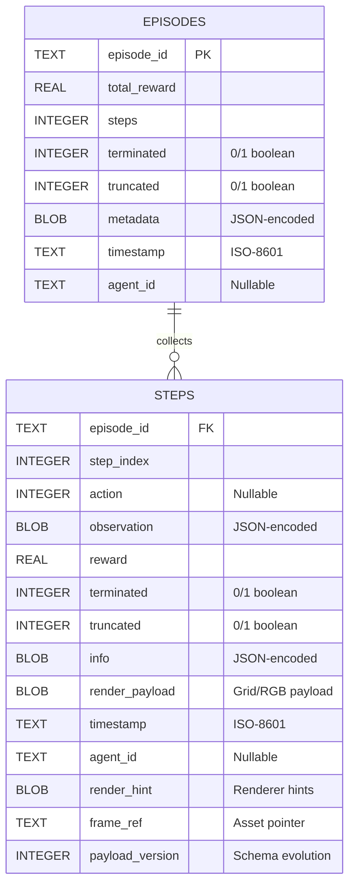

% 3.1 HUMAN MODE — CONTROL & CONFIGURATION BLUEPRINT

This design note centralizes every concept, class, and storage touchpoint that governs the **Configuration Mode** matrix and the **HUMAN_ONLY** control flow inside the Qt shell. All subsequent code changes to human control or mode selection must trace back to the contracts captured here.

## Scope

- Enumerations and defaults in `gym_gui.core.enums`
- Runtime configuration sourced through `gym_gui.config.settings.Settings`
- UI orchestration in `gym_gui.ui.widgets.control_panel.ControlPanelWidget`
- Session lifecycle in `gym_gui.controllers.session.SessionController`
- Keyboard routing in `gym_gui.controllers.human_input.HumanInputController`
- Writable locations declared in `gym_gui.config.paths`

## ControlMode taxonomy

```
ControlMode.HUMAN_ONLY          → Human player exclusively drives the environment.
ControlMode.AGENT_ONLY          → Agents (policy actors) act autonomously; human input is ignored.
ControlMode.HYBRID_TURN_BASED   → Human and agent alternate turns; Qt shell enforces the turn order.
ControlMode.HYBRID_HUMAN_AGENT  → Human and agent can both submit moves each step; priority is resolved per adapter.
ControlMode.MULTI_AGENT_COOP    → Multiple actors cooperate (future scope; not detailed here).
ControlMode.MULTI_AGENT_COMPETITIVE → Competitive multi-actor hand-off (future scope; not detailed here).
```

All adapters that expose human gameplay **must** include `ControlMode.HUMAN_ONLY` in their `supported_control_modes` tuple (see `ToyTextAdapter.supported_control_modes` in `gym_gui/core/adapters/toy_text.py`).

## Configuration sources

### Environment variables & Settings

- `.env` (loaded via `dotenv`) and system env vars feed `gym_gui.config.settings.get_settings()`.
- `_parse_control_mode()` maps `DEFAULT_CONTROL_MODE`/`GYM_CONTROL_MODE` string overrides to a `ControlMode` enum. Invalid values raise with a descriptive list of accepted modes.
- `Settings.default_control_mode` defaults to `ControlMode.HUMAN_ONLY` when no override is provided.
- The same settings object carries `default_seed` and `allow_seed_reuse`, both consumed by the control panel during environment load.

### File system expectations

- `gym_gui.config.paths.ensure_var_directories()` creates the writable tree under `<repo-root>/var/` (`records/`, `telemetry/`, `logs/`, `trainer/`, …). Human sessions recorded by `TelemetryService` rely on these directories; call this bootstrap before spinning up the Qt shell or the trainer daemon.

## UI orchestration — ControlPanelWidget

`MainWindow` supplies a `ControlPanelConfig` with:

- `available_modes`: built by iterating `available_games()` and querying `SessionController.supported_control_modes(game_id)`. This mirrors adapter capabilities and guarantees that any game which omits `HUMAN_ONLY` will automatically hide that option from the UI.
- `default_mode`: pulled from `Settings.default_control_mode` to honor environment overrides.
- Actor metadata: actor descriptors and the active actor id (for agent-aware modes).

### Mode persistence & selection

- The widget keeps `self._current_mode` in sync with the toggled radio button group. The choice is cached in `QtCore.QSettings` under `control_mode` so the Qt shell restores the previous selection across runs.
- `_apply_current_mode_selection()` ensures the stored mode is reflected in the UI after initialization.
- `update_modes(game_id)` disables radio buttons that are not listed in `available_modes[game_id]`. If the persisted mode is unavailable for the new game, the first supported mode is auto-selected, persisted, and emitted.

### HUMAN_ONLY-specific behavior

- `_update_control_states()` checks `self._current_mode == ControlMode.HUMAN_ONLY` to disable the *Agent Step*, *Configure Agent*, *Train Agent*, and *Use Trained Agent* interactions because no agent-side activity is expected.
- The actor dropdown remains disabled in Human Only mode even when actors are registered; re-enabling requires switching to a hybrid or agent-centric mode.
- `set_awaiting_human()` updates the status labels and will typically be driven by the session controller when waiting for keyboard input.

## Session lifecycle — SessionController

`SessionController` is the bridge between adapters, telemetry, and Qt widgets. Its handling of human control flows is explicit:

- `load_environment(...)` records the chosen `control_mode`, resets idle timers, and sets `_turn = "human"`. When running in Human Only, `_passive_action` is resolved but never applied automatically until a key press arrives.
- `perform_human_action(action, key_label=...)` gates execution: it refuses to advance unless the game has been started, is not paused, and the active `control_mode` is one of `{HUMAN_ONLY, HYBRID_TURN_BASED, HYBRID_HUMAN_AGENT}`. For turn-based hybrid it additionally checks `_turn == "human"`.
- `perform_agent_step()` short-circuits inside Human Only mode by flagging `_awaiting_human` and emitting `awaiting_human(True, ...)` rather than taking action. This keeps the UI message aligned with the disabled *Agent Step* button.
- `_select_agent_action()` returns `None` whenever `self._control_mode == ControlMode.HUMAN_ONLY`, ensuring auto-play and background agent sampling never trigger.
- `_auto_step()` stops the auto-play timer if `_select_agent_action()` returns `None`, reinforcing that Human Only mode cannot silently fall back to random or agent moves.
- `_record_step(...)` persists every human action (plus seed resets) through the telemetry pipeline, so replays and analytics retain complete human traces.

## Keyboard routing — HumanInputController

- Receives the `SessionController` instance and wires Qt shortcuts (`QShortcut`) for the discrete action space.
- `update_for_mode(mode)` toggles `_mode_allows_input`: human input is accepted only when the mode is `HUMAN_ONLY`, `HYBRID_TURN_BASED`, or `HYBRID_HUMAN_AGENT`.
- `_update_shortcuts_enabled()` combines `_mode_allows_input` with the requested enabled flag so that the presenter can globally mute shortcuts during dialogs or modals. Debug logs explain why shortcuts are enabled/disabled, aiding traceability.

## Data & replay surface

- `SessionController._record_step` and `_record_episode` feed `TelemetryService`, which in turn writes JSONL/SQLite artifacts under the directories governed by `gym_gui.config.paths`. Human-only sessions therefore land alongside agent runs with identical retention policies.
- `RenderTabs` inspects the current `ControlMode` when deciding whether to surface agent replay tabs (see `RenderTabs._agent_tab_context`). In Human Only mode it suppresses agent-centric views, keeping the UI focused on manual playbacks.

## Telemetry persistence schema (EER snapshot)

Human session telemetry is durably stored in the SQLite database located beneath `paths.VAR_TELEMETRY_DIR`. The schema is intentionally minimal—two related tables that capture the episode summary and every granular step. The entity-relationship diagram below reflects the canonical structure enforced by `TelemetrySQLiteStore`.



### Field reference

- `episode_id`: Human-readable UUID emitted by `SessionController._begin_episode`; anchors the relationship between summary rows and per-step details.
- `step_index`: Zero-based, monotonic counter within an episode. Combined with `episode_id` it forms a stable ordering key.
- `action`: Discrete integer produced by the human (or `None` when the human didn’t act, e.g., environment reset).
- `observation`: JSON blob (compressed) mirroring `StepRecord.observation`.
- `reward`, `terminated`, `truncated`: Exact values recorded at the time of the step—booleans are stored as integers for SQLite compatibility.
- `info`: Adapter-specific metadata (`StepRecord.info`) encoded as JSON.
- `render_payload`: Serialized payload fed into render strategies (grid tiles, RGB frames, etc.).
- `timestamp`: UTC ISO-8601 string stamped at persistence time for auditability.
- `agent_id`: Optional field populated when multi-agent or hybrid scenarios tag an acting agent. Human-only flows typically omit it.
- `render_hint`: Auxiliary JSON that renderer strategies use for tooltips and overlays (for example, FrozenLake cracked-hole state).
- `frame_ref`: Optional string linking to a frame persisted on disk (PNG, JSONL) when the storage profile opts into frame caching.
- `payload_version`: Integer guard that lets the reader differentiate between older and newer payload formats when backfilling or migrating data.
- `metadata`: Episode-level JSON summary that mirrors `EpisodeRollup.metadata` (seed values, custom settings, etc.).

### Indexing & retention

- Primary access pattern is `(episode_id, step_index)`, backed by the composite index `idx_steps_episode`.
- The store executes batched inserts (32 rows by default) to cut down on WAL churn and keep UI rendering smooth during live play.
- Purging (`delete_episode`, `delete_all_episodes`) cascades through both tables to prevent orphaned steps.

## Field verification matrix

The tables below trace every field that shapes Human Mode from configuration through runtime state and persistence. Each entry cites the authoritative source file so future contributors can verify intent before altering behavior.

### Runtime settings & environment bootstrap

| Field | Description | Source |
| --- | --- | --- |
| `Settings.default_control_mode` | Fallback control mode for new sessions; defaults to `ControlMode.HUMAN_ONLY` when no env var is present. | `gym_gui/config/settings.py` (`Settings` dataclass, `_parse_control_mode`) |
| `Settings.default_seed` / `Settings.allow_seed_reuse` | Seed sequencing used by the control panel and `SessionController` when resetting environments. | `gym_gui/config/settings.py` |
| `paths.VAR_ROOT` & subpaths | Directory structure for runtime artifacts (`records/`, `telemetry/`, `logs/`, `trainer/`, etc.). | `gym_gui/config/paths.py` |
| `ensure_var_directories()` | Guard that creates the writable tree prior to session or daemon startup. | `gym_gui/config/paths.py` |

### Control panel configuration

| Field | Description | Source |
| --- | --- | --- |
| `ControlPanelConfig.available_modes` | Map of `GameId` → supported control modes resolved from adapter metadata. Human mode will only appear where adapters declare support. | `gym_gui/ui/main_window.py` (builder) & `gym_gui/ui/widgets/control_panel.py` (dataclass) |
| `ControlPanelConfig.default_mode` | Seeds the initial radio button selection; comes from `Settings.default_control_mode`. | `gym_gui/ui/main_window.py` |
| `ControlPanelConfig.*_config` | Game-specific configuration snapshots (FrozenLake, Taxi, CliffWalking, LunarLander, CarRacing, BipedalWalker) used to populate the configuration panel prior to human play. | `gym_gui/ui/main_window.py` |
| `ControlPanelWidget._mode_buttons` | Radio grid gating access to each control mode; human-only toggles disable agent widgets. | `gym_gui/ui/widgets/control_panel.py` (constructor & `_update_control_states`) |
| `ControlPanelWidget._actor_combo` | Disabled whenever `ControlMode.HUMAN_ONLY` is active, preventing agent selection. | `gym_gui/ui/widgets/control_panel.py::_update_control_states` |
| `ControlPanelWidget._awaiting_label` | Updated via `set_awaiting_human` to reflect when the session is waiting for a human move. | `gym_gui/ui/widgets/control_panel.py` |

### Session controller state

| Field | Description | Source |
| --- | --- | --- |
| `SessionState.step_index`, `turn`, `terminated`, `truncated` | Snapshot exported to other components summarising human-progressed episodes. | `gym_gui/controllers/session.py` (dataclass) |
| `SessionController._control_mode` | Live control mode flag; gating condition for every human-action path. | `gym_gui/controllers/session.py` (constructor & property accessors) |
| `SessionController._awaiting_human` | Boolean tracking whether the UI should show "Awaiting human action". | `gym_gui/controllers/session.py` (`perform_human_action`, `_select_agent_action`, `_auto_step`) |
| `SessionController._turn` | String label (`"human"` / `"agent"`) used to enforce turn-based hybrid logic; remains `"human"` in Human Only mode. | `gym_gui/controllers/session.py` |
| `SessionController._passive_action` | Cached environmental passive action; never auto-applied in Human Only mode. | `gym_gui/controllers/session.py::_resolve_passive_action` |
| `SessionController.perform_human_action(...)` | Validates `ControlMode` and turn ownership before stepping the adapter; rejects input if the game isn’t started or paused. | `gym_gui/controllers/session.py` |
| `SessionController.perform_agent_step()` | Short-circuits by flagging `_awaiting_human` when the mode is `HUMAN_ONLY`. | `gym_gui/controllers/session.py` |
| `_auto_timer` / `_idle_timer` | Timers that stop automatically when human input is required; auto-play halts if `_select_agent_action` returns `None`. | `gym_gui/controllers/session.py` |
| `_episode_metadata`, `_record_step`, `_record_episode` | Metadata recorded for telemetry, ensuring human runs carry the same audit data as agent runs. | `gym_gui/controllers/session.py` |

### Human input routing

| Field | Description | Source |
| --- | --- | --- |
| `HumanInputController._shortcuts` | List of `QShortcut` instances bound to environment actions; toggled collectively. | `gym_gui/controllers/human_input.py` |
| `_mode_allows_input` | Internal flag set by `update_for_mode`, true only for human-capable modes. | `gym_gui/controllers/human_input.py` |
| `_requested_enabled` | UI-level override to temporarily mute shortcuts (e.g., modal dialogs). | `gym_gui/controllers/human_input.py` |
| `_update_shortcuts_enabled()` | Applies `mode_allows_input AND requested_enabled`; logs state for debugging human input issues. | `gym_gui/controllers/human_input.py` |

### Telemetry records & persistence

| Field | Description | Source |
| --- | --- | --- |
| `StepRecord` dataclass fields (`episode_id`, `step_index`, `action`, `observation`, `reward`, `terminated`, `truncated`, `info`, `timestamp`, `render_payload`, `agent_id`, `render_hint`, `frame_ref`, `payload_version`) | Canonical in-memory representation before SQLite persistence. | `gym_gui/core/data_model/telemetry.py` |
| `EpisodeRollup` fields (`episode_id`, `total_reward`, `steps`, `terminated`, `truncated`, `metadata`, `timestamp`, `agent_id`) | Episode-level summary generated at the end of human-controlled sessions. | `gym_gui/core/data_model/telemetry.py` |
| `TelemetrySQLiteStore._flush_steps` column bindings | Ensures every `StepRecord` attribute is written to the `steps` table. | `gym_gui/telemetry/sqlite_store.py` |
| `TelemetrySQLiteStore._write_episode` payload | Mirrors `EpisodeRollup` fields into the `episodes` table with conflict resolution. | `gym_gui/telemetry/sqlite_store.py` |
| `TelemetrySQLiteStore._ensure_columns` | Additive migrations that keep human-session columns (e.g., `render_payload`, `agent_id`, `payload_version`) in sync on existing databases. | `gym_gui/telemetry/sqlite_store.py` |

### Main window wiring & presenters

| Field | Description | Source |
| --- | --- | --- |
| `MainWindow._control_panel` | Instantiated with `ControlPanelConfig` and fed actor metadata before human play begins. | `gym_gui/ui/main_window.py` |
| `MainWindow._presenter` & `MainWindowPresenter` | Bridge between `SessionController`, `HumanInputController`, and control panel signals; ensures Human Mode UI updates remain consistent. | `gym_gui/ui/main_window.py`, `gym_gui/ui/presenters/main_window_presenter.py` |
| `MainWindow._render_tabs` | Coordinates renderers and telemetry replays; suppresses agent tabs when control mode is human-centric. | `gym_gui/ui/main_window.py`, `gym_gui/ui/widgets/render_tabs.py` |

## Implementation guardrails

1. **Documentation-first:** Any future change to control-mode behavior must update this document before touching source files.
2. **Adapter contract:** New adapters or environments must declare whether they honor human control through `supported_control_modes`; leaving `HUMAN_ONLY` out of an adapter will hide the toggle and must be intentional.
3. **Settings parity:** Environment overrides (CLI, `.env`, CI) should use enum names (`HUMAN_ONLY`) or values (`human_only`). `_parse_control_mode` supports both – document updates should clarify additional aliases before code changes go live.
4. **Storage discipline:** Always ensure `paths.ensure_var_directories()` runs during bootstrap so telemetry recordings from human sessions never fail due to missing directories.

---

> **Checklist before releasing Human-mode changes**
> - [ ] Defaults verified against `.env` overrides and CLI flags
> - [ ] Control panel button matrix reviewed for unintended enable/disable states
> - [ ] SessionController human gating paths tested (start, pause, reset, auto-play guard)
> - [ ] Key bindings validated via `HumanInputController`
> - [ ] Telemetry artifacts confirmed under `var/`
