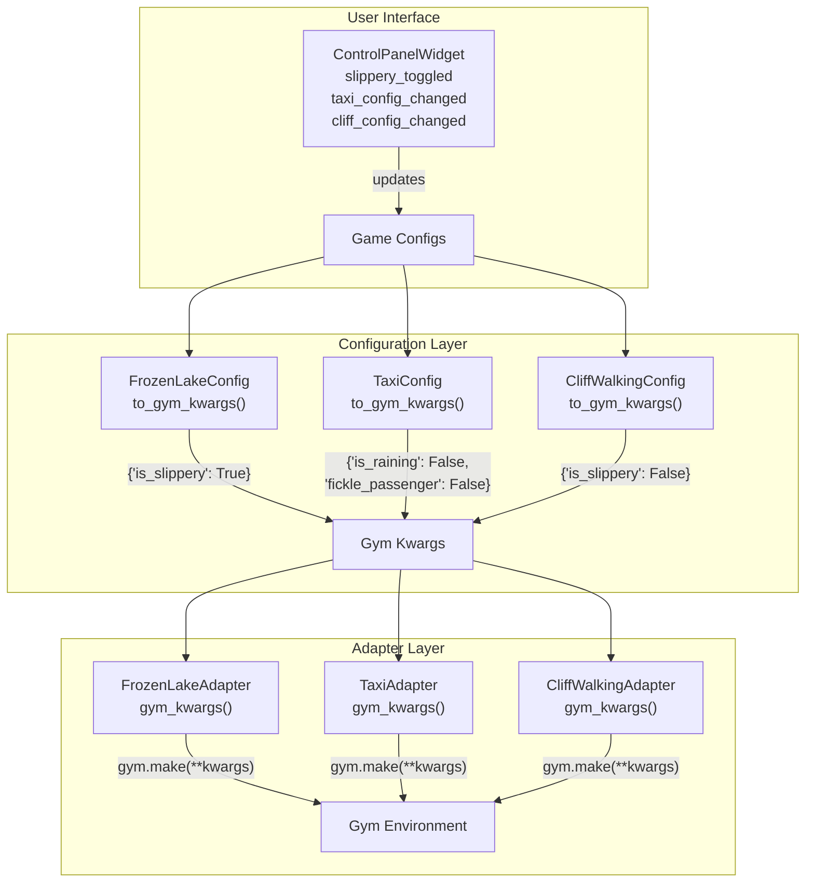
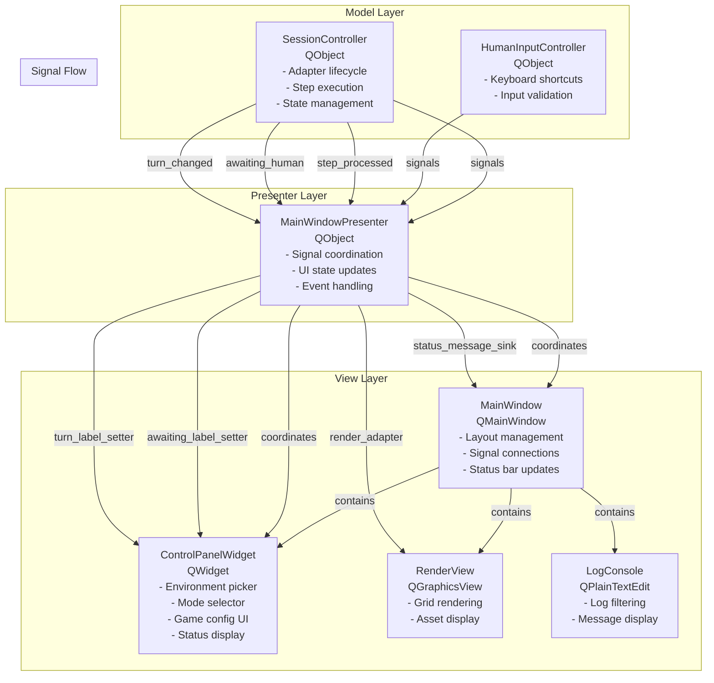
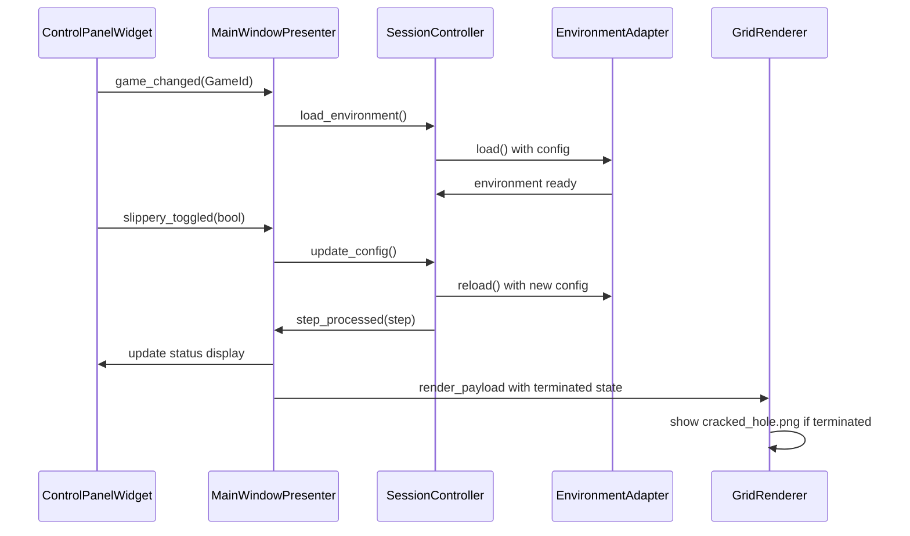

# Day 3 Plan – Qt Shell Game Integration

## WHY this milestone matters
- **Configuration separation:** Game-specific parameters (slipperiness, rain, fickle passengers) were scattered across adapters and settings. Day 3 establishes a clean separation where each game has its own configuration dataclass, making it easy to add new games without touching core infrastructure.
- **UI component extraction:** The MainWindow was becoming a monolithic controller with mixed concerns (UI layout, business logic, signal handling). Day 3 extracts view components into dedicated widgets and presenters, following the MVP pattern established in Day 0.
- **Visual feedback refinement:** Asset management and rendering were updated to provide better visual cues (cracked holes on termination, correct goal assets), making the learning experience more intuitive.
- **Architectural maturity:** These changes demonstrate the project's evolution from prototype to maintainable codebase, with clear separation of concerns that will scale as more games and features are added.

## WHAT we will ship
- **`gym_gui/config/game_configs.py`:** Game-specific configuration dataclasses (`FrozenLakeConfig`, `TaxiConfig`, `CliffWalkingConfig`) with `to_gym_kwargs()` methods for clean parameter passing.
- **`gym_gui/ui/widgets/control_panel.py`:** Extracted control panel widget handling environment picker, mode selector, game configuration UI, and status display.
- **`gym_gui/ui/presenters/main_window_presenter.py`:** Presenter class coordinating between SessionController and UI widgets using the MVP pattern.
- **Asset management updates:** CliffWalking goal changed from `goal.png` to `stool.png`, FrozenLake termination shows `cracked_hole.png`.
- **Grid renderer enhancements:** Support for terminated state visualization and improved asset compositing.
- **Adapter step tracking:** Added terminated/truncated state tracking for better visual feedback.

## HOW we will design it

### Configuration Flow Architecture



#### Configuration Flow Implementation

**1. Configuration Dataclasses:**
```python
# gym_gui/config/game_configs.py
@dataclass(frozen=True)
class FrozenLakeConfig:
    """Configuration for FrozenLake environment."""
    
    is_slippery: bool = True
    """If True, agent moves in intended direction with 33.33% probability,
    and in perpendicular directions with 33.33% probability each.
    If False, agent always moves in intended direction."""
    
    def to_gym_kwargs(self) -> Dict[str, Any]:
        """Convert to Gymnasium environment kwargs."""
        return {"is_slippery": self.is_slippery}

@dataclass(frozen=True)
class TaxiConfig:
    """Configuration for Taxi-v3 environment."""
    
    is_raining: bool = False
    """If True, the cab will move in intended direction with 80% probability,
    else will move left or right of target direction with 10% probability each."""
    
    fickle_passenger: bool = False
    """If True, passenger has 30% chance of changing destinations when cab
    has moved one square away from passenger's source location."""
    
    def to_gym_kwargs(self) -> Dict[str, Any]:
        """Convert to Gymnasium environment kwargs."""
        kwargs = {}
        if self.is_raining:
            kwargs["is_raining"] = True
        if self.fickle_passenger:
            kwargs["fickle_passenger"] = True
        return kwargs
```

**2. Adapter Factory Integration:**
```python
# gym_gui/core/factories/adapters.py
def create_adapter(
    game_id: GameId,
    context: AdapterContext | None = None,
    *,
    game_config: FrozenLakeConfig | TaxiConfig | CliffWalkingConfig | None = None,
) -> EnvironmentAdapter:
    """Instantiate the adapter bound to the optional context and game_config."""
    
    adapter_cls = get_adapter_cls(game_id)
    
    # Import adapter classes to check if game_config is supported
    from gym_gui.core.adapters.toy_text import (
        CliffWalkingAdapter,
        FrozenLakeAdapter,
        TaxiAdapter,
    )
    
    # Pass game config to appropriate adapter constructor
    if game_config is not None:
        if adapter_cls is FrozenLakeAdapter and isinstance(game_config, FrozenLakeConfig):
            adapter = FrozenLakeAdapter(context, game_config=game_config)
        elif adapter_cls is TaxiAdapter and isinstance(game_config, TaxiConfig):
            adapter = TaxiAdapter(context, game_config=game_config)
        elif adapter_cls is CliffWalkingAdapter and isinstance(game_config, CliffWalkingConfig):
            adapter = CliffWalkingAdapter(context, game_config=game_config)
        else:
            adapter = adapter_cls(context)
    else:
        adapter = adapter_cls(context)
    
    if context is not None:
        adapter.ensure_control_mode(context.control_mode)
    return adapter
```

**3. Adapter Implementation:**
```python
# gym_gui/core/adapters/toy_text.py
class FrozenLakeAdapter(ToyTextAdapter):
    """Adapter for FrozenLake environment with game-specific configuration."""
    
    id = GameId.FROZEN_LAKE.value

    def __init__(
        self,
        context: AdapterContext | None = None,
        *,
        game_config: FrozenLakeConfig | None = None,
    ) -> None:
        """Initialize with optional game-specific configuration."""
        super().__init__(context)
        self._game_config = game_config or DEFAULT_FROZEN_LAKE_CONFIG

    def gym_kwargs(self) -> dict[str, Any]:
        """Return Gymnasium environment kwargs from game configuration."""
        return self._game_config.to_gym_kwargs()

    def render(self) -> dict[str, Any]:
        """Render with FrozenLake-specific terminated state."""
        payload = super().render()
        
        # Add terminated state for cracked_hole visualization
        payload["terminated"] = self._last_terminated
        payload["truncated"] = self._last_truncated
        
        return payload
```

**4. Session Controller Integration:**
```python
# gym_gui/controllers/session.py
def load_environment(
    self,
    game_id: GameId,
    control_mode: ControlMode,
    *,
    seed: int | None = None,
    settings_overrides: dict[str, Any] | None = None,
    game_config: FrozenLakeConfig | TaxiConfig | CliffWalkingConfig | None = None,
) -> None:
    self.stop_auto_play()
    self._dispose_adapter()
    if settings_overrides is not None:
        self._settings_overrides = settings_overrides
    effective_settings = (
        replace(self._settings, **self._settings_overrides)
        if self._settings_overrides
        else self._settings
    )
    self._effective_settings = effective_settings
    context = AdapterContext(
        settings=effective_settings,
        control_mode=control_mode,
        logger_factory=logging.getLogger,
    )
    try:
        adapter = create_adapter(game_id, context, game_config=game_config)
        adapter.ensure_control_mode(control_mode)
        adapter.load()
        initial_step = adapter.reset(seed=seed)
    except Exception as exc:  # pragma: no cover - UI surfaces error
        self._logger.exception("Failed to load environment", exc_info=exc)
        self.error_occurred.emit(str(exc))
        return

```
### UI Component Extraction (MVP Pattern Implementation)

The MainWindow was refactored from a monolithic controller into separated concerns using the MVP pattern. The ControlPanelWidget was extracted to handle all control-related UI, while the MainWindowPresenter coordinates between the SessionController and UI components.



#### ControlPanelWidget Implementation

The ControlPanelWidget encapsulates all control-related UI components and emits signals when user interactions occur:

```python
# gym_gui/ui/widgets/control_panel.py
class ControlPanelWidget(QtWidgets.QWidget):
    # Signals for user interactions
    control_mode_changed = Signal(ControlMode)
    game_changed = Signal(GameId)
    load_requested = Signal(GameId, ControlMode, int)
    reset_requested = Signal(int)
    slippery_toggled = Signal(bool)
    taxi_config_changed = Signal(str, bool)  # (param_name, value)
    cliff_config_changed = Signal(str, bool)  # (param_name, value)
    play_requested = Signal()
    pause_requested = Signal()
    agent_step_requested = Signal()

    def __init__(self, *, config: ControlPanelConfig, parent=None):
        super().__init__(parent)
        self._config = config
        self._current_game = None
        self._current_mode = config.default_mode
        
        # Game configuration overrides storage
        self._game_overrides = {
            GameId.FROZEN_LAKE: {"is_slippery": config.frozen_lake_config.is_slippery},
            GameId.TAXI: {
                "is_raining": config.taxi_config.is_raining,
                "fickle_passenger": config.taxi_config.fickle_passenger,
            },
            GameId.CLIFF_WALKING: {"is_slippery": config.cliff_walking_config.is_slippery},
        }
        
        self._build_ui()
        self._connect_signals()
```

#### MainWindowPresenter Coordination

The presenter acts as the glue between the SessionController signals and UI updates:

```python
# gym_gui/ui/presenters/main_window_presenter.py
class MainWindowPresenter(QtCore.QObject):
    """Owns controllers and mediates between the session and UI widgets."""

    def __init__(self, session: SessionController, human_input: HumanInputController, parent=None):
        super().__init__(parent)
        self._session = session
        self._human_input = human_input
        self._view = None

    def bind_view(self, view: MainWindowView) -> None:
        """Attach the concrete view implementation to the presenter."""
        self._view = view
        self._wire_session_signals()

    def _handle_step_processed(self, step: object, step_count: int) -> None:
        """Handle step completion by updating render and status."""
        if self._view is None:
            return
        # Extract render payload and pass to render view
        render_payload = getattr(step, "render_payload", None)
        self._view.render_adapter(render_payload)
        # Update time labels after each step
        self._view.time_refresher()

    def _handle_awaiting_human(self, waiting: bool, message: str) -> None:
        """Handle human input state changes."""
        if self._view is None:
            return
        self._view.awaiting_label_setter(waiting)
        if message:
            self._view.status_message_sink(message, 5000)
```

#### MainWindow Signal Wiring

The MainWindow creates the presenter and wires it to coordinate UI updates:

```python
# gym_gui/ui/main_window.py
def _wire_presenter(self) -> None:
    """Wire the MainWindowPresenter to coordinate SessionController signals."""
    view = MainWindowView(
        control_panel=self._control_panel,
        status_message_sink=lambda msg, timeout: self._status_bar.showMessage(msg, timeout or 0),
        awaiting_label_setter=lambda waiting: self._on_awaiting_human(waiting, ""),
        turn_label_setter=lambda turn: self._control_panel.set_turn(turn),
        render_adapter=lambda payload: self._render_view.display(payload),
        time_refresher=self._refresh_time_labels,
    )
    self._presenter.bind_view(view)
```

### Asset Management and Rendering Updates

#### CliffWalking Goal Asset Change

The CliffWalking goal was changed from a generic `goal.png` to `stool.png` for better thematic consistency:

```python
# gym_gui/rendering/assets.py
class CliffWalkingAssets:
    """Asset mappings for CliffWalking environment."""
    
    # Mountain-specific assets
    MOUNTAIN_BG1 = "mountain_bg1.png"
    MOUNTAIN_BG2 = "mountain_bg2.png"
    MOUNTAIN_CLIFF = "mountain_cliff.png"
    STOOL = "stool.png"  # Goal tile for CliffWalking
    
    @staticmethod
    def get_tile_asset(cell_value: str, row: int = 0, col: int = 0) -> str:
        """Map grid cell character to tile asset."""
        cell = cell_value.strip().upper()
        
        if cell == "C":
            return CliffWalkingAssets.MOUNTAIN_CLIFF
        elif cell == "T":  # Goal position
            return CliffWalkingAssets.STOOL  # Changed from goal.png to stool.png
        # ... rest of mapping
```

#### FrozenLake Termination Visualization

When the agent falls into a hole and the episode terminates, the hole shows a `cracked_hole.png` instead of the regular `hole.png`:

```python
# gym_gui/rendering/grid_renderer.py
def _create_cell_pixmap(self, row, col, cell_value, agent_position, taxi_state, terminated=False):
    """Create a pixmap for a single grid cell with appropriate assets composited."""
    is_agent_cell = agent_position is not None and agent_position == (row, col)

    if self._current_game == GameId.FROZEN_LAKE:
        # For FrozenLake, check if agent fell into hole (terminated and on agent position)
        if terminated and is_agent_cell and cell_value.strip().upper() == 'H':
            # Use cracked_hole.png when agent is on hole and terminated
            asset_name = "cracked_hole.png"
        else:
            asset_name = self._get_tile_asset(cell_value, row, col)
        pixmap = self._asset_manager.get_pixmap(asset_name)
```

#### Adapter Step Tracking

Adapters now track terminated/truncated states for context-aware rendering:

```python
# gym_gui/core/adapters/toy_text.py
class ToyTextAdapter(EnvironmentAdapter[int, int]):
    """Base adapter for Gymnasium toy-text environments."""

    def __init__(self, context=None):
        super().__init__(context)
        self._last_terminated = False  # Track termination state
        self._last_truncated = False   # Track truncation state

    def step(self, action: int):
        """Step and track terminated/truncated states."""
        result = super().step(action)
        self._last_terminated = bool(result.terminated)
        self._last_truncated = bool(result.truncated)
        return result

    def render(self) -> dict[str, Any]:
        """Render with state tracking."""
        payload = super().render()
        
        # Add state tracking for visual feedback
        payload["terminated"] = self._last_terminated
        payload["truncated"] = self._last_truncated
        
        return payload
```

## Technical Implementation Details

### Game Configuration Architecture

The configuration system uses frozen dataclasses to ensure immutability and type safety:

**Benefits:**
- **Type safety:** IDE autocomplete for config parameters
- **Immutability:** Frozen dataclasses prevent accidental mutation
- **Clean separation:** Game configs independent of global settings
- **Extensibility:** New games add new config classes without touching existing code

**Usage Pattern:**
```python
# Create config
config = FrozenLakeConfig(is_slippery=False)

# Convert to Gym kwargs
kwargs = config.to_gym_kwargs()  # {"is_slippery": False}

# Pass to adapter
adapter = FrozenLakeAdapter(context, game_config=config)
```

### UI Component Extraction

**Before (Monolithic MainWindow):**
```python
class MainWindow(QMainWindow):
    def __init__(self):
        # Inline control panel layout (50+ lines)
        env_group = QGroupBox("Environment")
        self._game_combo = QComboBox()
        self._mode_buttons = {}  # Inline mode selector
        # ... mixed UI and business logic
        
        # Inline signal connections
        self._game_combo.currentIndexChanged.connect(self._on_game_changed)
        # ... business logic mixed with UI
```

**After (Separated Concerns):**
```python
class ControlPanelWidget(QWidget):
    """Dedicated widget for control panel."""
    
    def __init__(self, config: ControlPanelConfig):
        self._build_ui()  # Clean UI construction
        self._connect_signals()  # Signal connections
        
    def _build_ui(self):
        """Build control panel UI components."""
        # Environment picker
        # Mode selector  
        # Game configuration panels
        # Status display
        
class MainWindowPresenter(QObject):
    """Coordinates between SessionController and UI."""
    
    def _handle_step_processed(self, step, step_count):
        """Update UI when step completes."""
        if self._view:
            self._view.render_adapter(step.render_payload)
```

### Signal/Slot Architecture

The MVP implementation uses Qt signals for loose coupling:

**ControlPanelWidget Signals:**
```python
class ControlPanelWidget(QWidget):
    # User interaction signals
    control_mode_changed = Signal(ControlMode)
    game_changed = Signal(GameId) 
    load_requested = Signal(GameId, ControlMode, int)
    slippery_toggled = Signal(bool)
    taxi_config_changed = Signal(str, bool)
    cliff_config_changed = Signal(str, bool)
```

**MainWindow Signal Connections:**
```python
# gym_gui/ui/main_window.py
def _connect_signals(self):
    # Connect control panel signals to session controller
    self._control_panel.load_requested.connect(self._on_load_requested)
    self._control_panel.reset_requested.connect(self._on_reset_requested)
    self._control_panel.play_requested.connect(self._session.start_auto_play)
    self._control_panel.slippery_toggled.connect(self._on_slippery_toggled)
    self._control_panel.taxi_config_changed.connect(self._on_taxi_config_changed)
    self._control_panel.cliff_config_changed.connect(self._on_cliff_config_changed)
    
    # Connect session signals to handlers
    self._session.step_processed.connect(self._on_step_processed)
    self._session.episode_finished.connect(self._on_episode_finished)
    self._session.status_message.connect(self._on_status_message)
```

### Adapter Step Tracking

**State Tracking Implementation:**
```python
class ToyTextAdapter(EnvironmentAdapter):
    def __init__(self, context=None):
        super().__init__(context)
        self._last_terminated = False
        self._last_truncated = False

    def step(self, action: int):
        result = super().step(action)
        # Track state for visual feedback
        self._last_terminated = bool(result.terminated)
        self._last_truncated = bool(result.truncated)
        return result

    def render(self) -> dict[str, Any]:
        payload = super().render()
        # Include state in render payload
        payload["terminated"] = self._last_terminated
        payload["truncated"] = self._last_truncated
        return payload
```

**GridRenderer Termination Logic:**
```python
def _create_cell_pixmap(self, row, col, cell_value, agent_position, taxi_state, terminated=False):
    if self._current_game == GameId.FROZEN_LAKE:
        is_agent_cell = agent_position is not None and agent_position == (row, col)
        
        # Show cracked hole when agent terminated on hole
        if terminated and is_agent_cell and cell_value.strip().upper() == 'H':
            asset_name = "cracked_hole.png"
        else:
            asset_name = FrozenLakeAssets.get_tile_asset(cell_value)
```

## Architecture Diagrams

### Component Interaction Flow



## References from Previous Days
- **Day 0 Initial Plan:** MVP pattern foundation, layered architecture blueprint, Qt signal/slot patterns.
- **Day 1 Adapter Base:** EnvironmentAdapter contract, toy-text adapters, render payload structure.
- **Day 2 Qt Shell:** MainWindow scaffold, control mode orchestration, asset integration patterns.

## Acceptance checklist
- [x] Game configuration dataclasses implemented with `to_gym_kwargs()` methods
- [x] ControlPanelWidget extracted from MainWindow with proper signal emissions
- [x] MainWindowPresenter coordinates between SessionController and UI widgets
- [x] CliffWalking goal asset changed to `stool.png`
- [x] FrozenLake termination shows `cracked_hole.png` visual feedback
- [x] Adapter step tracking implemented for terminated/truncated states
- [x] GridRenderer supports terminated parameter for context-aware rendering
- [x] UI dynamically updates game configuration options per selected environment
- [x] Signal/slot architecture maintains loose coupling between components

## Risks & mitigations
- **Configuration complexity:** Game configs are simple dataclasses; if they grow complex, consider builder pattern.
- **UI coupling:** Presenter pattern provides abstraction layer; if Qt signals prove insufficient, consider full MVVM with QML.
- **Asset management overhead:** AssetManager caches pixmaps; monitor memory usage and add LRU eviction if needed.
- **Rendering performance:** QGraphicsView handles scaling; if complex scenes slow down, consider pre-compositing pixmaps.

## Next steps after Day 3
1. Extend game configuration system to Classic Control environments (CartPole, Pendulum).
2. Add session persistence for saving/loading game configurations and episode replays.
3. Implement agent policy selection UI for multi-agent cooperative scenarios.
4. Explore advanced rendering optimizations (sprite atlases, GPU acceleration).

## Phase 3 preview – Human Control Loop
- **Keyboard/mouse integration:** Extend HumanInputController with mouse click support for grid-based actions.
- **Input validation:** Add action space checking before forwarding to adapters.
- **Visual feedback:** Highlight valid/selected actions in the render view.
- **Accessibility:** Ensure keyboard navigation works with screen readers and alternative input devices.</content>
<parameter name="filePath">/home/hamid/Desktop/Projects/GUI_BDI_RL/1.0_DAY_3_QT_SHELL_GAME_INTEGERATION.md