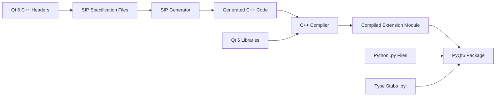
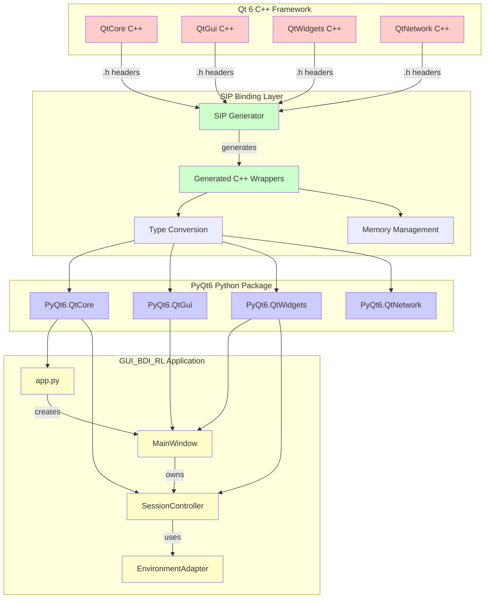
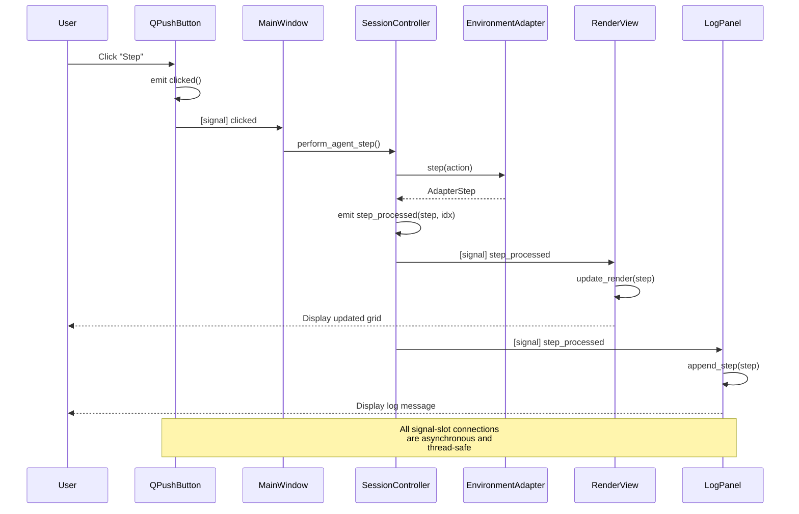
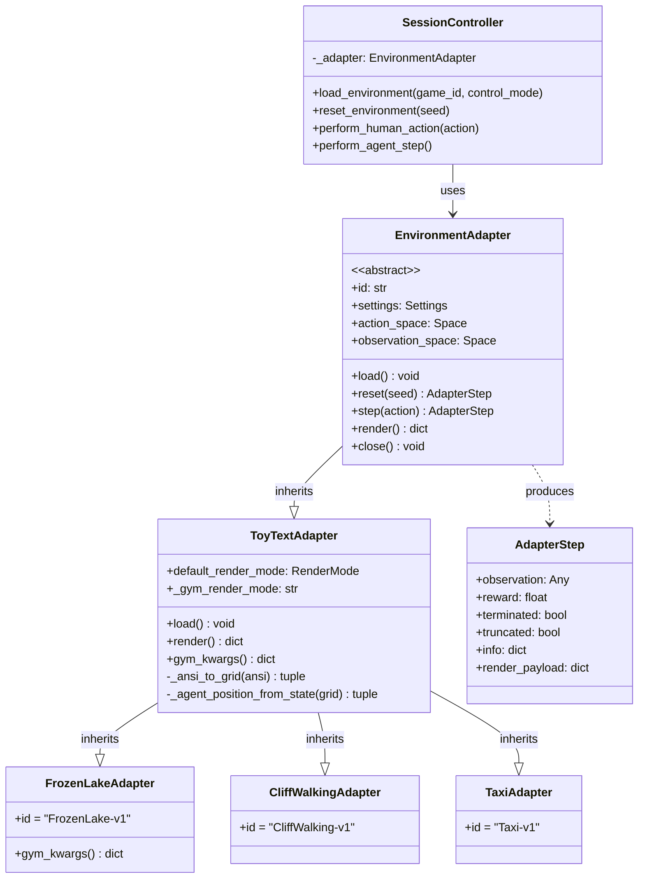
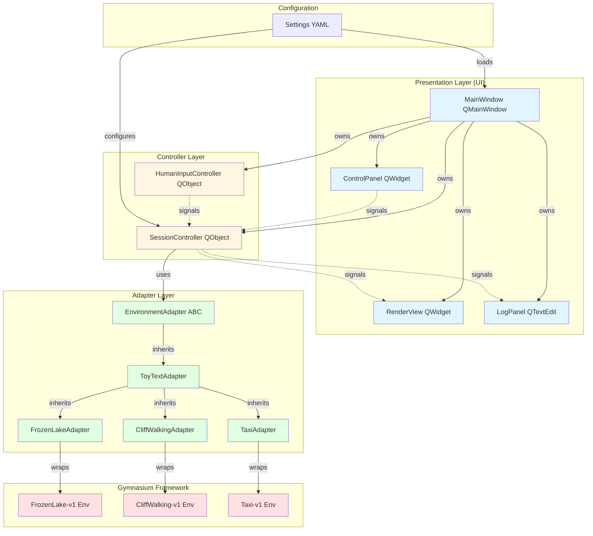
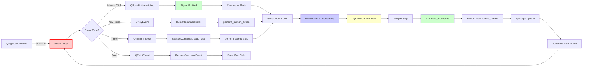

# 3.0 GUI PYQT6 DESIGN SPECIFICATION

**Document Version:** 3.0  
**Project:** GUI_BDI_RL - Gymnasium Multi-Environment Visualization Framework  
**Framework:** PyQt6 6.9.1 (Qt 6.9 Python Bindings)  
**Date:** 2025  
**Author:** Zahra  

---

## TABLE OF CONTENTS

1. [Introduction](#1-introduction)
2. [PyQt6 Framework Overview](#2-pyqt6-framework-overview)
3. [Qt 6 to Python Binding Architecture](#3-qt-6-to-python-binding-architecture)
4. [Compilation and Distribution Model](#4-compilation-and-distribution-model)
5. [GUI Execution Flow and Event Loop](#5-gui-execution-flow-and-event-loop)
6. [Signal-Slot Mechanism](#6-signal-slot-mechanism)
7. [Gymnasium Multi-Environment Integration](#7-gymnasium-multi-environment-integration)
8. [Architecture Diagrams](#8-architecture-diagrams)
9. [Implementation Analysis](#9-implementation-analysis)
10. [References](#10-references)

---

## 1. INTRODUCTION

### 1.1 Purpose

This document provides a comprehensive technical specification for understanding PyQt6's role in the GUI_BDI_RL project, which is a graphical user interface framework for visualizing and interacting with multiple Gymnasium reinforcement learning environments. The specification addresses:

- **PyQt6 Framework**: What PyQt6 is, its purpose, and how it provides Python bindings for Qt 6 C++ libraries
- **Architectural Design**: How Qt's C++ components are wrapped and made accessible to Python developers
- **Compilation Process**: Why end-users don't need C++ compilers and how pre-compiled binary wheels work
- **GUI Execution Model**: How the Qt event loop, signal-slot mechanism, and MVC pattern enable responsive applications
- **Gymnasium Integration**: How the Adapter pattern enables multi-environment support for reinforcement learning visualization

### 1.2 Document Scope

This specification focuses on:

1. **PyQt6 Bindings**: The translation layer between Qt 6 C++ and Python
2. **Qt 6 Framework**: Core modules (QtCore, QtGui, QtWidgets) and their responsibilities
3. **SIP Binding Generator**: The tool that creates Python wrappers around C++ Qt classes
4. **Event-Driven Architecture**: How Qt's event loop handles user interactions asynchronously
5. **Gymnasium Adapter Pattern**: How multiple RL environments (FrozenLake, CliffWalking, Taxi) are integrated

### 1.3 Target Audience

- Developers seeking to understand PyQt6's architecture and design patterns
- Researchers extending the GUI for new Gymnasium environments
- Students learning Qt framework principles through Python
- Contributors to the GUI_BDI_RL project

---

## 2. PYQT6 FRAMEWORK OVERVIEW

### 2.1 What is PyQt6?

**PyQt6** is a comprehensive set of **Python bindings** for **Qt 6**, developed by Riverbank Computing Limited. It provides Python developers with access to Qt's C++ application framework, enabling the creation of cross-platform graphical user interfaces and applications.

**Key Characteristics:**

- **Language Binding**: Wraps Qt 6 C++ classes, making them accessible to Python
- **Version Alignment**: PyQt6 6.9.0 corresponds to Qt 6.9.x
- **Platform Independence**: Supports Windows, Linux, macOS without code changes
- **Comprehensive Coverage**: Includes 40+ Qt modules (Core, GUI, Widgets, Network, WebEngine, etc.)
- **License**: Dual-licensed under GPL v3 and Riverbank Commercial License

**Relationship to Qt:**

```
Qt 6 (C++ Framework)  →  PyQt6 (Python Bindings)  →  Python Applications
     The Qt Company         Riverbank Computing         End Users
```

### 2.2 PyQt6 Components

PyQt6 comprises several integrated components:

#### 2.2.1 Extension Modules

All modules are installed in the `PyQt6` Python package:

- **QtCore**: Core non-GUI functionality (QObject, signals/slots, event loop, threads)
- **QtGui**: GUI primitives (colors, fonts, icons, images, OpenGL)
- **QtWidgets**: Desktop-style UI components (buttons, layouts, dialogs, tables)
- **QtNetwork**: Network programming (TCP/UDP sockets, HTTP clients, SSL/TLS)
- **QtSql**: SQL database integration
- **QtMultimedia**: Audio, video, camera, radio
- **QtWebEngineWidgets**: Chromium-based web browser integration
- **QtQml / QtQuick**: Declarative UI framework (alternative to Widgets)
- **40+ additional modules**: Charts, Bluetooth, NFC, 3D, positioning, etc.

In GUI_BDI_RL, we primarily use:
- **QtCore**: QObject, pyqtSignal, QTimer, Qt.AlignmentFlag
- **QtWidgets**: QApplication, QMainWindow, QPushButton, QComboBox, QTextEdit, QGridLayout
- **QtGui**: QPalette, QFont, QColor

#### 2.2.2 Type Stubs (PEP 484)

Each module includes stub files (`.pyi`) for static type checking with tools like `mypy`:

```python
from PyQt6.QtCore import QObject, pyqtSignal

class MyClass(QObject):
    my_signal = pyqtSignal(int, str)  # Type checkers understand this
```

#### 2.2.3 Utility Programs

- **pyuic6**: Converts Qt Designer `.ui` files to Python code
- **pylupdate6**: Extracts translatable strings for internationalization

#### 2.2.4 DBus Support

- **dbus.mainloop.pyqt6**: Integrates Qt event loop with DBus (Linux)

### 2.3 Qt Framework Foundation

Qt is a **C++ library** providing:

1. **Platform Abstractions**: Write once, run on Windows/Linux/macOS
2. **GUI Components**: Widgets, layouts, graphics, styles
3. **Networking**: HTTP, WebSockets, TCP/UDP, SSL/TLS
4. **Concurrency**: Threads, thread pools, async I/O
5. **Databases**: SQL drivers for PostgreSQL, MySQL, SQLite
6. **Multimedia**: Audio/video playback, cameras
7. **Web Technologies**: Chromium-based browser engine
8. **Meta-Object System**: Runtime introspection, signals/slots, properties

PyQt6 makes all these capabilities available to Python developers.

---

## 3. QT 6 TO PYTHON BINDING ARCHITECTURE

### 3.1 The SIP Binding Generator

**SIP** (formerly "Sippy") is a tool created by Riverbank Computing to generate Python extension modules from C++ libraries. It is the foundation of PyQt6.

**What SIP Does:**

1. **Parses C++ Headers**: Reads Qt 6 C++ class declarations
2. **Generates Python Wrappers**: Creates C Python API code that bridges Python ↔ C++
3. **Type Conversion**: Automatically converts between Python and C++ types:
   - `str` ↔ `QString`
   - `int` ↔ `int`
   - `list` ↔ `QList<T>`
   - `dict` ↔ `QMap<K,V>`
   - Python objects ↔ `QVariant` (Qt's type-erased container)
4. **Memory Management**: Handles reference counting and object lifetime
5. **Signal/Slot Integration**: Exposes Qt's signal-slot mechanism to Python

**SIP Workflow:**

```
Qt 6 C++ Headers → SIP Specification Files (.sip) → SIP Generator → C Extension Module (.so/.pyd) → PyQt6
```

### 3.2 How C++ Classes Become Python Classes

**Example: QObject**

Qt C++ class:
```cpp
// qobject.h (simplified)
class QObject {
public:
    QObject(QObject *parent = nullptr);
    virtual ~QObject();
    QString objectName() const;
    void setObjectName(const QString &name);
signals:
    void destroyed(QObject *obj = nullptr);
};
```

SIP specification (`.sip` file):
```cpp
class QObject {
public:
    QObject(QObject *parent /TransferThis/ = 0);
    virtual ~QObject();
    QString objectName() const;
    void setObjectName(const QString &name);
signals:
    void destroyed(QObject *obj = 0);
};
```

Python usage:
```python
from PyQt6.QtCore import QObject

obj = QObject()
obj.setObjectName("MyObject")
print(obj.objectName())  # "MyObject"
```

**Key Transformation:**

- C++ method `setObjectName(const QString &)` → Python method `setObjectName(str)`
- C++ signal `destroyed(QObject*)` → Python signal `destroyed` with `.connect()`, `.emit()`, `.disconnect()`
- C++ constructors → Python `__init__`
- C++ destructors → Python `__del__` (plus reference counting)

### 3.3 Type Conversion Layer

SIP handles complex type conversions automatically:

| Python Type | Qt C++ Type | Notes |
|------------|-------------|-------|
| `str` | `QString` | UTF-8/UTF-16 conversion |
| `int` | `int`, `qint32`, `qint64` | Range checking |
| `float` | `double`, `qreal` | Precision handled |
| `bool` | `bool` | Direct mapping |
| `list` | `QList<T>`, `QVector<T>` | Element conversion |
| `dict` | `QMap<K,V>`, `QHash<K,V>` | Key/value conversion |
| `None` | `nullptr`, default constructors | Null pointer handling |
| Python objects | `QVariant` | Type-erased container |

**Example:**

```python
from PyQt6.QtCore import QRect

# Python code
rect = QRect(10, 20, 100, 50)  # int → C++ int conversion
width = rect.width()            # C++ int → Python int

# Internally, SIP generates C code like:
# PyObject* wrap_QRect_width(PyObject* self) {
#     QRect* cpp_rect = extract_QRect(self);
#     int result = cpp_rect->width();
#     return PyLong_FromLong(result);
# }
```

### 3.4 Memory Management Bridge

**Challenge**: Python uses garbage collection (reference counting), C++ uses manual memory management.

**SIP Solution:**

1. **Python Owns Object**: Python's reference count determines lifetime
   ```python
   obj = QObject()  # PyQt6 owns C++ QObject instance
   del obj          # Python GC deletes C++ object
   ```

2. **C++ Owns Object**: Qt parent-child ownership (QObject trees)
   ```python
   parent = QWidget()
   child = QPushButton("Click", parent)  # parent owns child
   del parent  # C++ deletes both parent and child
   ```

3. **Transfer Ownership**: `/TransferThis/` annotation in SIP
   ```python
   layout = QVBoxLayout()
   widget.setLayout(layout)  # widget takes ownership of layout
   # PyQt6 no longer manages layout's lifetime
   ```

This prevents double-deletion and memory leaks.

---

## 4. COMPILATION AND DISTRIBUTION MODEL

### 4.1 Why Users Don't Compile C++

**Common Misconception**: "PyQt6 requires C++ compiler to use."  
**Reality**: End-users install pre-compiled binary wheels.

**Distribution Models:**

#### 4.1.1 Binary Wheels (Recommended)

```bash
pip install PyQt6
```

What happens:
1. `pip` downloads a **binary wheel** (`.whl` file) from PyPI
2. Wheel contains:
   - Pre-compiled C extension modules (`.so` on Linux, `.pyd` on Windows, `.dylib` on macOS)
   - Python `.py` files
   - Type stubs `.pyi`
   - Qt 6 shared libraries (bundled)
3. No compilation needed—user system doesn't need:
   - C++ compiler (g++, MSVC, clang)
   - Qt 6 SDK
   - CMake, Make, or other build tools

**Supported platforms:**
- Windows (x86_64, ARM64)
- Linux (x86_64, ARM64, manylinux2014 compatible)
- macOS (x86_64, Apple Silicon)

#### 4.1.2 Source Distribution (For Developers)

```bash
pip install --no-binary :all: PyQt6
```

What happens:
1. Downloads source distribution (`.tar.gz`)
2. Requires:
   - C++ compiler
   - Qt 6 development libraries
   - SIP build system
   - Python development headers
3. Compiles SIP-generated C++ code
4. Links against Qt 6 libraries
5. Installs compiled modules

**When needed:**
- Custom Qt patches
- Unsupported platforms
- Debugging PyQt6 internals

### 4.2 Compilation Process (Developer View)

For developers **building PyQt6 from source**:



**Steps:**

1. **Write SIP Specs**: Define Python API for Qt classes
2. **Run SIP**: Generate C++ wrapper code
3. **Compile**: Build extension modules with C++ compiler
4. **Link**: Against Qt 6 shared libraries
5. **Package**: Create wheel with compiled modules + Qt libraries

### 4.3 Runtime Dependencies

**For End-Users (Binary Wheel):**

- Python 3.8+ runtime
- System OpenGL libraries (graphics)
- System X11 libraries (Linux GUI)
- **No Qt SDK needed** (bundled in wheel)

**For Developers (Source Build):**

- All end-user dependencies
- Qt 6.9.x SDK
- C++17 compiler
- SIP 6.x

---

## 5. GUI EXECUTION FLOW AND EVENT LOOP

### 5.1 QApplication and Event Loop

Every PyQt6 GUI application requires a **QApplication** instance that manages the **event loop**.

**Event Loop Responsibilities:**

1. **Process GUI Events**: Mouse clicks, key presses, window resize
2. **Timer Events**: Periodic callbacks (QTimer)
3. **Paint Events**: Redraw widgets when needed
4. **Signal Delivery**: Queue and deliver signal-slot calls
5. **Platform Integration**: Handle OS-specific events

**Execution Flow:**

```python
from PyQt6.QtWidgets import QApplication, QMainWindow
import sys

# 1. Create QApplication instance (one per process)
app = QApplication(sys.argv)

# 2. Create main window
window = QMainWindow()
window.setWindowTitle("My App")
window.resize(800, 600)
window.show()

# 3. Enter event loop (blocks until app.quit())
sys.exit(app.exec())
```

**What `app.exec()` does:**

```cpp
// Simplified Qt C++ event loop
int QApplication::exec() {
    while (!quit_requested) {
        QEvent *event = wait_for_next_event();  // Blocks until event
        dispatch_event(event);                   // Route to target widget
        process_deferred_deletions();            // Clean up deleted objects
    }
    return exit_code;
}
```

### 5.2 Event Dispatch and Widget Hierarchy

**Widget Tree (Parent-Child Relationships):**

```
QMainWindow (top-level)
├── CentralWidget
│   ├── ControlPanel (QWidget)
│   │   ├── QLabel("Environment:")
│   │   ├── QComboBox (environment selector)
│   │   ├── QPushButton("Reset")
│   │   └── QPushButton("Step")
│   ├── RenderView (QWidget)
│   │   ├── QTabWidget
│   │   │   ├── Tab "Grid View"
│   │   │   └── Tab "Raw ANSI"
│   │   └── QGridLayout (for grid cells)
│   └── LogPanel (QTextEdit)
└── QStatusBar
```

**Event Propagation:**

1. OS generates event (e.g., mouse click)
2. Qt determines target widget via hit-testing
3. Event delivered to widget's `event()` method
4. Widget can:
   - Handle event (return `True`)
   - Ignore event → propagates to parent widget
5. If unhandled, reaches QApplication's default handler

### 5.3 GUI_BDI_RL Application Flow

**Initialization (`gym_gui/app.py`):**

```python
def main():
    # 1. Load settings from YAML
    settings = Settings.from_yaml("config/settings.yaml")
    
    # 2. Create QApplication
    app = QApplication(sys.argv)
    
    # 3. Apply visual style
    apply_dark_theme(app, settings)
    
    # 4. Create main window
    window = MainWindow(settings)
    window.show()
    
    # 5. Enter event loop
    sys.exit(app.exec())
```

**MainWindow Lifecycle:**

```python
class MainWindow(QMainWindow):
    def __init__(self, settings: Settings):
        super().__init__()
        
        # Create UI components
        self._session = SessionController(settings, parent=self)
        self._control_panel = ControlPanel(settings, parent=self)
        self._render_view = RenderView(parent=self)
        self._log_panel = LogPanel(parent=self)
        
        # Connect signals/slots
        self._control_panel.reset_clicked.connect(self._on_reset)
        self._session.step_processed.connect(self._render_view.update_render)
        
        # Layout widgets
        self._setup_layout()
    
    def _on_reset(self):
        # User clicked "Reset" button
        game_id = self._control_panel.selected_game()
        self._session.reset_environment(seed=42)
```

### 5.4 Thread-Safe Signal Delivery

Qt supports **cross-thread** signal-slot connections:

```python
from PyQt6.QtCore import QObject, QThread, pyqtSignal

class Worker(QObject):
    result_ready = pyqtSignal(int)  # Emitted from worker thread
    
    def process(self):
        # Running in worker thread
        result = expensive_computation()
        self.result_ready.emit(result)  # Safe to call from any thread

# Main thread
worker = Worker()
thread = QThread()
worker.moveToThread(thread)
worker.result_ready.connect(update_ui)  # Qt auto-detects queued connection
thread.start()
```

**Connection Types:**

- **Direct (Synchronous)**: Slot called immediately (same thread)
- **Queued (Asynchronous)**: Slot called via event loop (cross-thread)
- **Auto**: Qt chooses based on sender/receiver threads

---

## 6. SIGNAL-SLOT MECHANISM

### 6.1 What are Signals and Slots?

**Signals** and **Slots** are Qt's mechanism for **event-driven communication** between objects. They enable **loose coupling**—a component can emit a signal without knowing who (if anyone) will respond.

**Key Features:**

- **One signal → many slots**: Broadcast to multiple listeners
- **Many signals → one slot**: Aggregate from multiple sources
- **Signal chaining**: Connect signal to another signal
- **Type-safe**: Compile-time checks (C++) / runtime checks (Python)
- **Cross-thread**: Automatic queuing for thread safety
- **Disconnection**: Remove connections dynamically

### 6.2 Defining Signals

**Built-in Qt Signals** (e.g., QPushButton):

```python
from PyQt6.QtWidgets import QPushButton

button = QPushButton("Click Me")
# QPushButton has pre-defined signal: clicked(bool)
button.clicked.connect(lambda: print("Clicked!"))
```

**Custom Signals** (using `pyqtSignal`):

```python
from PyQt6.QtCore import QObject, pyqtSignal

class SessionController(QObject):
    # Signal with no arguments
    session_initialized = pyqtSignal()
    
    # Signal with typed arguments
    step_processed = pyqtSignal(object, int)  # (AdapterStep, step_index)
    
    # Overloaded signals (multiple signatures)
    value_changed = pyqtSignal([int], [str])  # value_changed(int) OR value_changed(str)
    
    def reset_environment(self):
        # Emit signal
        self.session_initialized.emit()
```

**Signal Declaration Rules:**

1. Must be class attributes (not instance attributes)
2. Only in `QObject` subclasses
3. Automatically added to `QMetaObject` (introspection)
4. Cannot be defined after class creation

### 6.3 Connecting Signals to Slots

**Basic Connection:**

```python
class MainWindow(QMainWindow):
    def __init__(self):
        super().__init__()
        self.button = QPushButton("Reset")
        
        # Connect signal to slot (method)
        self.button.clicked.connect(self.handle_reset)
    
    def handle_reset(self):
        print("Reset button clicked")
```

**Lambda Functions:**

```python
self.button.clicked.connect(lambda: self.reset_with_seed(42))
```

**Disconnecting:**

```python
# Disconnect specific slot
self.button.clicked.disconnect(self.handle_reset)

# Disconnect all slots
self.button.clicked.disconnect()

# Store connection for later disconnection
connection = self.button.clicked.connect(self.handle_reset)
self.button.clicked.disconnect(connection)
```

### 6.4 Signal-Slot in GUI_BDI_RL

**Example: SessionController → MainWindow Communication**

```python
class SessionController(QObject):
    step_processed = pyqtSignal(object, int)  # (AdapterStep, step_index)
    episode_finished = pyqtSignal(bool)       # (success)
    
    def _apply_action(self, action: int):
        step = self._adapter.step(action)
        self.step_processed.emit(step, self._step_index)  # Notify UI
        
        if step.terminated or step.truncated:
            self.episode_finished.emit(True)
```

```python
class MainWindow(QMainWindow):
    def __init__(self, settings):
        self._session = SessionController(settings, parent=self)
        
        # Connect session signals to UI update slots
        self._session.step_processed.connect(self._render_view.update_render)
        self._session.step_processed.connect(self._log_panel.append_step)
        self._session.episode_finished.connect(self._on_episode_end)
    
    def _on_episode_end(self, success: bool):
        self._log_panel.append_text("Episode finished!")
        self.statusBar().showMessage("Ready for new episode")
```

**Signal Flow Diagram:**

```
User clicks "Step" button
    ↓
QPushButton.clicked signal
    ↓ (connected to)
MainWindow._on_step_clicked() slot
    ↓ (calls)
SessionController.perform_agent_step()
    ↓ (emits)
SessionController.step_processed signal
    ↓ (connected to)
RenderView.update_render() slot → Updates grid visualization
    ↓ (connected to)
LogPanel.append_step() slot → Logs step info
```

### 6.5 pyqtSlot Decorator

**Purpose**: Explicitly mark Python methods as Qt slots for:
- Better performance (faster signal delivery)
- Reduced memory usage
- QML integration
- Qt Designer auto-connect

**Usage:**

```python
from PyQt6.QtCore import QObject, pyqtSlot

class MyController(QObject):
    @pyqtSlot()
    def simple_slot(self):
        """C++ signature: void simple_slot()"""
        pass
    
    @pyqtSlot(int, str)
    def typed_slot(self, count: int, message: str):
        """C++ signature: void typed_slot(int, QString)"""
        print(f"{message} x{count}")
    
    @pyqtSlot(int, result=int)
    def with_return(self, x: int) -> int:
        """C++ signature: int with_return(int)"""
        return x * 2
```

**Benefits:**

- **Type Safety**: Qt checks argument types at connection time
- **Overload Resolution**: Disambiguate overloaded signals
- **Auto-Connect**: Works with `connectSlotsByName()` (Qt Designer)

---

## 7. GYMNASIUM MULTI-ENVIRONMENT INTEGRATION

### 7.1 Gymnasium Framework Overview

**Gymnasium** (formerly OpenAI Gym) is a Python framework for developing and comparing reinforcement learning algorithms. It provides:

- **Standard API**: `reset()`, `step(action)`, `render()`, `close()`
- **Environment Registry**: Pre-built RL tasks (Atari, MuJoCo, Toy Text)
- **Observation/Action Spaces**: Type definitions for states and actions
- **Render Modes**: "human", "rgb_array", "ansi"

**Supported Environments in GUI_BDI_RL:**

| Environment | ID | Observation Space | Action Space | Description |
|------------|-----|-------------------|--------------|-------------|
| FrozenLake | `FrozenLake-v1` | Discrete(16) | Discrete(4) | 4x4 grid, avoid holes, reach goal |
| CliffWalking | `CliffWalking-v1` | Discrete(48) | Discrete(4) | 4x12 grid, avoid cliff edge |
| Taxi | `Taxi-v1` | Discrete(500) | Discrete(6) | 5x5 grid, pick up/drop off passenger |

### 7.2 Adapter Pattern Architecture

**Design Pattern**: Adapter (Wrapper)

**Purpose**: Decouple Gymnasium's diverse environment APIs from GUI-specific rendering and control logic.

**Structure:**

```
EnvironmentAdapter (ABC)
├── ToyTextAdapter (base for grid-based envs)
│   ├── FrozenLakeAdapter
│   ├── CliffWalkingAdapter
│   └── TaxiAdapter
└── [Future: AtariAdapter, MuJoCoAdapter]
```

**Interface (`gym_gui/core/adapters/base.py`):**

```python
from abc import ABC, abstractmethod
from dataclasses import dataclass
from typing import Any, Generic, TypeVar

ObsType = TypeVar("ObsType")
ActType = TypeVar("ActType")

@dataclass(slots=True)
class AdapterStep:
    """Unified step result for GUI consumption."""
    observation: Any
    reward: float
    terminated: bool
    truncated: bool
    info: dict[str, Any]
    render_payload: dict[str, Any]

class EnvironmentAdapter(ABC, Generic[ObsType, ActType]):
    """Abstract interface for Gymnasium environment adapters."""
    
    @abstractmethod
    def load(self) -> None:
        """Initialize Gymnasium environment."""
        pass
    
    @abstractmethod
    def reset(self, *, seed: int | None = None) -> AdapterStep:
        """Reset environment to initial state."""
        pass
    
    @abstractmethod
    def step(self, action: ActType) -> AdapterStep:
        """Execute action and return new state."""
        pass
    
    @abstractmethod
    def render(self) -> dict[str, Any]:
        """Generate visualization data for GUI."""
        pass
    
    @abstractmethod
    def close(self) -> None:
        """Clean up environment resources."""
        pass
```

### 7.3 ToyTextAdapter Implementation

**Responsibilities:**

1. **Gymnasium Wrapping**: Create `gym.make()` environment
2. **ANSI Parsing**: Convert terminal-style output to structured grid
3. **Agent Position Tracking**: Extract agent coordinates from environment state
4. **Render Data Generation**: Produce GUI-friendly grid representation

**Key Methods:**

```python
class ToyTextAdapter(EnvironmentAdapter[int, int]):
    def load(self) -> None:
        env = gym.make(self.id, render_mode="ansi", **self.gym_kwargs())
        self._set_env(env)
    
    def render(self) -> dict[str, Any]:
        # Get ANSI output from Gymnasium
        ansi_raw = self._env.render()
        
        # Parse ANSI escape codes to grid
        grid, agent_pos = _ansi_to_grid(ansi_raw)
        
        # Extract position from environment state (more reliable)
        env_position = self._agent_position_from_state(grid)
        if env_position is not None:
            agent_pos = env_position
        
        return {
            "mode": RenderMode.GRID.value,
            "grid": grid,              # List[List[str]] (2D char array)
            "ansi": ansi_raw,          # Raw terminal output
            "agent_position": agent_pos,  # (row, col) tuple
        }
    
    def _agent_position_from_state(self, grid: List[List[str]]) -> Tuple[int, int] | None:
        # Extract state from Gymnasium environment
        state = self._env.unwrapped.s  # Environment-specific state
        
        if self.id == GameId.TAXI.value:
            # Taxi state encodes: (taxi_row, taxi_col, passenger_loc, destination)
            taxi_row, taxi_col, *_ = self._env.unwrapped.decode(state)
            return (taxi_row, taxi_col)
        else:
            # FrozenLake/CliffWalking: state is position index
            width = self._env.unwrapped.ncol
            row = state // width
            col = state % width
            return (row, col)
```

**ANSI Parsing (`_ansi_to_grid`):**

```python
def _ansi_to_grid(ansi: str) -> Tuple[List[List[str]], Tuple[int, int] | None]:
    """Convert ANSI terminal output to 2D grid."""
    rows = []
    agent_pos = None
    
    for line in ansi.splitlines():
        row_chars = []
        i = 0
        current_bg = None  # Track background color (agent highlighting)
        
        while i < len(line):
            if line[i] == '\x1b':  # ANSI escape sequence
                # Parse \x1b[42m (green background) → agent position
                match = _ANSI_ESCAPE_RE.match(line, i)
                if match:
                    codes = match.group("codes").split(";")
                    for code in codes:
                        if 40 <= int(code) <= 47:  # Background color
                            current_bg = int(code)
                    i = match.end()
                    continue
            
            char = line[i]
            row_chars.append(char)
            
            if current_bg is not None:  # Character is highlighted
                agent_pos = (len(rows), len(row_chars) - 1)
            
            i += 1
        
        rows.append(row_chars)
    
    return rows, agent_pos
```

### 7.4 Adapter Factory Pattern

**Purpose**: Centralized creation of adapters based on `GameId`.

**Implementation (`gym_gui/core/factories/adapters.py`):**

```python
from gym_gui.core.enums import GameId
from gym_gui.core.adapters.base import EnvironmentAdapter
from gym_gui.core.adapters.toy_text import TOY_TEXT_ADAPTERS

def create_adapter(game_id: GameId, context: AdapterContext) -> EnvironmentAdapter:
    """Factory function to create adapter for given game ID."""
    if game_id in TOY_TEXT_ADAPTERS:
        adapter_cls = TOY_TEXT_ADAPTERS[game_id]
        return adapter_cls(context)
    else:
        raise ValueError(f"No adapter for game_id={game_id}")
```

**Registration:**

```python
# gym_gui/core/adapters/toy_text.py
TOY_TEXT_ADAPTERS: dict[GameId, Type[ToyTextAdapter]] = {
    GameId.FROZEN_LAKE: FrozenLakeAdapter,
    GameId.CLIFF_WALKING: CliffWalkingAdapter,
    GameId.TAXI: TaxiAdapter,
}
```

### 7.5 Control Modes

GUI_BDI_RL supports multiple interaction paradigms:

| Mode | Description | Use Case |
|------|-------------|----------|
| `HUMAN_ONLY` | User controls all actions | Manual play, data collection |
| `AGENT_ONLY` | AI agent controls all actions | RL agent evaluation |
| `HYBRID_TURN_BASED` | Alternating human/agent turns | Collaborative learning |
| `HYBRID_HUMAN_AGENT` | Human can intervene anytime | Safe RL, human-in-the-loop |
| `MULTI_AGENT_COOP` | Multiple agents cooperate | Multi-agent RL (future) |
| `MULTI_AGENT_COMPETITIVE` | Agents compete | Game theory (future) |

**Enforcement:**

```python
class SessionController(QObject):
    def perform_human_action(self, action: int):
        if self._control_mode not in {
            ControlMode.HUMAN_ONLY,
            ControlMode.HYBRID_TURN_BASED,
            ControlMode.HYBRID_HUMAN_AGENT,
        }:
            self.status_message.emit("Current mode ignores human input")
            return
        
        if self._control_mode == ControlMode.HYBRID_TURN_BASED and self._turn != "human":
            self.status_message.emit("Hybrid mode: waiting for agent turn")
            return
        
        self._apply_action(action)
```

---

## 8. ARCHITECTURE DIAGRAMS

### 8.1 PyQt6 Binding Architecture



### 8.2 Signal-Slot Execution Flow



### 8.3 Gymnasium Adapter Pattern



### 8.4 GUI_BDI_RL Application Architecture



### 8.5 Event Loop and Render Pipeline



---

## 9. IMPLEMENTATION ANALYSIS

### 9.1 Project Structure

```
GUI_BDI_RL/
├── gym_gui/                    # Main Python package
│   ├── __init__.py
│   ├── app.py                  # Entry point (QApplication creation)
│   ├── ui/                     # UI components
│   │   ├── main_window.py      # MainWindow class
│   │   ├── control_panel.py    # Control panel widget
│   │   ├── render_view.py      # Render viewport
│   │   └── log_panel.py        # Log output
│   ├── controllers/            # Business logic controllers
│   │   ├── session.py          # SessionController (Gym lifecycle)
│   │   └── human_input.py      # HumanInputController (keyboard)
│   ├── core/                   # Core abstractions
│   │   ├── adapters/           # Environment adapters
│   │   │   ├── base.py         # EnvironmentAdapter ABC
│   │   │   └── toy_text.py     # ToyTextAdapter implementations
│   │   ├── enums.py            # GameId, ControlMode, RenderMode
│   │   └── factories/          # Factory functions
│   │       └── adapters.py     # create_adapter()
│   ├── config/                 # Configuration
│   │   └── settings.py         # Settings dataclass
│   └── utils/                  # Utilities
│       ├── styling.py          # Dark theme application
│       └── timekeeping.py      # Episode timers
├── config/                     # Configuration files
│   └── settings.yaml           # Default settings
├── requirements.txt            # Python dependencies
├── run_app.sh                  # Shell script to launch
└── README.md                   # Usage documentation
```

### 9.2 Key Files Analysis

#### 9.2.1 `gym_gui/app.py` - Application Entry Point

**Responsibilities:**
- Load configuration from YAML
- Create `QApplication` instance
- Apply visual theme
- Instantiate `MainWindow`
- Enter event loop

**Code:**

```python
def main():
    """Launch the Gymnasium GUI application."""
    settings = Settings.from_yaml("config/settings.yaml")
    
    app = QApplication(sys.argv)
    apply_dark_theme(app, settings)
    
    window = MainWindow(settings)
    window.show()
    
    sys.exit(app.exec())

if __name__ == "__main__":
    main()
```

**Why users don't compile:**
- `QApplication` is imported from pre-compiled PyQt6 wheel
- No C++ code in this file—pure Python

#### 9.2.2 `gym_gui/ui/main_window.py` - Main Window

**Responsibilities:**
- Create 3-panel layout (control, render, log)
- Own `SessionController` and `HumanInputController`
- Connect UI signals to controller slots
- Handle menu actions, window events

**Layout Structure:**

```python
class MainWindow(QMainWindow):
    def _setup_layout(self):
        # Central widget
        central = QWidget()
        self.setCentralWidget(central)
        
        # Main layout (horizontal)
        main_layout = QHBoxLayout(central)
        
        # Left: Control Panel (fixed width 300px)
        main_layout.addWidget(self._control_panel, stretch=0)
        
        # Center: Render View (expandable)
        main_layout.addWidget(self._render_view, stretch=1)
        
        # Bottom: Log Panel (horizontal splitter)
        splitter = QSplitter(Qt.Orientation.Vertical)
        splitter.addWidget(self._render_view)
        splitter.addWidget(self._log_panel)
        main_layout.addWidget(splitter)
```

**Signal-Slot Connections:**

```python
def _connect_signals(self):
    # Control panel → Session controller
    self._control_panel.reset_clicked.connect(self._on_reset_clicked)
    self._control_panel.step_clicked.connect(self._on_step_clicked)
    
    # Session controller → UI updates
    self._session.step_processed.connect(self._render_view.update_render)
    self._session.step_processed.connect(self._log_panel.append_step)
    self._session.episode_finished.connect(self._on_episode_finished)
    self._session.status_message.connect(self.statusBar().showMessage)
    
    # Keyboard input → Human input controller
    self._human_input.action_triggered.connect(self._session.perform_human_action)
```

#### 9.2.3 `gym_gui/controllers/session.py` - Session Controller

**Responsibilities:**
- Manage `EnvironmentAdapter` lifecycle (load, reset, close)
- Execute human and agent actions
- Emit Qt signals for UI updates
- Handle auto-play timer
- Track episode state and timers

**Key Signals:**

```python
class SessionController(QObject):
    session_initialized = Signal(str, str, object)  # (game_id, control_mode, initial_step)
    step_processed = Signal(object, int)           # (AdapterStep, step_index)
    episode_finished = Signal(bool)                # (success)
    status_message = Signal(str)                   # Status bar message
    awaiting_human = Signal(bool, str)             # (waiting, message)
    turn_changed = Signal(str)                     # "human" | "agent"
    error_occurred = Signal(str)                   # Error message
    auto_play_state_changed = Signal(bool)         # Auto-play on/off
```

**Action Execution:**

```python
def _apply_action(self, action: int) -> None:
    """Execute action via adapter and emit signals."""
    step = self._adapter.step(action)
    self._step_index += 1
    
    # Emit step processed
    self.step_processed.emit(step, self._step_index)
    
    # Update status bar
    self._update_status(step)
    
    # Log step outcome
    self._log_step_outcome(action, step)
    
    # Check termination
    if step.terminated or step.truncated:
        self.episode_finished.emit(True)
        self.stop_auto_play()
    else:
        self._advance_turn()  # Hybrid mode turn management
```

#### 9.2.4 `gym_gui/core/adapters/toy_text.py` - Toy Text Adapter

**Responsibilities:**
- Wrap Gymnasium toy-text environments
- Parse ANSI output to structured grid
- Extract agent position from environment state
- Generate render payloads for GUI

**Render Method:**

```python
def render(self) -> dict[str, Any]:
    """Generate visualization data for GUI."""
    env = self._require_env()
    
    # Get raw ANSI output
    ansi_raw = env.render()
    ansi = str(ansi_raw)
    
    # Parse ANSI to grid
    grid, agent_pos = _ansi_to_grid(ansi)
    
    # Extract position from environment state (more reliable)
    env_position = self._agent_position_from_state(grid)
    if env_position is not None:
        agent_pos = env_position
    
    # Save snapshot to file
    snapshot_path = _TOY_TEXT_DATA_DIR / f"{self.id}_latest.txt"
    snapshot_path.write_text(ansi, encoding="utf-8")
    
    return {
        "mode": RenderMode.GRID.value,
        "grid": grid,                    # List[List[str]]
        "ansi": ansi,                    # str
        "snapshot_path": str(snapshot_path),
        "agent_position": agent_pos,     # Tuple[int, int] | None
    }
```

### 9.3 QtPy Abstraction Layer

GUI_BDI_RL uses **QtPy** instead of direct PyQt6 imports. This provides **binding-agnostic code**.

**QtPy Purpose:**

```python
# Without QtPy (binding-specific)
from PyQt6.QtWidgets import QApplication  # Must use PyQt6

# With QtPy (binding-agnostic)
from qtpy.QtWidgets import QApplication   # Works with PyQt5, PyQt6, PySide2, PySide6
```

**Environment Variable:**

```bash
export QT_API=pyqt6  # Tell QtPy to use PyQt6 backend
```

**Why use QtPy:**

1. **Flexibility**: Switch between PyQt5/6, PySide2/6 without code changes
2. **Migration Path**: Easier upgrades (e.g., PyQt5 → PyQt6)
3. **Library Compatibility**: Some libraries only support certain bindings
4. **Commercial vs Open Source**: PySide (LGPL) vs PyQt (GPL/Commercial)

**Trade-off**: Slightly slower imports (runtime binding resolution)

### 9.4 No Compilation Required for Users

**Verification:**

```bash
# Install PyQt6 (downloads pre-compiled wheel)
pip install PyQt6==6.9.1

# Check installed files
python -c "import PyQt6; print(PyQt6.__file__)"
# Output: /path/to/site-packages/PyQt6/__init__.py

ls /path/to/site-packages/PyQt6/
# Output:
# QtCore.abi3.so          (compiled C extension)
# QtWidgets.abi3.so       (compiled C extension)
# QtGui.abi3.so           (compiled C extension)
# Qt6/lib/libQt6Core.so   (bundled Qt 6 library)
```

**Key Observations:**

1. `.abi3.so` files are **pre-compiled** C extensions
2. Qt 6 shared libraries are **bundled** in wheel
3. No `.cpp` or `.h` files present (no source code)
4. User's system doesn't need:
   - C++ compiler
   - Qt 6 SDK
   - Build tools (CMake, Make)

**Users only need:**

- Python 3.8+ runtime
- `pip` to install wheels
- System OpenGL/X11 libraries (already present on most Linux distros)

---

## 10. REFERENCES

### 10.1 Official Documentation

1. **PyQt6 Documentation**  
   Riverbank Computing  
   https://www.riverbankcomputing.com/static/Docs/PyQt6/  
   _Comprehensive reference for PyQt6 API, signals/slots, Qt Designer integration_

2. **Qt 6 Documentation**  
   The Qt Company  
   https://doc.qt.io/qt-6/  
   _Official C++ Qt framework documentation (QtCore, QtWidgets, QtGui, etc.)_

3. **Gymnasium Documentation**  
   Farama Foundation  
   https://gymnasium.farama.org/  
   _Reinforcement learning environment framework API reference_

4. **SIP Documentation**  
   Riverbank Computing  
   https://www.riverbankcomputing.com/static/Docs/sip/  
   _SIP binding generator documentation for creating Python wrappers_

### 10.2 Academic References

5. **PEP 484 – Type Hints**  
   Python Software Foundation  
   https://www.python.org/dev/peps/pep-0484/  
   _Python type annotation specification (used in PyQt6 stub files)_

6. **Qt Meta-Object System**  
   The Qt Company  
   https://doc.qt.io/qt-6/metaobjects.html  
   _Technical details on signals/slots, QMetaObject, runtime introspection_

7. **Model-View-Controller (MVC) Pattern**  
   Gang of Four (Design Patterns)  
   _Architectural pattern used in GUI_BDI_RL (SessionController = Controller, RenderView = View, EnvironmentAdapter = Model)_

8. **Adapter Pattern (Wrapper)**  
   Gang of Four (Design Patterns)  
   _Structural pattern for wrapping Gymnasium environments with GUI-friendly interface_

### 10.3 Project-Specific Documentation

9. **GUI_BDI_RL README**  
   `/home/zahra/projects/GUI_BDI_RL/README.md`  
   _Installation, usage, and quickstart guide_

10. **HOW_TO_RUN.md**  
    `/home/zahra/projects/GUI_BDI_RL/HOW_TO_RUN.md`  
    _Step-by-step instructions for running the GUI with VcXsrv on WSL2_

11. **3.1_GUI_BDI_INTEGRATION_ARCHITECTURE.md**  
    `/home/zahra/projects/GUI_BDI_RL/3.1_GUI_BDI_INTEGRATION_ARCHITECTURE.md`  
    _Future integration plan for BDI agents with GUI_BDI_RL_

### 10.4 Source Code References

12. **EnvironmentAdapter Interface**  
    `gym_gui/core/adapters/base.py`  
    _Abstract base class defining adapter contract_

13. **SessionController Implementation**  
    `gym_gui/controllers/session.py`  
    _Qt-based session management and signal orchestration_

14. **MainWindow Layout**  
    `gym_gui/ui/main_window.py`  
    _Three-panel GUI layout with signal-slot connections_

15. **ToyTextAdapter Implementation**  
    `gym_gui/core/adapters/toy_text.py`  
    _ANSI parsing, grid generation, and agent position extraction_

### 10.5 Online Resources

16. **PyQt6 Tutorial (Real Python)**  
    https://realpython.com/python-pyqt-gui-calculator/  
    _Practical tutorial on PyQt6 GUI development_

17. **Qt Widgets Examples**  
    https://doc.qt.io/qt-6/qtwidgets-examples.html  
    _Official Qt examples (C++, portable to PyQt6)_

18. **Gymnasium Environments**  
    https://gymnasium.farama.org/environments/toy_text/  
    _Documentation for FrozenLake, CliffWalking, Taxi environments_

---

## APPENDIX A: GLOSSARY

| Term | Definition |
|------|------------|
| **PyQt6** | Python bindings for Qt 6 C++ framework |
| **Qt 6** | Cross-platform C++ application framework |
| **SIP** | Binding generator tool (C++ → Python) |
| **Signal** | Event notification mechanism in Qt |
| **Slot** | Callback function connected to signals |
| **QObject** | Base class for all Qt objects (provides signals/slots) |
| **Event Loop** | Core Qt mechanism for processing GUI events |
| **Adapter Pattern** | Design pattern for wrapping incompatible interfaces |
| **Gymnasium** | RL environment framework (formerly OpenAI Gym) |
| **MVC** | Model-View-Controller architectural pattern |
| **ANSI Escape Codes** | Terminal formatting codes (colors, cursor position) |
| **Binary Wheel** | Pre-compiled Python package (`.whl` file) |
| **QtPy** | Abstraction layer for PyQt5/6, PySide2/6 compatibility |

---

## APPENDIX B: INSTALLATION GUIDE

### B.1 User Installation (No Compilation)

```bash
# 1. Create virtual environment
python3 -m venv .venv
source .venv/bin/activate

# 2. Install dependencies (downloads pre-compiled wheels)
pip install -r requirements.txt

# 3. Run application
python -m gym_gui.app
```

**`requirements.txt`:**

```
PyQt6==6.9.1          # Pre-compiled Qt 6 bindings
QtPy==2.4.3           # Binding abstraction
gymnasium==1.2.1      # RL environment framework
numpy>=1.24.0         # Numerical arrays
PyYAML>=6.0          # Configuration parsing
```

### B.2 Developer Installation (Source Build)

```bash
# 1. Install Qt 6 SDK
# Ubuntu/Debian:
sudo apt install qt6-base-dev qt6-tools-dev

# macOS (Homebrew):
brew install qt@6

# Windows: Download from qt.io

# 2. Install PyQt6 from source
pip install --no-binary :all: PyQt6

# 3. Install development tools
pip install pytest mypy black
```

---

## APPENDIX C: TROUBLESHOOTING

### C.1 Common Errors

**Error: "qt.qpa.xcb: could not connect to display"**

**Cause**: X Server not running or `$DISPLAY` not set (Linux/WSL)

**Solution:**

```bash
# Start VcXsrv on Windows
& "C:\Program Files\VcXsrv\vcxsrv.exe" :0 -clipboard -multiwindow

# Set DISPLAY in WSL
export DISPLAY=$(cat /etc/resolv.conf | grep nameserver | awk '{print $2}'):0
```

**Error: "ModuleNotFoundError: No module named 'PyQt6.sip'"**

**Cause**: PyQt6 not installed or virtual environment not activated

**Solution:**

```bash
pip install PyQt6
# OR
source .venv/bin/activate
pip install -r requirements.txt
```

**Error: "This application failed to start because no Qt platform plugin could be initialized"**

**Cause**: Missing Qt platform plugins (Windows)

**Solution:**

```bash
# Reinstall PyQt6 with --force-reinstall
pip install --force-reinstall PyQt6
```

---

## DOCUMENT REVISION HISTORY

| Version | Date | Author | Changes |
|---------|------|--------|---------|
| 3.0 | 2025-01 | Zahra | Initial comprehensive PyQt6 design specification |

---

**END OF DOCUMENT**