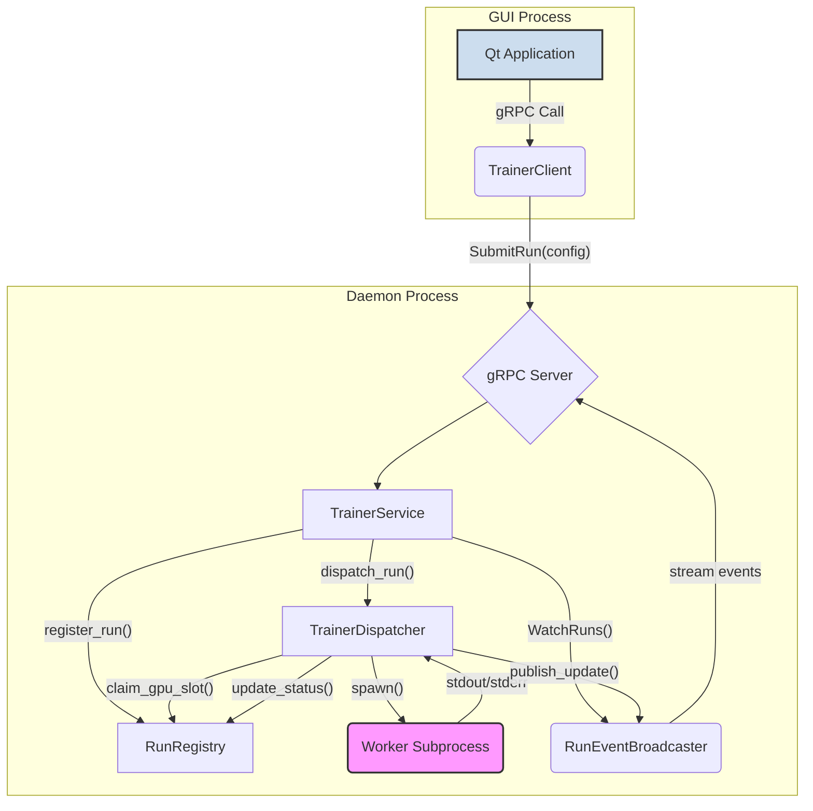
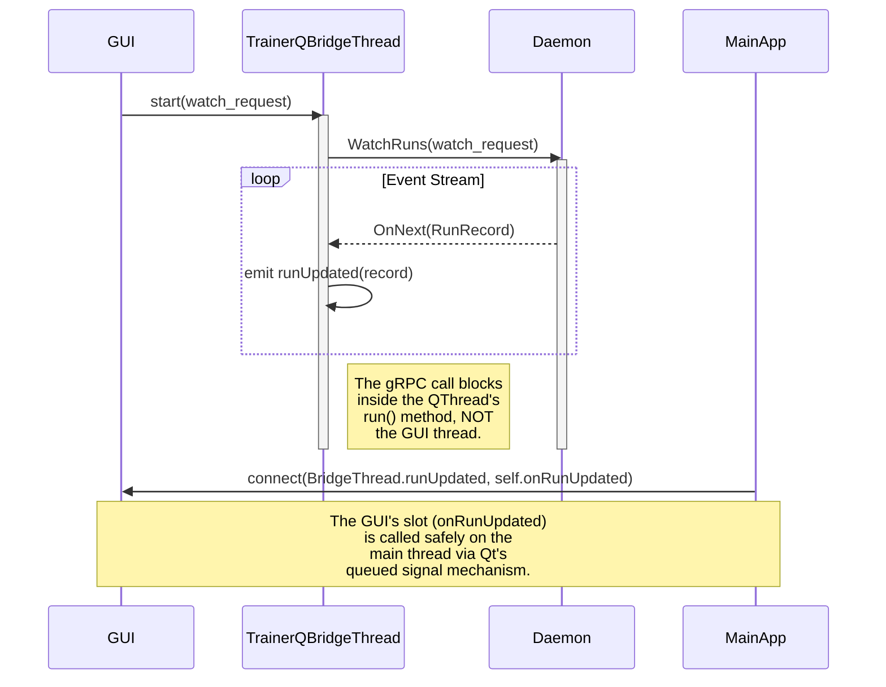

# Trainer Orchestrator: Phase 1 Completion Report

## 1. Executive Summary

This report details the successful completion of the first phase of the trainer orchestration layer. The primary objective was to establish a robust, decoupled, and resilient foundation for managing long-running training jobs, completely independent of the Qt GUI. This phase focused on "pre-GUI hardening," implementing critical features for state management, resource safety, and operational observability.

The system is now architecturally sound, adhering to the principles laid out in the `TRAINER_ORCHESTRATION_BLUEPRINT`. All critical fixes identified in the hardening plan have been implemented and verified. The core components—the Daemon, Dispatcher, Registry, and gRPC Service—are in place, providing a stable platform for the next phase: GUI integration and worker implementation.

## 2. Core Architecture & State of Components

The architecture is designed to isolate the training workload from the user interface, ensuring the GUI remains responsive and that training jobs are managed reliably in the background.

-   **`TrainerDaemon` (`trainer_daemon.py`)**: The central nervous system. It's an `asyncio`-based process that hosts the gRPC server and orchestrates all other components. It ensures it's a singleton using a **cross-platform file lock** (`fcntl` on POSIX, `msvcrt` on Windows), manages the lifecycle of the dispatcher, and handles graceful shutdown.
-   **`RunRegistry` (`registry.py`)**: The source of truth for all run metadata. It uses **SQLite in WAL (Write-Ahead Logging) mode** for high-throughput, concurrent writes without blocking readers. All interactions are thread-safe.
-   **`TrainerService` (`service.py`)**: The public-facing API layer, implemented via gRPC. It translates Protobuf messages into actions, interacts with the registry and dispatcher, and streams status updates back to clients. It is now defensively coded against unknown enum values.
-   **`TrainerDispatcher` (`dispatcher.py`)**: **(Framework Complete)** This is a significant addition in Phase 1. It's a dedicated async component whose framework is now in place to manage the complete lifecycle of a training run. Its full implementation is the core of Phase 2, but the current structure is designed for:
    -   Polling the registry for `PENDING` jobs.
    -   Allocating GPU resources.
    -   Spawning the worker as an isolated subprocess.
    -   Asynchronously streaming `stdout`/`stderr` (see `references/asyncio_subprocess_deadlock.md`).
    -   Monitoring for heartbeats and terminating zombie workers.
-   **`RunEventBroadcaster` (`service.py`)**: A pub/sub mechanism that allows multiple clients to receive real-time updates. It now detects when a listener's queue is full and **logs a warning**, providing crucial visibility into backpressure from slow consumers (see `references/zeromq_chapter5_pub_sub.md`).

## 3. Phase 1 Hardening: Key Achievements

Based on the `1.0_DAY_7_TRAINER_ORCHESTRATION_PRE_GUI_FIXES.md` summary and recent fixes, the following critical guardrails are now in place:

1.  **Cross-Platform Singleton Lock**: The `TrainerDaemon` now uses a platform-aware advisory file lock (`fcntl.flock` on POSIX, `msvcrt.locking` on Windows) to ensure only one instance can run, making it robust across different development environments.
2.  **Robust Dependency Version Checking**: The daemon startup sequence now uses the `packaging` library to compare `grpc` and `protobuf` versions, preventing incorrect behavior that can arise from simple string comparisons (e.g., "1.9" vs. "1.67").
3.  **Digest-Based Deduplication**: The `RunRegistry` uses a SHA-256 digest of the run configuration to enforce uniqueness. This makes the `SubmitRun` operation idempotent, preventing accidental duplicate training jobs.
4.  **Transaction Guards in Registry**: The `claim_gpu_slot` method wraps its database operations in a `BEGIN IMMEDIATE` transaction. This prevents race conditions during GPU allocation, a critical step for future multi-client or multi-daemon scenarios.
5.  **Broadcaster Backpressure Warnings**: The `RunEventBroadcaster` now detects and logs a warning when a subscriber's queue is full, making it possible to diagnose slow or stuck clients that could otherwise cause silent data loss.
6.  **Defensive Enum Mapping**: The gRPC service layer no longer crashes on unknown enum values from newer clients or corrupted data, making the API more robust to future evolution.
7.  **Symmetric GPU Release Design**: The architecture ensures that the `TrainerDispatcher` is the single component responsible for both allocating and releasing GPU slots, guaranteeing that resources are reclaimed upon *any* terminal state (`COMPLETED`, `FAILED`, `CANCELLED`).
8.  **Worker State Progression Framework**: The `TrainerDispatcher` provides the foundational structure to reliably move runs from `PENDING` to a terminal state, providing a clear, auditable lifecycle. The implementation of this logic is the focus of Phase 2.

## 4. Deep Dive: Database & Persistence (`RunRegistry`)

The `RunRegistry` has been significantly improved to be both robust and observable.

-   **WAL Mode**: The database is configured with `PRAGMA journal_mode=WAL;` and `PRAGMA synchronous=NORMAL;`. This provides a major performance boost for concurrent reads and writes, as writers no longer block readers. This is essential for allowing the GUI to query run statuses while the dispatcher is actively updating them.
-   **Observability Refactoring**: The dependency on `apsw` was removed. The `wal_checkpoint` method now uses the standard library's `sqlite3` interface to execute `PRAGMA wal_checkpoint(TRUNCATE)`. Crucially, it **captures and logs the `(busy, log_frames, checkpointed_frames)` tuple** returned by this pragma. This provides deep insight into the checkpointing process without requiring a native dependency (see `references/sqlite_wal_checkpointing.md`).
-   **Daemon Integration**: The `TrainerDaemon`'s maintenance loop now calls this checkpoint method periodically. It tracks a `_fallback_full_streak` counter and **logs a warning if `busy > 0` for several consecutive intervals**, indicating a potential stuck reader process is preventing the WAL file from being truncated.

## 5. Deep Dive: API & GUI Bridge (`TrainerService` & `QThread`)

The service contract is defined in `trainer.proto`, which acts as the single source of truth for the API. As noted in `references/protobuf_python_tutorial.md`, this file is used to generate both the server-side stubs (`trainer_pb2_grpc.py`) and the client-side message classes (`trainer_pb2.py`).

### API Surface

-   `SubmitRun(TrainRunConfig)`: Idempotently submits a job.
-   `WatchRuns(WatchRequest)`: Opens a long-lived stream of `RunRecord` updates.
-   `CancelRun(CancelRequest)`: Requests a graceful shutdown of a run.
-   `GetHealth()`: Provides daemon status.

### The Path to GUI Integration

The current architecture is now perfectly positioned for safe GUI integration, following the principles from `references/qt_qthread_doc.md` and the `TRAINER_ORCHESTRATION_BLUEPRINT`.

As planned, we will **not** call the `TrainerClient` directly from the main Qt event loop. Instead, a dedicated `QThread` (`TrainerQBridgeThread`) will be created. This thread's `run()` method will house the blocking `WatchRuns` gRPC call. When the bridge receives an event from the daemon, it will `emit` a Qt signal. The main GUI thread will have a slot connected to this signal, allowing it to update widgets safely without ever performing direct, blocking I/O.

## 6. Next Steps

The successful completion of Phase 1 unlocks the following roadmap items:

1.  **Worker Command Builder**: Implement the logic in `TrainerDispatcher` to correctly parse the `config_json` and build the `python -m <entry_point> ...` command for the worker subprocess.
2.  **GUI Bridge Implementation**: Create the `TrainerQBridgeThread` and connect its signals to the UI to display live run data.
3.  **Artifact & Video Management**: Integrate the `VideoArtifactService` plan from `1.0_DAY_7_GYMNASIUM_RecordVideo_COMPARED_WITH_GYM_GUI.md`. The worker will use `RecordVideo` to create MP4s, and the dispatcher will listen for `VideoAvailable` events to link the video file path to the `RunRecord` in the registry.
4.  **Integration Testing**: Write tests that validate the full lifecycle, including submission, GPU allocation, heartbeat timeouts, and cancellation.
