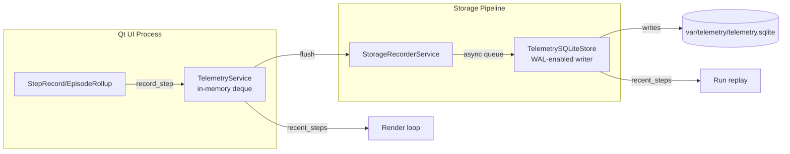
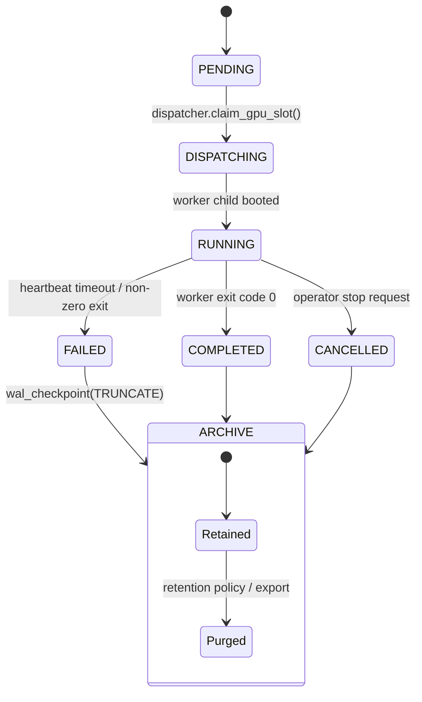

# Day 8 — In-Memory vs SQLite vs MySQL Persistence Notes

## Persistence touchpoints in this repo

| Concern | Default backing | Key files | Notes |
| --- | --- | --- | --- |
| Trainer run registry | SQLite | `gym_gui/services/trainer/registry.py`, `gym_gui/config/paths.py` | Tracks run lifecycle, GPU reservations, WAL checkpoints. |
| Telemetry capture | Dual: in-memory + SQLite | `gym_gui/services/telemetry.py`, `gym_gui/telemetry/sqlite_store.py`, `gym_gui/services/bootstrap.py` | Deques buffer recent events; optional SQLite store persists to disk. |
| Writable directory layout | Filesystem structure | `gym_gui/config/paths.py` | Provides `var/` hierarchy for databases and logs. |

## Service & storage file structure quick map

```text
gym_gui/
  config/
    paths.py                 # Declares VAR_* directories (telemetry, trainer, cache, logs)
  services/
    bootstrap.py             # Wires TelemetryService + TelemetrySQLiteStore at startup
    telemetry.py             # In-memory buffers and hooks into storage
    trainer/
      registry.py            # SQLite-backed RunRegistry for trainer jobs
      dispatcher.py          # Consumes registry rows and spawns workers
  telemetry/
    sqlite_store.py          # Background worker persisting Step/Episode records to SQLite
var/
  telemetry/telemetry.sqlite # Runtime SQLite database for playback + analytics
  trainer/trainer.sqlite     # Run metadata, GPU slot reservations
  logs/                      # JSONL/stdout logs from services
```

## Visual cheat sheets





```mermaid
mindmap
  root((Persistence choice))
    In-memory buffers
      Pros:::green(Zero setup)
      Pros:::green(Millisecond latency)
      Cons:::red(Volatile)
      Cons:::red(Single-process scope)
    SQLite
      Pros:::green(Bundled with Python)
      Pros:::green(WAL + file portability)
      Cons:::orange(Limited concurrent writers)
      Cons:::orange(Raw SQL coupling)
    MySQL / Server DB
      Pros:::green(Scale-out, auth, backups)
      Pros:::green(Multi-tenant friendly)
      Cons:::red(Ops overhead)
      Cons:::red(Requires adapters + network tolerance)

classDef green fill:#d4f8d4,stroke:#2c8d2c,stroke-width:1px
classDef orange fill:#ffecc7,stroke:#c77d1a,stroke-width:1px
classDef red fill:#ffd6d6,stroke:#c72c2c,stroke-width:1px
```

## In-memory stores in the current stack

- **Where they exist:**
  - `TelemetryService` keeps a bounded deque of `StepRecord` and `EpisodeRollup` instances, allowing fast playback and UI refresh without disk I/O.
  - Actor state, renderer registries, and service locator contents remain process-local objects.
  - `gym_gui/cache/memory.py` exposes a `@memoize` decorator (thin `lru_cache` wrapper) so adapters and presenters can memoize deterministic helpers without wiring a separate cache service.
- **Strengths:**
  - Zero external dependencies; perfect for quick iterations and headless unit tests.
  - Low latency when telemetry must drive paint events inside the Qt loop.
- **Limits:**
  - Volatile. Crashes or restarts erase history, making replay or forensic debugging impossible.
  - Single-process scope. No other client (CLI, daemon, notebook) can introspect state if they are not inside the same Python interpreter.
  - Contrarian take: sprinkling `@memoize` everywhere hides cache eviction policy (LRU with fixed maxsize). Without profiling, the decorator can mask hot-path inefficiencies or pin large render payloads in RAM, so every use should document the expected key cardinality.

## SQLite in this project

- **Trainer registry (`registry.py`):**
  - Uses a single-file SQLite database at `gym_gui/var/trainer/trainer.sqlite`.
  - Enables write-ahead logging (WAL) and relaxed sync to balance throughput and integrity.
  - Handles GPU reservations transactionally and prevents duplicate submissions via SHA-256 digests.
- **Telemetry store (`telemetry/sqlite_store.py`):**
  - Asynchronously batches writes from an in-memory queue, offloading disk I/O from the UI thread.
  - Persists steps, episodes, and render payloads while still allowing recent-history queries via SQLite.
- **Why it fits:**
  - Ships with Python, so developers do not need to provision a database server.
  - File-based deployment matches the "learning-first" spirit and keeps artifacts portable under `var/`.

## Contrarian read on the architecture

1. **SQLite everywhere risks tight coupling.** The registry and telemetry store each speak raw SQL. Introducing an interface (e.g., `RunStoreProtocol`) would ease swapping persistence backends if this grows beyond a single developer machine.
2. **Telemetry duplication breeds inconsistency.** Maintaining both an in-memory deque and an async SQLite writer invites subtle drift—especially if future code filters or mutates records before persistence. A shared event bus with clearly defined delivery guarantees could reduce divergence.
3. **`var/` as a catch-all may crumble.** Trainer runs, telemetry, caches, and logs co-exist in the same directory tree. As CleanRL agents start streaming gigabytes of data, storage quotas and cleanup policies must be enforced or the UI will inherit stale metadata.
4. **Network-aware design deferred.** The trainer daemon aspires to service multiple clients, yet the persistence layer still assumes local file access. A remote Qt client or web dashboard would hit a wall without an API that exposes the data beyond SQLite files.
5. **Learning curve tension.** The project optimizes for simplicity (single binaries, local stores), but future Machine Learning workflows crave reproducible, queryable datasets. A deliberate persistence abstraction now would teach better patterns than retrofitting one later.

## Suggested next experiments

- Prototype an in-memory `RunRegistry` implementation for unit tests to ensure the rest of the code does not depend on SQLite-specific behavior.
- Document backup/restore steps for `trainer.sqlite` and `telemetry.sqlite` so learners appreciate durability trade-offs.
- Consider thin repository interfaces around both persistence areas to ease optional MySQL or PostgreSQL adapters when multi-user orchestration becomes non-negotiable.
