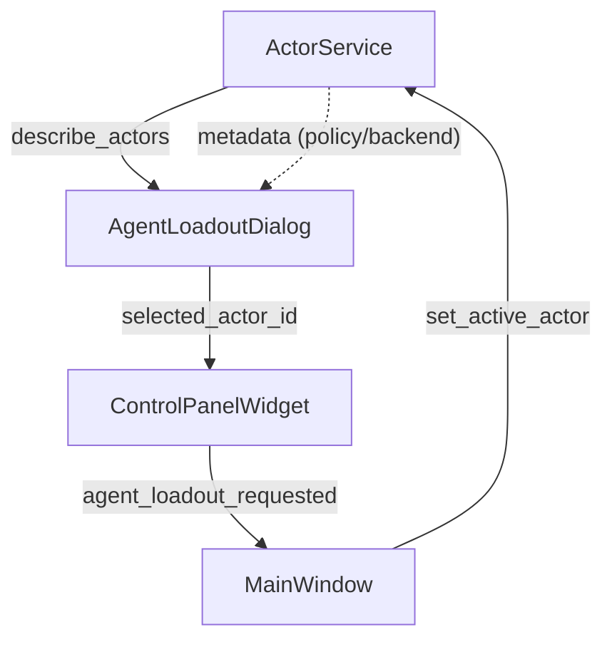

# Day 8 – SPADE-BDI Refactor Notes & Agent Loadout Enhancements

## Snapshot

| Theme | Highlights |
| --- | --- |
| **SPADE-BDI worker refactor** | Reconfirmed import/packaging constraints inside `spadeBDI_RL_refactored`, aligned asset layout with the headless worker plan, and enumerated the next library-first milestones. |
| **Control mode UX** | Broke `AgentLoadoutDialog` out of `MainWindow`, added a metadata-rich detail pane, and persisted future-ready hooks (policy/backend labels) for agent selection. |
| **Roadmap** | Captured short- and mid-term actions for both the worker integration and the Qt list-view redesign that will land in phase 2. |

---

## SPADE-BDI Worker Library Preparation (`spadeBDI_RL_refactored/`)

- **Why the legacy shim stays (for now):** documented that the `sys.path` tweak still shields vendor SPADE modules until the worker becomes a package entry point. The plan is to replace this with an editable install once the refactor stabilises.
- **Asset packaging pass:** inventoried the `.asl` policy files and confirmed they ride inside the refactored package so Docker-based deployments pull rules locally instead of relying on bind mounts.
- **Worker bootstrap outline:** reiterated the library-first approach—`python -m spade_bdi_worker` should load env vars, attach to ejabberd, and stream telemetry JSONL through the shared recorder. The new notes include event hooks we still need to implement (graceful shutdown, WAL flush before exit, error telemetry).
- **Integration checkpoints:** noted the upcoming tasks: expose the worker API through the service locator, unify telemetry schemas with the trainer daemon, and retire the old `runtime/data` write path in favour of `gym_gui/var/`.

---

## Control Mode & Agent Loadout Upgrades (`gym_gui/ui/`)

### What changed today

1. **Modular dialog:** `AgentLoadoutDialog` now lives in `gym_gui/ui/widgets/agent_loadout_dialog.py`, keeping `MainWindow` lean and easier to reason about.
2. **Metadata-rich experience:** the dialog shows display name, actor ID, policy label, backend label, and description for each registered actor. Tooltips mirror the same data for quick scans.
3. **Service metadata surfaced:** `ActorDescriptor` gained `policy_label` and `backend_label`; `bootstrap_default_services()` now annotates human, BDI-Q, and LLM actors with meaningful values so the dialog has real data.
4. **Phase-2 groundwork:** the selection list still uses `QListWidget`, but the new detail pane, persisted mode preference, and dedicated `agent_loadout_requested` signal give us a clean seam to swap in a model/delegate later.

### Architecture snapshot

---

## Roadmap & Follow-ons

### SPADE-BDI worker

- [ ] Refactor the headless worker into an installable CLI (`python -m spade_bdi_worker.app`).
- [ ] Replace the `sys.path` shim with a standard package import once the CLI lands.
- [ ] Emit structured telemetry (step, episode, error) via the shared JSONL schema so the trainer daemon can ingest it immediately.
- [ ] Document Docker wiring: how the packaged `.asl` assets map into the container and how ejabberd credentials flow via env vars.

### Control mode UI

- [ ] Transition the loadout list to a `QAbstractListModel` + delegate combo that can show policy/backend badges inline.
- [ ] Add filtering/search once the model exists, so large fleets remain manageable.
- [ ] Wire Codacy lint gates around the new widgets once the delegate lands (aligning with repo guardrails).
- [ ] Extend telemetry stats in the detail pane (e.g., last run seed, success rate) after the trainer bridge exposes that data.

---

## References

- `gym_gui/services/actor.py` – source of truth for `ActorDescriptor` metadata and active actor selection.
- `gym_gui/services/bootstrap.py` – default registration site where new agents should set policy/backend labels.
- `gym_gui/ui/widgets/agent_loadout_dialog.py` – updated dialog implementation with detail pane and selection logic.
- `spadeBDI_RL_refactored/` – refactor workspace for the SPADE-BDI worker and packaged ASL assets.

> ✅ Today’s work keeps the UI trim, exposes richer agent context, and documents the remaining lift to finalize the SPADE-BDI worker pipeline. Phase 2 can now plug in the model/delegate list view without revisiting existing consumers or risking regressions in the control panel.
