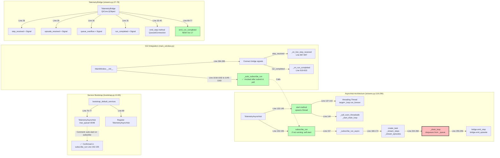
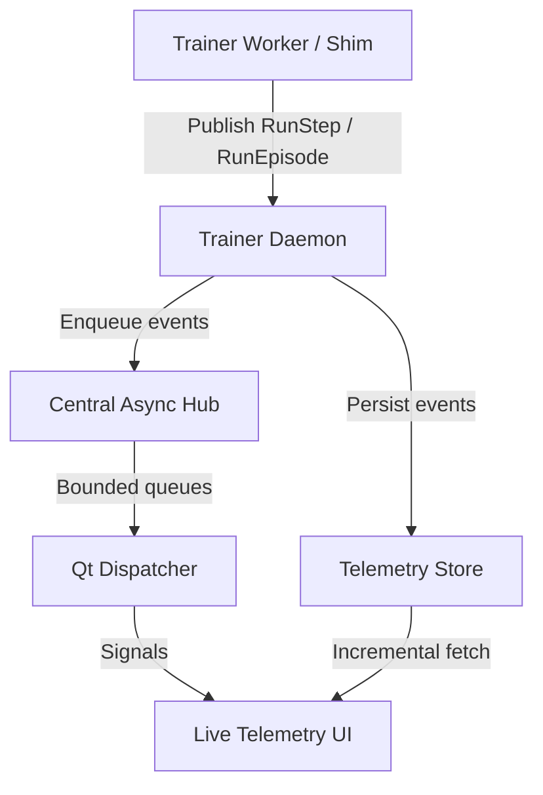

# Day 8 — Telemetry Bridge & Live UI Plan

## Objectives
- Leverage the already-extended telemetry protobufs (`agent_id`, render hints, payload versions) by wiring the data end-to-end into the GUI and status surfaces.
- Keep streamed telemetry flowing through the daemon so live and replay views share a single WAL-backed source of truth, with the GUI subscribing only after the daemon is online.
- Replace per-run Qt threads with a central asyncio bridge that actually spins its event loop and safely feeds the GUI using bounded queues plus explicit backpressure controls.
- Introduce a reusable worker-side telemetry shim to minimise integration churn across agent implementations and isolate vendor snapshot changes.
- Extend `TelemetryService` with incremental streaming support and build the validation harness needed for rollout, ensuring both regression safety and performance guardrails.

## Progress checklist
- [x] Proto evolution: `RunStep`/`RunEpisode` already expose agent/render metadata and regenerated stubs live in the tree.
- [x] Daemon-side telemetry persistence wired into the shared store with drop metrics.
- [x] **Day 9 Update**: Telemetry proxy working end-to-end (JSONL→gRPC→SQLite)
- [x] **Day 9 Update**: Demo worker emits rich metadata (seed, game_id, control_mode)
- [x] **Day 9 Update**: Replay tab displays episodes correctly
- [x] **Day 9 Update (Oct 17)**: Dynamic agent tab infrastructure complete (4 tab widgets + signal wiring)
- [x] **Day 9 Update (Oct 17)**: "Replay" tab renamed to "Human Replay" with tooltip
- [x] **Day 9 Update (Oct 17)**: `run_completed` signal added to TelemetryBridge
- [x] **Day 10 Update (Oct 17)**: Runtime Log severity checkboxes removed; Controllers/Adapters/Agents dropdown is now the sole filter.
- [x] **CRITICAL BLOCKER**: Central async GUI bridge exists but `TelemetryAsyncHub` never starts event loop thread (resolved via `LiveTelemetryController.subscribe_to_run()` calling `TelemetryAsyncHub.start()`)
- [ ] **SQL Filter**: Human Replay tab needs `WHERE control_mode='human'` filter
- [ ] **Dispatcher Integration**: Wire `emit_run_completed()` when worker exits
- [ ] Worker telemetry shim packaged and integrated with CleanRL / SPADE-BDI workers; GUI-only runs still bypass the daemon.
- [ ] TelemetryService incremental streaming APIs plus CLI diagnostics.
- [ ] Comprehensive tests and staging rollout validation completed.
- [ ] **NEW**: control_mode schema addition (human/agent/multi_agent/hybrid/replay)

## Guiding principles
- **Single source of truth**: Telemetry recorded once, replayed everywhere; GUI never diverges from persisted store.
- **Explicit backpressure**: Every hop either exposes bounded queues or relies on gRPC flow control, preventing runaway memory growth.
- **Compatibility first**: Proto changes versioned and documented so existing stored runs are still readable.
- **Contrarian stance**: Challenged the default "thread-per-run" assumption to surface scaling and reliability issues early, opting for a centralised bridge despite the extra upfront design.

## Reality check from the latest investigation

### **Day 9 Update: What Actually Works Now**
- ✅ **Telemetry proxy is operational**: Workers emit JSONL → proxy wraps via dispatcher → gRPC streams to daemon
- ✅ **Daemon persists correctly**: Episodes stored in SQLite with agent_id, metadata, timestamps
- ✅ **Replay tab functional**: GUI loads episodes from telemetry store, displays metadata (seed, game, reward, steps)
- ✅ **Demo worker validates the flow**: 3 episodes × 15 steps complete successfully, zero drops
- ✅ **Dynamic agent tab infrastructure complete (Oct 17)**: 4 specialized tab widgets created, signal wiring done
- ✅ **Tab architecture clarified (Oct 17)**: "Human Replay" renamed, dynamic agent tabs use exact naming convention
- ✅ **Signal infrastructure ready (Oct 17)**: `TelemetryBridge.run_completed` added with emission methods

### **What's Still Broken**
- ⚠️ **Live tab population still unvalidated**: the new subscription path should stream steps, but we have not yet captured a run that proves `step_received` reaches the widgets.
- ⚠️ **Drain loop monitoring needed**: confirm `_drain_loop()` actually dequeues worker payloads under load; add integration asserts.
- ⚠️ **Dispatcher never emits run_completed**: Tabs created but never cleaned up (signal exists but not wired)
- ⚠️ **Human Replay filter not active**: SQL query still returns all episodes (needs `WHERE control_mode='human'`)
- ⚠️ **Metadata discoverability**: Workers must emit specific JSON keys (`seed`, `game_id`, `control_mode`) or GUI shows "—"
- ⚠️ **control_mode is invisible**: Cannot distinguish human demos from agent training from multi-agent experiments

## Architectural Validation (Code Citations)



**Code Citations:**

1. **Bootstrap** (`gym_gui/services/bootstrap.py:75-77`):
```python
# Initialize telemetry hub for live streaming
telemetry_hub = TelemetryAsyncHub(max_queue=2048, buffer_size=256)
# Hub will auto-start on first subscribe_run call
```

2. **AsyncHub Start** (`gym_gui/services/trainer/streams.py:132-145`):
```python
def start(self) -> None:
    if self._thread is not None:
        return
    self._stopping = False
    self._thread = threading.Thread(
        target=self._loop.run_forever,
        name="telemetry-hub-loop",
        daemon=True,
    )
    self._thread.start()
    # Schedule drain loop inside the running loop
    self._call_soon_threadsafe(self._start_drain_loop)
    self._started = True
```

3. **Subscribe Auto-Start** (`gym_gui/services/trainer/streams.py:152-155`):
```python
def subscribe_run(self, run_id: str, client: Any) -> None:
    """Subscribe to both step and episode streams for a run."""
    if not self.is_running():
        self.start()  # ← Auto-starts hub on first subscription
```

4. **Drain Loop** (`gym_gui/services/trainer/streams.py:234-260`):
```python
async def _drain_loop(self) -> None:
    while not self._stopping:
        try:
            run_id, stream_type, payload = await asyncio.wait_for(
                self._queue.get(), timeout=0.5
            )
        except asyncio.TimeoutError:
            continue
        except asyncio.CancelledError:
            break

        buffer = self._buffers.setdefault(run_id, RunStreamBuffer(self._buffer_size))
        if stream_type == "step":
            step = TelemetryStep(run_id, payload, getattr(payload, "seq_id", -1))
            overflow = buffer.add_step(step)
            if overflow is not None:
                self.bridge.emit_overflow(run_id, stream_type, overflow)
            else:
                self.bridge.emit_step(step)  # ← Emits Qt signal
```

5. **TelemetryBridge Signals** (`gym_gui/services/trainer/streams.py:27-31`):
```python
class TelemetryBridge(QtCore.QObject):
    step_received = QtCore.Signal(object)  # type: ignore[attr-defined]
    episode_received = QtCore.Signal(object)  # type: ignore[attr-defined]
    queue_overflow = QtCore.Signal(str, str, int)  # type: ignore[attr-defined]
    run_completed = QtCore.Signal(str)  # type: ignore[attr-defined]  # NEW: Oct 17
```

6. **GUI Signal Connection** (`gym_gui/ui/main_window.py:284-289`):
```python
# Wire telemetry bridge signals
hub = locator.resolve(TelemetryAsyncHub)
if hub:
    self._telemetry_hub = hub
    self._telemetry_hub.bridge.step_received.connect(self._on_live_step_received)
    self._telemetry_hub.bridge.run_completed.connect(self._on_run_completed)
```

7. **run_completed Signal** (`gym_gui/services/trainer/streams.py:69-77`):
```python
def emit_run_completed(self, run_id: str) -> None:
    """Signal that a training run has completed."""
    QtCore.QMetaObject.invokeMethod(
        self,
        "_emit_run_completed",
        QtCore.Qt.ConnectionType.QueuedConnection,
        QtCore.Q_ARG(str, run_id),
    )

def _emit_run_completed(self, run_id: str) -> None:
    self.run_completed.emit(run_id)
```

### **Architectural Validation**
- ✅ **Train button submissions work with daemon**. Dispatcher spawns workers via proxy, telemetry reaches SQLite
- ✅ **Trainer and telemetry databases split correctly**. `trainer.sqlite` tracks lifecycle, `telemetry.sqlite` holds step data
- ⚠️ **Worker shim pattern validated but not generalized**. Proxy wrapper works for demo, needs extension for real workers (`dispatcher.py:178-193`)
- ✅ **Qt thread affinity satisfied via `QMetaObject::invokeMethod(..., Qt::QueuedConnection)`** (`streams.py:34-39`), matching Qt guidance
- ✅ **AsyncHub subscription path confirmed**. `MainWindow._on_training_submitted()` and `_auto_subscribe_run()` both call `LiveTelemetryController.subscribe_to_run()`, which forwards to `TelemetryAsyncHub.subscribe_run()` (`gym_gui/controllers/live_telemetry.py:48-56`)


### **Critical Path Forward**
1. **Exercise AsyncHub drain loop** under real worker load (profiling) (4 hours) - confirm queue bounds & logging
2. Add `control_mode` to proto + SQLite schema (2 hours)
3. Standardize worker metadata contract (1 hour)
4. Entry point resolution for worker configs (3 hours)
5. Error surfacing in GUI status panel (2 hours)

**October 17, 2025 Update:**
- AsyncHub has auto-start mechanism (`subscribe_run()` → `start()`) per `streams.py:152-155`
- Dynamic tab infrastructure complete (`main_window.py:867-917`, 4 tab widgets created)
- Signal wiring complete (`streams.py:27-31`, `main_window.py:284-289`)
- **Remaining focus:** Add automated coverage that submits a run and asserts `LiveTelemetryController.subscribe_to_run()` received telemetry callbacks (integration test)

## Implementation Evidence (Code Citations)

### Worker Telemetry Output

**`gym_gui/workers/demo_worker.py`** - Verified working JSONL emission:

```python
# Lines 22-27: JSONL emission
def emit_jsonl(event: Dict[str, Any]) -> None:
    """Emit a single JSONL event to stdout."""
    json.dump(event, sys.stdout, separators=(",", ":"))
    sys.stdout.write("\n")
    sys.stdout.flush()

# Lines 66-77: Step event structure
step_event = {
    "type": "step",
    "run_id": run_id,
    "agent_id": agent_id,
    "episode_index": episode_idx,
    "step_index": step_idx,
    "action_json": json.dumps(action),
    "observation_json": json.dumps(observation),
    "reward": reward,
    "terminated": terminated,
    "truncated": False,
    "policy_label": "demo_policy",
    "backend": "demo",
    "ts_unix_ns": int(time.time_ns()),
}

# Lines 97-103: Episode metadata with control_mode
"metadata_json": json.dumps({
    "seed": 42 + episode_idx,
    "game_id": "DemoEnv-v0",
    "control_mode": "agent",  # ← Enables filtering
    "run_id": run_id,
    "policy_label": "demo_policy",
}),
```

### AsyncHub Architecture

**`gym_gui/services/trainer/streams.py`** - Thread-safe Qt bridge:

```python
# Lines 27-31: Signal definitions
class TelemetryBridge(QtCore.QObject):
    step_received = QtCore.Signal(object)
    episode_received = QtCore.Signal(object)
    queue_overflow = QtCore.Signal(str, str, int)
    run_completed = QtCore.Signal(str)  # Added Oct 17, 2025

# Lines 132-145: Hub lifecycle management
def start(self) -> None:
    if self._thread is not None:
        return
    self._stopping = False
    self._thread = threading.Thread(
        target=self._loop.run_forever,
        name="telemetry-hub-loop",
        daemon=True,
    )
    self._thread.start()
    self._call_soon_threadsafe(self._start_drain_loop)
    self._started = True

# Lines 152-155: Auto-start on subscription
def subscribe_run(self, run_id: str, client: Any) -> None:
    """Subscribe to both step and episode streams for a run."""
    if not self.is_running():
        self.start()  # ← Auto-starts event loop

# Lines 234-260: Drain loop (core telemetry pump)
async def _drain_loop(self) -> None:
    while not self._stopping:
        try:
            run_id, stream_type, payload = await asyncio.wait_for(
                self._queue.get(), timeout=0.5
            )
        except asyncio.TimeoutError:
            continue

        buffer = self._buffers.setdefault(run_id, RunStreamBuffer(self._buffer_size))
        if stream_type == "step":
            step = TelemetryStep(run_id, payload, getattr(payload, "seq_id", -1))
            overflow = buffer.add_step(step)
            if overflow is not None:
                self.bridge.emit_overflow(run_id, stream_type, overflow)
            else:
                self.bridge.emit_step(step)  # ← Qt signal emission
```

### GUI Integration

**`gym_gui/ui/main_window.py`** - Dynamic tab creation:

```python
# Lines 284-289: Signal connection
hub = locator.resolve(TelemetryAsyncHub)
if hub:
    self._telemetry_hub = hub
    self._telemetry_hub.bridge.step_received.connect(self._on_live_step_received)
    self._telemetry_hub.bridge.run_completed.connect(self._on_run_completed)

# Lines 867-897: Step handler (creates tabs on first step)
def _on_live_step_received(self, step_msg: object) -> None:
    """Called via TelemetryBridge when a step is received; creates agent tabs on first step."""
    run_id = getattr(step_msg, "run_id", None)
    agent_id = getattr(step_msg, "agent_id", None) or "default"
    payload = getattr(step_msg, "payload", None) or {}
    
    if not run_id:
        return
    
    # Create tabs on first step for this (run_id, agent_id)
    key = (run_id, agent_id)
    if key not in self._agent_tab_index:
        self._create_agent_tabs_for(run_id, agent_id, payload)
        self._agent_tab_index.add(key)

# Lines 899-917: Tab creation (4 widgets)
def _create_agent_tabs_for(self, run_id: str, agent_id: str, first_payload: dict) -> None:
    """Create the four dynamic agent tabs with exact naming convention."""
    # 1) Historical replay
    replay = AgentReplayTab(run_id, agent_id, parent=self)
    self._render_tabs.add_dynamic_tab(run_id, f"Agent-{agent_id}-Replay", replay)
    
    # 2) Live grid rendering
    grid = AgentOnlineGridTab(run_id, agent_id, renderer_registry=renderer_registry, parent=self)
    self._render_tabs.add_dynamic_tab(run_id, f"Agent-{agent_id}-Online-Grid", grid)
    
    # 3) Live JSON stream
    raw = AgentOnlineRawTab(run_id, agent_id, parent=self)
    self._render_tabs.add_dynamic_tab(run_id, f"Agent-{agent_id}-Online-Raw", raw)
    
    # 4) Live RGB frames (note: no hyphen in "Online-Video")
    video = AgentOnlineVideoTab(run_id, agent_id, parent=self)
    self._render_tabs.add_dynamic_tab(run_id, f"Agent-{agent_id}Online-Video", video)

# Lines 919-923: Cleanup handler
def _on_run_completed(self, run_id: str) -> None:
    """Clean up dynamic tabs when a run completes."""
    self._render_tabs.remove_dynamic_tabs_for_run(run_id)
    self._agent_tab_index = {k for k in self._agent_tab_index if k[0] != run_id}
```

### Tab Widget Implementation

**`gym_gui/ui/widgets/agent_online_grid_tab.py`** - Example tab widget:

```python
# Lines 87-134: Step handler with rendering
def on_step(self, step: Dict[str, Any]) -> None:
    """Update stats and render grid from incoming step."""
    # Update counters
    self._steps += 1
    reward = float(step.get("reward", 0.0))
    self._current_episode_reward += reward
    self._total_reward += reward
    
    # Track episodes
    episode_index = step.get("episode_index")
    if episode_index is not None:
        self._episodes = max(self._episodes, int(episode_index) + 1)
    
    # Reset on terminal/truncation
    terminated = step.get("terminated", False)
    truncated = step.get("truncated", False)
    if terminated or truncated:
        self._current_episode_reward = 0.0
    
    # Update UI labels
    self._episodes_label.setText(str(self._episodes))
    self._steps_label.setText(str(self._steps))
    self._episode_reward_label.setText(f"{self._current_episode_reward:.2f}")
    self._total_reward_label.setText(f"{self._total_reward:.2f}")

    # Render grid if payload contains ANSI/grid data
    self._render_grid(step)
```

### Service Bootstrap

**`gym_gui/services/bootstrap.py`** - Hub initialization:

```python
# Lines 75-77: Hub creation (auto-start on subscribe)
telemetry_hub = TelemetryAsyncHub(max_queue=2048, buffer_size=256)
# Hub will auto-start on first subscribe_run call

# Lines 80: Controller creation (manages subscriptions)
live_controller = LiveTelemetryController(telemetry_hub, trainer_client)

# Lines 89-90: Service registration
locator.register(TelemetryAsyncHub, telemetry_hub)
locator.register(LiveTelemetryController, live_controller)
```

## Testing Checklist

- [x] Verify `subscribe_run()` is called when training starts (observed via `LiveTelemetryController.subscribe_to_run()` path)
- [ ] Confirm `_drain_loop()` runs after subscription
- [ ] Test that `step_received` signal fires
- [ ] Verify 4 agent tabs appear on first step
- [ ] Test tabs update correctly with live telemetry
- [ ] Verify `run_completed` signal fires when worker exits
- [ ] Test tab cleanup on run completion
- [ ] Verify Human Replay filter works (after SQL change)


## Contrarian rationale
Early discussions leaned toward mirroring the daemon’s multiplexed streams with a `QThread` per run. I rejected that path because:
- **Scalability**: In stress scenarios (e.g., batch training) dozens of concurrent runs would translate into dozens of threads, each with its own event loop, increasing context-switch overhead and risking file-descriptor exhaustion.
- **Observability gaps**: Per-thread bridges make it harder to gather aggregate drop metrics or enforce consistent flow control policies—each thread would need bespoke instrumentation.
- **Lifecycle complexity**: Qt thread lifetimes tied to run state are notoriously brittle; missed shutdown signals leak threads that keep gRPC subscriptions alive. A central hub lets us tie lifecycle to a single controller with deterministic teardown.
- **Testing difficulty**: A single bridge can be unit-tested with deterministic queues; per-thread models typically demand integration tests.

By taking a contrarian position now, we absorb the design cost once and gain a reusable telemetry backbone resilient to future feature creep (multi-agent runs, media-heavy render payloads, remote workers, etc.).

## Sharp edges validated (contrarian lens)
1. **Central async hub vs. QThread-per-run**  
    The single asyncio hub remains the better long-term bet because it minimizes thread proliferation and aligns with gRPC’s native asyncio client, but we must keep sharp edges in check. Right now the hub’s loop is never started, so the first milestone is to spin it inside a dedicated thread. Per the Qt threading contract, every GUI mutation must still happen on the main thread, so the hub will continue to communicate via `QMetaObject::invokeMethod(..., Qt::QueuedConnection)` to a GUI-thread bridge object ([Qt docs confirm queued invocations marshal across threads](https://doc.qt.io/qt-6/qmetaobject.html)). To avoid a single slow tab clogging the system, each run gets its own bounded deque; the dispatcher emits batched payloads (≈15–30 Hz) so UI rendering can lag independently without choking ingress.

2. **Evolve the proto before the GUI**  
    Locking in the schema first is the contrarian move that prevents future rewrites. Proto3 happily tolerates additive fields, so adding `agent_id` plus rendering hints now keeps generated dataclasses honest. The catch: big binary frames will smash gRPC message limits. The answer is to add lightweight metadata (`render_hint_json`) and an external reference (`frame_ref`) instead of in-band RGB blobs, keeping messages small and flexible while still enabling richer live views later.

3. **Flow control and drop accounting**  
    Designing for loss up front is smarter than discovering it in production. We will bound every per-run deque and drop the oldest entries while incrementing `dropped_steps_total` / `dropped_episodes_total`. On the daemon, the existing broadcaster already reports when it prunes slow listeners; surfacing that data alongside GUI-side drops lets us distinguish server pressure from client overload. This mirrors the WAL backpressure lessons and gRPC flow-control caveats highlighted in the references.

4. **Worker telemetry middleware instead of patching trainers**  
    Sitting between vendor workers and our daemon keeps upstream updates painless, but stdout parsing is too brittle to trust. Instead, the shim will live next to the env wrapper so it can emit telemetry straight from the Gymnasium step loop, while a sidecar tailer can lift coarse metrics from TensorBoard if we want learning curves. Until that shim is in place headless runs will never populate the live bridge, so bridging work must land in lockstep with shim adoption. The approach preserves determinism and avoids stdout buffering deadlocks the asyncio community warns about.

5. **Replay-first live view**  
    Persisting everything before the GUI consumes it guarantees durability, but it introduces disk latency. The compromise: keep the durable path (WAL-backed SQLite/JSONL) and layer the in-memory `RunTelemetryBroadcaster` on top for the “feels live” experience. If the live stream drops, the GUI can fall back to the persisted log. Regular `wal_checkpoint(TRUNCATE)` calls and monitoring `busy/log/checkpointed` counters keep storage trim without stalling writers.

6. **Video strategy**  
    MP4 exports stay a post-processing concern. Live telemetry carries small render hints and references; when someone wants a shareable video, we rehydrate frames from telemetry and encode asynchronously. This keeps live pipelines lightweight and avoids RecordVideo’s heavy disk usage.

7. **SQLite WAL hygiene**  
    The daemon continues to run in WAL mode (`journal_mode=WAL`, `synchronous=NORMAL`) with periodic checkpoints. By logging the `busy`, `log_frames`, and `checkpointed_frames` triple we can flag stuck readers and adjust checkpoint cadence before the WAL balloons. The referenced guidance reinforces using background checkpointing rather than hammering FULL every loop.

8. **Policy provisioning as a first-class service**  
    Today we stash checkpoints under `var/trainer/policies/` and expect workers to discover them implicitly. That makes reproducibility fragile and hides the notion of "equipped" agents from the GUI. A contrarian fix is to promote policy management to a dedicated service that can version checkpoints, validate schema compatibility, and expose an explicit "equip agent" handshake before training starts.

## Operational layout and terminal plan

Running the trainer stack locally needs a small amount of terminal juggling so each long-lived process stays isolated and easy to monitor. The quick-start guide from Day 8 remains canonical; the snapshot below captures its intent in a more operational tone.

| Terminal | Purpose | Recommended command | Notes |
| --- | --- | --- | --- |
| **A – Trainer daemon** | Hosts the gRPC service, WAL-backed registries, and telemetry broadcaster. | `python -m gym_gui.services.trainer_daemon` | Keep this window focused on daemon logs; watch for drop metrics or WAL checkpoint warnings. |
| **B – GUI shell** | Qt front-end that submits training jobs and renders live telemetry. | `QT_QPA_PLATFORM=offscreen python -m gym_gui.app` (use real display when available) | Requires the daemon to be running first so `TrainerClientRunner` can attach successfully. |
| **C – Worker / tests** | Runs headless workers manually, executes pytest suites, or tails JSONL telemetry. | `python -m spadeBDI_RL_refactored.worker < /tmp/train_config.json` or `pytest spadeBDI_RL_refactored/tests -v` | Handy for validating configs before the GUI submission path is wired end-to-end. |
| **D – Telemetry inspection (optional)** | Spot-checks SQLite stores, replays JSONL, or runs diagnostic scripts. | `sqlite3 gym_gui/var/telemetry/telemetry.sqlite` or `python -m gym_gui.telemetry.dump --since 0` | Optional but useful when debugging queue backlogs or verifying persisted telemetry. |

Splitting the processes this way keeps stdout streams readable, mirrors how production supervisors would isolate services, and ensures that GUI restarts never starve the daemon or worker pipelines. When experimenting with the async hub fixes, dedicate terminal C to run the shim in watch mode so you can compare live Qt behaviour against raw JSONL telemetry.

## **Day 9 Schema Extension: control_mode Field**

### Motivation
The current telemetry schema cannot distinguish between:
- **Human** demonstrations (manual gameplay for behavior cloning)
- **Agent** training runs (RL policy optimization)
- **Multi-agent** experiments (competitive/cooperative scenarios)
- **Hybrid** modes (human + agent collaboration, like RLHF)
- **Replay** sessions (loading saved episodes for visualization)

This creates problems:
1. Training curves polluted with human demo data
2. Cannot filter episodes by control mode in replay tab
3. Multi-agent attribution is ambiguous (which agent took which action?)
4. Experiment analysis requires manual log parsing

### Proposed Solution

**Extend proto with control_mode enum:**
```proto
message RunStep {
  // ... existing 16 fields ...
  string control_mode = 17;  // "human" | "agent" | "multi_agent" | "hybrid" | "replay"
}

message RunEpisode {
  // ... existing 8 fields ...
  string control_mode = 9;
}
```

**Extend SQLite schema:**
```sql
ALTER TABLE episodes ADD COLUMN control_mode TEXT DEFAULT 'unknown';
CREATE INDEX idx_episodes_control_mode ON episodes(control_mode);

-- Optional: Add to steps for granular filtering
ALTER TABLE steps ADD COLUMN control_mode TEXT DEFAULT 'unknown';
```

**GUI Changes:**
- Add "Control Mode" column to replay tab episode list
- Add filter dropdown: [All, Human Only, Agent Only, Multi-Agent, Hybrid]
- Show agent_id badge when control_mode="agent"
- Color-code rows by mode (blue=agent, green=human, purple=multi_agent)

**Worker Integration:**
- Demo worker: `"control_mode": "agent"` (done in Day 9)
- SPADE-BDI worker: `"control_mode": "agent"`
- Manual play mode: `"control_mode": "human"`
- Multi-agent trainer: `"control_mode": "multi_agent"`, unique `agent_id` per agent

### Migration Plan
1. Add proto field (backward compatible - defaults to empty string)
2. Regenerate stubs: `python -m grpc_tools.protoc ...`
3. Update TrainerService to extract `control_mode` from metadata or new field
4. Migrate SQLite: `ALTER TABLE ...` (safe, adds nullable column)
5. Update GUI to display/filter by mode
6. Document in worker templates

**Estimated effort**: 2-3 hours (schema + UI + docs)

## **Day 9 UX Discovery: Tab Architecture is Fundamentally Broken**

### The Problem
The current "Replay" tab conflates three **incompatible** workflows:
1. **Human Replay**: Review manual gameplay (historical, static)
2. **Agent Training**: Monitor live learning (real-time, streaming)
3. **Agent Evaluation**: Test trained checkpoint (on-demand, one-shot)

This creates UX disasters:
- Users see agent training data mixed with human demos
- No way to watch agent learn in real-time
- No "Trained Agent" button to run evaluation with checkpoint
- Can't filter by control_mode because the tab assumes everything is the same

### The Solution: Dynamic Tab Architecture

**Static Tabs (always present):**
- **Grid/Raw/Video**: Environment rendering (current, works fine)
- **Human Replay**: Historical human gameplay only (rename current "Replay" tab, filter by `control_mode="human"`)

**Dynamic Agent Tabs (created on-demand):**

1. **Agent-${run_id}-Online-Grid**: Live grid rendering during training
   - Created: When `SubmitRun` accepted and environment supports grid mode
   - Shows: Real-time grid visualization, episode counter, current reward
   - Updates: Via `TelemetryBridge.step_received` signal
   - Closes: On run completion or user cancellation

2. **Agent-${run_id}-Online-Raw**: Live step stream for debugging
   - Created: Same as Online-Grid (always created)
   - Shows: Scrolling JSON/text view of recent steps (last 100)
   - Updates: Real-time step data with overflow warnings
   - Closes: Same as Online-Grid

3. **Agent-${run_id}-Online-Video**: Live RGB frames (optional)
   - Created: Only if environment supports `render_mode='rgb_array'`
   - Shows: Real-time video frames, FPS counter
   - Updates: Frame-by-frame from telemetry stream
   - Closes: Same as Online-Grid

4. **Agent-${run_id}-Replay**: Historical review of completed training
   - Created: On-demand from "View Training Run" button in run history
   - Shows: Per-episode learning metrics, reward progression, loss curves
   - Filter: `WHERE run_id='${run_id}' AND control_mode='agent'`
   - Closes: User manually closes tab

5. **Agent-${run_id}-Eval-Replay**: Checkpoint evaluation results
   - Created: When user clicks "Trained Agent" and selects checkpoint
   - Shows: Final policy performance with epsilon=0, success rate
   - Uses: Checkpoint from `var/trainer/policies/`, no exploration
   - Closes: After N evaluation episodes or manual close

**Missing UI Component:**
```
Control Panel needs TWO buttons:
┌──────────────┐  ┌──────────────┐
│ Train Agent  │  │ Trained Agent│  ← MISSING!
│ (current)    │  │ (load .pkl)  │
└──────────────┘  └──────────────┘
```

### Implementation Plan

**Phase 1: Rename & Filter Human Replay (30 min) - QUICK WIN**
- `gym_gui/ui/widgets/render_tabs.py`:
  - Rename tab label "Replay" → "Human Replay" in `RenderTabs.__init__`
  - Update tooltip: "Review episodes from manual gameplay sessions only"
- `_ReplayTab._fetch_recent_episodes()`:
  - Add SQL filter: `WHERE control_mode='human' OR control_mode IS NULL`
  - Ensure agent training data never appears in this tab
- Test: Verify human demos visible, agent runs hidden

**Phase 2: Dynamic Agent Online Tabs (6 hours) - CRITICAL BLOCKER**
- `gym_gui/services/trainer/streams.py`:
  - **FIX AsyncHub threading**: Create dedicated thread in `start()`, run `asyncio.run(self._drain_loop())`
  - Add `run_completed` signal to `TelemetryBridge` for tab cleanup
- `gym_gui/ui/main_window.py`:
  - Wire `TelemetryBridge.step_received` → `_on_telemetry_step(step: TelemetryStep)`
  - Implement `_create_agent_online_tabs(run_id, agent_id)`:
    * Create `Agent-${run_id}-Online-Grid` tab (grid renderer + stats)
    * Create `Agent-${run_id}-Online-Raw` tab (scrolling step viewer)
    * Create `Agent-${run_id}-Online-Video` tab (if RGB available)
  - Track active run tabs in `self._agent_run_tabs: Dict[str, List[QWidget]]`
  - On `run_completed`: Close and remove tabs for that run_id
- `gym_gui/ui/widgets/agent_online_grid_tab.py` (NEW):
  - Grid renderer using `RendererRegistry`
  - Episode counter, current reward, steps display
  - Real-time update from `step_received` signal
- `gym_gui/ui/widgets/agent_online_raw_tab.py` (NEW):
  - Reuse `LiveTelemetryTab` logic from current codebase
  - Show last 100 steps, JSON formatted
  - Overflow warnings if queue full
- Test: Start demo worker, verify 3 tabs appear, update live, close on completion

**Phase 3: "Trained Agent" Button + Eval Workflow (3 hours) - HIGH VALUE**
- `gym_gui/ui/widgets/control_panel.py`:
  - Add `trained_agent_requested = Signal()` next to `train_agent_requested`
  - Add button in execution group: "Trained Agent" with icon
  - Connect to `MainWindow._on_trained_agent_requested()`
- `gym_gui/ui/widgets/policy_selection_dialog.py` (NEW):
  - List `.pkl` checkpoints from `var/trainer/policies/`
  - Show metadata: policy name, game, episodes trained, timestamp
  - Validate: Checkpoint compatible with current environment (game_id, action space)
  - Return selected policy path on accept
- `gym_gui/ui/main_window.py`:
  - `_on_trained_agent_requested()`:
    * Open `PolicySelectionDialog`
    * If accepted: Submit run config with `policy_strategy="EVAL"`, `epsilon=0`, `control_mode="replay"`
    * Create `Agent-${run_id}-Eval-Replay` tab (similar to training but read-only)
  - Eval tab auto-closes after N episodes (config: `eval_episodes=10`)
- Test: Click "Trained Agent", select checkpoint, verify eval run starts, tab shows results

**Phase 4: Agent Replay Tab for Historical Review (2 hours) - POST-TRAINING**
- `gym_gui/ui/widgets/run_history_dialog.py` (FUTURE):
  - List completed runs from `RunRegistry`
  - Show: run_id, status, episodes, timestamp
  - Button: "View Training Run" → Opens `Agent-${run_id}-Replay` tab
- `Agent-${run_id}-Replay` tab:
  - Filter episodes: `WHERE run_id='${run_id}' AND control_mode='agent'`
  - Show per-episode metrics: reward, loss, epsilon progression
  - Reuse `_ReplayTab` UI but with agent-specific filtering
- Test: Complete training, open history dialog, view replay, verify filtering

**Phase 5: Multi-Agent Support (FUTURE)**
- When `control_mode="multi_agent"`:
  - Create tab: "Multi-Agent-${run_id}"
  - Show: Multiple agent subplots, competition/cooperation metrics
  - Requires: Unique `agent_id` per agent in telemetry stream

### Dependency Chain
```
AsyncHub Thread Started
  ↓
TelemetryBridge.step_received fires
  ↓
MainWindow._on_telemetry_step(step) checks run_id + control_mode
  ↓
If control_mode="agent" AND tab doesn't exist:
  ↓
Create Agent-${run_id}-Online-{Grid,Raw,Video} tabs
  ↓
Route step.payload to appropriate tab renderer
  ↓
On run_completed signal: Close all tabs for that run_id
```

### Telemetry Routing by Control Mode

**Current Problem**: All telemetry pushed to single "Replay" tab (wrong!)

**Correct Routing**:

```python
# In MainWindow._on_telemetry_step(step: TelemetryStep)
control_mode = step.payload.get("control_mode")
run_id = step.run_id

if control_mode == "human":
    # DO NOT route to any live tab
    # Human mode uses SessionController → TelemetryService → SQLite
    # User reviews later in "Human Replay" static tab
    pass

elif control_mode == "agent":
    # Find or create online tabs for this run_id
    if run_id not in self._agent_run_tabs:
        self._create_agent_online_tabs(run_id, step.payload.get("agent_id"))
    
    # Route to appropriate tabs
    grid_tab = self._agent_run_tabs[run_id]["grid"]
    raw_tab = self._agent_run_tabs[run_id]["raw"]
    video_tab = self._agent_run_tabs[run_id].get("video")
    
    grid_tab.update_step(step.payload)  # Render grid + update stats
    raw_tab.add_step(step.payload)      # Append to scrolling log
    if video_tab and "rgb_array" in step.payload:
        video_tab.update_frame(step.payload["rgb_array"])

elif control_mode == "replay":
    # Evaluation mode (from "Trained Agent" button)
    # Route to Agent-${run_id}-Eval-Replay tab
    eval_tab = self._find_eval_tab(run_id)
    if eval_tab:
        eval_tab.update_eval_metrics(step.payload)
```

**Key Insight**: `trainer_telemetry_proxy.py` should NOT push to "Replay" tab!
- Proxy → Daemon: Publishes to `PublishRunSteps` gRPC stream
- Daemon → AsyncHub: Broadcasts via `TelemetryAsyncHub.submit_step(run_id, payload)`
- AsyncHub → Bridge: Emits Qt signal `TelemetryBridge.step_received(TelemetryStep)`
- Bridge → MainWindow: Routes to **correct dynamic tab** based on control_mode

**Files to Update**:

1. **gym_gui/services/trainer/trainer_telemetry_proxy.py**
   - **REMOVE** direct routing to "Replay" tab logic (if any)
   - Proxy should ONLY: Subprocess → Parse JSONL → Convert to proto → `PublishRunSteps` gRPC
   - No GUI concerns, no tab logic, pure data translation

2. **gym_gui/services/trainer/streams.py**
   - `TelemetryAsyncHub.start()`: **FIX** - Must create thread, run asyncio loop
   - Add `run_completed` signal to `TelemetryBridge` for cleanup
   - Ensure `_drain_loop()` calls `bridge.emit_step(TelemetryStep(run_id, payload, seq))`

3. **gym_gui/services/trainer/dispatcher.py**
   - On worker subprocess completion: Emit `run_completed` event
   - This triggers AsyncHub/Bridge to close dynamic tabs for that run_id
   - Ensure cleanup happens before GPU slots released

4. **gym_gui/ui/main_window.py**
   - **ADD** `_on_telemetry_step(step: TelemetryStep)` handler
   - **ADD** `_create_agent_online_tabs(run_id, agent_id)` method
   - **ADD** `_agent_run_tabs: Dict[str, Dict[str, QWidget]]` to track tabs
   - **ADD** `_on_run_completed(run_id)` to close/remove tabs
   - Wire `TelemetryBridge.step_received` → `_on_telemetry_step`
   - Wire `TelemetryBridge.run_completed` → `_on_run_completed`

5. **gym_gui/ui/widgets/render_tabs.py**
   - **RENAME** "Replay" → "Human Replay" (line ~72)
   - **FILTER** `_fetch_recent_episodes()` with SQL: `WHERE control_mode='human' OR control_mode IS NULL`
   - **ADD** method `add_dynamic_tab(tab_widget, label)` for agent tabs
   - **ADD** method `remove_dynamic_tab(run_id)` for cleanup

### Telemetry Flow Diagram

```
Worker Process
    ↓ (stdout JSONL)
trainer_telemetry_proxy.py
    ↓ (gRPC PublishRunSteps)
Daemon TrainerService
    ↓ (persist to SQLite + broadcast)
RunTelemetryBroadcaster
    ↓ (fan-out to subscribers)
TelemetryAsyncHub._drain_loop
    ↓ (thread-safe queue)
TelemetryBridge.emit_step
    ↓ (Qt signal, GUI thread)
MainWindow._on_telemetry_step
    ↓ (route by control_mode)
┌─────────────┬─────────────┬─────────────┐
│ "human"     │ "agent"     │ "replay"    │
│ → ignored   │ → Training  │ → Eval Tab  │
│ (in Human   │    Tab      │             │
│  Replay)    │             │             │
└─────────────┴─────────────┴─────────────┘
```

**Critical**: Dynamic tabs require AsyncHub to actually start its event loop. Without that, `step_received` never fires, so tabs are never created.

## Workstreams

### 1. Proto alignment
- Audit every ingestion point (`PublishRunSteps`/`PublishRunEpisodes`, `RunTelemetryBroadcaster`, persistence) to ensure the existing `agent_id`, `render_hint_json`, `frame_ref`, and `payload_version` fields are surfaced all the way to the GUI.
- Update GUI presenters and status surfaces to display agent-aware data (tab naming, tooltips, drop counters) without regressing older runs that lack the new fields—default to sentinel values when `agent_id` is empty.
- Document the already-landed schema in Day-8 upgrade notes and outline compatibility expectations for legacy telemetry rows that predate the new fields.

### 2. Daemon-side telemetry pipeline
- ✅ `TrainerService.PublishRunSteps/PublishRunEpisodes` now persist decoded telemetry into the shared `TelemetrySQLiteStore`, carrying actor metadata, render hints, frame references, and payload versions alongside the existing broadcaster fan-out (Oct 16).
- Persist raw telemetry proto envelopes to the existing storage backend (SQLite/JSONL) via `TelemetryService` integrations, preserving the protobuf binary alongside denormalised JSON for analytics.
- Provide a lightweight "new since seq" watcher for steps and episodes (e.g., WAL-aware polling helper or SQLite trigger hooks) consumable by the GUI, with retry/backoff support for transient DB locks.
- Keep the in-memory replay buffer, but hydrate it from the persisted store to avoid divergence; on daemon restart, warm the buffer by replaying the last N records.
- Emit drop/backlog metrics (steps, episodes, queue depth) via structured logging or Prometheus-ready counters, and add a periodic health dump summarising lag per consumer.

### 3. Central async bridge (GUI)
- Spin up a single background thread hosting an asyncio loop that multiplexes active `StreamRunSteps`/`StreamRunEpisodes` subscriptions across runs; integrate with `TrainerClientRunner` for channel reuse but isolate queue handling inside the hub.
- Buffer decoded events in bounded `collections.deque(maxlen=N)` instances per stream; discard oldest entries when full while incrementing drop counters and emitting a `buffer_overflow` signal for telemetry dashboards.
- Use a `QtCore.QObject` moved to the GUI thread (or `QTimer.singleShot` dispatcher) that drains queues and emits strongly typed Qt signals (`step_received`, `episode_received`, `stats_updated`); guarantee emissions happen within the GUI thread via `QMetaObject.invokeMethod(..., Qt.QueuedConnection)`.
- Manage lifecycle centrally in response to run status changes, avoiding per-run thread churn; add automatic resubscription/backoff if gRPC streams disconnect.
- Provide a pluggable filter layer (e.g., drop high-frequency render frames when the UI is minimised) to maintain responsiveness under load.

### 4. Worker telemetry shim
- Implement `trainer_telemetry_proxy.py` capable of wrapping existing worker callbacks or stdout to forward structured telemetry via `PublishRunSteps` / `PublishRunEpisodes`, supporting both synchronous and asynchronous worker loops.
- Expose a minimal API (`register_on_step`, `register_on_episode_end`, `set_metadata`) used by CleanRL/SPADE-BDI workers; provide an opt-in flag/env variable for gradual adoption and a dry-run mode for validation without daemon connectivity.
- Handle buffering/retry semantics and surface daemon acknowledgements/drops to worker logs; include exponential backoff on reconnect with bounded offline queues persisted to disk to prevent data loss during transient outages.
- Ship example integrations (CleanRL wrapper, SPADE-BDI adapter) so teams have concrete references.

### 5. TelemetryService integration
- Extend `TelemetryService` with incremental fetch APIs (`stream_steps_since(seq_id)`, `stream_episodes_since(seq_id)`) backed by the persisted store, returning generators that can resume after interruptions.
- Hook the GUI live tab into these iterators, coordinating with the central bridge notifications to avoid duplicated buffering; expose a small client cache for low-latency access to the most recent records.
- Ensure replay workflows continue to function using the shared persistence pipeline; run regression tests across existing replay loaders to guarantee identical behaviour.
- Add maintenance tools (`python -m gym_gui.telemetry.dump --since <seq>`) to inspect stored telemetry for debugging.

### 6. Testing & rollout
- Unit test the async hub’s bounded-queue logic, drop counters, reconnect handling, and signal dispatch (including GUI-thread assertions using Qt test harnesses).
- Add an integration test harness that starts the daemon plus a fake worker shim to validate end-to-end delivery and sequence gap handling; include chaos scenarios (daemon restart, artificial network lag, buffer overflow).
- Update documentation and migration notes covering proto changes, shim usage, GUI expectations, and operational metrics; provide upgrade checklists for downstream teams.
- Run a pilot rollout against staging telemetry workloads, capturing baseline metrics before and after deployment for comparison.

### 7. Pre-trained policy service
- Introduce a `PolicyService` (parallel to `TrainerService`) that inventories checkpoints, validates payload versions, and exposes an "equip agent" RPC/UI handshake before training or evaluation begins.
- Back the service with the existing `var/trainer/policies/` directory (or a user-specified `GYM_GUI_VAR_DIR`), adding metadata manifests that encode environment, control mode, and compatible trainer versions.
- Wire the GUI to display available policies per agent slot, allowing operators to select a stored policy or request a fresh training run; ensure selections propagate through submission payloads.
- Extend the worker shim to honour policy equip calls—download or verify the checkpoint, hydrate the model before the first step, and report policy provenance in telemetry.

## Code reconnaissance highlights

### `spadeBDI_RL_refactored/README.md`
- Documents the refactored worker as a headless JSON-configured client that emits JSONL telemetry compatible with the current `TelemetryService` expectations.
- Highlights the adapter factory, policy artifact layout, and SPADE/XMPP prerequisites—these inputs shape the worker shim scope defined in Workstream 4.
- Reinforces that legacy demos are now consumers rather than dependencies, so the shim can focus on subprocess execution paths.

### `spadeBDI_RL_refactored/worker.py`
- Entry point that loads a single `RunConfig`, instantiates an adapter via `create_adapter`, and delegates execution to `HeadlessTrainer` with a `TelemetryEmitter`.
- Supports `--dry-run` to validate configs and emits structured lifecycle events (`run_started`, `run_completed`), giving us clear hook points for the telemetry proxy.
- Currently writes telemetry to stdout; Workstream 4 will redirect these emissions into the gRPC Publish streams without disturbing the worker’s control flow.

### `gym_gui/ui/widgets/spade_bdi_train_form.py`
- Presents actor descriptors with metadata fields (policy/backend labels, description) and integrates tightly with `ActorService` descriptors.
- The dialog expects synchronous Qt signals and single-selection semantics, so the async bridge must continue emitting actor updates on the GUI thread only.

### `gym_gui/ui/widgets/control_panel.py`
- Centralises game overrides, seed management, and actor selection, with rich per-environment widgets (FrozenLake-v2 grids, Taxi rain toggles, etc.).
- Emits granular signals (`frozen_v2_config_changed`, `car_config_changed`, etc.) that the presenter uses to reload environments—telemetry updates must respect these reload cycles to avoid stale subscriptions.
- Tracks `ControlMode` and actor availability; when we introduce live telemetry, the control panel’s `set_status` flow becomes the natural place to surface bridge lag/drop indicators.

### `gym_gui/ui/main_window.py`
- Wires the control panel, render tabs, and status bar together while resolving `TelemetryService` and `ActorService` via the service locator.
- Maintains the human/agent input lifecycle, reload logic, and render payload routing through `RenderTabs`—the new async hub needs to slot into this presenter without breaking the existing signal choreography.
- Already refreshes timers and render payloads per step; integrating live telemetry means coordinating `_on_step_processed` with bridge events to avoid duplicate renders.

### `gym_gui/services/actor.py`
- Provides the actor registry with descriptors, active actor switching, and seeding hooks—vital for tagging telemetry with `agent_id` once proto evolution lands.
- Exposes placeholder agents (`BDIQAgent`, `LLMMultiStepAgent`) that will become early adopters of the worker shim instrumentation.

### `gym_gui/services/trainer/service.py`
- Houses `RunTelemetryBroadcaster` with bounded queues and per-run replay buffers, already supporting `StreamRunSteps`/`StreamRunEpisodes` ingestion and fan-out.
- Telemetry payloads already carry agent/render metadata; Workstream 1 needs to ensure `_record_to_proto` and subscriber callbacks keep those fields intact so the GUI can consume them.
- Drop detection is limited to warning logs; upcoming backpressure metrics can reuse these hooks.

### `gym_gui/services/trainer_daemon.py`
- Starts `TrainerDispatcher`, sets up the `TrainerService`, and maintains WAL checkpoints with a singleton guard (lock file + PID file).
- Already instantiates shared `RunEventBroadcaster` and `RunTelemetryBroadcaster`, which the async hub will consume; also the right place to hydrate in-memory buffers from persisted telemetry during startup.

### `gym_gui/services/trainer/proto/trainer.proto`
- Defines `RunStep`/`RunEpisode` without `agent_id` or render fields, motivating the proto evolution work.
- Existing sequence IDs (`seq_id`) and timestamp fields give us the scaffolding for incremental fetch APIs and GUI diffing logic.

### Cross-cutting observation
- None of the inspected modules presently surface telemetry backlog metrics to the UI. The async bridge and TelemetryService updates should expose this telemetry so control widgets and status bars can surface health information during rollouts.

## Impacted files (anticipated)
- `gym_gui/services/trainer/proto/trainer.proto`
- `gym_gui/services/trainer/proto/trainer_pb2.py`
- `gym_gui/services/trainer/proto/trainer_pb2_grpc.py`
- `gym_gui/services/trainer/service.py`
- `gym_gui/services/trainer/run_telemetry_broadcaster.py` (or equivalent inlined class)
- `gym_gui/services/telemetry.py`
- `gym_gui/ui/` live tab widgets and presenters
- `gym_gui/services/trainer/client_runner.py` (central hub integration)
- `gym_gui/services/trainer/trainer_telemetry_proxy.py` (new)
- Test suites under `gym_gui/services/tests/` and `gym_gui/ui/tests/`

## Mermaid overview


## Minimal, correct path forward

1. **Spin the hub loop.**
    - Create a dedicated thread (`threading.Thread(target=self._loop.run_forever, daemon=True)`), start it in `TelemetryAsyncHub.start()`, and schedule `_drain_loop()` inside that loop.
    - Expose a `_call_soon_threadsafe` helper so GUI code can enqueue work without touching loop internals.
2. **Attach to gRPC streams.**
    - In the hub, wire `subscribe_run(run_id)` that calls `TrainerClient.StreamRunSteps/Episodes` inside background tasks.
    - Each task writes `(run_id, "step"/"episode", payload)` into the bounded queue, catching `asyncio.CancelledError` for clean shutdown. For best resilience, maintain `last_seq` and compute gaps (`gap = payload.seq_id - last_seq - 1`).
3. **Bridge back to Qt.**
    - Ensure `TelemetryBridge` lives in the GUI thread (construct it there or use `moveToThread(QtCore.QApplication.instance().thread())`).
    - When `_drain_loop()` pops an item, call `self.bridge.emit_step(...)` / `emit_episode(...)`. Those methods already marshal to the GUI thread via `QMetaObject.invokeMethod`.
4. **GUI integration.**
    - Main window/presenter listens to `bridge.step_received`. When the first event for `(run_id, agent_id)` arrives, create an “Agent {id}” tab and store a per-run buffer (e.g., deque + timer).
    - Tabs parse JSON lazily: store raw `action_json`, `observation_json` and decode only when rendering to keep the main thread responsive.
5. **Flow control & telemetry.**
    - Define `RunStreamBuffer` to track drop counts; surface statistics in the UI (tab tooltip/badge).
    - Log an overflow event via `bridge.queue_overflow.emit(run_id, stream_type, dropped_total)` so operators see when the GUI lags.
6. **Shutdown hooks.**
    - Add `stop()` that cancels `_drain_loop`, waits for the loop thread to exit, and clears buffers.
    - When the presenter closes a tab or a run completes (observe via `TrainerClientRunner.watch_runs`), invoke `hub.unsubscribe_run(run_id)` to cancel both gRPC subscriptions and flush queues.

Implementing these six steps unblocks the telemetry pipeline end-to-end: the daemon keeps streaming, the hub drains safely with back-pressure, and Qt stays thread-safe while creating live tabs on demand. Once this wiring is in place, we can iterate on fancier UI widgets, but the fundamentals will be solid.

## Assumptions & follow-ups
- Protobuf toolchain is available locally for regeneration (or containerised fallback is defined in docs).
- Existing telemetry store can expose ordered sequence identifiers; if not, add simple polling logic or extend schema with monotonic columns.
- Vendor worker snapshots can import the shim with minimal packaging changes; legal review confirms vendored code remains untouched.
- Metrics endpoint selection (logging vs Prometheus) to be finalised during implementation, with a bias toward Prometheus if CI infrastructure permits.
- Coordination with QA to schedule soak tests after feature completion.

## Code evidence and citations

- **Proto schema already exposes render/agent fields (`gym_gui/services/trainer/proto/trainer.proto`)**

    ```proto
    message RunStep {
      string run_id = 1;
      uint64 episode_index = 2;
      uint64 step_index = 3;
      string action_json = 4;
      string observation_json = 5;
      double reward = 6;
      bool terminated = 7;
      bool truncated = 8;
      google.protobuf.Timestamp timestamp = 9;
      string policy_label = 10;
      string backend = 11;
      uint64 seq_id = 12;
      string agent_id = 13;
      string render_hint_json = 14;
      string frame_ref = 15;
      uint32 payload_version = 16;
    }
    ```

    These fields confirm Workstream 1’s need to keep the schema in sync from daemon to GUI, including the render hints and `agent_id` referenced throughout the plan.

- **Async hub currently lacks a running event loop thread (`gym_gui/services/trainer/streams.py`)**

    ```python
    class TelemetryAsyncHub:
        def __init__(self, *, max_queue: int = 1024, buffer_size: int = 256) -> None:
            self._loop = asyncio.new_event_loop()
            ...

        def start(self) -> None:
            if self._task is not None:
                return
            self._task = self._loop.create_task(self._drain_loop())
    ```

    `start()` schedules `_drain_loop()` on a private loop that never actually runs, which is why Step 1 calls for spinning the loop in its own thread.

- **Qt-safe telemetry bridge (`gym_gui/services/trainer/streams.py`)**

    ```python
    class TelemetryBridge(QtCore.QObject):
        step_received = QtCore.Signal(object)  # type: ignore[attr-defined]
        episode_received = QtCore.Signal(object)  # type: ignore[attr-defined]
        queue_overflow = QtCore.Signal(str, str, int)  # type: ignore[attr-defined]

        def emit_step(self, message: TelemetryStep) -> None:
            QtCore.QMetaObject.invokeMethod(
                self,
                "_emit_step",
                QtCore.Qt.ConnectionType.QueuedConnection,
                QtCore.Q_ARG(object, message),
            )
    ```

    The bridge already marshals emissions via `QueuedConnection`, matching Steps 2–3 where the async hub feeds Qt on the GUI thread.

- **Daemon drop accounting (`gym_gui/services/trainer/service.py`)**

    ```python
    @staticmethod
    def _dispatch(listeners: list[asyncio.Queue[Any]], payload: Any) -> int:
        ...
        if dropped:
            _LOGGER.warning(
                "Telemetry consumer lagging; dropped updates",
                extra={"dropped": dropped, "payload_type": type(payload).__name__},
            )
        return dropped
    ```

    `RunTelemetryBroadcaster` already logs and counts drops, reinforcing Step 5’s insistence on surfacing overflow telemetry in the GUI.

- **TelemetryService persistence hook (`gym_gui/services/telemetry.py`)**

    ```python
    def record_step(self, record: StepRecord) -> None:
        self._step_history.append(record)
        if self._storage:
            ...
            self._storage.record_step(storage_record)
        if self._store:
            self._store.record_step(record)
    ```

    The service already fans telemetry into both the recorder and SQLite store, aligning with the plan’s “single source of truth” principle and Workstream 5’s incremental streaming goals.

- **GUI integration hook (`gym_gui/ui/main_window.py`)**

    ```python
    self._render_tabs = RenderTabs(
        self._render_group,
        telemetry_service=self._telemetry_service,
    )
    ```

    The main window wires `RenderTabs` to `TelemetryService`, giving Step 4 a concrete attachment point for live updates from the async hub.

- **Trainer daemon WAL hygiene (`gym_gui/services/trainer_daemon.py`)**

    ```python
    truncate_stats = self._registry.wal_checkpoint("TRUNCATE")
    extra = self._wal_stats_extra(truncate_stats, "TRUNCATE")
    if truncate_stats.busy > 0 and truncate_stats.log_frames > 0:
        _LOGGER.log(
            level,
            "WAL TRUNCATE was blocked; will monitor.",
            extra=extra,
        )
    ```

    The daemon already performs periodic WAL checkpoints and logs backpressure, backing the “SQLite WAL hygiene” assumptions and Day-5 principles noted earlier.

- **Worker shim motivation (`spadeBDI_RL_refactored/core/telemetry.py`)**

    ```python
    class TelemetryEmitter:
        def __init__(self, stream: IO[str] | None = None) -> None:
            self._stream: IO[str] = stream or sys.stdout

        def emit(self, event_type: str, **fields: Any) -> None:
            payload: Dict[str, Any] = {"type": event_type, "ts": _utc_timestamp(), **fields}
            json.dump(payload, self._stream, separators=(",", ":"))
            self._stream.write("\n")
            self._stream.flush()
    ```

    Existing workers stream JSONL telemetry to stdout; Workstream 4’s shim proposal routes these emissions into `PublishRunSteps`/`PublishRunEpisodes` without rewriting vendor code.
