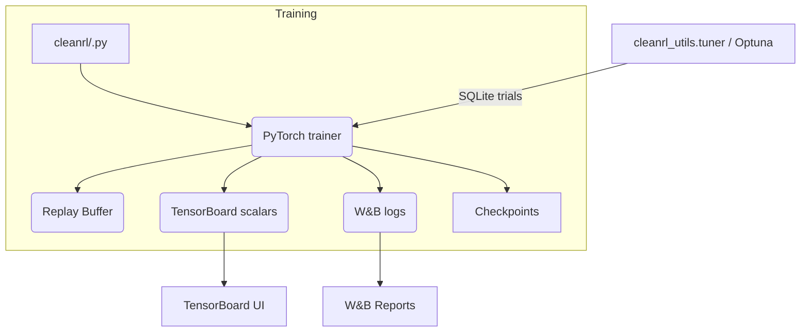
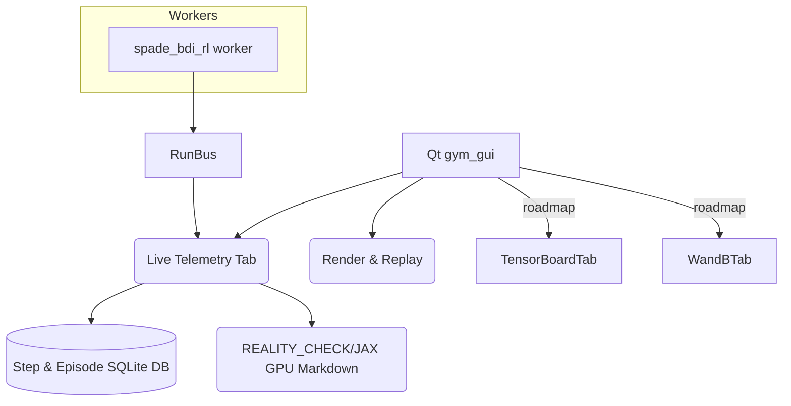
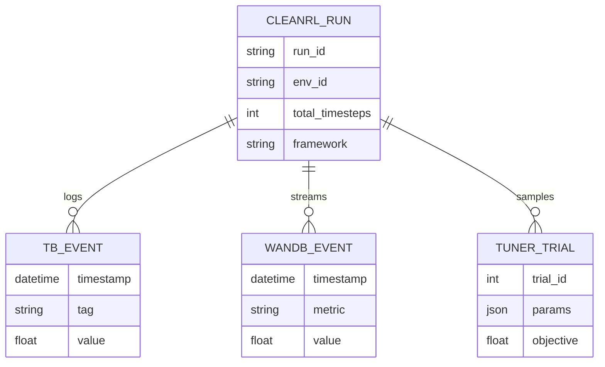
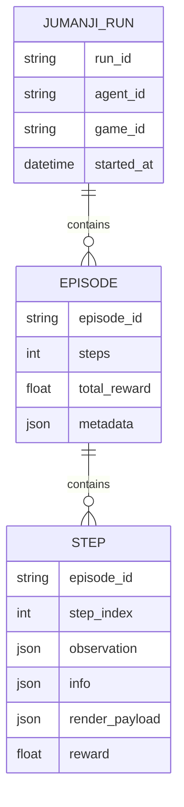
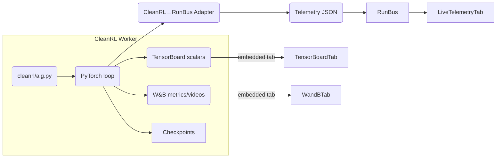

# CleanRL vs. Jumanji (spadeBDI_RL + gym_gui)

## 1. Stack Overview

| Dimension | CleanRL | Jumanji (spadeBDI_RL + gym_gui) |
| --- | --- | --- |
| Core framework | PyTorch single-file algorithms (JAX variants optional) | SPADE-BDI Q-learning core plus JAX worker bridge |
| Orchestration | CLI, tyro-generated flags | Qt GUI launching workers via RunBus |
| Instrumentation | TensorBoard, Weights & Biases, Optuna, SQLite (Optuna DB) | Live telemetry tables, SQLite episodes/steps, replay widgets |
| Data persistence | Run directories, checkpoints, W&B artifacts | SQLite (episodes/steps), JSON run metadata, render payload archives |
| UI experience | Headless (console + dashboards) | Visual Live tabs with immediate observation, archive/delete dialog |
| Hyperparam sweeps | `cleanrl_utils.tuner` (Optuna, stored in SQLite) | Manual today; telemetry-driven tuning planned |
| Community benchmarking | Open RL Benchmark (W&B aggregation) | Internal markdowns (`REALITY_CHECK`, `LEGACY_TRAINING_BENCHMARKS`, `JAX_GPU_PROFILING`) |

## 2. CleanRL System Architecture (Mermaid)

- Runs dispatch from the CLI, recording scalars to TensorBoard, streaming metrics/videos to W&B, and storing hyperparameter trials in Optuna’s SQLite database.
- Observation of progress occurs **after** or between training via dashboards; no live-agent rendering is provided.

## 3. Jumanji Architecture (Mermaid)

- RunBus streams allow the GUI to display step-by-step updates, render grids, and persist telemetry into SQLite the moment training starts.
- Operators can terminate/archive tabs mid-run, unlike CleanRL’s post-hoc dashboards.

## 4. Data Models (Mermaid ER)

- CleanRL centres on scalar time series (TensorBoard, W&B, SQLite for Optuna trials).
- Jumanji stores full JSON payloads for deterministic replay and live visualization.

## 5. Observability & UX

- **CleanRL**: Progress is visible via TensorBoard/W&B after metrics flush. No GUI for live agent behaviour—videos or GIFs are generated after training runs complete (e.g., by `--capture-video`).
- **Jumanji**: Live Telemetry tab updates from the first episode; users see observations, render payloads, and can archive/delete runs in real time.
- **Gap**: Embedding TensorBoard and W&B inside gym_gui would merge CleanRL’s analytic strengths with our live UI.

## 6. Performance Snapshot (local measurements)

| System | Workload | Runtime | Throughput | CPU Avg % | GPU Util | Notes |
| --- | --- | ---:| ---:| ---:| ---:| --- |
| CleanRL DQN (CPU) | CartPole-v1, 20 k steps | 6.78 s | ~5.7k steps/s | 551 % | 0 % | TensorBoard events created; stdout shows SPS |
| spadeBDI_RL legacy | FrozenLake 8×8, 5 k episodes | 0.87 s | ~5.7k eps/s | 203 % | 0 % | Live telemetry stored in SQLite |
| spadeBDI_RL JAX | FrozenLake 8×8, 5 k episodes | 21.1 s | 237 eps/s | 110 % | 95 % | GPU heavy; render payload streamed via RunBus |

## 7. Recommendations

1. **Add analytics tabs** (TensorBoard/W&B) to gym_gui so operators get CleanRL-style dashboards without leaving the UI.
2. **Adopt Optuna patterns** in our workflow by logging telemetry-driven trials and surfacing them in the GUI.
3. **Emphasize live visualization** as a differentiator—CleanRL still requires waiting for dashboard uploads, whereas Jumanji displays behaviour immediately.

## 8. Integrating CleanRL as a Gym GUI Worker

### Proposed Workflow

1. **Process orchestration** – treat each CleanRL script as a worker similar to the `spade_bdi_rl` executable. gym_gui launches the script with structured CLI arguments (env id, seed, total timesteps, CUDA visibility) and supervises the lifecycle.
2. **Telemetry bridge** – wrap CleanRL’s per-episode logging hook to emit standard `StepRecord`/`EpisodeRollup` JSON over RunBus, so Live Telemetry updates exactly like our native workers.
3. **Metrics ingestion** – parse the TensorBoard log dir and expose it inside a new TensorBoard tab; embed W&B dashboards using either the public share URL or API tokens for private projects.
4. **Hyperparameter sweeps** – surface Optuna trials by monitoring the SQLite database generated by `cleanrl_utils.tuner`, presenting winning configs and allowing operators to launch follow-up runs from within gym_gui.
5. **Documentation alignment** – mirror the benchmark markdowns (`REALITY_CHECK.md`, `LEGACY_TRAINING_BENCHMARKS.md`) with CleanRL telemetry so comparisons stay consistent across ecosystems.

### Benefits

- **Immediate adoption of best practices:** CleanRL’s curated defaults, Optuna integrations, and W&B trackers become available without restructuring their codebase.
- **Unified UX:** Operators gain real-time visuals, archive controls, and replay features while still benefiting from TensorBoard/W&B analytics.
- **Community alignment:** Integrating CleanRL positions Jumanji alongside widely recognized baselines, strengthening reproducibility and competitive benchmarking efforts.

By adding a CleanRL worker and embedding analytics tabs, we extend gym_gui from a telemetry-first interface into a full research cockpit—matching CleanRL’s reporting ecosystem and retaining our live visualization advantage.

### CleanRL CLI flags at a glance

The tyro CLI generated by each CleanRL script exposes rich configuration. Key options to surface inside gym_gui:

| Flag | Purpose | Integration note |
| --- | --- | --- |
| `--exp-name` | Run identifier (used in `runs/<name>` directories) | Map to GUI run metadata. |
| `--seed` | RNG seed | Pass through from GUI seed control. |
| `--torch-deterministic/--no-torch-deterministic` | cuDNN determinism toggle | Surface as advanced toggle for reproducibility. |
| `--cuda/--no-cuda` | Enable PyTorch CUDA | Coordinate with `CUDA_VISIBLE_DEVICES`. |
| `--track` | Enable W&B logging | Requires user API key; drive W&B tab visibility. |
| `--wandb-project-name`, `--wandb-entity` | W&B routing | Store defaults per user profile. |
| `--capture-video` | Save gameplay videos | If enabled, register artifacts for GUI replay. |
| `--env-id`, `--total-timesteps`, `--learning-rate`, etc. | Core hyperparameters | Bind to GUI form fields; capture CLI snapshot in telemetry metadata. |

**Implementation watch-outs**

- Tyro warns when defaults are `None` (e.g., `--wandb-entity`). The adapter should normalise values to avoid noisy stderr entries in the GUI.
- CleanRL scripts emit frequent logs; consider batching RunBus telemetry to avoid saturating the UI during Optuna sweeps.
- CUDA initialisation issues (`cudaGetDeviceCount` error 304) should surface clearly when GPU runs fall back to CPU, preventing misleading analytics in TensorBoard/W&B tabs.
