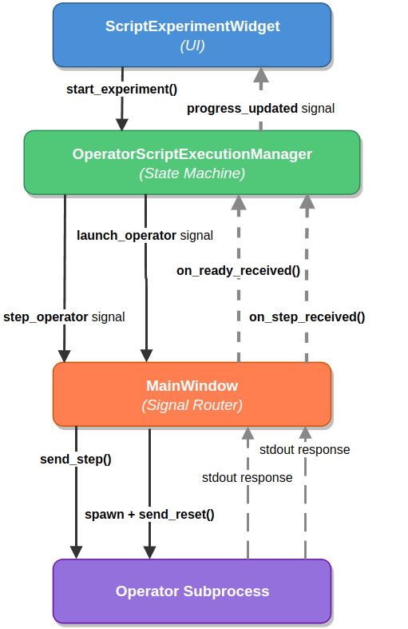

Operator Lifecycle
==================

Operators have two distinct execution modes: **Manual Mode** for
interactive exploration and **Script Mode** for automated experiments.
Each mode has its own state machine and signal flow.

Execution Modes
---------------

.. list-table::
   :header-rows: 1
   :widths: 20 40 40

   * - Mode
     - Description
     - Entry Point
   * - **Manual Mode**
     - User clicks "Reset All" and "Step All" buttons.
       One step per click.
     - Operators Tab > Manual sub-tab
   * - **Script Mode**
     - User loads a Python script defining operators and
       seeds.  Execution runs automatically across N episodes.
     - Operators Tab > Script Experiments sub-tab

.. important::

   Manual Mode and Script Mode are **fully decoupled**, they use
   separate signal paths and state machines.  Running a script does
   not interfere with manual controls, and vice versa.

Manual Mode
-----------

State Machine
~~~~~~~~~~~~~

.. mermaid::

   %%{init: {"flowchart": {"curve": "linear"}} }%%
   graph TD
       START(( )) -->|Operator configured| IDLE
       IDLE -->|Start All clicked| LAUNCHING
       LAUNCHING -->|Subprocess spawned| RUNNING
       RUNNING -->|Step All clicked| STEPPING
       STEPPING -->|Response received| RUNNING
       RUNNING -->|Reset All clicked| RESETTING
       RESETTING -->|Ready response| RUNNING
       RUNNING -->|Stop All clicked| STOPPED
       STEPPING -->|Stop All clicked| STOPPED
       STOPPED --> END(( ))

       style IDLE fill:#6c757d,stroke:#495057,color:#fff
       style LAUNCHING fill:#0d6efd,stroke:#0a58ca,color:#fff
       style RUNNING fill:#198754,stroke:#146c43,color:#fff
       style STEPPING fill:#ffc107,stroke:#cc9a06,color:#000
       style RESETTING fill:#0dcaf0,stroke:#0aa2c0,color:#000
       style STOPPED fill:#dc3545,stroke:#b02a37,color:#fff

Script Mode
-----------

Script mode enables automated multi-episode experiments.  The user
loads a Python script that defines operator configurations and seed
lists, then the ``OperatorScriptExecutionManager`` drives execution
automatically.

State Machine
~~~~~~~~~~~~~

.. mermaid::

   %%{init: {"flowchart": {"curve": "linear"}} }%%
   graph TD
       START(( )) -->|Script loaded| IDLE
       IDLE -->|Run Experiment clicked| LAUNCHING
       LAUNCHING -->|Subprocess spawned + reset sent| WAITING_READY
       WAITING_READY -->|ready response| STEPPING

       subgraph LOOP ["Paced Step Loop"]
           STEPPING -->|episode_end response| EPISODE_DONE
       end

       EPISODE_DONE -->|All episodes finished| COMPLETED
       EPISODE_DONE -->|Next episode: reset with next seed| WAITING_READY

       WAITING_READY -->|User clicks Stop| STOPPED
       STEPPING -->|User clicks Stop| STOPPED

       style IDLE fill:#6c757d,stroke:#495057,color:#fff
       style LAUNCHING fill:#0d6efd,stroke:#0a58ca,color:#fff
       style WAITING_READY fill:#ffc107,stroke:#cc9a06,color:#000
       style STEPPING fill:#198754,stroke:#146c43,color:#fff
       style EPISODE_DONE fill:#0dcaf0,stroke:#0aa2c0,color:#000
       style COMPLETED fill:#198754,stroke:#146c43,color:#fff
       style STOPPED fill:#dc3545,stroke:#b02a37,color:#fff
       style LOOP fill:none,stroke:#555,stroke-dasharray: 5 5

OperatorScriptExecutionManager
~~~~~~~~~~~~~~~~~~~~~~~~~~~~~~

The execution manager is a ``QObject`` state machine that owns the
entire automatic execution lifecycle:

.. code-block:: python

   class OperatorScriptExecutionManager(QObject):
       # Signals sent to MainWindow for subprocess control
       launch_operator = pyqtSignal(str, object, int)   # op_id, config, seed
       reset_operator = pyqtSignal(str, int)             # op_id, seed
       step_operator = pyqtSignal(str)                   # op_id
       stop_operator = pyqtSignal(str)                   # op_id

       # Signals sent to ScriptExperimentWidget for UI updates
       progress_updated = pyqtSignal(int, int, int)      # episode, total, seed
       experiment_completed = pyqtSignal(int)             # num_episodes

The manager coordinates with ``MainWindow`` through signals:

   Signal flow between the four components: ScriptExperimentWidget triggers
   ``start_experiment()``, the Manager emits ``launch_operator`` and
   ``step_operator`` signals to MainWindow, which spawns the subprocess and
   relays ``send_reset()`` / ``send_step()`` commands.  Responses flow back
   via stdout, and progress is reported to the UI via ``progress_updated``.

Paced Stepping
~~~~~~~~~~~~~~

A critical design detail: after receiving a step response, the manager
does **not** immediately request the next step.  Instead, it uses
``QTimer.singleShot(delay_ms, callback)`` to insert a small delay:

.. code-block:: python

   def on_step_received(self, operator_id: str) -> None:
       if not self._is_running or not self._waiting_for_response:
           return

       def _emit_next_step():
           if self._is_running and self._waiting_for_response:
               self.step_operator.emit(operator_id)

       QTimer.singleShot(self._step_delay_ms, _emit_next_step)

This delay serves a critical purpose: **without it, the step loop runs
so fast that Qt paint events are starved**.  The render view would show
visual jumps (e.g., step 26 to step 37) because frames are logically
rendered but never visually painted by the Qt compositor.

.. list-table::
   :header-rows: 1
   :widths: 25 25 25 25

   * - Approach
     - Speed
     - Visual Quality
     - Status
   * - Timer spam
     - Uncontrolled
     - Broken (flooding)
     - Abandoned
   * - Immediate re-emit
     - Maximum
     - Jittery (skips frames)
     - Abandoned
   * - **Paced stepping**
     - **Configurable**
     - **Smooth**
     - **Current**

The step delay is configurable via a UI spinbox:

- **0 ms**: fastest (may skip frames visually)
- **50 ms**: smooth frame-by-frame rendering (default)
- **200 ms**: slow-motion playback for analysis
- **1000 ms**: one step per second

.. warning::

   Never use ``QApplication.processEvents()`` for step pacing.
   It causes reentrancy issues and unpredictable behavior.
   ``QTimer.singleShot`` is the Qt-idiomatic solution.

Episode Advancement
~~~~~~~~~~~~~~~~~~~

When an episode ends, the manager advances to the next seed:

.. code-block:: python

   def on_episode_ended(
       self, operator_id: str, terminated: bool, truncated: bool
   ) -> None:
       self._current_episode += 1

       if self._current_episode >= self._total_episodes:
           self.experiment_completed.emit(self._total_episodes)
           return

       next_seed = self._seeds[self._current_episode]
       self.reset_operator.emit(operator_id, next_seed)

**Seed modes:**

- **Procedural**: different seed per episode (tests generalization)
- **Fixed**: same seed every episode (isolates agent behavior)

Script Format
-------------

Experiment scripts are Python files that define operator configurations
and execution parameters:

.. code-block:: python

   # simple_random_baseline.py

   operators = [
       {
           "id": "random_1",
           "name": "Random Agent",
           "type": "baseline",
           "worker_id": "operators_worker",
           "env_name": "minigrid",
           "task": "MiniGrid-Empty-8x8-v0",
       },
   ]

   execution = {
       "num_episodes": 10,
       "seeds": [1000, 1001, 1002, 1003, 1004,
                 1005, 1006, 1007, 1008, 1009],
       "step_delay_ms": 50,
       "env_mode": "procedural",
   }

Scripts are loaded via ``compile()`` + sandboxed namespace execution
(not ``importlib``, which can cause import chain hangs on Linux):

.. code-block:: python

   with open(script_path) as f:
       code = compile(f.read(), script_path, "exec")
   namespace = {}
   exec(code, namespace)
   operators = namespace["operators"]
   execution = namespace.get("execution", {})

Telemetry Output
----------------

Operator telemetry is written to ``var/operators/telemetry/``:

.. code-block:: text

   var/operators/telemetry/
   ├── random_minigrid_{run_id}_steps.jsonl    # Per-step data
   └── random_minigrid_{run_id}_episodes.jsonl # Per-episode summaries

Each line is a JSON object with step index, action, reward,
termination status, and optional render payload.
