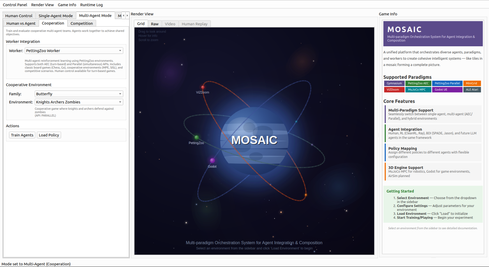

MOSAIC: Multi-Agent Orchestration System with Adaptive Intelligent Control for Heterogeneous Agent Workloads
=============================================================================================================

.. raw:: html

   
   
   
   
   
   

.. raw:: html

     

**MOSAIC** (Multi-Agent Orchestration System with Adaptive Intelligent Control for Heterogeneous
Agent Workloads) is a unified platform that orchestrates diverse agents, paradigms, and workers
to create cohesive intelligent systems — like tiles in a mosaic forming a complete picture.
It provides a visual-first interface for configuring, running, and analyzing reinforcement
learning experiments across multiple paradigms.

.. raw:: html

    

| **GitHub**: `https://github.com/Abdulhamid97Mousa/MOSAIC <https://github.com/Abdulhamid97Mousa/MOSAIC>`_

Why MOSAIC?
-----------

Today's AI landscape offers powerful but **fragmented** tools: RL frameworks (CleanRL, RLlib, XuanCe),
symbolic AI (Jason BDI, SPADE), language models (GPT, Claude), robotics simulators (MuJoCo), and
3D game engines (Godot). Each excels in isolation, but **no platform bridges them together**
under a unified, visual-first interface.

MOSAIC provides:

- **Unified Framework Bridge**: Connect RL, LLM, BDI, Robotics, and 3D Simulation in a single platform
- **Visual-First Design**: Configure experiments through an intuitive PyQt6 interface — no code required
- **Heterogeneous Agent Mixing**: Run Human + RL + BDI + LLM agents in the same environment
- **Resource Management & Quotas**: GPU allocation, queue limits, credit-based backpressure, health monitoring
- **Per-Agent Policy Binding**: Route each agent to different workers via ``PolicyMappingService``
- **Worker Lifecycle Orchestration**: Subprocess management with heartbeat monitoring and graceful termination

Supported Paradigms
-------------------

.. list-table::
   :widths: 20 40 40
   :header-rows: 1

   * - Paradigm
     - Description
     - Example Environments
   * - **Gymnasium**
     - Standard single-agent RL API
     - CartPole, MountainCar, Atari, MuJoCo
   * - **PettingZoo AEC**
     - Turn-based multi-agent (Alternating Environment Cycle)
     - Chess, Go, Tic-Tac-Toe, Connect Four
   * - **PettingZoo Parallel**
     - Simultaneous multi-agent environments
     - MPE, SISL, Butterfly
   * - **MiniGrid**
     - Procedural grid-world environments
     - Empty, DoorKey, MultiRoom, RedBlueDoors
   * - **ViZDoom**
     - Doom-based visual RL platform
     - Basic, Deadly Corridor, Defend the Center
   * - **MuJoCo MPC**
     - Model Predictive Control for robotics
     - Humanoid, Quadruped, Manipulation tasks
   * - **Godot UE**
     - Custom 3D game environments
     - Custom game AI training scenarios
   * - **ALE Atari**
     - Arcade Learning Environment
     - Breakout, Pong, Space Invaders

Supported Workers
-----------------

* **CleanRL** - Single-file RL implementations (PPO, DQN, SAC, TD3)
* **XuanCe** - Multi-agent algorithms (MAPPO, QMIX, MADDPG)
* **RLlib** - Distributed training with Ray
* **Jason BDI** - AgentSpeak agents via Java/gRPC bridge
* **SPADE BDI** - Python-native BDI agents
* **MuJoCo MPC** - Model Predictive Control worker
* **Godot** - 3D game engine integration
* **LLM** - Language model agents (planned)

Quick Example
-------------

.. code-block:: python

   from gym_gui.services import PolicyMappingService
   from gym_gui.core.enums import SteppingParadigm

   # Configure heterogeneous agents for a Chess game
   policy_service = PolicyMappingService()
   policy_service.set_paradigm(SteppingParadigm.SEQUENTIAL)

   # Player 0: Human control
   policy_service.bind_agent_policy("player_0", "human_keyboard")

   # Player 1: Trained RL policy
   policy_service.bind_agent_policy("player_1", "cleanrl_ppo")

Architecture Overview
---------------------

.. mermaid::

   flowchart TD
       subgraph Platform["MOSAIC Platform"]
           UI["Visual Layer (PyQt6)"]
           SVC["Service Layer (PolicyMapping, Actor, Telemetry)"]
           ADP["Adapter Layer (Paradigm, Environment)"]
       end

       subgraph Workers["Training Workers"]
           RL["Neural RL CleanRL | XuanCe | RLlib"]
           BDI["Symbolic AI Jason | SPADE"]
           SIM["Simulation MuJoCo | Godot | LLM"]
       end

       UI --> SVC --> ADP
       ADP <-->|gRPC / IPC| Workers

Core Features
-------------

**Multi-Paradigm Support**
   Seamlessly switch between single-agent, multi-agent (AEC/Parallel), and hybrid environments
   without changing your agent code.

**Agent Integration**
   Human, RL (CleanRL, Ray), BDI (SPADE, Jason), and future LLM agents in the same framework.

**Policy Mapping**
   Assign different policies to different agents with flexible configuration through the
   PolicyMappingService.

**3D Engine Support**
   MuJoCo MPC for robotics, Godot for game environments, with AirSim planned for drone/vehicle
   simulation.

**Real-time Visualization**
   Interactive render view with the MOSAIC space animation, live telemetry, and episode replay.

Who Is MOSAIC For?
------------------

MOSAIC is designed for:

- **Researchers** exploring multi-agent RL with heterogeneous agents
- **Developers** building RL applications with visual configuration
- **Students** learning about different RL paradigms and agent architectures
- **AI practitioners** interested in combining symbolic AI (BDI) with neural methods (RL)
- **Game developers** training AI agents in custom 3D environments

.. raw:: html

    

Contents
--------

.. toctree::
   :maxdepth: 2
   :caption: Getting Started

   documents/tutorials/installation
   documents/tutorials/quickstart
   documents/tutorials/basic_usage

.. toctree::
   :maxdepth: 2
   :caption: Architecture

   documents/architecture/overview
   documents/architecture/paradigms
   documents/architecture/policy_mapping
   documents/architecture/workers

.. toctree::
   :maxdepth: 2
   :caption: API Reference

   documents/api/core
   documents/api/services
   documents/api/adapters

.. toctree::
   :hidden:
   :caption: Development

   GitHub <https://github.com/Abdulhamid97Mousa/MOSAIC>
   documents/contributing
   documents/changelog
