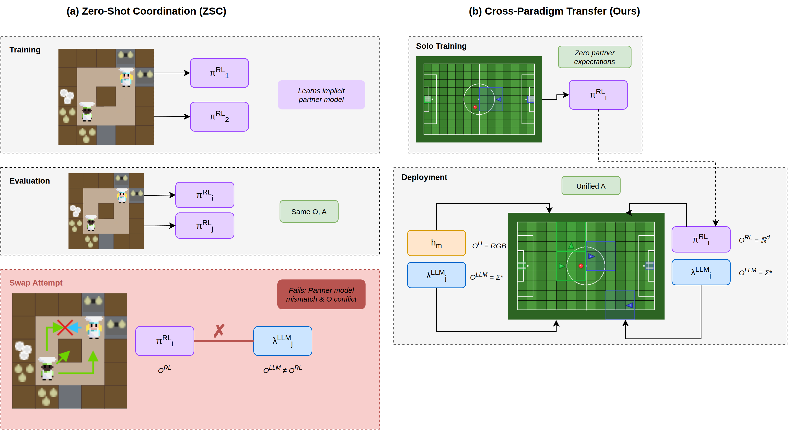

MOSAIC
======

.. raw:: html

   
   
   
   
   
   

.. raw:: html

     

**A Unified Platform for Cross-Paradigm Comparison and Evaluation of Homogeneous and Heterogeneous Multi-Agent RL, LLM, VLM, and Human Decision-Makers**

MOSAIC is a visual-first platform that enables researchers to configure, run, and
compare experiments across RL, LLM, VLM, and human decision-makers in the same
multi-agent environment.  Different paradigms like tiles in a mosaic come
together to form a complete picture of agent performance.

.. figure:: _static/figures/A_Full_Architecture.png
   :alt: MOSAIC Platform Overview
   :align: center
   :width: 100%
   :target: documents/architecture/workers/architecture.html

   The architecture shows the
   :doc:`Evaluation Phase <documents/architecture/operators/index>` (operators containing workers),
   :doc:`Training Phase <documents/architecture/workers/architecture>` (TrainerClient, TrainerService, Workers),
   Daemon Process (gRPC Server, RunRegistry, Dispatcher, Broadcasters),
   and :doc:`Worker Processes <documents/architecture/workers/integrated_workers/index>`
   (:doc:`CleanRL <documents/architecture/workers/integrated_workers/CleanRL_Worker/index>`,
   :doc:`XuanCe <documents/architecture/workers/integrated_workers/XuanCe_Worker/index>`,
   :doc:`Ray RLlib <documents/architecture/workers/integrated_workers/RLlib_Worker/index>`,
   :doc:`BALROG <documents/architecture/workers/integrated_workers/BALROG_Worker/index>`).

.. raw:: html

    

MOSAIC provides two evaluation modes designed for reproducibility:

.. raw:: html

   <video style="width:100%; max-width:100%; height:auto; border-radius:8px; box-shadow:0 2px 8px rgba(0,0,0,0.15);" controls autoplay muted loop playsinline>
     <source src="https://github.com/user-attachments/assets/ea9ebc18-2216-4fb2-913c-5d354ebea56e?raw=true" type="video/mp4">
     Your browser does not support the video tag.
   </video>
   

     <strong>Manual Mode</strong> Side-by-side lock-step evaluation with shared seeds.
     See <a href="documents/architecture/operators/index.html">Operators &amp; Evaluation Modes</a>
     and <a href="documents/rendering_tabs/slow_lane.html">Slow Lane (Render View)</a>.
   

- **Manual Mode:** side-by-side comparison where multiple operators step through
  the same environment with shared seeds, letting researchers visually inspect
  decision-making differences between paradigms in real time.

.. raw:: html

   <video style="width:100%; max-width:100%; height:auto; border-radius:8px; box-shadow:0 2px 8px rgba(0,0,0,0.15);" controls autoplay muted loop playsinline>
     <source src="https://github.com/user-attachments/assets/a9b3f6f4-661c-492f-b43f-34d7125a6d2e?raw=true" type="video/mp4">
     Your browser does not support the video tag.
   </video>
   

     <strong>Script Mode:</strong> Automated batch evaluation with deterministic seed sequences.
     See <a href="documents/architecture/operators/architecture.html">IPC Architecture</a>
     and <a href="documents/runtime_logging/index.html">Runtime Logging</a>.
   

- **Script Mode:** automated, long-running evaluation driven by Python scripts
  that define operator configurations, worker assignments, seed sequences, and
  episode counts.  Scripts execute deterministically with no manual intervention,
  producing reproducible telemetry logs (JSONL) for every step and episode.

All evaluation runs share **identical conditions**: same environment seeds, same
observations, and unified telemetry.  Script Mode additionally supports
**procedural seeds** (different seed per episode to test generalization) and
**fixed seeds** (same seed every episode to isolate agent behaviour), with
configurable step pacing for visual inspection or headless batch execution.

| **GitHub**: `https://github.com/Abdulhamid97Mousa/MOSAIC <https://github.com/Abdulhamid97Mousa/MOSAIC>`_

Why MOSAIC?
-----------

Today's AI landscape offers powerful but **fragmented** tools: RL frameworks
(`CleanRL <https://github.com/vwxyzjn/cleanrl>`_,
`RLlib <https://docs.ray.io/en/latest/rllib/index.html>`_,
`XuanCe <https://github.com/agi-brain/xuance>`_),
language models (GPT, Claude), and robotics simulators (MuJoCo).
Each excels in isolation, but **no platform bridges them together**
under a unified, visual-first interface.

**MOSAIC provides:**

- **Visual-First Design**: Configure experiments through an intuitive PyQt6 interface, **Almost no code required**.
- **Heterogeneous Agent Mixing**: Deploy Human(Agent),  RL, and LLM agents in the same environment
- **Resource Management & Quotas**: GPU allocation, queue limits, credit-based backpressure, health monitoring.
- **Per-Agent Policy Binding**: Route each agent to different workers via ``PolicyMappingService``.
- **Worker Lifecycle Orchestration**: Subprocess management with heartbeat monitoring and graceful termination.

.. raw:: html

   <video style="width:100%; max-width:100%; height:auto; border-radius:8px; box-shadow:0 2px 8px rgba(0,0,0,0.15);" controls autoplay muted loop playsinline>
     <source src="https://github.com/user-attachments/assets/ded17cdc-f23c-404f-a9f6-074fbe74816c?raw=true" type="video/mp4">
     Your browser does not support the video tag.
   </video>
   

     <strong>Human vs Human:</strong> Two human players competing via dedicated USB keyboards.
     See <a href="documents/human_control/index.html">Human Control</a>
     and <a href="documents/human_control/multi_keyboard_evdev.html">Multi-Keyboard Support (Evdev)</a>.
   

.. raw:: html

   <video style="width:100%; max-width:100%; height:auto; border-radius:8px; box-shadow:0 2px 8px rgba(0,0,0,0.15);" controls autoplay muted loop playsinline>
     <source src="https://github.com/user-attachments/assets/2625a8f8-476c-4171-86cc-a9970cbf1665?raw=true" type="video/mp4">
     Your browser does not support the video tag.
   </video>
   

     <strong>Random Agents:</strong> Baseline agents across 26 environment families.
     See <a href="documents/architecture/workers/integrated_workers/MOSAIC_Random_Worker/index.html">MOSAIC Random Worker</a>
     and <a href="documents/environments/index.html">Supported Environments</a>.
   

.. raw:: html

   <video style="width:100%; max-width:100%; height:auto; border-radius:8px; box-shadow:0 2px 8px rgba(0,0,0,0.15);" controls autoplay muted loop playsinline>
     <source src="https://github.com/user-attachments/assets/f2d79901-a93d-465b-9058-1b9cdabf311a?raw=true" type="video/mp4">
     Your browser does not support the video tag.
   </video>
   

     <strong>Heterogeneous Multi-Agent Ad-Hoc Teamwork in Adversarial Settings:</strong> Different decision-making paradigms (RL, LLM, Random) competing head-to-head in the same multi-agent environment.
     See <a href="documents/architecture/operators/heterogeneous_decision_maker/index.html">Heterogeneous Decision-Maker</a>.
   

.. raw:: html

   <video style="width:100%; max-width:100%; height:auto; border-radius:8px; box-shadow:0 2px 8px rgba(0,0,0,0.15);" controls autoplay muted loop playsinline>
     <source src="https://github.com/user-attachments/assets/2ae1665b-3a57-44be-98a3-4e7223b37628?raw=true" type="video/mp4">
     Your browser does not support the video tag.
   </video>
   

     <strong>Homogeneous Teams: Random vs LLM:</strong> Two homogeneous teams (all-Random vs all-LLM) competing in the same multi-agent environment.
     See <a href="documents/architecture/operators/homogenous_decision_makers/index.html">Homogeneous Decision-Makers</a>.
   

Agent-Level Interface and Cross-Paradigm Evaluation
-----------------------------------------------------

**Agent-Level Interface.** Existing infrastructure lacks the ability to deploy
agents from different decision-making paradigms within the same environment.
The root cause is an **interface mismatch**: RL agents expect tensor
observations and produce integer actions, while LLM agents expect text prompts
and produce text responses.  MOSAIC addresses this through an *operator
abstraction* that forms an agent-level interface by mapping workers to agents:
each operator, regardless of whether it is backed by an RL policy, an LLM, or
a human, conforms to a minimal unified interface
(``select_action(obs) → action``).  The environment never needs to know what
kind of decision-maker it is communicating with.  This is the agent-side
counterpart to what `Gymnasium <https://gymnasium.farama.org/>`_ did for
environments: Gymnasium standardized the environment interface
(``reset()`` / ``step()``), so any algorithm can interact with any environment;
MOSAIC's Operator Protocol standardizes the agent interface, so any
decision-maker can be plugged into any compatible environment without modifying
either side.

**Cross-Paradigm Evaluation.** Cross-paradigm evaluation is the ability to
deploy decision-makers from *different paradigms* (RL, LLM, VLM, Human,
scripted baselines) within the same multi-agent environment under identical
conditions, and to produce directly comparable results.  Both evaluation modes described above
(:doc:`Manual Mode <documents/architecture/operators/lifecycle>` and
:doc:`Script Mode <documents/architecture/operators/architecture>`) guarantee
that all decision-makers face the same environment states, observations, and
shared seeds, making this the first infrastructure to enable fair, reproducible
cross-paradigm evaluation.

See :doc:`Operator Concept <documents/architecture/operators/concept>` for the
full Agent-Level Interface specification,
:doc:`Heterogeneous Decision-Maker <documents/architecture/operators/heterogeneous_decision_maker/index>`
for the research gap and design rationale, and
:doc:`IPC Architecture <documents/architecture/operators/architecture>` for
Manual Mode and Script Mode implementation details.

Comparison with Existing Frameworks
------------------------------------

Existing frameworks are paradigm-siloed. No prior framework allowed fair,
reproducible, head-to-head comparison between RL agents and LLM agents in the
same multi-agent environment.

*Agent Paradigms*: which decision-maker types are supported.
*Framework*: algorithms can be integrated without source-code modifications.
*Platform GUI*: real-time visualization during execution.
*Cross-Paradigm*: infrastructure for comparing different agent types (e.g., RL
vs. LLM) on identical environment instances with shared random seeds for
reproducible head-to-head evaluation.
Legend: ✓ Supported, ✗ Not supported, ◉ Partial.

.. raw:: html

   
   <table class="cmp-table">
     <thead>
       <tr style="border-bottom:2px solid #333;">
         <th rowspan="2" style="text-align:left;">System</th>
         <th colspan="3" style="border-bottom:1px solid #aaa;">Agent Paradigms</th>
         <th colspan="2" style="border-bottom:1px solid #aaa;">Infrastructure</th>
         <th style="border-bottom:1px solid #aaa;">Evaluation</th>
       </tr>
       <tr style="border-bottom:2px solid #333;">
         <th>RL</th><th>LLM/VLM</th><th>Human</th>
         <th>Framework</th><th>Platform GUI</th><th>Cross-Paradigm</th>
       </tr>
     </thead>
     <tbody>
       <tr class="section-row"><td colspan="7"><strong>RL Frameworks</strong></td></tr>
       <tr>
         <td>RLlib <a href="#ref1">[1]</a></td>
         <td>&#10003;</td><td>&#10007;</td><td>&#10007;</td>
         <td>&#10003;</td><td>&#10007;</td><td>&#10007;</td>
       </tr>
       <tr>
         <td>CleanRL <a href="#ref2">[2]</a></td>
         <td>&#10003;</td><td>&#10007;</td><td>&#10007;</td>
         <td>&#10003;</td><td>&#10007;</td><td>&#10007;</td>
       </tr>
       <tr>
         <td>Tianshou <a href="#ref3">[3]</a></td>
         <td>&#10003;</td><td>&#10007;</td><td>&#10007;</td>
         <td>&#10003;</td><td>&#10007;</td><td>&#10007;</td>
       </tr>
       <tr>
         <td>Acme <a href="#ref4">[4]</a></td>
         <td>&#10003;</td><td>&#10007;</td><td>&#10007;</td>
         <td>&#10003;</td><td>&#10007;</td><td>&#10007;</td>
       </tr>
       <tr>
         <td>XuanCe <a href="#ref5">[5]</a></td>
         <td>&#10003;</td><td>&#10007;</td><td>&#10007;</td>
         <td>&#10003;</td><td>&#10007;</td><td>&#10007;</td>
       </tr>
       <tr>
         <td>OpenRL <a href="#ref6">[6]</a></td>
         <td>&#10003;</td><td>&#10007;</td><td>&#10007;</td>
         <td>&#10003;</td><td>&#10007;</td><td>&#10007;</td>
       </tr>
       <tr>
         <td>Stable-Baselines3 <a href="#ref7">[7]</a></td>
         <td>&#10003;</td><td>&#10007;</td><td>&#10007;</td>
         <td>&#10003;</td><td>&#10007;</td><td>&#10007;</td>
       </tr>
       <tr>
         <td>Coach <a href="#ref8">[8]</a></td>
         <td>&#10003;</td><td>&#10007;</td><td>&#10007;</td>
         <td>&#10003;</td><td>&#10003;</td><td>&#10007;</td>
       </tr>
       <tr>
         <td>BenchMARL <a href="#ref15">[15]</a></td>
         <td>&#10003;</td><td>&#10007;</td><td>&#10007;</td>
         <td>&#10003;</td><td>&#10007;</td><td>&#10007;</td>
       </tr>
       <tr class="section-row"><td colspan="7"><strong>LLM/VLM Benchmarks</strong></td></tr>
       <tr>
         <td>BALROG <a href="#ref9">[9]</a></td>
         <td>&#10007;</td><td>&#10003;</td><td>&#10007;</td>
         <td>&#10003;</td><td>&#10007;</td><td>&#10007;</td>
       </tr>
       <tr>
         <td>TextArena <a href="#ref10">[10]</a></td>
         <td>&#10007;</td><td>&#10003;</td><td>&#10003;</td>
         <td>&#10003;</td><td>&#10007;</td><td>&#10007;</td>
       </tr>
       <tr>
         <td>GameBench <a href="#ref11">[11]</a></td>
         <td>&#10007;</td><td>&#10003;</td><td>&#10007;</td>
         <td>&#10003;</td><td>&#10007;</td><td>&#10007;</td>
       </tr>
       <tr>
         <td>lmgame-Bench <a href="#ref12">[12]</a></td>
         <td>&#10007;</td><td>&#10003;</td><td>&#10007;</td>
         <td>&#10003;</td><td>&#10007;</td><td>&#10007;</td>
       </tr>
       <tr>
         <td>LLM Chess <a href="#ref13">[13]</a></td>
         <td>&#10003;</td><td>&#10003;</td><td>&#10007;</td>
         <td>&#10003;</td><td>&#10007;</td><td>&#10007;</td>
       </tr>
       <tr>
         <td>LLM-Game-Bench <a href="#ref14">[14]</a></td>
         <td>&#10007;</td><td>&#10003;</td><td>&#10007;</td>
         <td>&#10003;</td><td>&#9673;</td><td>&#10007;</td>
       </tr>
       <tr>
         <td>AgentBench <a href="#ref16">[16]</a></td>
         <td>&#10007;</td><td>&#10003;</td><td>&#10007;</td>
         <td>&#10003;</td><td>&#10007;</td><td>&#10007;</td>
       </tr>
       <tr>
         <td>MultiAgentBench <a href="#ref17">[17]</a></td>
         <td>&#10007;</td><td>&#10003;</td><td>&#10007;</td>
         <td>&#10003;</td><td>&#10007;</td><td>&#10007;</td>
       </tr>
       <tr>
         <td>GAMEBoT <a href="#ref18">[18]</a></td>
         <td>&#10007;</td><td>&#10003;</td><td>&#10007;</td>
         <td>&#10003;</td><td>&#10007;</td><td>&#10007;</td>
       </tr>
       <tr>
         <td>Collab-Overcooked <a href="#ref19">[19]</a></td>
         <td>&#9673;</td><td>&#10003;</td><td>&#10007;</td>
         <td>&#10003;</td><td>&#10007;</td><td>&#10007;</td>
       </tr>
       <tr>
         <td>BotzoneBench <a href="#ref20">[20]</a></td>
         <td>&#10007;</td><td>&#10003;</td><td>&#10007;</td>
         <td>&#10003;</td><td>&#10007;</td><td>&#10007;</td>
       </tr>
       <tr>
         <td>AgentGym <a href="#ref21">[21]</a></td>
         <td>&#10007;</td><td>&#10003;</td><td>&#10007;</td>
         <td>&#10003;</td><td>&#10007;</td><td>&#10007;</td>
       </tr>
       <tr class="mosaic-row">
         <td>MOSAIC (Ours)</td>
         <td>&#10003;</td><td>&#10003;</td><td>&#10003;</td>
         <td>&#10003;</td><td>&#10003;</td><td>&#10003;</td>
       </tr>
     </tbody>
   </table>
   

     &#10003; Supported &nbsp;&nbsp;
     &#10007; Not supported &nbsp;&nbsp;
     &#9673; Partial
   

Experimental Configurations
---------------------------

Heterogeneous decision-making enables a systematic ablation matrix for
cross-paradigm research. The following configurations illustrate the design
using :doc:`MOSAIC MultiGrid <documents/environments/mosaic_multigrid/index>`.

Formal Notation
^^^^^^^^^^^^^^^

.. list-table:: Summary of notation for cross-paradigm multi-agent systems.
   :header-rows: 1
   :widths: 20 80

   * - **Symbol**
     - **Description**
   * - **Agent Paradigms**
     - 
   * - :math:`\pi^{\text{RL}}_i`
     - RL policy trained via reinforcement learning
   * - :math:`\bar{\pi}^{\text{RL}}_i`
     - Frozen RL policy (parameters :math:`\theta_i` fixed; no further learning)
   * - :math:`\lambda^{\text{LLM}}_j`
     - LLM agent (large language model)
   * - :math:`h_m`
     - Human operator (interactive GUI control)
   * - :math:`\rho`
     - Uniform random baseline policy
   * - :math:`\nu`
     - No-op baseline policy (null action at every step)
   * - **Agent Sets and Cardinalities**
     - 
   * - :math:`\Pi^{\text{RL}} = \{\pi^{\text{RL}}_i\}_{i=1}^{n_{\text{RL}}}`
     - Set of RL policies with cardinality :math:`n_{\text{RL}}`
   * - :math:`\Lambda^{\text{LLM}} = \{\lambda^{\text{LLM}}_j\}_{j=1}^{n_{\text{LLM}}}`
     - Set of LLM agents with cardinality :math:`n_{\text{LLM}}`
   * - :math:`\mathcal{H} = \{h_m\}_{m=1}^{n_{\text{H}}}`
     - Set of human operators with cardinality :math:`n_{\text{H}}`
   * - :math:`N = n_{\text{RL}} + n_{\text{LLM}} + n_{\text{H}}`
     - Total number of agents in the system
   * - **Team Partitions**
     - 
   * - :math:`\mathcal{T}_A, \mathcal{T}_B`
     - Disjoint team partitions: :math:`\mathcal{T}_A \cap \mathcal{T}_B = \emptyset`, :math:`\mathcal{T}_A \cup \mathcal{T}_B = \{1,\ldots,N\}`
   * - :math:`n_A, n_B`
     - Team sizes: :math:`n_A = |\mathcal{T}_A|`, :math:`n_B = |\mathcal{T}_B|`, :math:`n_A + n_B = N`
   * - **Observation and Action Spaces**
     - 
   * - :math:`\mathcal{O}^{\text{RL}} = \mathbb{R}^d`
     - RL observation space (continuous tensor)
   * - :math:`\mathcal{O}^{\text{LLM}} = \Sigma^{*}`
     - LLM observation space (strings over alphabet :math:`\Sigma`)
   * - :math:`\mathcal{O}^{\text{H}} = \mathbb{R}^{H \times W \times C}`
     - Human observation space (rendered RGB image)
   * - :math:`\mathcal{A} = \{1,2,\dots,K\}`
     - Discrete action space (shared after paradigm-specific parsing)
   * - :math:`\phi: \Sigma^{*} \to \mathcal{A}`
     - Deterministic parsing function mapping LLM text to actions

Standard Self-Play vs Cross-Paradigm Transfer
^^^^^^^^^^^^^^^^^^^^^^^^^^^^^^^^^^^^^^^^^^^^^

   **Standard Self-Play and Cross-Paradigm Transfer.**
   **(a) Standard Self-Play (Baseline):** Agents :math:`\pi^{RL}_1` and :math:`\pi^{RL}_2` are
   co-trained, learning implicit partner models that overfit to the specific environment.
   This approach fails the Zero-Shot Coordination (ZSC) challenge because it struggles to
   coordinate with unseen RL partners (who may have learned different features). It
   collapses when a partner is swapped across paradigms (e.g., :math:`\pi^{RL}` paired with
   :math:`\lambda^{LLM}`) due to observation space mismatches
   (:math:`\mathcal{O}^{\text{RL}} \neq \mathcal{O}^{\text{LLM}}`) and violated behavioral
   expectations.
   **(b) Cross-Paradigm Transfer (MOSAIC):** Agent :math:`\pi^{RL}` is trained solo
   (:math:`N=1`, zero partner expectations), then deployed in multi-agent teams alongside
   heterogeneous partners such as LLM agents :math:`\lambda^{LLM}`, human players :math:`h`,
   or random baselines. By eliminating co-training dependencies, agents can cooperate
   across paradigm boundaries using a unified action interface.

.. list-table:: Comparison: Standard Self-Play vs Cross-Paradigm Transfer
   :header-rows: 1
   :widths: 20 40 40

   * - Aspect
     - Standard Self-Play (Baseline)
     - Cross-Paradigm Transfer (MOSAIC)
   * - Training
     - Co-training via self-play (:math:`N \geq 2`)
     - Solo training (:math:`N=1`)
   * - Partner Model
     - Implicit partner model (overfitted to training partner)
     - Zero partner expectations
   * - Generalization (RL)
     - Fails with unseen RL partners (ZSC failure)
     - Generalizes to unseen solo-trained RL partners
   * - Generalization (Cross-Paradigm)
     - Fails when swapping RL ↔ LLM (Interface mismatch)
     - Succeeds across paradigm boundaries
   * - Deployment
     - Requires same-paradigm, familiar partners
     - Supports RL, LLM, human, scripted agents

Adversarial Cross‑Paradigm Matchups
^^^^^^^^^^^^^^^^^^^^^^^^^^^^^^^^^^^

The first set of configurations establishes single-paradigm baselines before introducing
cross-paradigm matchups to measure relative performance.
Let :math:`\mathcal{T}_A` and :math:`\mathcal{T}_B` denote disjoint team partitions with
:math:`|\mathcal{T}_A| = n_A` and :math:`|\mathcal{T}_B| = n_B`.
For each team :math:`\mathcal{T}_k` (:math:`k \in \{A,B\}`), we define its paradigm composition as
:math:`(\Pi^{\text{RL}}_k, \Lambda^{\text{LLM}}_k, \mathcal{H}_k)` where
:math:`|\Pi^{\text{RL}}_k| + |\Lambda^{\text{LLM}}_k| + |\mathcal{H}_k| = n_k`.

.. list-table:: Adversarial configurations for :math:`N=4` agents with :math:`n_A = n_B = 2`
   :widths: 12 28 28 32
   :header-rows: 1

   * - Config
     - Team A Composition
     - Team B Composition
     - Purpose
   * - **A1**
     - :math:`|\Pi^{\text{RL}}_A| = 2`
     - :math:`|\Pi^{\text{RL}}_B| = 2`
     - Homogeneous RL baseline
   * - **A2**
     - :math:`|\Lambda^{\text{LLM}}_A| = 2`
     - :math:`|\Lambda^{\text{LLM}}_B| = 2`
     - Homogeneous LLM baseline
   * - **A3**
     - :math:`|\Pi^{\text{RL}}_A| = 2`
     - :math:`|\Lambda^{\text{LLM}}_B| = 2`
     - Cross-paradigm matchup
   * - **A4**
     - :math:`|\Pi^{\text{RL}}_A| = 2`
     - :math:`\rho` baseline (:math:`n_B = 2`)
     - Sanity check (trained vs random)

Configuration A1 measures the performance ceiling for trained RL agents operating in
homogeneous teams. A2 establishes the baseline for LLM agents reasoning via text-based
decision-making. A3 addresses the central cross-paradigm research question: under
identical environmental conditions and shared random seeds, does a team composed entirely
of RL policies outperform a team composed entirely of LLM agents, and by what margin?
A4 serves as a sanity check, confirming that trained agents significantly outperform
uniform-random baseline policies.

Cooperative Heterogeneous Teams
^^^^^^^^^^^^^^^^^^^^^^^^^^^^^^^

The second set of configurations examines intra-team heterogeneity by mixing paradigms
**within** a team. These configurations test whether an LLM agent :math:`\lambda^{\text{LLM}}`
can effectively cooperate with a frozen RL policy :math:`\bar{\pi}^{\text{RL}}` that was
trained without any partner model.

.. list-table:: Cooperative configurations for :math:`N=4` agents with :math:`n_A = n_B = 2`
   :widths: 12 28 28 32
   :header-rows: 1

   * - Config
     - Team A Composition
     - Team B Composition
     - Research Question
   * - **C1**
     - :math:`|\Pi^{\text{RL}}_A| = 1`, :math:`|\Lambda^{\text{LLM}}_A| = 1`
     - :math:`|\Pi^{\text{RL}}_B| = 1`, :math:`\rho` baseline
     - Does :math:`\lambda^{\text{LLM}}` outperform :math:`\rho` as teammate?
   * - **C2**
     - :math:`|\Pi^{\text{RL}}_A| = 1`, :math:`|\Lambda^{\text{LLM}}_A| = 1`
     - :math:`|\Pi^{\text{RL}}_B| = 1`, :math:`\nu` baseline
     - Does :math:`\lambda^{\text{LLM}}` actively contribute?
   * - **C3**
     - :math:`|\Pi^{\text{RL}}_A| = 2`
     - :math:`|\Pi^{\text{RL}}_B| = 2` 
     - Solo-pair baseline (no co-training)
   * - **C4**
     - :math:`|\Pi^{\text{RL}}_A| = 1`, :math:`|\Lambda^{\text{LLM}}_A| = 1`
     - :math:`|\Pi^{\text{RL}}_B| = 2` (co-trained)
     - Can zero-shot LLM teaming match co-training?

All RL policies are trained solo (:math:`N=1`) and frozen before deployment; LLM agents
are zero-shot. These configurations distinguish four possible outcomes for cross-paradigm
cooperation: **(a)** The RL agent dominates and the LLM contributes negligibly (performance
≈ C1 with :math:`\rho` baseline); **(b)** The LLM agent dominates and the RL agent
contributes negligibly (symmetric to case (a)); **(c)** True synergy emerges, where the
heterogeneous team outperforms both homogeneous baselines; or **(d)** Interference occurs,
where paradigm mismatch degrades performance below both homogeneous baselines.
Configuration C3 serves as the fair comparison baseline: two independently trained solo
experts paired at evaluation time, since neither was trained with any partner.

.. admonition:: Solo‑to‑Team Transfer Design – Why Solo Training?
   :class: important

   RL agents are trained as **solo experts** in single-agent environments
   (:math:`N=1`), then deployed as teammates in multi-agent settings
   **without any fine‑tuning**. This design eliminates the *co-training
   confound* and avoids the failure modes of standard self-play.

   In standard self-play, agents develop implicit partner models calibrated
   against other RL agents sharing the same observation space
   (:math:`\mathcal{O} = \mathbb{R}^d`). This creates two failure modes:
   (1) **ZSC Failure**: The agent overfits to its training partner's conventions,
   failing to coordinate with *unseen* RL agents.
   (2) **Cross-Paradigm Failure**: As shown in the figure's "Swap Attempt"
   panel, replacing an RL partner with an LLM agent causes a breakdown due to
   observation space mismatches (:math:`\mathcal{O}^{\text{RL}} \neq \mathcal{O}^{\text{LLM}}`).

   By training agents in isolation (:math:`N=1`), the RL policy carries **zero
   partner expectations**. This cleanly isolates the paradigm variable as the sole
   experimental factor, allowing true cross-paradigm coordination where the
   challenge is not just an unknown policy, but a fundamentally different way of
   perceiving and acting in the world.

   For full mathematical details and further configurations, see the companion paper.

Supported Environment Families
------------------------------

MOSAIC supports **26 environment families** spanning single-agent, multi-agent,
and cooperative/competitive paradigms.  See the full
:doc:`Environment Families <documents/environments/index>` reference for
installation instructions, environment lists, and academic citations.

.. list-table::
   :widths: 28 42 30
   :header-rows: 1

   * - Family
     - Description
     - Example Environments
   * - **Gymnasium**
     - Standard single-agent RL (Toy Text, Classic Control, Box2D, MuJoCo)
     - .. image:: images/envs/gymnasium/cartpole.gif
          :width: 200px
   * - **Atari / ALE**
     - 128 classic Atari 2600 games
     - .. image:: images/envs/atari/atari.gif
          :width: 200px
   * - **MiniGrid**
     - Procedural grid-world navigation
     - .. image:: images/envs/minigrid/minigrid.gif
          :width: 200px
   * - **BabyAI**
     - Language-grounded instruction following
     - .. image:: images/envs/babyai/GoTo.gif
          :width: 200px
   * - **ViZDoom**
     - Doom-based first-person visual RL
     - .. image:: images/envs/vizdoom/vizdoom.gif
          :width: 200px
   * - **MiniHack / NetHack**
     - Roguelike dungeon crawling (NLE)
     - .. image:: images/envs/minihack/minihack.gif
          :width: 200px
   * - **Crafter**
     - Open-world survival benchmark
     - .. image:: images/envs/crafter/crafter.gif
          :width: 200px
   * - **Procgen**
     - 16 procedurally generated environments
     - .. image:: images/envs/procgen/coinrun.gif
          :width: 200px
   * - **BabaIsAI**
     - Rule-manipulation puzzles
     - .. image:: images/envs/babaisai/babaisai.png
          :width: 200px
   * - **Jumanji**
     - JAX-accelerated logic/routing/packing (25 envs)
     - .. image:: images/envs/jumanji/jumanji.gif
          :width: 200px
   * - **PyBullet Drones**
     - Quadcopter physics simulation
     - .. image:: images/envs/pybullet_drones/pybullet_drones.gif
          :width: 200px
   * - **PettingZoo Classic**
     - Turn-based board games (AEC)
     - .. image:: images/envs/pettingzoo/pettingzoo.gif
          :width: 200px
   * - **MOSAIC MultiGrid**
     - Competitive team sports (view_size=3)
     - .. image:: images/envs/mosaic_multigrid/mosaic_multigrid.gif
          :width: 200px
   * - **INI MultiGrid**
     - Cooperative exploration (view_size=7)
     - .. image:: images/envs/multigrid_ini/multigrid_ini.gif
          :width: 200px
   * - **Melting Pot**
     - Social multi-agent scenarios (up to 16 agents)
     - .. image:: images/envs/meltingpot/meltingpot.gif
          :width: 200px
   * - **Overcooked**
     - Cooperative cooking (2 agents)
     - .. image:: images/envs/overcooked/overcooked_layouts.gif
          :width: 200px
   * - **SMAC**
     - StarCraft Multi-Agent Challenge (hand-designed maps)
     - .. image:: images/envs/smac/smac.gif
          :width: 200px
   * - **SMACv2**
     - StarCraft Multi-Agent Challenge v2 (procedural units)
     - .. image:: images/envs/smacv2/smacv2.png
          :width: 200px
   * - **RWARE**
     - Cooperative warehouse delivery
     - .. image:: images/envs/rware/rware.gif
          :width: 200px
   * - **MuJoCo**
     - Continuous-control robotics tasks
     - .. image:: images/envs/mujoco/ant.gif
          :width: 200px

Supported Workers (8)
---------------------

* :doc:`CleanRL <documents/architecture/workers/integrated_workers/CleanRL_Worker/index>`: Single-file RL implementations (PPO, DQN, SAC, TD3, DDPG, C51)
* :doc:`XuanCe <documents/architecture/workers/integrated_workers/XuanCe_Worker/index>`: Modular RL framework with flexible algorithm composition and custom environments.
  Multi-agent algorithms (MAPPO, QMIX, MADDPG, VDN, COMA)
* :doc:`Ray RLlib <documents/architecture/workers/integrated_workers/RLlib_Worker/index>`: RL with distributed training and large-batch optimization (PPO, IMPALA, APPO)
* :doc:`BALROG <documents/architecture/workers/integrated_workers/BALROG_Worker/index>`: LLM/VLM agentic evaluation (GPT-4o, Claude 3, Gemini · NetHack, BabyAI, Crafter)
* :doc:`MOSAIC LLM <documents/architecture/workers/integrated_workers/MOSAIC_LLM_Worker/index>`: Multi-agent LLM with coordination strategies and Theory of Mind (MultiGrid, BabyAI, MeltingPot, PettingZoo)
* :doc:`Chess LLM <documents/architecture/workers/integrated_workers/Chess_LLM_Worker/index>`: LLM chess play with multi-turn dialog (PettingZoo Chess)
* :doc:`MOSAIC Human Worker <documents/architecture/workers/integrated_workers/MOSAIC_Human_Worker/index>`: Human-in-the-loop play via keyboard for any Gymnasium-compatible environment (MiniGrid, Crafter, Chess, NetHack)
* :doc:`MOSAIC Random Worker <documents/architecture/workers/integrated_workers/MOSAIC_Random_Worker/index>`: Baseline agents with random, no-op, and cycling action behaviours across all 26 environment families

Citing MOSAIC
-------------

If you use MOSAIC in your research, please cite the following paper:

.. code-block:: bibtex

   @article{mousa2026mosaic,
     title   = {{MOSAIC}: A Unified Platform for Cross-Paradigm Comparison
                and Evaluation of Homogeneous and Heterogeneous Multi-Agent
                {RL}, {LLM}, {VLM}, and Human Decision-Makers},
     author  = {Mousa, Abdulhamid M. and Daoui, Zahra and Khajiev, Rakhmonberdi
                and Azzabi, Jalaledin M. and Mousa, Abdulkarim M. and Liu, Ming},
     year    = {2026},
     url     = {https://github.com/Abdulhamid97Mousa/MOSAIC},
     note    = {Available at \url{https://github.com/Abdulhamid97Mousa/MOSAIC}}
   }

References
----------

.. raw:: html

   

     [1] E. Liang et al., "RLlib: Abstractions for Distributed Reinforcement Learning," <em>ICML</em>, 2018. 
     [2] S. Huang et al., "CleanRL: High-quality Single-file Implementations of Deep RL Algorithms," <em>JMLR</em>, 2022. 
     [3] J. Weng et al., "Tianshou: A Highly Modularized Deep RL Library," <em>JMLR</em>, 2022. 
     [4] M. Hoffman et al., "Acme: A Research Framework for Distributed RL," <em>arXiv:2006.00979</em>, 2020. 
     [5] W. Liu et al., "XuanCe: A Comprehensive and Unified Deep RL Library," <em>arXiv:2312.16248</em>, 2023. 
     [6] S. Huang et al., "OpenRL: A Unified Reinforcement Learning Framework," <em>arXiv:2312.16189</em>, 2023. 
     [7] A. Raffin et al., "Stable-Baselines3: Reliable RL Implementations," <em>JMLR</em>, 2021. 
     [8] I. Caspi et al., "Reinforcement Learning Coach," 2017. 
     [9] D. Paglieri et al., "BALROG: Benchmarking Agentic LLM and VLM Reasoning On Games," <em>arXiv:2411.13543</em>, 2024. 
     [10] G. De Magistris et al., "TextArena," 2025. 
     [11] D. Costarelli et al., "GameBench: Evaluating Strategic Reasoning Abilities of LLM Agents," <em>arXiv:2406.06613</em>, 2024. 
     [12] Y. Huang et al., "lmgame-Bench: Evaluating LLMs on Game-Theoretic Decision-Making," 2025. 
     [13] M. Saplin, "LLM Chess," 2025. 
     [14] J. Guo et al., "LLM-Game-Bench: Evaluating LLM Reasoning through Game-Playing," 2024. 
     [15] M. Bettini et al., "BenchMARL: Benchmarking Multi-Agent Reinforcement Learning," <em>JMLR</em>, 2024. arXiv:2312.01472. 
     [16] X. Liu et al., "AgentBench: Evaluating LLMs as Agents," <em>ICLR</em>, 2024. arXiv:2308.03688. 
     [17] K. Zhu et al., "MultiAgentBench: Evaluating the Collaboration and Competition of LLM Agents," <em>ACL</em>, 2025. arXiv:2503.01935. 
     [18] Y. Lin et al., "GAMEBoT: Transparent Assessment of LLM Reasoning in Games," <em>ACL</em>, 2025. arXiv:2412.13602. 
     [19] H. Sun et al., "Collab-Overcooked: Benchmarking and Evaluating Large Language Models as Collaborative Agents," <em>EMNLP</em>, 2025. arXiv:2502.20073. 
     [20] "BotzoneBench: Scalable LLM Evaluation via Graded AI Anchors," arXiv:2602.13214, 2026. 
     [21] Z. Xi et al., "AgentGym: Evolving Large Language Model-based Agents across Diverse Environments," <em>ACL</em>, 2025. arXiv:2406.04151.
   

.. raw:: html

    

.. toctree::
   :hidden:
   :maxdepth: 2
   :caption: Getting Started

   documents/tutorials/installation/index
   documents/tutorials/quickstart

.. toctree::
   :hidden:
   :maxdepth: 2
   :caption: Environments

   documents/environments/index

.. toctree::
   :hidden:
   :maxdepth: 4
   :caption: Architecture

   documents/architecture/overview
   documents/architecture/paradigms
   documents/architecture/policy_mapping
   documents/architecture/workers/index
   documents/architecture/operators/index

.. toctree::
   :hidden:
   :maxdepth: 3
   :caption: Rendering

   documents/rendering_tabs/index

.. toctree::
   :hidden:
   :maxdepth: 3
   :caption: Runtime Logs

   documents/runtime_logging/index

.. toctree::
   :hidden:
   :maxdepth: 2
   :caption: Human Control

   documents/human_control/index

.. toctree::
   :hidden:
   :maxdepth: 2
   :caption: API Reference

   documents/api/core
   documents/api/services
   documents/api/adapters

.. toctree::
   :hidden:
   :caption: Development

   GitHub <https://github.com/Abdulhamid97Mousa/MOSAIC>
   documents/contributing
   documents/changelog
