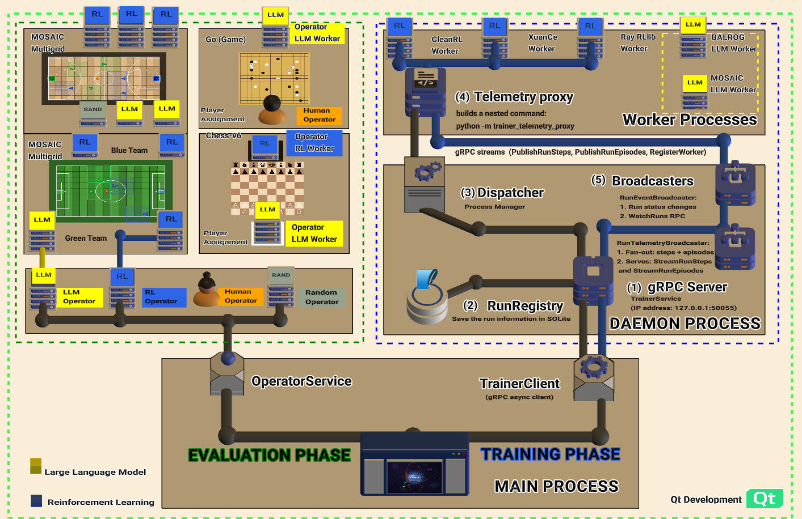

MOSAIC
======

.. raw:: html

   
   
   
   
   
   

.. raw:: html

     

**A Unified Platform for Cross-Paradigm Comparison and Evaluation of Homogeneous and
Heterogeneous Multi-Agent RL, LLM, and Human Decision-Makers**

MOSAIC is a visual-first platform that enables researchers to configure, run, and
compare experiments across RL, LLM, VLM, and human decision-makers in the same
multi-agent environment.  Different paradigms -- like tiles in a mosaic -- come
together to form a complete picture of agent performance.

.. image:: images/Platform_Main_View.png
   :alt: 
   :align: center
   :width: 100%

.. raw:: html

    

   The architecture is showing the Evaluation Phase
   (operators, that contain workers), Training Phase (TrainerClient, TrainerService, Workers),
   Daemon Process (gRPC Server, RunRegistry, Dispatcher, Broadcasters),
   and Worker Processes (CleanRL, XuanCe, Ray RLlib, BALROG, MOSAIC LLM).

.. raw:: html

    

MOSAIC provides two evaluation modes designed for reproducibility:

- **Manual Mode** -- side-by-side comparison where multiple operators step through
  the same environment with shared seeds, letting researchers visually inspect
  decision-making differences between paradigms in real time.
- **Script Mode** -- automated, long-running evaluation driven by Python scripts
  that define operator configurations, worker assignments, seed sequences, and
  episode counts.  Scripts execute deterministically with no manual intervention,
  producing reproducible telemetry logs (JSONL) for every step and episode.

All evaluation runs share **identical conditions**: same environment seeds, same
observations, and unified telemetry.  Script Mode additionally supports
**procedural seeds** (different seed per episode to test generalization) and
**fixed seeds** (same seed every episode to isolate agent behaviour), with
configurable step pacing for visual inspection or headless batch execution.

| **GitHub**: `https://github.com/Abdulhamid97Mousa/MOSAIC <https://github.com/Abdulhamid97Mousa/MOSAIC>`_

Why MOSAIC?
-----------

Today's AI landscape offers powerful but **fragmented** tools: RL frameworks (CleanRL, RLlib, XuanCe),
language models (GPT, Claude), and robotics simulators (MuJoCo).
Each excels in isolation, but **no platform bridges them together**
under a unified, visual-first interface.

**MOSAIC provides:**

- **Unified Framework Bridge**: Connect RL, LLM, and Robotics in a single platform
- **Visual-First Design**: Configure experiments through an intuitive PyQt6 interface, **Almost no code required**.
- **Heterogeneous Agent Mixing**: Run Human + RL + LLM agents in the same environment
- **Resource Management & Quotas**: GPU allocation, queue limits, credit-based backpressure, health monitoring.
- **Per-Agent Policy Binding**: Route each agent to different workers via ``PolicyMappingService``.
- **Worker Lifecycle Orchestration**: Subprocess management with heartbeat monitoring and graceful termination.

Supported Environment Families
------------------------------

MOSAIC supports **26 environment families** spanning single-agent, multi-agent,
and cooperative/competitive paradigms.  See the full
:doc:`Environment Families <documents/environments/index>` reference for
installation instructions, environment lists, and academic citations.

.. list-table::
   :widths: 28 42 30
   :header-rows: 1

   * - Family
     - Description
     - Example Environments
   * - **Gymnasium**
     - Standard single-agent RL (Toy Text, Classic Control, Box2D, MuJoCo)
     - .. image:: images/envs/gymnasium/cartpole.gif
          :width: 200px
   * - **Atari / ALE**
     - 128 classic Atari 2600 games
     - .. image:: images/envs/atari/atari.gif
          :width: 200px
   * - **MiniGrid**
     - Procedural grid-world navigation
     - .. image:: images/envs/minigrid/minigrid.gif
          :width: 200px
   * - **BabyAI**
     - Language-grounded instruction following
     - .. image:: images/envs/babyai/GoTo.gif
          :width: 200px
   * - **ViZDoom**
     - Doom-based first-person visual RL
     - .. image:: images/envs/vizdoom/vizdoom.gif
          :width: 200px
   * - **MiniHack / NetHack**
     - Roguelike dungeon crawling (NLE)
     - .. image:: images/envs/minihack/minihack.gif
          :width: 200px
   * - **Crafter**
     - Open-world survival benchmark
     - .. image:: images/envs/crafter/crafter.gif
          :width: 200px
   * - **Procgen**
     - 16 procedurally generated environments
     - .. image:: images/envs/procgen/coinrun.gif
          :width: 200px
   * - **BabaIsAI**
     - Rule-manipulation puzzles
     - .. image:: images/envs/babaisai/babaisai.png
          :width: 200px
   * - **Jumanji**
     - JAX-accelerated logic/routing/packing (25 envs)
     - .. image:: images/envs/jumanji/jumanji.gif
          :width: 200px
   * - **PyBullet Drones**
     - Quadcopter physics simulation
     - .. image:: images/envs/pybullet_drones/pybullet_drones.gif
          :width: 200px
   * - **PettingZoo Classic**
     - Turn-based board games (AEC)
     - .. image:: images/envs/pettingzoo/pettingzoo.gif
          :width: 200px
   * - **MOSAIC MultiGrid**
     - Competitive team sports (view_size=3)
     - .. image:: images/envs/multigrid/multigrid.gif
          :width: 200px
   * - **INI MultiGrid**
     - Cooperative exploration (view_size=7)
     - .. image:: images/envs/multigrid/multigrid.gif
          :width: 200px
   * - **Melting Pot**
     - Social multi-agent scenarios (up to 16 agents)
     - .. image:: images/envs/meltingpot/meltingpot.gif
          :width: 200px
   * - **Overcooked**
     - Cooperative cooking (2 agents)
     - .. image:: images/envs/overcooked/overcooked.gif
          :width: 200px
   * - **SMAC**
     - StarCraft Multi-Agent Challenge (hand-designed maps)
     - .. image:: images/envs/smac/smac.gif
          :width: 200px
   * - **SMACv2**
     - StarCraft Multi-Agent Challenge v2 (procedural units)
     - .. image:: images/envs/smacv2/smacv2.png
          :width: 200px
   * - **RWARE**
     - Cooperative warehouse delivery
     - .. image:: images/envs/rware/rware.gif
          :width: 200px
   * - **MuJoCo**
     - Continuous-control robotics tasks
     - .. image:: images/envs/mujoco/ant.gif
          :width: 200px

Supported Workers
-----------------

* **CleanRL:**  Single-file RL implementations (PPO, DQN, SAC, TD3, DDPG, C51)
* **XuanCe:**  Multi-agent algorithms (MAPPO, QMIX, MADDPG, VDN, COMA)
* **RLlib:**  Distributed training with Ray (PPO, IMPALA, APPO)
* **BALROG:**  Single-agent LLM benchmarking (MiniGrid, BabyAI, MiniHack, Crafter)
* **MOSAIC LLM:**  Multi-agent LLM with coordination strategies and Theory of Mind (MultiGrid, BabyAI, MeltingPot, PettingZoo)
* **Chess LLM:**  LLM chess play with multi-turn dialog (PettingZoo Chess)

Quick Example
-------------

.. code-block:: python

   from gym_gui.services import PolicyMappingService
   from gym_gui.core.enums import SteppingParadigm

   # Configure heterogeneous agents for a Chess game
   policy_service = PolicyMappingService()
   policy_service.set_paradigm(SteppingParadigm.SEQUENTIAL)

   # Player 0: Human control
   policy_service.bind_agent_policy("player_0", "human_keyboard")

   # Player 1: Trained RL policy
   policy_service.bind_agent_policy("player_1", "cleanrl_ppo")

Core Features
-------------

**Multi-Paradigm Support**
   Seamlessly switch between single-agent, multi-agent (AEC/Parallel), and hybrid environments
   without changing your agent code.

**Agent Integration**
   Human, RL (CleanRL, Ray), and future LLM agents in the same framework.

**Policy Mapping**
   Assign different policies to different agents with flexible configuration through the
   PolicyMappingService.

**Robotics Support**
   MuJoCo MPC for robotics control tasks.

**Real-time Visualization**
   Interactive render view with the MOSAIC space animation, live telemetry, and episode replay.

.. raw:: html

    

.. toctree::
   :hidden:
   :maxdepth: 2
   :caption: Getting Started

   documents/tutorials/installation/index
   documents/tutorials/quickstart

.. toctree::
   :hidden:
   :maxdepth: 2
   :caption: Environments

   documents/environments/index

.. toctree::
   :hidden:
   :maxdepth: 2
   :caption: Architecture

   documents/architecture/overview
   documents/architecture/paradigms
   documents/architecture/policy_mapping
   documents/architecture/workers/index
   documents/architecture/operators/index

.. toctree::
   :hidden:
   :maxdepth: 2
   :caption: Human Control

   documents/human_control/index

.. toctree::
   :hidden:
   :maxdepth: 2
   :caption: API Reference

   documents/api/core
   documents/api/services
   documents/api/adapters

.. toctree::
   :hidden:
   :caption: Development

   GitHub <https://github.com/Abdulhamid97Mousa/MOSAIC>
   documents/contributing
   documents/changelog
