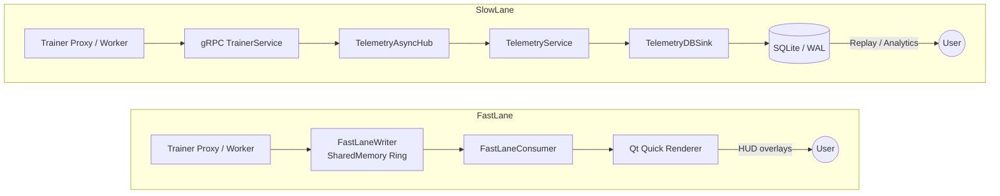
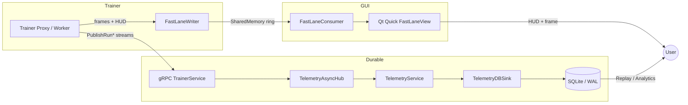
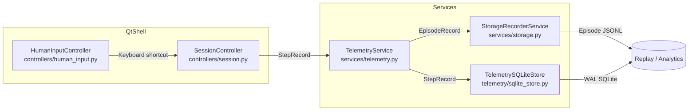
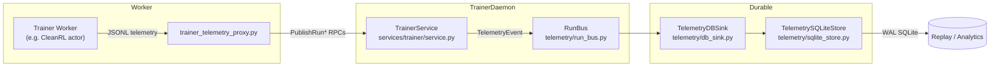

# Fast Lane vs Slow Lane

## Why Two Lanes?

- **Fast lane** feeds the GUI with the freshest frame and HUD metrics directly from shared memory, keeping rendering responsive.
- **Slow lane** preserves the existing gRPC → Telemetry → SQLite path for durability, replay, and distributed workers.

## Phase A Workstreams

1. Shared-memory helpers (`gym_gui/fastlane/buffer.py`).
2. Trainer proxy wiring (`gym_gui/services/trainer/streams.py`, `trainer_telemetry_proxy.py`).
3. GUI consumer + Qt Quick view (`gym_gui/ui/fastlane_consumer.py`, `gym_gui/ui/renderers/fastlane_item.py`, `resources/qml/FastLaneView.qml`, `gym_gui/ui/widgets/fastlane_tab.py`, plus new fast-lane render tabs such as `CleanRL-Live-{agent_id}`).

## Fast Lane UI Implementation Plan

Preconditions: these components do not exist yet, so the fast-lane GUI must be added from scratch while matching conventions already in `gym_gui/ui/`.

1. **Introduce `FastLaneConsumer` (`gym_gui/ui/fastlane_consumer.py`)**

   Subclass `QtCore.QObject`, attach to shared-memory rings via `FastLaneReader.attach(run_id)` from `gym_gui/fastlane/buffer.py`, and poll on a `QtCore.QTimer` (≈60 Hz). Convert raw bytes to `QtGui.QImage`, emit signals like `frame_ready(QImage, FastLaneMetrics)` so views can respond, and reuse the image handling patterns in `LiveTelemetryTab._try_render_visual` but source data from shared memory. Provide `start(run_id, config)` / `stop()` APIs so presenters manage lifecycle; ensure `FastLaneReader.close()` executes in `stop()` to release OS handles.

1. **Create Qt Quick renderer shim (`gym_gui/ui/renderers/fastlane_item.py`)**

  Implement a custom `QtQuick.QQuickPaintedItem` (or `QtQuick.QQuickItem` with a texture node) and expose it to QML via the Qt Qml registration APIs. Import `PySide6.QtQml` / `PySide6.QtQuick`, and either decorate the class with `@QtQml.QmlElement()` or invoke `QtQml.qmlRegisterType` to publish it under a namespace (for example `GymGui 1.0`), matching the module packaging notes in `docs/1.0_DAY_24/TASK_3/QtQml`. Store the latest `QImage` plus metrics, expose `@QtCore.Slot(QtGui.QImage, float, float, float)` invokables that update state, and call `update()` to trigger repainting.

1. **Author the QML shell (`gym_gui/ui/resources/qml/FastLaneView.qml`)**

  Add `gym_gui/ui/resources/qml/` (new directory) and declare a `FastLaneView.qml` scene that imports both the Qt Quick base types (`import QtQuick 2.x`) and the registered Gym GUI module (`import GymGui 1.0`). Compose a minimal layout: the custom `FastLaneItem` filling the viewport with overlay `Text` items for `last_reward`, `rolling_return`, and `step_rate_hz`; optionally reserve buttons for capture/detach hooks. Keep dependencies lightweight so the view can be embedded via `QtQuickWidgets.QQuickWidget`.

1. **Wrap QML in a QWidget tab**

   Implement a `FastLaneTab` helper (either beside the renderer shim or in its own module) that subclasses `QtWidgets.QWidget` and owns a `QtQuickWidgets.QQuickWidget` targeting `FastLaneView.qml`. Expose the consumer through `rootContext().setContextProperty("fastLaneConsumer", self._consumer)` and reconnect the consumer’s `frame_ready` signal to the QML item (`self._quick.rootObject().findChild(...).setFrame(...)`). Provide `cleanup()` / `closeEvent()` hooks to stop timers and close shared-memory readers, mirroring the safeguards in `LiveTelemetryTab`.

1. **Register new tabs with presenters**

   Update `gym_gui/ui/presenters/workers/registry.py` and extend `CleanRlWorkerPresenter.create_tabs()` (and other workers as needed) to instantiate and return `[FastLaneTab(...)]` for live runs. Teach `RenderTabs` (`gym_gui/ui/widgets/render_tabs.py`) to host the tab via a helper like `open_fastlane_tab(run_id, agent_id, widget)` that leverages existing `add_dynamic_tab` semantics so names follow the `CleanRL-Live-{agent_id}` pattern and integrate with close/cleanup logic.

1. **Hook lifecycle into `MainWindow`**

   When `_handle_run_started` in `gym_gui/ui/main_window.py` receives a run, ensure the presenter’s `create_tabs()` results are registered so `_agent_tabs` tracks the new fast-lane widget. On `LiveTelemetryController.run_completed`, manual tab closure, and shutdown, call `FastLaneTab.cleanup()` so timers stop and shared-memory references release cleanly.

1. **Testing and validation**

   Add a focused unit test (e.g., `gym_gui/tests/test_fastlane_consumer.py`) that spins up a `FastLaneWriter`, publishes a frame, waits on `FastLaneConsumer.frame_ready`, and asserts width/height/metrics via `pytest-qt`’s `qtbot.waitSignal`. Create a smoke test that launches `FastLaneTab` under `QT_QPA_PLATFORM=offscreen`, loads a dummy `FastLaneView.qml`, injects a small `QImage`, and verifies no runtime exceptions.

### Qt QML and Qt Quick integration notes

- Leverage the Qt Qml engine APIs to publish custom types: either decorate classes with `@QtQml.QmlElement()` or call `QtQml.qmlRegisterType`, ensuring the namespace and version match the `import GymGui 1.0` statement used in QML.
- Import `PySide6.QtQuick` to access the canonical visual types (`QQuickItem`, `QQuickPaintedItem`) and keep the QML scene focused on the Qt Quick “standard library” primitives outlined in `docs/1.0_DAY_24/TASK_3/QtQuick.md`.
- When embedding the QML into widgets, keep a reference to the underlying `QQmlEngine` so disk cache or JavaScript-engine tweaks (see `docs/1.0_DAY_24/TASK_3/QtQml`) can be set centrally if performance tuning becomes necessary.

### Grounding references

- Shared memory API: `gym_gui/fastlane/buffer.py` (`FastLaneReader`, `FastLaneMetrics`).
- Telemetry plumbing: `gym_gui/controllers/live_telemetry_controllers.py`, `gym_gui/ui/widgets/live_telemetry_tab.py`, `gym_gui/ui/widgets/render_tabs.py`.
- Presenter integration: `gym_gui/ui/presenters/workers/cleanrl_worker_presenter.py`, `gym_gui/ui/presenters/workers/spade_bdi_worker_presenter.py`, `gym_gui/ui/presenters/workers/registry.py`.
- UI resource layout: keep new assets under `gym_gui/ui/...` to match existing module organization.
- Qt QML / Qt Quick references: `docs/1.0_DAY_24/TASK_3/QtQml`, `docs/1.0_DAY_24/TASK_3/QtQuick.md`.

## Data Flow Overview

- Fast-lane output will power new render tabs (e.g., `CleanRL-Live-{agent_id}`) so you can watch agents train live while existing Live/WANDB tabs continue to show analytics.

## Current Implementation Status

- **Buffer layer:** `gym_gui/fastlane/buffer.py` + `__init__.py` implement the SPSC shared-memory ring with seqlock semantics.
- **Trainer proxy wiring:** `trainer_telemetry_proxy.py` now extracts RGB frames from `render_payload`, allocates a per-run fast lane via `FastLaneWriter`, and writes HUD metrics every step.
- **GUI consumption:** `gym_gui/ui/fastlane_consumer.py`, `gym_gui/ui/renderers/fastlane_item.py`, `gym_gui/ui/qml/FastLaneView.qml`, and `gym_gui/ui/widgets/fastlane_tab.py` provide the Qt Quick path and `CleanRL-Live-*` tabs, embedding fast-lane visuals alongside the traditional Live Telemetry tab.

## Slow Lane Best Practices

- **Central collector:** TrainerService → TelemetryAsyncHub → TelemetryService → TelemetryDBSink → SQLite mirrors industry guidance (Cisco telemetry, OpenTelemetry) about funneling durable telemetry through a broker before storage.
- **WAL + batching:** SQLite’s WAL mode plus large batches/cache (per SQLite docs, PowerSync tuning guides) keep the slow lane write-heavy but efficient; the GUI must never wait on it.
- **Hot vs cold storage:** Our Live Telemetry tabs show hot data (RunBus/HUB), while SQLite provides cold storage for replay—akin to Netflix Atlas’s split storage design.

## 2.2 LMAX Disruptor and SPSC Inspiration

- The LMAX Disruptor papers describe an SPSC ring buffer with pre-allocated slots, sequence numbers, and memory barriers for “stupid low latency” event passing (see Scott Logic, LMAX Exchange blogs, Baeldung’s summary). The key idea is **single-writer, single-reader** with overwrite semantics.
- For Fast Lane we mirror that shape: one producer (trainer proxy) and one consumer (Qt GUI). This lets us implement the Disruptor pattern with minimal locking inside `fastlane/buffer.py`.

### Design Rules Borrowed from Disruptor / SPSC Literature

1. **SPSC only:** one writer, one reader. No extra locks. Sequence counters live in the shared header.
2. **Lossy by design:** if the GUI lags we overwrite old frames instead of blocking the writer—just like Disruptor consumers skipping ahead or LTTng’s lossy ring buffers.
3. **Batch-friendly:** consumers can always jump straight to the latest sequence (best-practice from Disruptor and tracing systems) to avoid “frame debt”.
4. **Simple payload:** slot header carries seq/timestamp + HUD scalars; payload is tight-packed RGB(A) bytes.
5. **Memory barriers:** writer marks slot state WRITING → copies payload → flips to READY; reader only renders READY slots whose seq is stable before/after read.

References: Scott Logic’s Disruptor deep dive, Martin Fowler’s write-up, Stack Overflow/Kmdreko blog on SPSC queues, and tracing papers (Embedded Recipes, Tracing Summit) recommending lossy rings for hot data.

## Slow Lane Modes

### Human-Control Slow Lane

- `HumanInputController` wires Qt shortcuts to `SessionController.perform_human_action`, which only accepts input in `ControlMode.HUMAN_ONLY` or hybrid modes (see `gym_gui/controllers/session.py`).
- `SessionController` emits `StepRecord` objects that the shared `TelemetryService` forwards to both `StorageRecorderService` (ring-buffer JSONL) and `TelemetrySQLiteStore` for durable slow-lane persistence.

### Agent-Control Slow Lane

- Remote agents stream JSONL through `trainer_telemetry_proxy.py`, which calls `TrainerService.PublishRunSteps/PublishRunEpisodes` on the daemon.
- `TrainerService` fans events onto the shared `RunBus`; `TelemetryDBSink` drains that bus and writes directly to `TelemetrySQLiteStore`, forming the slow lane for unattended runs.
